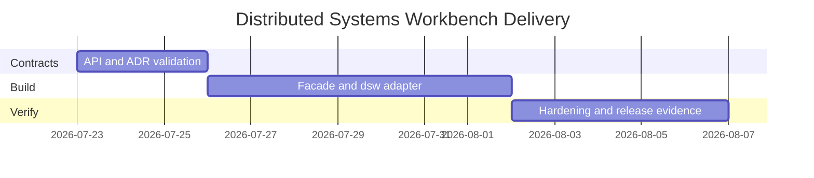

# Planning — Distributed Systems Workbench

## Problem Statement

System Design wiki notes explain topology and NFRs, but learners lack a discoverable package surface, CLI workflow, compatibility contract, and release evidence—especially across capacity models, LB affinity, quorum math, shard skew, and multi-region failover playbooks.

## Success Definition

Every documented capability is importable and demonstrable through stable contracts; a clean checkout installs and passes tests; documentation states production gaps without implying Express/ORM stacks, DB engine replacement, or k8s orchestration scope.

## Scope

**In scope:** package facade, CLI adapter (`dsw`), capacity estimator, consistent-hash LB + health/drain, shard router + skew clinic, N/R/W quorum demo, multi-region failover playbook, reference architecture gallery metadata, typed contracts, tests, release artifact, security checks, five ADRs.

**Out of scope:** Express/repos/ORM, database engine internals, Kafka/broker engines, Kubernetes/mesh control planes, claiming production LB/DNS/GTM parity.

## Milestones

| Milestone | Outcome | Exit criteria |
| --- | --- | --- |
| M1 Contracts | Public exports and CLI schemas fixed | ADRs accepted; contract tests define gaps |
| M2 Integration | Library + CLI vertical slice | Five command families pass positive/negative tests |
| M3 Hardening | Release-ready evidence | clean install, vitest, package smoke, docs match behavior |

## Risks

| Risk | Impact | Mitigation |
| --- | --- | --- |
| Docs exceed implementation | Misleading portfolio | Label target vs implemented; test every claimed command |
| Production parity implied | Incorrect learning | Explicit limitations; ADR-001 banners |
| CLI accepts unbounded workloads | Hang / OOM | Caps on keys, replicas, steps, retention |
| Non-deterministic sims | Flaky CI | Seeds + step clocks only |
| Scope creep into engines/orchestration | Blurs track boundaries | Reject via ADR-001; handoff links |

## Dependencies

Node.js 20 LTS+, TypeScript, Vitest. No cloud credentials required. See [[09-System-Design/projects/Distributed Systems Workbench/Roadmap|Roadmap]].

## Related Documents

- [[09-System-Design/projects/Distributed Systems Workbench/Requirements|Requirements]]
- [[09-System-Design/projects/Distributed Systems Workbench/Roadmap|Roadmap]]
