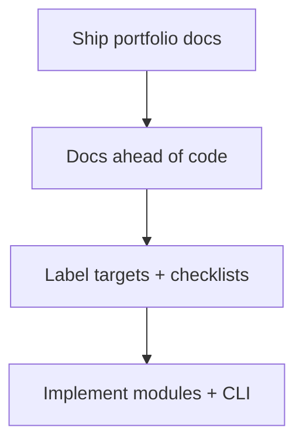

# Postmortem Index — Distributed Systems Workbench

## Delivery Readiness Retrospective

| Date | Event | Severity | Status |
| --- | --- | --- | --- |
| 2026-07-23 | Portfolio documentation landed ahead of full code lab implementation | SEV-4 documentation risk | mitigated, follow-ups open |

## Impact

No released npm consumers affected. Risk was documentation implying runnable `dsw` CLI and cohesive exports before [[09-System-Design/code|09-System-Design/code]] implements them.

## Contributing Conditions

Curriculum completeness pressure; parallel wiki track delivery; separate deliverables for modules, facade, CLI, and smoke tests.

## Corrective Actions

- [ ] Implement modules behind facade with contract tests
- [ ] Land `dsw` adapter with exit-code suite
- [ ] Add CI pack smoke before any “complete” claim
- [ ] Keep Known Issues KI-001/KI-002 visible until closed

## Related Documents

- [[09-System-Design/projects/Distributed Systems Workbench/Known Issues|Known Issues]]
- [[09-System-Design/projects/Distributed Systems Workbench/Roadmap|Roadmap]]
