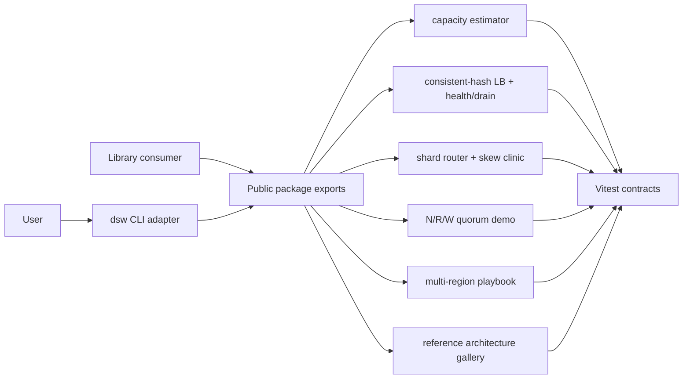

# Distributed Systems Workbench

## One-Line Purpose

A tested TypeScript library and thin CLI learning surface that exposes **distributed product topology simulations**: capacity estimation, consistent-hash load balancing, partition/skew routing, N/R/W quorums, multi-region failover playbooks, a reference-architecture gallery, ADR templates, typed contracts, and bounded resource limits.

## Status

**Active.** Core modules and tests target [[09-System-Design/code|09-System-Design/code]]. Package facade, public re-exports, and CLI integration (`dsw`) are the active portfolio scope.

This workbench is **not an Express/ORM product stack, database engine, or container orchestration platform**. It is an inspectable educational model with explicit behavioral limits—see [[09-System-Design/projects/Distributed Systems Workbench/ADR/ADR-001 Simulation Scope|ADR-001]].

## Goals

- Present integrated topology simulations through one versioned package boundary and a deterministic CLI.
- Preserve small modules that map 1:1 to mini projects and can be tested independently.
- Make capacity, affinity, consistency, skew, and failover trade-offs visible with ADRs.
- Demonstrate production disciplines: contracts, security, tests, releases, and observability for system design literacy.

## Non-Goals

- Express, Nest, Fastify, or other application HTTP frameworks.
- ORMs, query builders, repository layers, or migration products.
- Reimplementing Postgres/Mongo/Redis/Kafka engine internals.
- Kubernetes, service mesh, or cloud control-plane orchestration.
- Claiming production parity with commercial load balancers or global traffic managers.

## Architecture Snapshot



## Document Map

| Document | Purpose |
| --- | --- |
| [[09-System-Design/projects/Distributed Systems Workbench/Planning\|Planning]] | Scope, milestones, risks |
| [[09-System-Design/projects/Distributed Systems Workbench/Requirements\|Requirements]] | Functional and non-functional requirements |
| [[09-System-Design/projects/Distributed Systems Workbench/Architecture\|Architecture]] | System shape and major components |
| [[09-System-Design/projects/Distributed Systems Workbench/Database\|Database]] | Simulation state stance (not product DB) |
| [[09-System-Design/projects/Distributed Systems Workbench/API\|API]] | Interfaces and contracts |
| [[09-System-Design/projects/Distributed Systems Workbench/Deployment\|Deployment]] | Environments and release path |
| [[09-System-Design/projects/Distributed Systems Workbench/Security\|Security]] | Threats, controls, secrets |
| [[09-System-Design/projects/Distributed Systems Workbench/Testing\|Testing]] | Verification strategy |
| [[09-System-Design/projects/Distributed Systems Workbench/Monitoring\|Monitoring]] | Release health and lab diagnostics |
| [[09-System-Design/projects/Distributed Systems Workbench/Engineering Journal\|Engineering Journal]] | Session logs |
| [[09-System-Design/projects/Distributed Systems Workbench/Debug Diary\|Debug Diary]] | Bug investigations |
| [[09-System-Design/projects/Distributed Systems Workbench/Known Issues\|Known Issues]] | Open defects and debt |
| [[09-System-Design/projects/Distributed Systems Workbench/Lessons Learned\|Lessons Learned]] | Durable takeaways |
| [[09-System-Design/projects/Distributed Systems Workbench/Postmortem\|Postmortem]] | Retrospectives |
| [[09-System-Design/projects/Distributed Systems Workbench/Ideas\|Ideas]] | Backlog |
| [[09-System-Design/projects/Distributed Systems Workbench/Roadmap\|Roadmap]] | Phased delivery |
| [[09-System-Design/projects/Distributed Systems Workbench/ADR/ADR-001 Simulation Scope\|ADR-001]] · [[09-System-Design/projects/Distributed Systems Workbench/ADR/ADR-002 Consistent-Hash Default\|ADR-002]] · [[09-System-Design/projects/Distributed Systems Workbench/ADR/ADR-003 Quorum Teaching Defaults\|ADR-003]] · [[09-System-Design/projects/Distributed Systems Workbench/ADR/ADR-004 Active-Passive vs Active-Active Teaching Default\|ADR-004]] · [[09-System-Design/projects/Distributed Systems Workbench/ADR/ADR-005 Clone-Case Study Selection\|ADR-005]] |

## Mini Projects

| Mini project | Module focus |
| --- | --- |
| [[09-System-Design/projects/Capacity Estimator Lab/README\|Capacity Estimator Lab]] | capacity, latency budgets, bottlenecks |
| [[09-System-Design/projects/Load Balancer From Scratch/README\|Load Balancer From Scratch]] | consistent hash, health, drain |
| [[09-System-Design/projects/Shard Router and Hotspot Clinic/README\|Shard Router and Hotspot Clinic]] | partition keys, skew, reshard windows |
| [[09-System-Design/projects/Consistency and Quorum Demo/README\|Consistency and Quorum Demo]] | N/R/W quorums, stale reads |
| [[09-System-Design/projects/Multi-Region Failover Playbook Lab/README\|Multi-Region Failover Playbook Lab]] | RPO/RTO, active-passive playbooks |

## Features

- **Capacity / LB / quorum / partition sims** — executable modules with deterministic JSON reports.
- **Reference architecture gallery** — curated sketches (URL shortener, feed, chat, search/notify/media/payments, read vs write matrices) linked from wiki notes.
- **ADR templates** — five accepted decisions plus room for clone-specific ADRs.
- **Typed contracts** — public TypeScript exports with schema-validated CLI inputs.
- **Thin CLI** — `dsw <command> --json` adapter; domain logic stays in the library.

## Run and Test

```bash
cd 09-System-Design/code
npm install
npm test
```

The documented CLI target is `dsw <command> --json`; until its adapter lands under [[09-System-Design/code|09-System-Design/code]], use imported TypeScript APIs described in [[09-System-Design/projects/Distributed Systems Workbench/API|API]].

## Portfolio Acceptance Checklist

- [ ] All documented capabilities export from one package boundary.
- [ ] CLI output is deterministic JSON; errors use stable non-zero exit codes.
- [ ] Unit and integration tests cover capacity math, ring remap, skew flags, quorum scenarios, and failover budgets.
- [ ] Package ships typed public symbols and excludes test fixtures from artifacts.
- [ ] Security and monitoring checks pass before a tagged release.
- [ ] Gallery links wiki reference architectures without implying production deployment of sims.
- [ ] Five mini projects cross-linked; ADRs 001–005 accepted.

## Related Notes

- [[09-System-Design/code/README|System Design Code Labs]]
- [[09-System-Design/README|System Design Track]]
- [[Projects/README|Projects]]
- [[07-Backend/README|Backend]]
- [[08-Databases/README|Databases]]
- [[Career/README|Career]]
