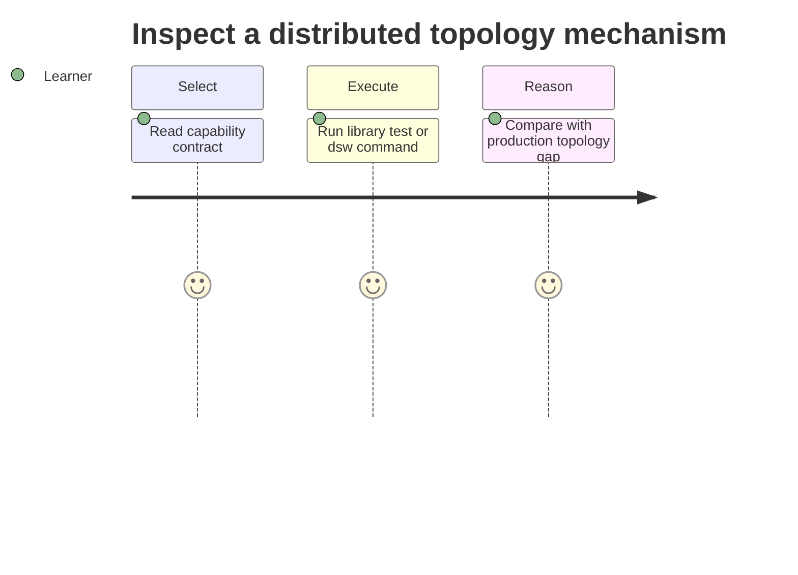

# Requirements — Distributed Systems Workbench

## Actors

| Actor | Goal |
| --- | --- |
| Learner | Run topology simulations and reason about trade-offs |
| Library consumer | Import typed, documented educational APIs |
| CLI user | Run deterministic labs without writing code |
| Maintainer | Change modules without silently breaking contracts |
| Instructor | Score scenario fixtures (quorum, failover, skew) |

## Functional Requirements

| ID | Requirement | Acceptance |
| --- | --- | --- |
| FR-001 | Export capacity estimator | Workload → storage/QPS/bandwidth/budget report |
| FR-002 | Export consistent-hash ring + LB | Remap metric + health/drain states |
| FR-003 | Export shard router + skew clinic | Strategy matrix + hotspot flags |
| FR-004 | Export N/R/W quorum demo | Scenario fixtures classified correctly |
| FR-005 | Export multi-region failover playbook | RPO/RTO verify outcomes |
| FR-006 | Export reference architecture gallery metadata | Links to wiki sketches + clone set |
| FR-007 | Offer JSON CLI for each capability | Valid input → documented JSON + exit 0 |
| FR-008 | Enforce resource ceilings | Oversized inputs → `LIMIT_EXCEEDED` |

## Non-Functional Requirements

| ID | Category | Requirement | Measurement |
| --- | --- | --- | --- |
| NFR-001 | Correctness | Deterministic sims with seeds/step clocks | 100% contract suite pass |
| NFR-002 | Performance | Bounded keys, replicas, steps, retention | limits enforced before work |
| NFR-003 | Security | No eval of CLI input; no cloud creds required | negative security tests pass |
| NFR-004 | Portability | Node LTS on Windows/Linux/macOS | CI matrix passes |
| NFR-005 | Observability | JSON stdout; diagnostics stderr | integration tests assert separation |
| NFR-006 | Honesty | Document gaps vs production systems | each module links limitations |

## Traceability

FR-001–FR-005 → [[09-System-Design/projects/Distributed Systems Workbench/ADR/ADR-001 Simulation Scope|ADR-001]]; FR-002 → [[09-System-Design/projects/Distributed Systems Workbench/ADR/ADR-002 Consistent-Hash Default|ADR-002]]; FR-004 → [[09-System-Design/projects/Distributed Systems Workbench/ADR/ADR-003 Quorum Teaching Defaults|ADR-003]]; FR-005 → [[09-System-Design/projects/Distributed Systems Workbench/ADR/ADR-004 Active-Passive vs Active-Active Teaching Default|ADR-004]]; FR-006 → [[09-System-Design/projects/Distributed Systems Workbench/ADR/ADR-005 Clone-Case Study Selection|ADR-005]].

## Related Documents

- [[09-System-Design/projects/Distributed Systems Workbench/API|API]]
- [[09-System-Design/projects/Distributed Systems Workbench/Testing|Testing]]
