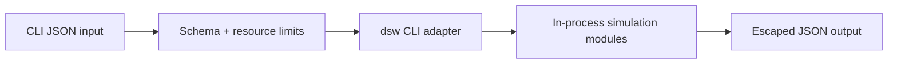

# Security — Distributed Systems Workbench

## Trust Boundaries

## Threat Model

| Threat | Example | Control |
| --- | --- | --- |
| Code execution | input treated as JS | parse JSON only; no `eval` |
| Resource exhaustion | huge key streams / replica counts | hard caps before allocation |
| Path traversal | hostile fixture paths | root jail on optional file reads |
| Credential leakage | accidental cloud keys in fixtures | no cloud SDKs; redact patterns in stderr |
| Supply-chain compromise | malicious dependency | lockfile, audit, minimal deps |
| Misuse as production control plane | “run failover against prod” | banners + ADR-001 non-goals |

## Controls

The package needs no credentials for core labs. Scenario and workload files are data-only JSON. Gallery metadata is read-only curated links. Advisories and playbook outputs are educational—not authorization to skip fencing or backups in production.

## Security Acceptance

- Negative tests cover malformed, oversized, deeply nested, and hostile path inputs.
- `npm audit` findings triaged by exploitability before release.
- Publish token scope is publish-only; unavailable to pull-request jobs.
- Limitations link to [[09-System-Design/projects/Distributed Systems Workbench/Known Issues|Known Issues]] and [[09-System-Design/projects/Distributed Systems Workbench/Postmortem|Postmortem]].

## Related Documents

- [[09-System-Design/projects/Distributed Systems Workbench/ADR/ADR-001 Simulation Scope|ADR-001]]
- [[09-System-Design/projects/Distributed Systems Workbench/Testing|Testing]]
