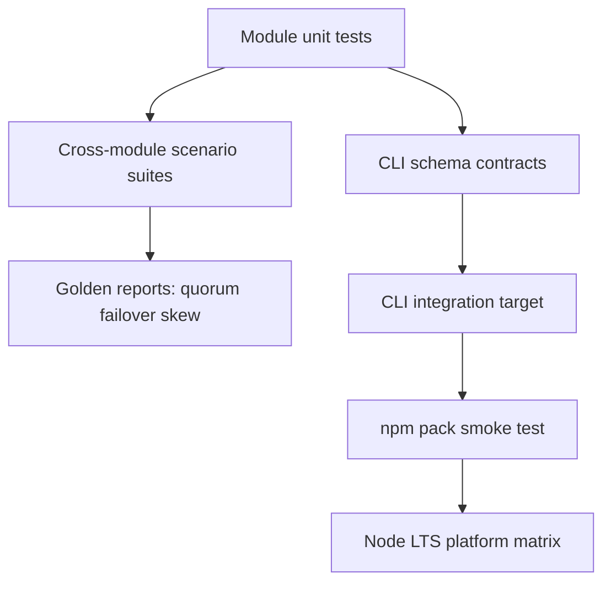

# Testing — Distributed Systems Workbench

## Strategy



## Test Layers

| Layer | Coverage |
| --- | --- |
| Unit | capacity math, ring placement, skew ratios, version compare, policy validation |
| Integration | LB drain + remap; dual-write window; quorum+fault; failover playbook |
| Contract | JSON CLI schemas, stderr/stdout separation, exit codes |
| Package | install tarball, import facade, invoke `dsw` entry |
| Platform | Windows/Linux/macOS on Node 20+ LTS |

## Current Command

```bash
cd 09-System-Design/code
npm install
npm test
```

Target executable coverage: labs under `09-System-Design/code/tests`. Required additions include facade export smoke tests, CLI schema validation, hostile input fixtures, golden scenarios for quorum/failover/skew, and packed-artifact smoke tests.

## Module Test Filters

| Focus | Suggested filter |
| --- | --- |
| Capacity | `CapacityEstimator` |
| LB / hash | `ConsistentHash\|LoadBalancer\|Drain` |
| Shard | `ShardRouter\|Hotspot\|Reshard` |
| Quorum | `Quorum\|ReplicaSet` |
| Failover | `Failover\|Playbook` |

## Related Documents

- [[09-System-Design/projects/Distributed Systems Workbench/API|API]]
- [[09-System-Design/projects/Distributed Systems Workbench/Requirements|Requirements]]
