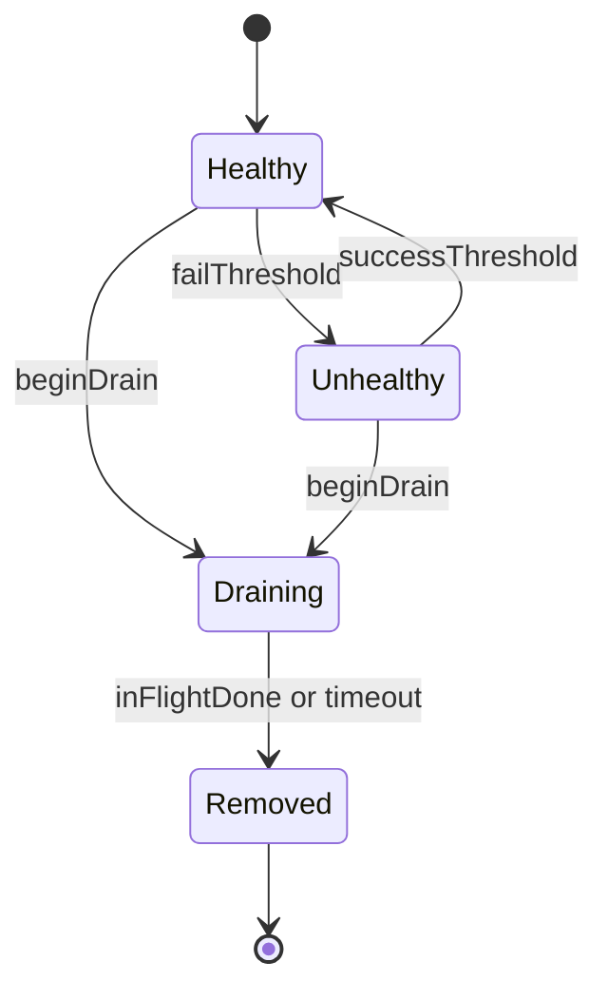

# Architecture — Load Balancer From Scratch

## Summary

In-process LB simulator: ring + health/drain controllers. Not a production proxy. Targets: `consistent-hash-ring.ts`, `load-balancer.ts`, `health-drain.ts` under `09-System-Design/code/src`.

## Component Diagram

## Ring Layout (Scaffold)

| Concept | Lab default | Notes |
| --- | --- | --- |
| Hash | FNV-1a or SHA-1 truncated | Document algorithm; keep deterministic |
| Virtual nodes | 100–200 per backend | Configurable; ADR-002 default |
| Lookup | binary search on sorted ring | O(log n) |
| Remap metric | keys remapped / keys sampled | Required acceptance output |

## Drain Semantics

1. `beginDrain(id)` → state `draining`; ring excludes id for **new** lookups.
2. In-flight requests on id complete or hit `drainTimeoutMs`.
3. After drain, backend removed; optional re-add creates new membership epoch.

## Scaffold Notes

1. Prefer discrete simulation clock over `setInterval` in unit tests.
2. Keep algorithm strategy injectable; default must be consistent hash (ADR-002).
3. Do not model L4 TCP splicing or HTTP/2 multiplexing—request tokens only.
4. Handoff real mesh/proxy ops to [[16-DevOps/README|DevOps]] and gateway patterns to wiki notes.

## Related Documents

- [[09-System-Design/projects/Load Balancer From Scratch/README|README]]
- [[09-System-Design/projects/Distributed Systems Workbench/ADR/ADR-002 Consistent-Hash Default|ADR-002]]
