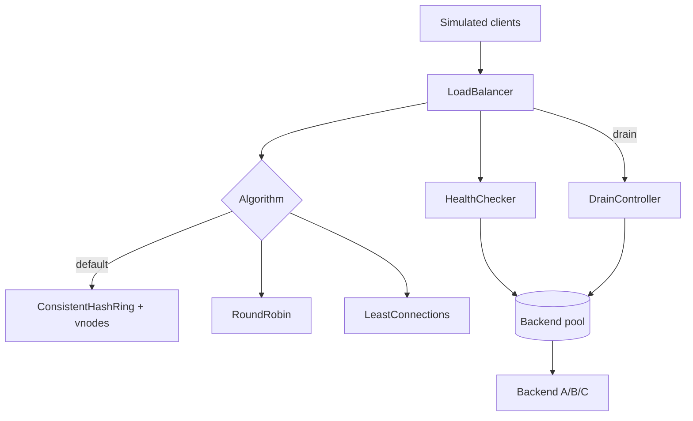

# Load Balancer From Scratch

## Overview

Build an in-process **L7-style request router** with a consistent-hash ring (virtual nodes), health checks, and graceful drain—teaching affinity and failure behavior without reimplementing nginx, Envoy, or kube-proxy.

## Goals

- Implement consistent hashing with virtual nodes and measurable key remapping on node add/remove.
- Model healthy / unhealthy / draining backend states with explicit connection drain semantics.
- Compare round-robin and least-connections against consistent hash for sticky vs uniform traffic.
- Expose deterministic simulation timelines suitable for tests and interview walkthroughs.

## Prerequisites

- [[09-System-Design/02-Load-Balancing-and-Edge-Entry/Load Balancer Roles L4 vs L7|Load Balancer Roles L4 vs L7]]
- [[09-System-Design/02-Load-Balancing-and-Edge-Entry/Algorithms Round Robin Least Conn Consistent Hash|Algorithms Round Robin Least Conn Consistent Hash]]
- [[09-System-Design/02-Load-Balancing-and-Edge-Entry/Health Checks Drain and Connection Management|Health Checks Drain and Connection Management]]
- [[09-System-Design/02-Load-Balancing-and-Edge-Entry/API Gateway vs Reverse Proxy vs Service Mesh Concepts|API Gateway vs Reverse Proxy vs Service Mesh Concepts]]
- [[09-System-Design/projects/Distributed Systems Workbench/ADR/ADR-002 Consistent-Hash Default|ADR-002 Consistent-Hash Default]]
- [[09-System-Design/code/README|System Design Code Labs]]

## Architecture

See [[09-System-Design/projects/Load Balancer From Scratch/Architecture|Architecture]] for ring layout and drain state machine.

## Spec

| Concern | Spec |
| --- | --- |
| Default algorithm | Consistent hash with configurable virtual nodes (per ADR-002) |
| Health | Periodic probe; consecutive failures → unhealthy; success → healthy |
| Drain | Mark draining: no new keys; in-flight finish or timeout → removed |
| Remap metric | Report % of keys that change backend on membership change |
| Simulation | Discrete event or step clock; no real sockets required for unit tests |
| Code targets | `consistent-hash-ring.ts`, `load-balancer.ts`, `health-drain.ts` |

## Acceptance Criteria

- [ ] Consistent-hash ring places keys with virtual nodes; add/remove node remaps a bounded fraction of keys (test asserts remap ratio).
- [ ] Round-robin and least-connections selectable; default remains consistent hash.
- [ ] Unhealthy backends receive zero new requests; recovering backends rejoin after success threshold.
- [ ] Drain forbids new assignments while allowing in-flight completion within drain timeout.
- [ ] Simulation produces timeline JSON: assign, fail, drain, remap events.
- [ ] No dependency on Express, Envoy, or container orchestration APIs.
- [ ] Tests cover empty pool, single backend, and dual-failure scenarios.

## Stretch

1. Maglev-style table for faster lookup; compare remap % vs vnode ring.
2. Weighted backends and zone-aware preference with affinity override.
3. Edge admission control sketch: reject when healthy pool capacity < threshold.

## Related Notes

- [[09-System-Design/projects/Load Balancer From Scratch/Architecture|Architecture]]
- [[09-System-Design/projects/Distributed Systems Workbench/README|Distributed Systems Workbench]]
- [[09-System-Design/README|System Design MOC]]
- [[09-System-Design/code/README|System Design Code Labs]]
- [[09-System-Design/02-Load-Balancing-and-Edge-Entry/Edge Admission Control and Global Traffic Steering|Edge Admission Control and Global Traffic Steering]]
- [[Career/README|Career]]

## Progress Checklist

- [ ] Implement ring + vnode placement tests
- [ ] Implement health/drain state machine
- [ ] Expose `dsw lb simulate --input … --json`
- [ ] Document remap metrics in Workbench Monitoring lab diagnostics
- [ ] Mark mini project complete in track Implementation Checklist
