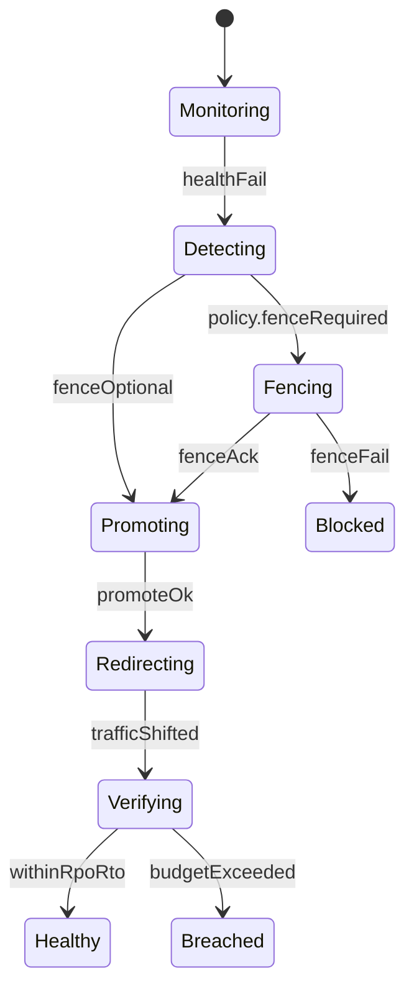

# Architecture — Multi-Region Failover Playbook Lab

## Summary

Policy-driven failover simulator for product RPO/RTO contracts. Default topology is active-passive (ADR-004). Engine WAL shipping mechanics remain in [[08-Databases/README|Databases]].

## Component Diagram



## Policy Object (Scaffold)

```ts
// Conceptual shape — implement under code/src/failover-policy.ts
type FailoverPolicy = {
  topology: "active-passive" | "active-active";
  rpoMs: number;
  rtoMs: number;
  syncMode: "async" | "semi-sync" | "sync";
  fenceRequired: boolean;
  splitBrainPolicy: "block" | "manual";
};
```

## Scaffold Notes

1. Represent replication progress as monotonic `offset` integers—not real LSNs.
2. Detection delay is a first-class input that consumes RTO budget.
3. Active-active path must require an explicit flag; defaults stay active-passive.
4. Playbook JSON should be usable as an interview artifact and on-call training aid.

## Related Documents

- [[09-System-Design/projects/Multi-Region Failover Playbook Lab/README|README]]
- [[09-System-Design/projects/Distributed Systems Workbench/ADR/ADR-004 Active-Passive vs Active-Active Teaching Default|ADR-004]]
