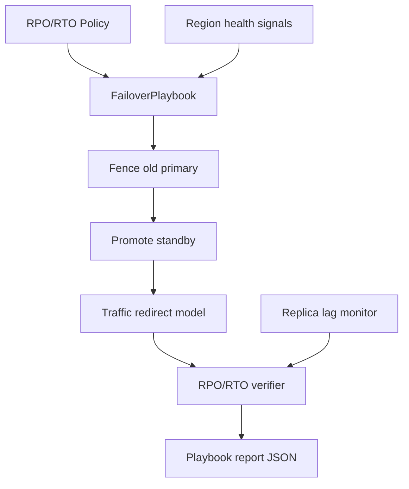

# Multi-Region Failover Playbook Lab

## Overview

Model **multi-region failover policy** as executable playbooks: RPO/RTO budgets, active-passive teaching default, split-brain guards, and replica-lag as a user-visible consistency budget—without operating real cloud DNS, Kubernetes, or database engines.

## Goals

- Encode RPO/RTO as first-class policy objects checked by a failover simulator.
- Default to active-passive teaching topology (ADR-004); contrast active-active conflict modes.
- Produce playbook timelines: detect → fence → promote → redirect → verify.
- Tie lag and sync mode (async / semi-sync / sync) to user-visible staleness.

## Prerequisites

- [[09-System-Design/07-Multi-Region-and-Geo/Single-Primary Multi-Primary and Leaderless Product Views|Single-Primary Multi-Primary and Leaderless Product Views]]
- [[09-System-Design/07-Multi-Region-and-Geo/Sync Async and Semi-Sync as Latency SLOs|Sync Async and Semi-Sync as Latency SLOs]]
- [[09-System-Design/07-Multi-Region-and-Geo/Multi-Region Active-Passive Active-Active Patterns|Multi-Region Active-Passive Active-Active Patterns]]
- [[09-System-Design/07-Multi-Region-and-Geo/Failover RPO RTO and Split-Brain Product Policy|Failover RPO RTO and Split-Brain Product Policy]]
- [[09-System-Design/07-Multi-Region-and-Geo/Replica Lag as User-Facing Consistency Budget|Replica Lag as User-Facing Consistency Budget]]
- [[09-System-Design/projects/Distributed Systems Workbench/ADR/ADR-004 Active-Passive vs Active-Active Teaching Default|ADR-004]]
- [[09-System-Design/code/README|System Design Code Labs]]

## Architecture

See [[09-System-Design/projects/Multi-Region Failover Playbook Lab/Architecture|Architecture]] for state machine and split-brain guards.

## Spec

| Concern | Spec |
| --- | --- |
| Default topology | Active-passive (ADR-004) |
| Policy fields | `rpoMs`, `rtoMs`, sync mode, fencing required, splitBrainPolicy |
| Playbook steps | detect, fence, promote, redirect, verify (ordered) |
| Lag model | Async lag grows with partition; sync blocks writes beyond timeout |
| Outcomes | `success`, `rpo_breach`, `rto_breach`, `split_brain_blocked` |
| Code targets | `failover-policy.ts`, `region-topology.ts`, `failover-playbook.ts` |

## Acceptance Criteria

- [ ] Policy object rejects nonsensical budgets (e.g., RPO < 0, RTO < detection minimum).
- [ ] Active-passive failover succeeds when lag ≤ RPO and steps complete within RTO.
- [ ] Async replication under long partition produces `rpo_breach` when promote would lose data beyond budget.
- [ ] Missing fence step yields `split_brain_blocked` when policy requires fencing.
- [ ] Active-active mode is available but not default; documents conflict/ADR-004 trade-offs.
- [ ] Report lists step durations vs RTO remaining and last applied LSN/offset surrogate.
- [ ] No cloud SDK, k8s API, or real DNS—pure simulation.

## Stretch

1. Semi-sync mode: acknowledge after standby durable within timeout; measure write latency SLO.
2. Integrate quorum demo for multi-primary conflict on active-active stretch path.
3. Attach clone case study (Discord/Netflix) regional failure narrative to playbook output.

## Related Notes

- [[09-System-Design/projects/Multi-Region Failover Playbook Lab/Architecture|Architecture]]
- [[09-System-Design/projects/Distributed Systems Workbench/README|Distributed Systems Workbench]]
- [[09-System-Design/README|System Design MOC]]
- [[09-System-Design/code/README|System Design Code Labs]]
- [[08-Databases/07-Replication-Mechanics/Failover Promote and Split-Brain Mechanics|Failover Promote and Split-Brain Mechanics]]
- [[Career/README|Career]]

## Progress Checklist

- [ ] Implement policy + topology + playbook runner
- [ ] Golden fixtures: success, RPO breach, split-brain block
- [ ] Expose `dsw failover run --policy … --json`
- [ ] Cross-link ADR-004 and clone gallery (ADR-005)
- [ ] Mark mini project complete in track Implementation Checklist
