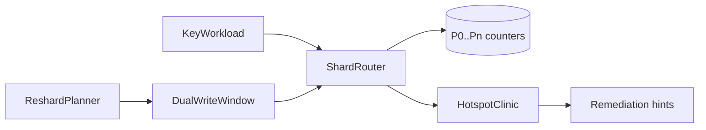
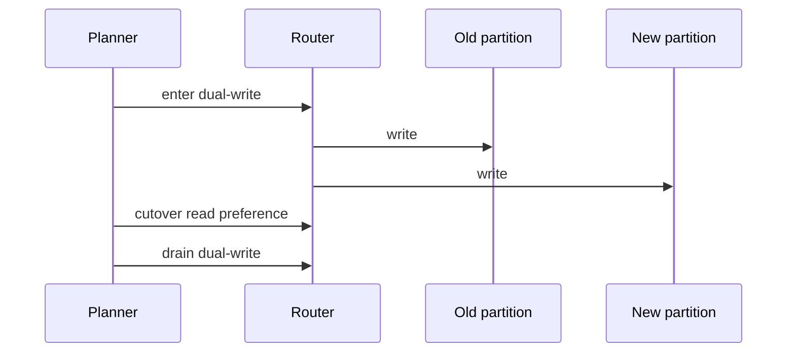

# Architecture — Shard Router and Hotspot Clinic

## Summary

In-memory partition router + skew diagnostics. Teaches key choice and reshard windows—not storage engine internals (handoff to [[08-Databases/README|Databases]]).

## Component Diagram

## Skew Metrics (Scaffold)

| Metric | Definition |
| --- | --- |
| `maxMeanRatio` | `max(shardCounts) / mean(shardCounts)` |
| `hotKeys` | Top-N keys by request share |
| `entropy` | Optional Shannon entropy of shard distribution |
| `dualWriteConflicts` | Writes observed on both old and new partitions in window |

Flag hotspot when `maxMeanRatio > skewThreshold` (default `2.0`).

## Reshard Stages

## Scaffold Notes

1. Keep partition maps serializable JSON for CLI fixtures.
2. Zipf generator must be deterministic given seed.
3. Directory map is an explicit `Record<key, partitionId>` with size caps.
4. Do not implement MVCC or WAL—counters and conflict tallies only.

## Related Documents

- [[09-System-Design/projects/Shard Router and Hotspot Clinic/README|README]]
- [[09-System-Design/projects/Distributed Systems Workbench/Architecture|Workbench Architecture]]
