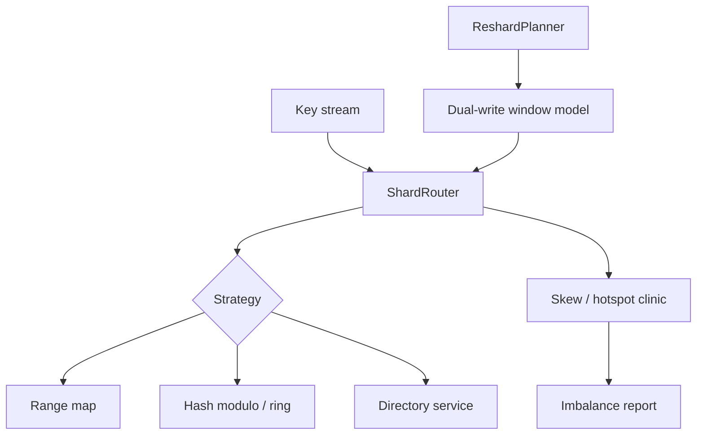

# Shard Router and Hotspot Clinic

## Overview

Simulate **partition key routing** (range, hash, directory) and diagnose skew/hotspots: show how a bad key choice concentrates load, and how salting/resharding windows trade consistency for balance.

## Goals

- Route keys through range, hash, and directory-based sharding strategies.
- Detect skew with measurable imbalance metrics (max/avg load, hotspot keys).
- Demonstrate dual-write / resharding window hazards without building a real database engine.
- Connect placement choices to geo affinity and secondary-index fan-out costs.

## Prerequisites

- [[09-System-Design/04-Partitioning-Sharding-and-Placement/Partition Keys Hotspots and Skew|Partition Keys Hotspots and Skew]]
- [[09-System-Design/04-Partitioning-Sharding-and-Placement/Range Hash and Directory-Based Sharding|Range Hash and Directory-Based Sharding]]
- [[09-System-Design/04-Partitioning-Sharding-and-Placement/Resharding Rebalancing and Dual-Write Windows|Resharding Rebalancing and Dual-Write Windows]]
- [[09-System-Design/04-Partitioning-Sharding-and-Placement/Data Locality Geo Placement and Affinity|Data Locality Geo Placement and Affinity]]
- [[09-System-Design/04-Partitioning-Sharding-and-Placement/Secondary Indexes Across Partitions|Secondary Indexes Across Partitions]]
- [[09-System-Design/projects/Load Balancer From Scratch/README|Load Balancer From Scratch]]
- [[09-System-Design/code/README|System Design Code Labs]]

## Architecture

See [[09-System-Design/projects/Shard Router and Hotspot Clinic/Architecture|Architecture]] for skew metrics and reshard stages.

## Spec

| Concern | Spec |
| --- | --- |
| Strategies | `range`, `hash`, `directory` with typed partition maps |
| Hotspot clinic | Rank keys by request share; flag when max shard > `skewThreshold × mean` |
| Workloads | Uniform, Zipf, sequential range, celebrity-key fixtures |
| Reshard | Plan split/merge; optional dual-write phase with conflict counter |
| Non-goals | Page layout, B+ internals, real Postgres partitioning DDL |
| Code targets | `shard-router.ts`, `skew-metrics.ts`, `reshard-window.ts` |

## Acceptance Criteria

- [ ] Router assigns every key to exactly one partition under each strategy (except during documented dual-write window).
- [ ] Hash strategy balances uniform keys within configurable tolerance; Zipf celebrity keys produce clinic hotspot flag.
- [ ] Range strategy demonstrates sequential-key hotspot; salt/bucket recommendation appears in report hints.
- [ ] Directory strategy supports remapping a single key without full rehash (test asserts remapped key only).
- [ ] Skew report includes per-shard counts, max/mean ratio, and top-N hot keys.
- [ ] Dual-write window model increments conflict/duplicate counters when both old and new partitions accept writes.
- [ ] No DB engine or ORM dependencies—in-memory maps only.

## Stretch

1. Secondary index fan-out cost estimator for global vs local secondary indexes.
2. Geo affinity constraint: prefer partitions colocated with region tag.
3. Integrate consistent-hash ring from LB lab as hash placement backend.

## Related Notes

- [[09-System-Design/projects/Shard Router and Hotspot Clinic/Architecture|Architecture]]
- [[09-System-Design/projects/Distributed Systems Workbench/README|Distributed Systems Workbench]]
- [[09-System-Design/README|System Design MOC]]
- [[09-System-Design/code/README|System Design Code Labs]]
- [[08-Databases/README|Databases]] (engine partitioning internals handoff)
- [[Career/README|Career]]

## Progress Checklist

- [ ] Implement three routing strategies + fixture workloads
- [ ] Implement skew clinic metrics and golden reports
- [ ] Model dual-write window conflicts
- [ ] Expose `dsw shard diagnose --input … --json`
- [ ] Mark mini project complete in track Implementation Checklist
