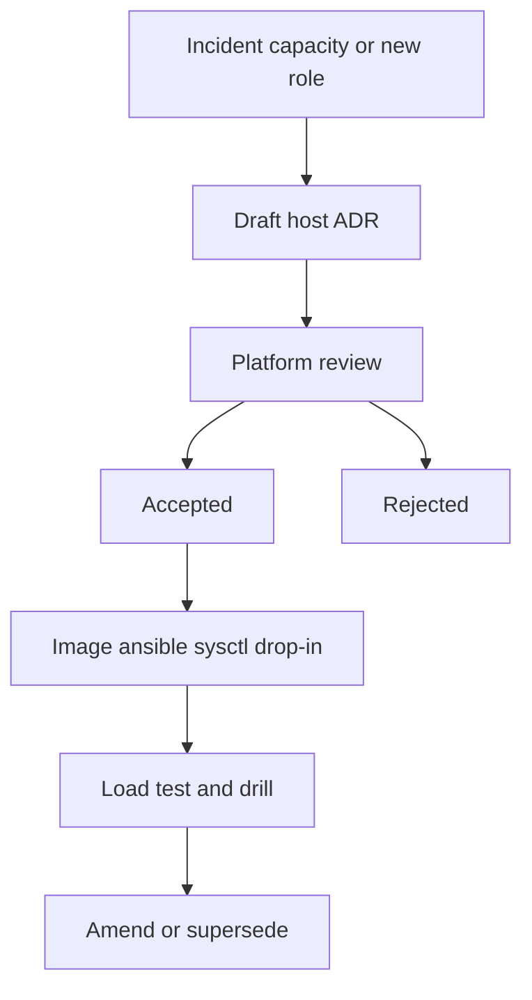
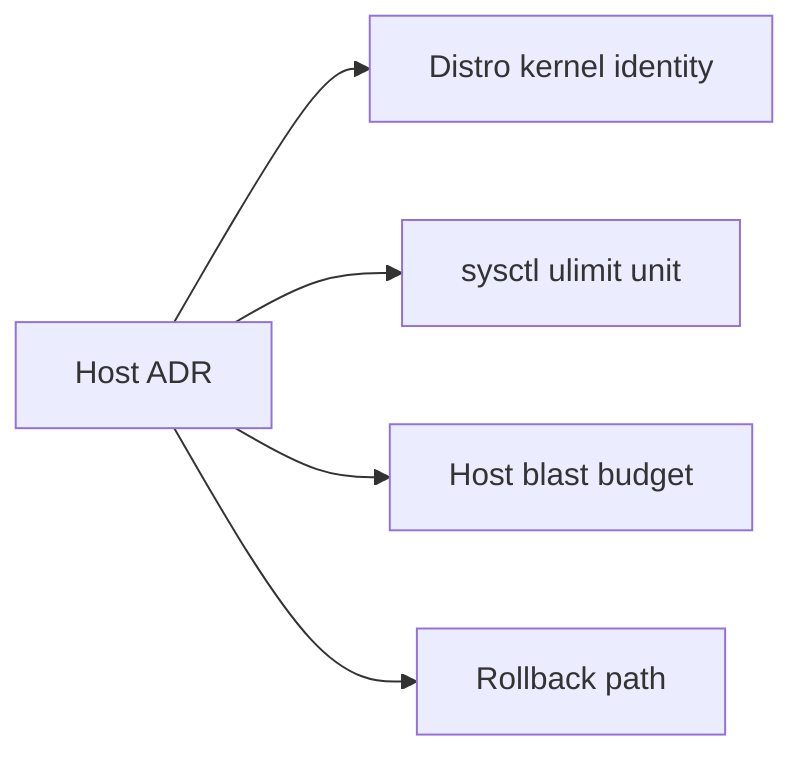

# ADR Discipline for Host Decisions

## Overview

A host **Architecture Decision Record** captures a significant Linux operations choice: golden image, sysctl, ulimit defaults, OOM policy, mount layout, systemd hardening, or co-location rules. Without ADRs, fleets accumulate tribal `sysctl.conf` and “temporary” cron hacks that outlive their authors.

This note adapts ADR practice to [[10-Linux/README|Linux]]: every irreversible or blast-radius-relevant host choice gets context, options, consequences, and a rollback story. Fleet topology ADRs remain [[09-System-Design/00-Orientation-and-Boundaries/ADR Discipline for Distributed Decisions|System Design ADR discipline]].

## Learning Objectives

- Write host ADRs that bind symptoms, mechanisms, and tooling to a decision
- Separate reversible local tweaks from decisions that need records
- Assign owners (Linux/Backend/Databases/DevOps) when knobs cross tracks
- Supersede sysctl and image decisions instead of silent edits
- Use ADRs as evidence in postmortems and interviews

## Prerequisites

- [[10-Linux/00-Orientation-and-Boundaries/Why Linux Exists for Engineers|Why Linux Exists for Engineers]]
- [[10-Linux/00-Orientation-and-Boundaries/Failure Domains on a Single Host|Failure Domains on a Single Host]]
- [[00-Templates/ADR Template|ADR Template]]

## Difficulty

`intermediate`

## Estimated Time

- Reading: 45 minutes
- Exercises: 1 hour
- Mini project: 2 hours

## History

Nygard-style ADRs spread with microservices; platform teams borrowed them for AMI baselines and kernel tuning after “who changed `vm.swappiness`?” became a ritual. Immutable infrastructure made the record even more valuable: the decision lives longer than any one SSH session.

## Problem It Solves

| Failure mode | Host ADR discipline |
| --- | --- |
| Mystery sysctl in production | Context + rejected alternatives |
| Image drift between envs | Pinned distro/kernel/identity |
| OOM policy fights app team | Recorded scoreadj / cgroup limits |
| “Temporary” ulimit in unit file | Consequences + review date |
| Postmortem cannot explain change | Append-only decision log |

## Internal Implementation

### ADR lifecycle for host choices



Minimum fields: **Status, Context (symptom+metrics), Decision, Options, Consequences, Blast domain, Rollback, Owner, Related notes**.

## Mermaid Diagrams

### Structure



### Sequence / Lifecycle — superseding swappiness

```mermaid
sequenceDiagram
    participant OnCall
    participant ADR as ADR log
    participant Image as Golden image
    OnCall->>ADR: read ADR-007 swappiness=10
    ADR-->>OnCall: accepted for DB hosts
    OnCall->>ADR: draft ADR-019 supersedes 007
    Note over ADR: app hosts keep 60; DB stays 10
    ADR->>Image: split sysctl by role
```

## Examples

### Minimal Example — host ADR as data

```typescript
export type HostAdr = {
  id: string;
  title: string;
  status: "proposed" | "accepted" | "superseded" | "rejected";
  context: string;
  decision: string;
  options: Array<{ name: string; pros: string[]; cons: string[] }>;
  consequences: string[];
  blastDomain: "process" | "cgroup" | "host" | "fleet-image";
  rollback: string;
  owner: "Linux" | "Backend" | "Databases" | "DevOps";
  related: string[];
};

export const ADR_007: HostAdr = {
  id: "ADR-007",
  title: "Database hosts set vm.swappiness=10",
  status: "accepted",
  context: "DB p99 spikes correlated with si/so in vmstat under cache pressure",
  decision: "Role-scoped sysctl drop-in for db-* images only",
  options: [
    {
      name: "swappiness=10 on all hosts",
      pros: ["Uniform images"],
      cons: ["Hurts mem-light batch nodes that benefit from cache reclaim"],
    },
    {
      name: "Role-scoped swappiness",
      pros: ["Matches workload"],
      cons: ["Two image flavors"],
    },
  ],
  consequences: [
    "DB prefers reclaiming page cache over swapping anon",
    "Must document in runbook; do not copy to API AMI",
  ],
  blastDomain: "fleet-image",
  rollback: "Revert drop-in; reboot or sysctl -p; monitor swap-in",
  owner: "Linux",
  related: [
    "[[10-Linux/03-Memory-Swap-and-OOM/Swap Pressure and thrashing Symptoms|Swap Pressure]]",
  ],
};
```

### Production-Shaped Example — review gate

```typescript
export function readyForHostReview(adr: HostAdr): string[] {
  const gaps: string[] = [];
  if (!/vmstat|OOM|iostat|ss|journal|p99|ENOSPC/i.test(adr.context)) {
    gaps.push("context needs host evidence");
  }
  if (adr.options.length < 2) gaps.push("need ≥2 options");
  if (!adr.rollback) gaps.push("missing rollback");
  if (adr.blastDomain === "fleet-image" && adr.owner === "Backend") {
    gaps.push("image-wide knob needs Linux/DevOps owner");
  }
  return gaps;
}
```

## Trade-offs

| Dimension | Host ADR discipline | SSH snowflake tuning |
| --- | --- | --- |
| Continuity | Survivable turnover | Knowledge walks out |
| Speed | Review latency | Fast now, brittle later |
| Safety | Forces blast/rollback | Silent footguns |
| Audit | Patch + decision trail | git blame on conf only |

### When to Use

- Golden image, sysctl, default ulimits, OOM/cgroup policy, mount layout
- Anything copied to >1 host or baked into AMI/agent
- Cross-team knobs (DB wants swappiness; app wants page cache)

### When Not to Use

- One-off debug `sysctl` in a break-glass session (revert + note in incident)
- Pure app config with no host contract change
- Spikes—use `proposed`, then accept/reject

## Exercises

1. Convert a past “we set `fs.file-max`” Slack decision into `HostAdr`.
2. Split an ADR that mixes Postgres `shared_buffers` and `vm.dirty_ratio` into two owners.
3. Draft a supersede when moving from cgroup v1 to v2 memory limits.
4. Run `readyForHostReview` mentally on ADR-007—what evidence would you add?
5. List ten host changes: ADR vs no-ADR.

## Mini Project

Create `ADR/ADR-HOST-001`–`003`: golden distro, root vs data mounts, and default `nofile` for API units. Use [[00-Templates/ADR Template|ADR Template]].

## Portfolio Project

[[10-Linux/projects/Linux Host Workbench/README|Linux Host Workbench]] — `ADR/` index linking each accepted host ADR to blast-budget and role image.

## Interview Questions

1. What belongs in a Linux host ADR vs an app README?
2. How do you roll back a bad sysctl safely?
3. Who owns `oom_score_adj` for a JVM service—app or platform?
4. When is “temporary” host tuning unacceptable without an ADR?
5. How do host ADRs help in postmortems?

### Stretch / Staff-Level

1. Design async ADR review SLAs so platform is not a bottleneck.
2. Migrate years of undocumented `sysctl.conf` into ADRs without a archaeology year.

## Common Mistakes

- ADR essay without a Decision line
- No rejected alternatives
- Mixing engine knobs and host knobs in one record
- Editing accepted ADRs silently instead of superseding
- Accepting with no bake/validate step

## Best Practices

- One decision per ADR; link siblings by role
- Lead with metrics and symptoms
- Name blast domain and rollback
- Pin distro/kernel identity in image ADRs
- Cross-link [[10-Linux/README|Linux]] topics that implement the knob

## Summary

Host fleets forget *why* knobs exist. **ADR discipline** records context, options, blast domain, and rollback so sysctl, images, and limits stay intentional. Write them light enough to ship, strict enough to cite when the next incident asks “who changed the host?”

## Further Reading

- [[00-Templates/ADR Template|ADR Template]]
- [[10-Linux/README|Linux README]]
- [[09-System-Design/00-Orientation-and-Boundaries/ADR Discipline for Distributed Decisions|ADR Discipline for Distributed Decisions]]
- [[10-Linux/10-Performance-Tuning-and-Kernel-Knobs/sysctl Trade-offs Documentation Discipline|sysctl Trade-offs Documentation Discipline]]

## Related Notes

- [[10-Linux/00-Orientation-and-Boundaries/Distributions Kernel and Userspace|Distributions Kernel and Userspace]]
- [[10-Linux/00-Orientation-and-Boundaries/Failure Domains on a Single Host|Failure Domains on a Single Host]]
- [[10-Linux/03-Memory-Swap-and-OOM/OOM Killer Scores and Policy|OOM Killer Scores and Policy]]
- [[10-Linux/02-Processes-Signals-and-Job-Control/Limits ulimit and rlimits|Limits ulimit and rlimits]]

## Progress Checklist

- [ ] Explained from first principles
- [ ] Drew at least one Mermaid diagram
- [ ] Implemented a minimal version
- [ ] Documented trade-offs and non-goals
- [ ] Completed exercises
- [ ] Practiced interview questions aloud
- [ ] Linked prerequisites and dependents
