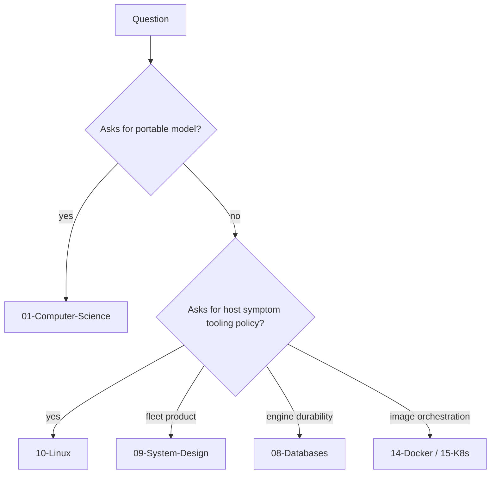
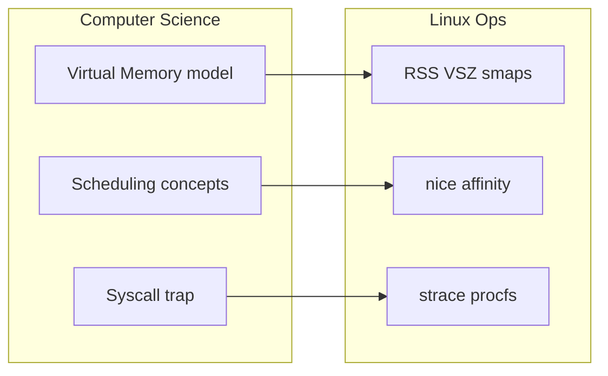
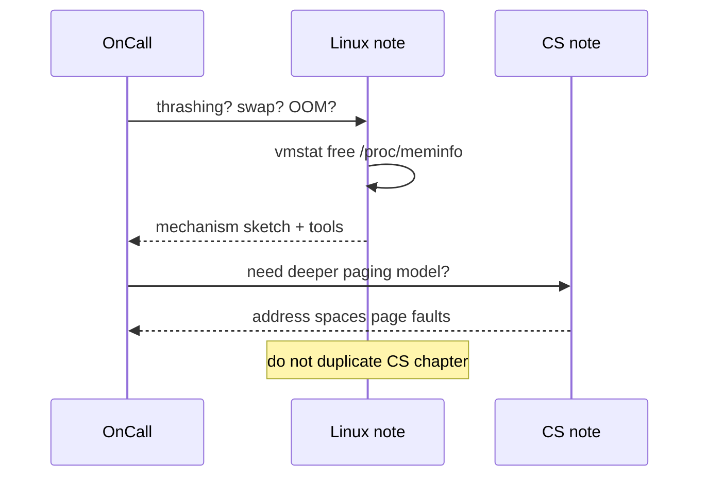

# CS Models vs Linux Operations Boundaries

## Overview

**Computer Science** owns portable *models*: virtual memory, process control blocks, scheduling fairness, syscall traps, TCP state machines. **Linux** owns *operations on a concrete host*: `ps`/`procfs`, `oom_score_adj`, `ss`, `iostat`, systemd units, cgroup controllers, and the failure modes those tools reveal.

Conflating the two produces either theory without a runbook or cargo-cult commands without mechanism. This note is the boundary contract for the entire [[10-Linux/README|Linux]] track.

## Learning Objectives

- Separate model questions from ops questions for the same symptom
- Route topics to CS vs Linux vs Docker/K8s without duplication
- Write notes and ADRs that cite models once and ops tooling deeply
- Recognize when “understanding Linux” actually means needing CS first
- Hand off cleanly to Backend, Databases, and System Design

## Prerequisites

- [[10-Linux/00-Orientation-and-Boundaries/Why Linux Exists for Engineers|Why Linux Exists for Engineers]]
- [[01-Computer-Science/03-Memory-and-Addressing/Virtual Memory|Virtual Memory]]
- [[01-Computer-Science/04-Processes-and-Execution/System Calls|System Calls]]

## Difficulty

`beginner`

## Estimated Time

- Reading: 45 minutes
- Exercises: 45 minutes
- Mini project: 1.5 hours

## History

Unix teaching historically mixed “how the kernel works” with “how to use the shell.” Modern tracks split: CS courses for invariants; SRE/platform docs for host playbooks. Containers blurred the line again—engineers inherited Linux knobs without Linux literacy, then blamed “Kubernetes” for cgroup OOM kills.

This repository restores the split deliberately: CS notes stay mechanism-pure; Linux notes stay symptom-and-tooling-heavy and *link* CS.

## Problem It Solves

| Confused statement | Correct home |
| --- | --- |
| “Explain page tables” while debugging RSS | CS Virtual Memory → then Linux RSS/VSZ ops |
| “What is a process?” vs `ps -eo pid,stat,rss` | Model vs tooling |
| “TCP slow-start” vs `ss -s` / retransmission counters | CS networking vs host triage |
| “Docker memory limit” as magic | Linux cgroups (07) then Docker track |
| Rewriting WAL durability under “Linux disk” | Databases fsync contracts |

## Internal Implementation

### Boundary rule



Linux notes **may** one-paragraph-summarize a CS model, then must pivot to ops: files under `/proc`, commands, failure, simulation.

## Mermaid Diagrams

### Structure — same topic, two tracks



### Sequence / Lifecycle — incident handoff



## Examples

### Minimal Example — dual annotation

```typescript
export type DualTopic = {
  symptom: string;
  csModelNote: string;
  linuxOpsNote: string;
  firstCommand: string;
};

export const MEMORY: DualTopic = {
  symptom: "latency spikes under load; free RAM looks low",
  csModelNote: "[[01-Computer-Science/03-Memory-and-Addressing/Virtual Memory|Virtual Memory]]",
  linuxOpsNote: "[[10-Linux/03-Memory-Swap-and-OOM/Virtual Memory Ops RSS vs VSZ|RSS vs VSZ]]",
  firstCommand: "ps -eo pid,rss,vsz,cmd --sort=-rss | head",
};
```

### Production-Shaped Example — gate for note authors

```typescript
export function boundaryCheck(draft: {
  title: string;
  diagramsExplainTooling: boolean;
  citesCsInsteadOfRetelling: boolean;
  hasHostFailureMode: boolean;
}): string[] {
  const gaps: string[] = [];
  if (!draft.diagramsExplainTooling) gaps.push("add ops/tooling diagram");
  if (!draft.citesCsInsteadOfRetelling) gaps.push("link CS; delete theory dump");
  if (!draft.hasHostFailureMode) gaps.push("name ENOSPC/OOM/zombie-style failure");
  return gaps;
}
```

## Trade-offs

| Dimension | Strict CS/Linux split | Merged “OS everything” notes |
| --- | --- | --- |
| Clarity | Clear study paths | Readers drown in theory mid-incident |
| Duplication | Controlled cross-links | Conflicting explanations |
| Interview | Can answer model *and* debug | Mixes whiteboard with `ps` poorly |
| Maintenance | Two owners | One sprawling doc bitrots |

### When to Use

- Designing every Linux module’s “Related Notes”
- Mentoring juniors who confuse Docker with the kernel
- ADR reviews that sneak ISA theory into host sysctl changes

### When Not to Use

- Blocking a live incident for taxonomy purity—triage first
- Pretending ops needs zero mental model (link CS lightly)

## Exercises

1. For signals, zombies, and page cache: write a one-line CS question and one-line Linux question each.
2. Take a System Design blast-radius note and list what still requires host literacy.
3. Run `boundaryCheck` mentally on an existing CS Virtual Memory note—what must Linux *not* copy?
4. Map five `/proc` files to the CS concepts they surface.
5. Draft a handoff sentence from Linux cgroups to [[14-Docker/README|Docker]].

## Mini Project

Create `docs/BOUNDARY.md` with a table of 15 symptoms → CS note → Linux note → first tool. Cite [[10-Linux/README|Linux]].

## Portfolio Project

[[10-Linux/projects/Linux Host Workbench/README|Linux Host Workbench]] — each lab README must list `csPrereq` and `linuxFocus` fields.

## Interview Questions

1. How do you explain virtual memory differently in a CS interview vs an SRE interview?
2. Is `strace` a CS topic or Linux ops? Why?
3. Where does “cgroup memory.max” belong relative to Docker memory limits?
4. Why shouldn’t the Linux track re-teach TCP congestion control in full?
5. Give an example where the model is fine but ops policy is wrong (OOM, ulimit).

### Stretch / Staff-Level

1. Design a curriculum gate so Backend engineers get Linux modules without a full CS redo.
2. How do you version the boundary when eBPF blurs kernel observability and app tracing?

## Common Mistakes

- Pasting CS lecture notes into Linux topics
- Teaching only commands with no mechanism sentence
- Treating Kubernetes as the process model
- Assuming “Linux” means desktop distro trivia
- Skipping CS prerequisites then blaming “Linux is hard”

## Best Practices

- One paragraph model → deep ops
- Always name the first tool and the failure mode
- Cross-link [[10-Linux/README|Linux]] and the CS note explicitly
- Keep container orchestration out of host-primitive notes except handoff sections
- Prefer ADR for host policy; prefer CS for invariants

## Summary

**CS owns models; Linux owns host operations.** The same physical phenomena appear in both tracks, but the questions, diagrams, and artifacts differ. Hold the boundary tightly so Linux notes stay production-actionable and CS notes stay portable—then cross-link aggressively.

## Further Reading

- [[10-Linux/README|Linux README]]
- [[01-Computer-Science/README|Computer Science]]
- [[10-Linux/00-Orientation-and-Boundaries/Why Linux Exists for Engineers|Why Linux Exists for Engineers]]
- [[01-Computer-Science/00-Orientation/Abstraction Layers in Computing|Abstraction Layers in Computing]]

## Related Notes

- [[10-Linux/00-Orientation-and-Boundaries/Distributions Kernel and Userspace|Distributions Kernel and Userspace]]
- [[10-Linux/03-Memory-Swap-and-OOM/Virtual Memory Ops RSS vs VSZ|Virtual Memory Ops RSS vs VSZ]]
- [[10-Linux/02-Processes-Signals-and-Job-Control/Process Lifecycle ps and procfs|Process Lifecycle ps and procfs]]
- [[10-Linux/07-Cgroups-Namespaces-and-Isolation/From Host Primitives to Containers Handoff|From Host Primitives to Containers Handoff]]

## Progress Checklist

- [ ] Explained from first principles
- [ ] Drew at least one Mermaid diagram
- [ ] Implemented a minimal version
- [ ] Documented trade-offs and non-goals
- [ ] Completed exercises
- [ ] Practiced interview questions aloud
- [ ] Linked prerequisites and dependents
