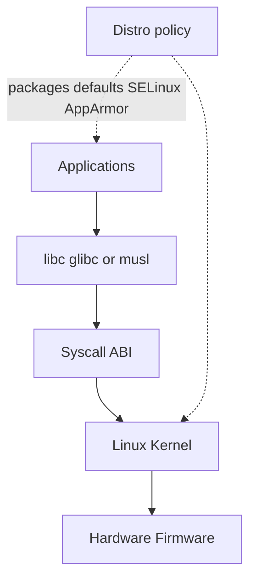
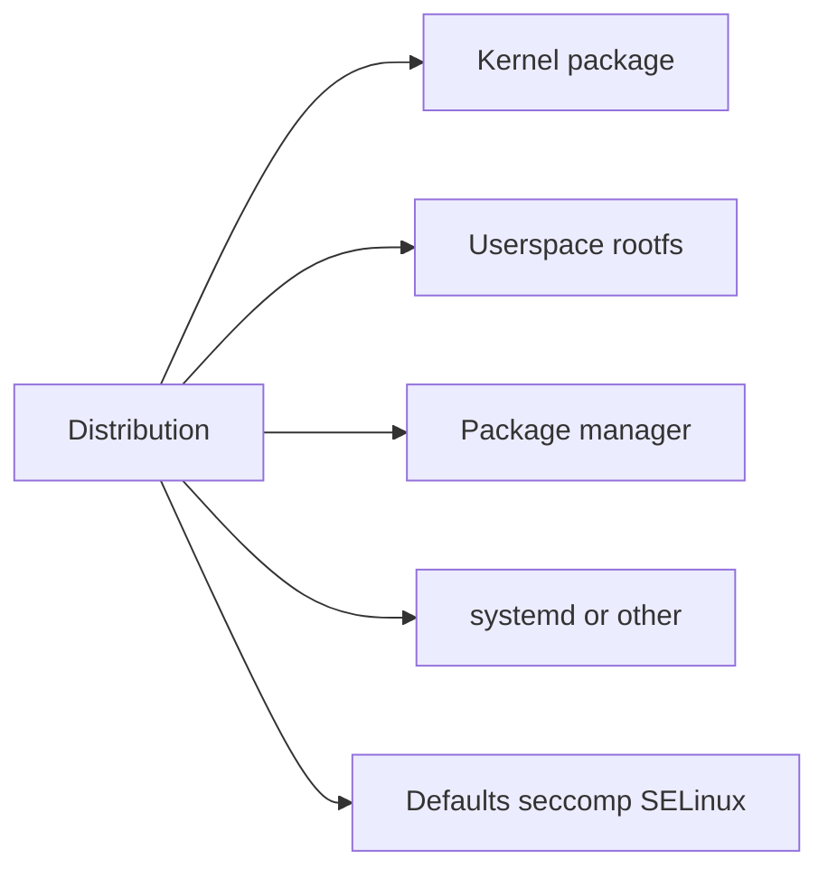

# Distributions Kernel and Userspace

## Overview

A **Linux distribution** packages a **kernel**, a **userspace** (libc, coreutils, init/systemd, package manager), and policies (defaults, security modules, update cadence). The kernel implements syscalls, scheduling, memory, and drivers; userspace implements shells, services, and almost everything you configure day to day.

Host incidents often misattribute “Linux” when the real variable is *distro defaults*: different `sysctl`, journal persistence, package names, or cgroup layouts. This note builds the mental model before packaging (module 11) and systemd (module 06).

## Learning Objectives

- Separate kernel version/features from distro userspace choices
- Explain why the same app behaves differently on Ubuntu vs RHEL vs Alpine
- Map “where to look” for a knob: `/proc`, `/sys`, unit files, package configs
- Reason about LTS kernels, backport policies, and ABI stability expectations
- Avoid “works on my AMI” without recording distro+kernel in ADRs

## Prerequisites

- [[10-Linux/00-Orientation-and-Boundaries/Why Linux Exists for Engineers|Why Linux Exists for Engineers]]
- [[01-Computer-Science/04-Processes-and-Execution/System Calls|System Calls]]
- [[10-Linux/00-Orientation-and-Boundaries/CS Models vs Linux Operations Boundaries|CS Models vs Linux Operations Boundaries]]

## Difficulty

`beginner`

## Estimated Time

- Reading: 1 hour
- Exercises: 45 minutes
- Mini project: 2 hours

## History

Linus Torvalds’ kernel needed a userspace to be a system—GNU tools, then distributions (Slackware, Debian, Red Hat) bundled coherent sets. systemd unified init on many distros; containers popularized minimal userspaces (Alpine/musl) beside glibc giants. Cloud images freeze a distro+kernel pair as the real production interface.

## Problem It Solves

| Symptom | Often actually |
| --- | --- |
| “Linux doesn’t have package X” | Wrong package name / repo on this distro |
| Feature missing though kernel is “new enough” | Distro disabled config; need module or newer image |
| Different default ulimits / journal size | Userspace policy, not kernel bug |
| musl vs glibc crash | Userspace ABI / locale / DNS stub differences |
| “Kernel update broke NVIDIA / custom module” | Out-of-tree module vs distro kernel ABI |

## Internal Implementation

### Stack layers



Stable syscall ABI is why old binaries often run on new kernels; **userspace** and **kernel config** still diverge across images.

## Mermaid Diagrams

### Structure — what a distro owns



### Sequence / Lifecycle — “is this a kernel bug?”

```mermaid
sequenceDiagram
    participant Eng as Engineer
    participant User as Userspace tool
    participant Kern as Kernel
    Eng->>User: reproduce with strace
    User->>Kern: syscall
    alt Error is EPERM from LSM or cgroup
        Kern-->>User: policy denial
        Eng->>Eng: check distro security defaults
    else Kernel oops or missing feature
        Eng->>Eng: uname -r; check config module
    end
```

## Examples

### Minimal Example — inventory the box

```typescript
export type HostIdentity = {
  distroId: string;      // /etc/os-release ID
  versionId: string;
  kernelRelease: string; // uname -r
  libc: "glibc" | "musl" | "other";
  init: "systemd" | "other";
};

export function compatRisk(a: HostIdentity, b: HostIdentity): string[] {
  const risks: string[] = [];
  if (a.libc !== b.libc) risks.push("libc mismatch (DNS locales binary)");
  if (a.init !== b.init) risks.push("service management differs");
  if (a.distroId !== b.distroId) risks.push("package names and defaults differ");
  return risks;
}
```

### Production-Shaped Example — ADR context stub

```typescript
export const IMAGE_ADR_CONTEXT = {
  decision: "Standardize app AMI on Ubuntu 22.04 LTS + vendor kernel",
  why: [
    "Predictable systemd and journald defaults",
    "glibc ecosystem for Node native addons",
    "Security update cadence matches org patch window",
  ],
  rejected: [
    { name: "Alpine base for VMs", reason: "musl + ops unfamiliarity cost" },
    { name: "Rolling distro", reason: "unbounded change blast radius" },
  ],
  record: ["ID", "VERSION_ID", "uname -r", "cgroup v2 mounted?"],
};
```

## Trade-offs

| Dimension | Homogeneous distro fleet | Mixed distros |
| --- | --- | --- |
| Operability | One runbook | N package dialects |
| Supply risk | Single vendor cadence | Diversified but costly |
| Containers | Base image still matters | Alpine vs distroless choices |
| Kernel features | Controlled rollouts | Surprising skew |

### When to Use

- Choosing golden images and bastion OS
- Debugging “works on Ubuntu CI, fails on RHEL”
- Writing host ADRs that pin kernel+userspace

### When Not to Use

- Debating distro fandom instead of measuring the incident
- Assuming containers erase distro differences (they move them into images)

## Exercises

1. On a lab VM, collect `HostIdentity` from `os-release`, `uname -r`, and `ldd --version` / musl checks.
2. List five knobs that are userspace-default vs kernel-config.
3. Explain why two hosts with the same `uname -r` can still differ operationally.
4. Compare glibc vs musl impact on a Node native module story.
5. Draft rejected alternatives for a golden-image ADR.

## Mini Project

Write `ADR-HOST-001`: choose one distro+kernel for a three-tier app. Include `compatRisk` checks against CI runners.

## Portfolio Project

[[10-Linux/projects/Linux Host Workbench/README|Linux Host Workbench]] — fixture matrix: Ubuntu glibc systemd vs Alpine musl; document tool name deltas (`ss` still, package manager differs).

## Interview Questions

1. What is a Linux distribution?
2. Does upgrading the kernel change `/etc` defaults? Explain.
3. Why do containers still care about distro choice?
4. What is ABI stability at the syscall layer vs packaging?
5. How do you decide LTS vs latest kernel for a database host?

### Stretch / Staff-Level

1. Design a dual-track fleet (immutable container hosts vs mutable bastions) with clear distro policy.
2. How do you validate out-of-tree modules across kernel upgrades without freezing forever?

## Common Mistakes

- Saying “Linux” when you mean “Ubuntu defaults”
- Ignoring libc when copying binaries between images
- Updating kernel without recording module/driver dependencies
- Treating `os-release` as optional trivia
- Assuming systemd is universal (it is common, not definitional)

## Best Practices

- Pin and document distro ID, version, kernel release in every host ADR
- Prefer LTS images for prod; isolate experiments
- Test packaging and native deps on the *same* libc as prod
- Separate kernel CVE response from userspace package response in runbooks
- Cross-link [[10-Linux/11-Packaging-Config-and-Automation-Basics/Package Managers Deb Rpm Mental Model|Package Managers]] when deep-diving

## Summary

A working Linux system is **kernel + userspace + distro policy**. Syscall ABI is relatively stable; defaults, libc, init, and packages are not. Inventory identity first, attribute bugs to the right layer, and ADR the golden image so “Linux” stops being a vague variable.

## Further Reading

- [[10-Linux/README|Linux README]]
- [[10-Linux/11-Packaging-Config-and-Automation-Basics/Package Managers Deb Rpm Mental Model|Package Managers Deb Rpm Mental Model]]
- [[10-Linux/06-systemd-Timers-and-Logging/Unit Types Dependencies and Targets|Unit Types Dependencies and Targets]]
- [[01-Computer-Science/04-Processes-and-Execution/System Calls|System Calls]]

## Related Notes

- [[10-Linux/00-Orientation-and-Boundaries/CS Models vs Linux Operations Boundaries|CS Models vs Linux Operations Boundaries]]
- [[10-Linux/00-Orientation-and-Boundaries/ADR Discipline for Host Decisions|ADR Discipline for Host Decisions]]
- [[10-Linux/07-Cgroups-Namespaces-and-Isolation/From Host Primitives to Containers Handoff|From Host Primitives to Containers Handoff]]

## Progress Checklist

- [ ] Explained from first principles
- [ ] Drew at least one Mermaid diagram
- [ ] Implemented a minimal version
- [ ] Documented trade-offs and non-goals
- [ ] Completed exercises
- [ ] Practiced interview questions aloud
- [ ] Linked prerequisites and dependents
