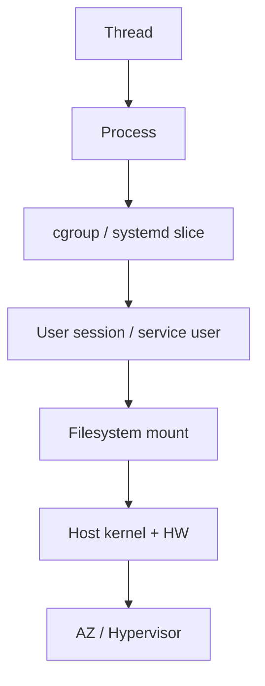
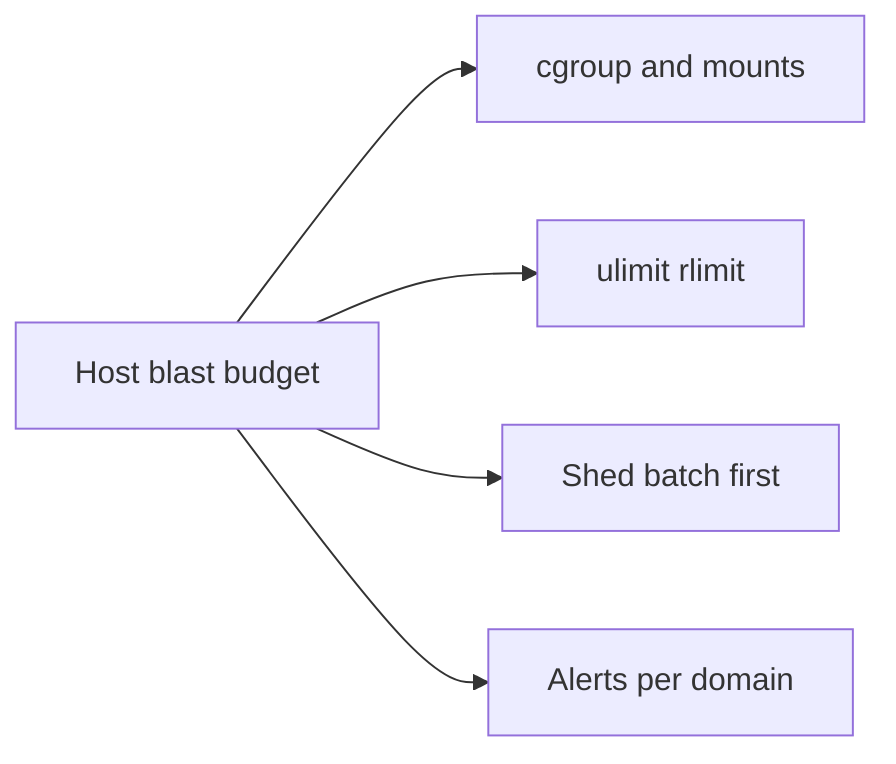
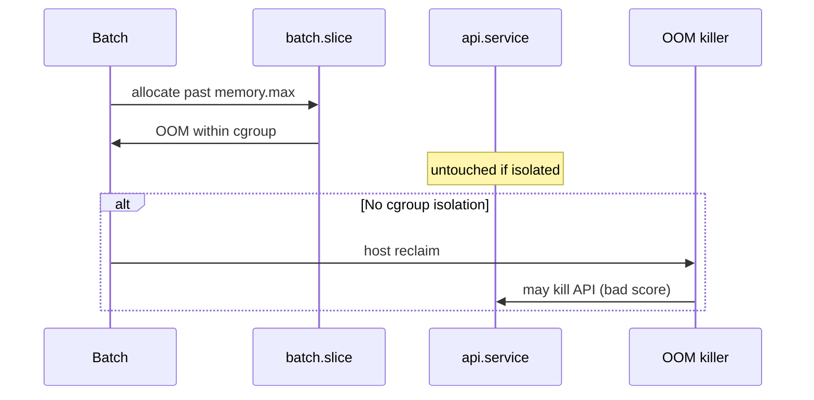

# Failure Domains on a Single Host

## Overview

On one machine, **failure domains** nest: thread → process → cgroup/slice → user session → host kernel/disk → (later) AZ. **Blast radius** on a host is how much co-located work dies when that domain fails—OOM of one cgroup vs kernel panic, full root filesystem vs full data mount, one runaway `nice 0` batch job vs the API.

System Design budgets multi-AZ fate; this note budgets **shared fate on a box** so noisy neighbors and shared mounts are intentional, not discovered at 3 a.m. See [[10-Linux/README|Linux]] for the track map.

## Learning Objectives

- Inventory host-local failure domains from process to kernel
- Set blast-radius budgets for co-located services (API + batch + agent)
- Distinguish process kill, cgroup OOM, and host-wide resource exhaustion
- Reason about correlated failures: full disk, FD exhaustion, bad deploy on one node
- Link to cgroups (07) and incident triage (12) without jumping to fleet topology

## Prerequisites

- [[10-Linux/00-Orientation-and-Boundaries/Why Linux Exists for Engineers|Why Linux Exists for Engineers]]
- [[09-System-Design/00-Orientation-and-Boundaries/Failure Domains and Blast Radius Budgets|Failure Domains and Blast Radius Budgets]]
- [[07-Backend/06-Reliability-and-Abuse-Resistance/Circuit Breakers and Bulkheads|Circuit Breakers and Bulkheads]]

## Difficulty

`intermediate`

## Estimated Time

- Reading: 1 hour
- Exercises: 45 minutes
- Mini project: 2 hours

## History

Classic Unix co-located daemons on one box with soft ulimits. Containers and cgroup v2 made hard isolation cheap enough to expect—yet many VMs still run API, log shipper, node exporter, and cron on one root FS. SRE practice imported “blast radius” downward: change and failure should be survivable at a *stated host scope*.

## Problem It Solves

| Shared-fate accident | Host-domain design |
| --- | --- |
| Batch job fills `/` | Separate mounts + quotas; batch cgroup |
| One process opens all FDs | rlimits + monitoring (module 02) |
| OOM killer picks the wrong victim | Scores + cgroup memory.max (03, 07) |
| Kernel panic / NMI | Host is the domain—capacity elsewhere (SD) |
| Log shipper saturates disk IO | IO controller / ionice / separate volume |
| Agent + app same UID with broad write | DAC/capability split (01, 09) |

## Internal Implementation

### Host domain hierarchy



Budget example: **batch cgroup OOM → 0% API availability loss; root FS full → page on-call within 5m; kernel panic → lose this replica only**.

## Mermaid Diagrams

### Structure — blast budget artifacts



### Sequence / Lifecycle — memory pressure



## Examples

### Minimal Example — host blast budget

```typescript
export type HostBlastBudget = {
  domain: "process" | "cgroup" | "mount" | "host";
  colocated: string[];
  mustSurvive: string[];
  mayDie: string[];
  isolation: string[];
};

export const APP_VM_BUDGET: HostBlastBudget = {
  domain: "cgroup",
  colocated: ["api", "batch", "node-exporter"],
  mustSurvive: ["api"],
  mayDie: ["batch"],
  isolation: ["memory.max on batch.slice", "/var/lib/batch on separate mount"],
};
```

### Production-Shaped Example — correlated failure check

```typescript
export function sharedFateRisks(box: {
  services: string[];
  singleRootFs: boolean;
  cgroupV2: boolean;
}): string[] {
  const risks: string[] = [];
  if (box.singleRootFs && box.services.length > 1) {
    risks.push("ENOSPC on / takes all services");
  }
  if (!box.cgroupV2) {
    risks.push("weak memory/IO isolation between units");
  }
  if (box.services.includes("api") && box.services.includes("batch")) {
    risks.push("CPU contention without CPUWeight / cpu.max");
  }
  return risks;
}
```

## Trade-offs

| Dimension | Strong host isolation | Cozy co-location |
| --- | --- | --- |
| Density | Lower (more headroom) | Higher cost efficiency |
| MTTR | Clearer victim domain | Ambiguous “the box is sick” |
| Complexity | More units/mounts | Simple until incident |
| Blast radius | Contained | Host-wide by default |

### When to Use

- Any VM running more than one critical role
- Before approving “just run the migrator on the API box”
- Designing systemd slices and disk layout

### When Not to Use

- Replacing multi-AZ System Design budgets—this is the *inner* ring
- Over-isolating a single-process bastion with no neighbors

## Exercises

1. Inventory domains on a lab host: processes, slices, mounts, NICs.
2. Write `HostBlastBudget` for API+Redis co-located anti-pattern—then fix isolation.
3. Trace what fails first on root FS 100%: ssh? journald? app writes?
4. Compare this note to [[09-System-Design/00-Orientation-and-Boundaries/Failure Domains and Blast Radius Budgets|Failure Domains and Blast Radius Budgets]]—what moves up?
5. List three correlated failures a bad deploy wave causes on one node.

## Mini Project

Produce `docs/HOST_BLAST.md` for a three-service VM: budgets, mounts, cgroup sketch, and alert per domain. Cite [[10-Linux/README|Linux]].

## Portfolio Project

[[10-Linux/projects/Cgroup Budget Clinic/README|Cgroup Budget Clinic]] — demonstrate batch OOM not killing API under cgroup v2.

## Interview Questions

1. What is a failure domain on a single Linux host?
2. How do cgroups change OOM blast radius?
3. Why is a full `/var` different from a full data volume?
4. Where do Backend circuit breakers sit relative to host domains?
5. Kernel panic—what is the blast radius, and what is the mitigation?

### Stretch / Staff-Level

1. Design host blast budgets that compose with AZ budgets without double-counting capacity.
2. How do you enforce isolation as policy-as-code for golden images?

## Common Mistakes

- Treating the VM as one domain always (sometimes correct—name it)
- Isolating memory but sharing a tiny root disk
- Alerting only on host CPU while cgroup throttling kills latency
- Assuming containers mean isolation without verifying controllers
- Ignoring agents that share fate with the app

## Best Practices

- Name mustSurvive vs mayDie per host role
- Separate mounts for high-write workloads
- Prefer systemd slices + cgroup v2 over hope
- Alert on domain-local signals (cgroup OOM events, mount fill)
- Cross-link System Design for multi-host fate

## Summary

A single host has nested **failure domains**. Blast-radius budgets decide which co-located work may die together. Isolate with cgroups, mounts, and limits; escalate to System Design when the domain is the whole replica. Linux ops makes shared fate visible and intentional.

## Further Reading

- [[10-Linux/README|Linux README]]
- [[09-System-Design/00-Orientation-and-Boundaries/Failure Domains and Blast Radius Budgets|Failure Domains and Blast Radius Budgets]]
- [[10-Linux/07-Cgroups-Namespaces-and-Isolation/Resource Budgets and Noisy Neighbor Containment|Resource Budgets and Noisy Neighbor Containment]]
- [[10-Linux/12-Incidents-Runbooks-and-Portfolio/Host Incident Triage Order CPU Mem Disk Net|Host Incident Triage Order]]

## Related Notes

- [[10-Linux/00-Orientation-and-Boundaries/ADR Discipline for Host Decisions|ADR Discipline for Host Decisions]]
- [[10-Linux/03-Memory-Swap-and-OOM/OOM Killer Scores and Policy|OOM Killer Scores and Policy]]
- [[10-Linux/02-Processes-Signals-and-Job-Control/Limits ulimit and rlimits|Limits ulimit and rlimits]]
- [[10-Linux/04-Filesystems-Disks-and-IO/Inodes Quotas and ENOSPC Failure Modes|Inodes Quotas and ENOSPC Failure Modes]]

## Progress Checklist

- [ ] Explained from first principles
- [ ] Drew at least one Mermaid diagram
- [ ] Implemented a minimal version
- [ ] Documented trade-offs and non-goals
- [ ] Completed exercises
- [ ] Practiced interview questions aloud
- [ ] Linked prerequisites and dependents
