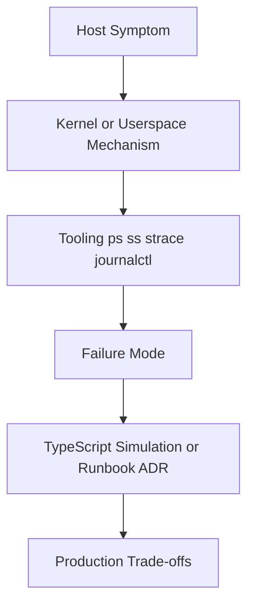
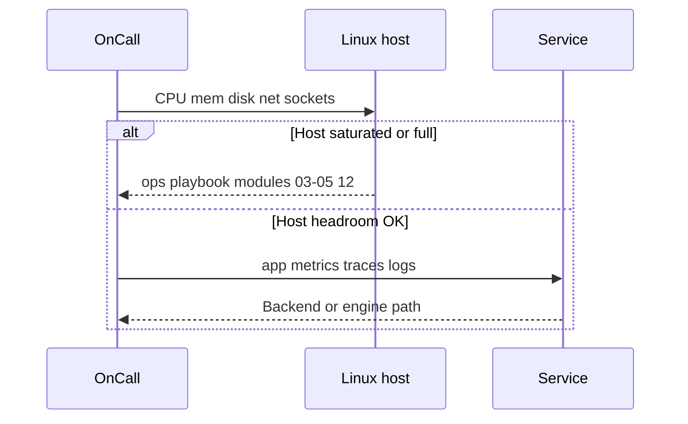

# Why Linux Exists for Engineers

## Overview

**Linux host operations** is the discipline of reading and controlling what a single machine is doing: processes, memory pressure, disk fullness, sockets, permissions, and service lifecycle. Application code, databases, and fleet topology all sit on contracts the kernel and userspace tools expose—`procfs`, signals, mounts, cgroups, and systemd.

This track exists because most production outages eventually land on a box: OOM kills, `ENOSPC`, socket exhaustion, runaway batch jobs, mis-mounted volumes, and “it works in Docker” surprises that are really host primitives misunderstood. [[10-Linux/README|Linux]] teaches those **host contracts** without re-teaching CS theory or Kubernetes YAML.

## Learning Objectives

- Explain what Linux ops owns that CS models, Backend, and System Design do not
- Map the teaching pipeline: host symptom → mechanism → tooling → failure → TS sim/ADR → trade-offs
- Distinguish “the process is slow” (app) from “the host is thrashing / full / starved” (ops)
- Identify when a ticket is a host problem vs an engine, service, or topology problem
- Use the Linux MOC as the map for modules 01–12

## Prerequisites

- [[01-Computer-Science/04-Processes-and-Execution/Processes|Processes]] — PCB and address-space *models*
- [[01-Computer-Science/04-Processes-and-Execution/System Calls|System Calls]] — trap boundary *models*
- Comfortable with a shell and reading logs

## Difficulty

`beginner`

## Estimated Time

- Reading: 1 hour
- Exercises: 45 minutes
- Mini project: 1.5 hours

## History

Unix (1970s) and later Linux (1991–) made a portable userspace contract around files, processes, and pipes. Production engineering inherited that contract as the **universal substrate**: bare metal, VMs, and containers all expose a Linux-shaped view of CPU, memory, disk, and network.

Cloud and containers did not remove the host—they multiplied it. An OOM in a pod is still an OOM policy on a kernel. A full disk is still `ENOSPC`. Engineers who only know dashboards without `ps`, `ss`, `iostat`, and journald lose hours when the graph only says “something is wrong.”

## Problem It Solves

| Failure mode without host literacy | What this track addresses |
| --- | --- |
| “API p99 high” with no CPU/mem/disk/net triage | Modules 02–05, 08, 12 |
| Service dies mysteriously; no signal story | Signals, systemd, reaping (02, 06) |
| Node “out of memory” with no OOM score context | Memory / swap / OOM (03) |
| Permission denied / sticky-bit surprises | Shell and DAC/ACL (01) |
| “Works locally” vs production cgroup limits | Cgroups / namespaces (07) → Docker/K8s handoff |
| Tribal sysctl changes | Perf knobs + ADR discipline (10, 00) |

CS owns *why* virtual memory and scheduling exist. Linux owns *how to measure and act* on a live host.

## Internal Implementation

### Teaching contract (every later note)



### Ownership layers

| Layer | Example question | Home track |
| --- | --- | --- |
| Machine model | What is a page table? | [[01-Computer-Science/README\|Computer Science]] |
| Host ops | Why is RSS climbing and who got OOM-killed? | **This track** |
| Service | Timeouts, pools, idempotency | [[07-Backend/README\|Backend]] |
| Engine | WAL fsync, buffer pool | [[08-Databases/README\|Databases]] |
| Fleet | Blast radius across AZs | [[09-System-Design/README\|System Design]] |
| Containers | Image, runtime, pod | [[14-Docker/README\|Docker]], [[15-Kubernetes/README\|Kubernetes]] |

## Mermaid Diagrams

### Structure — what “the host” is

```mermaid
flowchart LR
    HW[Hardware] --> Kernel[Linux Kernel]
    Kernel --> Proc[/proc /sys]
    Kernel --> User[Userspace tools systemd]
    User --> Apps[App DB Agent]
    Apps -->|syscalls| Kernel
```

### Sequence / Lifecycle — first triage question



## Examples

### Minimal Example — classify the problem class

```typescript
type HostProblem =
  | { kind: "cs-model"; symptom: string }     // teach theory elsewhere
  | { kind: "host-ops"; symptom: string }     // this track
  | { kind: "service"; symptom: string }      // Backend
  | { kind: "topology"; symptom: string };    // System Design

export function classify(symptom: string): HostProblem {
  if (/page table|TLB|scheduler fairness theory/i.test(symptom)) {
    return { kind: "cs-model", symptom };
  }
  if (/OOM|ENOSPC|ulimit|zombie|iowait|conntrack|journald/i.test(symptom)) {
    return { kind: "host-ops", symptom };
  }
  if (/N\+1|connection pool|idempotency|circuit breaker/i.test(symptom)) {
    return { kind: "service", symptom };
  }
  return { kind: "topology", symptom };
}

// "dmesg: Out of memory: Killed process 1842" → host-ops
```

### Production-Shaped Example — one-page host sketch

```typescript
export type HostSketch = {
  role: "app" | "db" | "bastion" | "batch";
  goldenSignals: { cpuPct: number; memAvailPct: number; diskFullPct: number; netErrs: number };
  budgets: { maxRssMb: number; maxFds: number; maxLoad1PerCore: number };
  failureDomain: "process" | "cgroup" | "host" | "az";
  firstTools: string[];
};

export const APP_HOST: HostSketch = {
  role: "app",
  goldenSignals: { cpuPct: 72, memAvailPct: 18, diskFullPct: 61, netErrs: 0 },
  budgets: { maxRssMb: 4096, maxFds: 65535, maxLoad1PerCore: 1.5 },
  failureDomain: "cgroup",
  firstTools: ["ps", "free", "df", "ss", "journalctl"],
};
```

## Trade-offs

| Dimension | Host-literate ops | Dashboard-only ops |
| --- | --- | --- |
| MTTR | Faster mechanism mapping | Slow “check more graphs” |
| Transfer | Runbooks teach tools | Tribal Slack lore |
| Risk | Can make unsafe sysctls if undisciplined | Safe until silent host failure |
| Scope | One machine clarity | Misses shared-fate on one box |

### When to Use

- Any production role that touches VMs, bare metal, or containers
- Incidents where CPU/mem/disk/net could be causal
- Interviews that ask “how would you debug a slow server?”

### When Not to Use

- As a substitute for fixing application N+1 or missing indexes
- When the real problem is multi-region consistency (System Design)
- Deep ISA/microarchitecture theory (Computer Science)

## Exercises

1. List five recent incidents (real or hypothetical) and classify each with `classify()`.
2. Write golden-signal thresholds for an app host vs a Postgres host—why do they differ?
3. Draw the teaching-contract flowchart for “API timeouts rising.”
4. Explain why “we use Kubernetes” is not a host-ops answer by itself.
5. Compare ownership tables with [[10-Linux/00-Orientation-and-Boundaries/CS Models vs Linux Operations Boundaries|CS Models vs Linux Operations Boundaries]].

## Mini Project

Draft a one-page `HostSketch` for a batch worker and an API node. Store as `docs/HOST_WHY.md` citing this note and [[10-Linux/README|Linux]].

## Portfolio Project

[[10-Linux/projects/Linux Host Workbench/README|Linux Host Workbench]] — add `docs/WHY.md` linking host symptoms to module playbooks, not app stack traces alone.

## Interview Questions

1. What does Linux ops teach that reading CS textbooks does not?
2. Walk symptom → mechanism → tool for “disk full.”
3. Where do circuit breakers live vs cgroup memory limits?
4. Why can p50 look fine while the host is about to OOM?
5. Name three decisions that belong in Databases, not on the host runbook.

### Stretch / Staff-Level

1. Design a host triage gate that forces CPU/mem/disk/net checks before paging the app team.
2. How do you keep Linux literacy alive when most deploys are containers?

## Common Mistakes

- Equating Linux knowledge with memorizing flag trivia
- Jumping to `sysctl` before stating the symptom and mechanism
- Treating containers as “not Linux”
- Ignoring disk and FD limits because CPU graphs look green
- Re-teaching virtual memory theory instead of RSS/OOM ops

## Best Practices

- Start from host golden signals, then drill into processes
- Separate CS models from ops tooling in notes and ADRs
- Name the failure domain: process, cgroup, host, AZ
- Prefer one clear runbook over five competing scripts
- Cross-link Backend / Databases / System Design instead of absorbing them

## Summary

Linux exists for engineers as the **operational substrate**: processes, memory, disk, network, and service control on a single host. This track turns host symptoms into mechanisms, tools, failure modes, and ADRs. Use Computer Science for models, Backend for service patterns, System Design for fleets, and Linux when the box is lying, full, starved, or killing your work.

## Further Reading

- [[10-Linux/README|Linux README]]
- [[10-Linux/00-Orientation-and-Boundaries/CS Models vs Linux Operations Boundaries|CS Models vs Linux Operations Boundaries]]
- [[01-Computer-Science/04-Processes-and-Execution/Processes|Processes]]
- [[00-References/Linux/README|Linux References]]

## Related Notes

- [[10-Linux/00-Orientation-and-Boundaries/Distributions Kernel and Userspace|Distributions Kernel and Userspace]]
- [[10-Linux/00-Orientation-and-Boundaries/Failure Domains on a Single Host|Failure Domains on a Single Host]]
- [[10-Linux/00-Orientation-and-Boundaries/ADR Discipline for Host Decisions|ADR Discipline for Host Decisions]]
- [[10-Linux/12-Incidents-Runbooks-and-Portfolio/Host Incident Triage Order CPU Mem Disk Net|Host Incident Triage Order]]

## Progress Checklist

- [ ] Explained from first principles
- [ ] Drew at least one Mermaid diagram
- [ ] Implemented a minimal version
- [ ] Documented trade-offs and non-goals
- [ ] Completed exercises
- [ ] Practiced interview questions aloud
- [ ] Linked prerequisites and dependents
