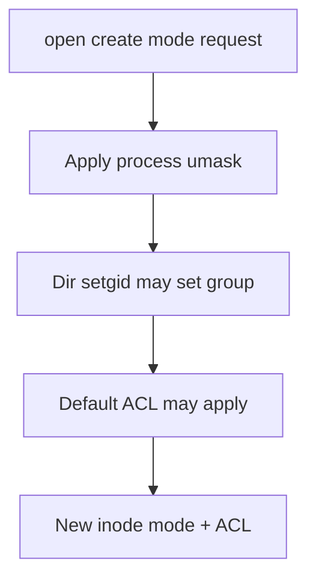
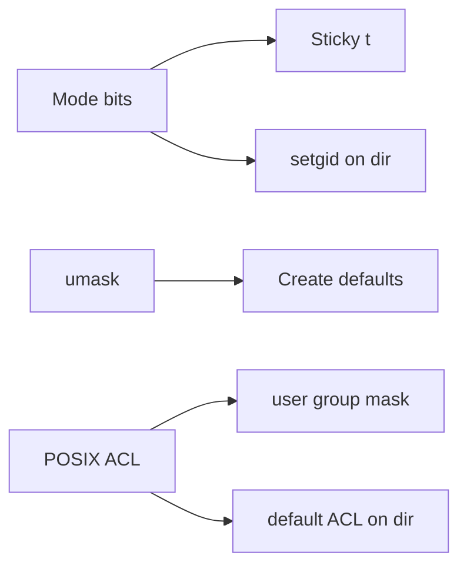
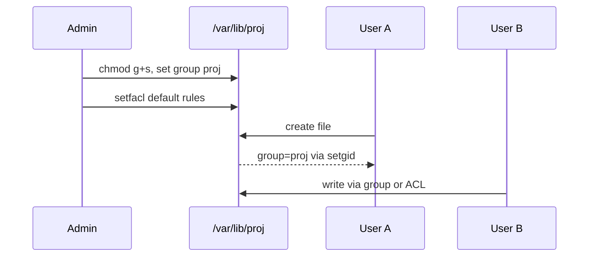

# ACLs Sticky Bits and Umask

## Overview

Beyond the nine mode bits, Linux hosts use **special bits** (sticky on directories, setgid on dirs for group inheritance), **umask** (bits stripped from default creation modes), and **POSIX ACLs** (named user/group entries plus mask) when owner/group/other is too coarse.

Shared drop directories, multi-team log dirs, and “why is this file 644 when I wanted 640?” are daily ops. Master these before blaming the application—see [[10-Linux/README|Linux]].

## Learning Objectives

- Explain sticky bit on `/tmp`-style directories (delete only own files unless privileged)
- Use setgid directories for inherited group ownership
- Predict new file modes from process umask
- Read and set POSIX ACLs (`getfacl`/`setfacl`) including default ACLs
- Know when ACLs are justified vs redesigning groups

## Prerequisites

- [[10-Linux/01-Shell-Filesystem-Hierarchy-and-Permissions/Users Groups and DAC Permissions|Users Groups and DAC Permissions]]
- [[10-Linux/01-Shell-Filesystem-Hierarchy-and-Permissions/Filesystem Hierarchy Standard and Path Semantics|Filesystem Hierarchy Standard and Path Semantics]]

## Difficulty

`intermediate`

## Estimated Time

- Reading: 1 hour
- Exercises: 1 hour
- Mini project: 2.5 hours

## History

Sticky directories protected shared temp spaces on multi-user systems. setgid directories spread collaboration without world-write. POSIX ACLs arrived when two groups were not enough; many orgs still overuse ACLs instead of fixing identity design—or underuse them and invent brittle sync scripts.

## Problem It Solves

| Symptom | Mechanism |
| --- | --- |
| User deletes another’s file in shared dir | Missing sticky bit |
| New files wrong group in project tree | Need setgid on directory |
| Created files world-readable | umask too permissive (e.g. 022) |
| Third team needs read, fourth write | ACL named entries |
| ACL “doesn’t work” after chmod | ACL mask interaction |

## Internal Implementation

### Creation mode



Roughly: `final = requested & ~umask`, then ACL defaults can widen the story—always verify with `stat`/`getfacl`.

## Mermaid Diagrams

### Structure — tools



### Sequence / Lifecycle — shared project directory



## Examples

### Minimal Example — umask apply

```typescript
export function applyUmask(requestedMode: number, umask: number): number {
  return requestedMode & ~umask & 0o777;
}

// open(..., 0666) with umask 0o027 → 0o640
export const EXAMPLE = applyUmask(0o666, 0o027); // 0o640
```

### Production-Shaped Example — ACL decision

```typescript
export type AccessNeed = {
  path: string;
  principals: Array<{ name: string; perms: "r" | "rw" | "rwx" }>;
  sticky: boolean;
};

export function preferGroupsOrAcl(need: AccessNeed): "groups" | "acl" | "both" {
  if (need.principals.length <= 2 && !need.sticky) return "groups";
  if (need.principals.some((p) => p.name.startsWith("user:"))) return "acl";
  return need.principals.length > 3 ? "acl" : "both";
}
```

## Trade-offs

| Tool | Upside | Downside |
| --- | --- | --- |
| Sticky bit | Safe shared scratch | Does not control create mode |
| setgid dir | Stable collaboration group | Surprises if misunderstood |
| umask | Global create policy | Per-process; systemd may differ from login |
| ACL | Fine-grained | Harder to audit; backup/tool support varies |

### When to Use

- `/tmp`-like shares → sticky
- Team project trees → setgid + careful umask
- Exceptional third principal → ACL with defaults
- Service units → explicit `UMask=` in systemd

### When Not to Use

- ACLs as a substitute for every permission problem
- setuid binaries for convenience (security track)
- Copying ACL-heavy trees without `cp -a` / rsync ACL flags

## Exercises

1. Compute `applyUmask(0o777, 0o022)` and `applyUmask(0o666, 0o077)`.
2. On a lab dir, demonstrate sticky preventing cross-delete.
3. Create setgid dir; show new file GID matches directory.
4. Add a named user ACL and show mask effect after `chmod`.
5. Compare login umask vs `systemd` service `UMask=`.

## Mini Project

TypeScript simulator: directory flags (sticky/setgid) + umask + optional default ACL → resulting file metadata. Document as ADR when to enable ACLs. Link [[10-Linux/README|Linux]].

## Portfolio Project

[[10-Linux/projects/Linux Host Workbench/README|Linux Host Workbench]] — permission evaluator extended for ACL mask + sticky delete rules.

## Interview Questions

1. What does the sticky bit do on a directory?
2. How does setgid on a directory affect new files?
3. How does umask interact with `open` mode?
4. What is the ACL mask?
5. Default ACL vs access ACL?

### Stretch / Staff-Level

1. Design an audit pipeline that diffs unexpected ACL sprawl on golden hosts.
2. When do you migrate from ACL spaghetti to group redesign + separate mounts?

## Common Mistakes

- Setting ACL without default ACL on directories
- Forgetting umask in service managers
- Assuming Samba/NFS will preserve ACLs identically
- Using sticky bit thinking it makes files immutable
- chmod that silently clears ACL mask permissions

## Best Practices

- Prefer group redesign; ACL for exceptions
- Set `UMask=` explicitly on sensitive units
- Use sticky on shared writable dirs
- Backup/restore with ACL awareness
- Document in host ADRs for shared trees

## Summary

**Sticky bits, setgid directories, umask, and ACLs** extend classic DAC for shared and multi-principal workflows. Predict create modes, protect shared deletes, inherit groups intentionally, and use ACLs sparingly with defaults—and verify with `getfacl`/`stat`, not hope.

## Further Reading

- [[10-Linux/README|Linux README]]
- [[10-Linux/01-Shell-Filesystem-Hierarchy-and-Permissions/Users Groups and DAC Permissions|Users Groups and DAC Permissions]]
- [[10-Linux/06-systemd-Timers-and-Logging/Service Hardening Directives|Service Hardening Directives]]
- [[10-Linux/09-Security-Primitives-on-the-Host/File Integrity and Permission Drift|File Integrity and Permission Drift]]

## Related Notes

- [[10-Linux/01-Shell-Filesystem-Hierarchy-and-Permissions/Finding Files Inodes and Links|Finding Files Inodes and Links]]
- [[10-Linux/00-Orientation-and-Boundaries/ADR Discipline for Host Decisions|ADR Discipline for Host Decisions]]
- [[10-Linux/11-Packaging-Config-and-Automation-Basics/Environment Files Secrets on Disk Anti-Patterns|Environment Files Secrets on Disk Anti-Patterns]]

## Progress Checklist

- [ ] Explained from first principles
- [ ] Drew at least one Mermaid diagram
- [ ] Implemented a minimal version
- [ ] Documented trade-offs and non-goals
- [ ] Completed exercises
- [ ] Practiced interview questions aloud
- [ ] Linked prerequisites and dependents
