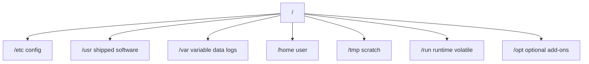
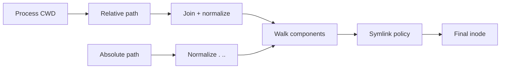
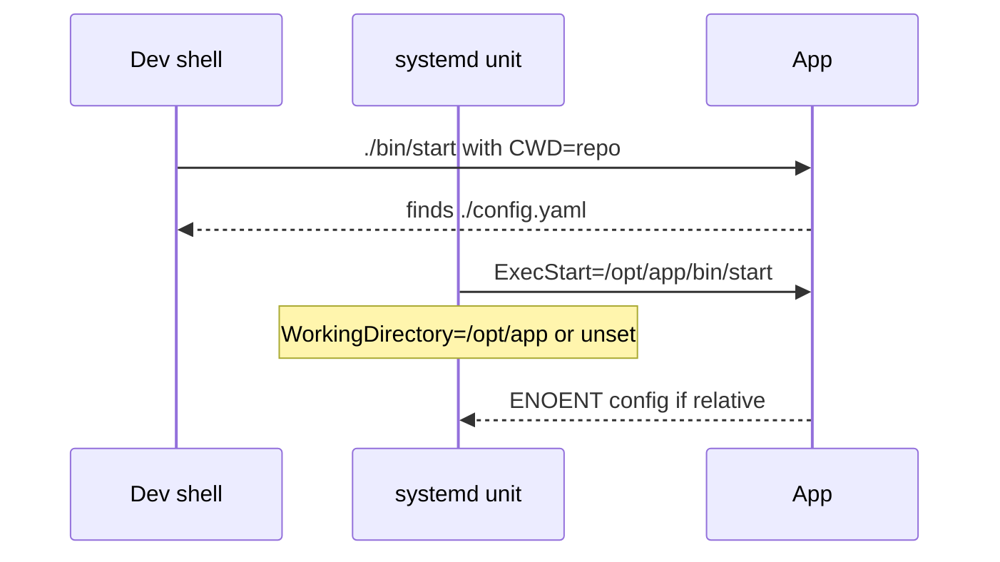

# Filesystem Hierarchy Standard and Path Semantics

## Overview

The **Filesystem Hierarchy Standard (FHS)** is a conventional layout for Unix-like systems: where binaries, configs, variable data, and runtime state live (`/etc`, `/var`, `/usr`, `/tmp`, `/run`, …). **Path semantics**—absolute vs relative, symlinks, `.` / `..`, trailing slashes, and “file vs directory” expectations—determine whether tools operate on the path you think.

Misplaced state (writing app data under `/usr`, filling `/tmp` on RAM-backed tmpfs, following symlinks into the wrong tree) is a classic host failure. Ops literacy here precedes mounts and ENOSPC in module 04—see [[10-Linux/README|Linux]].

## Learning Objectives

- Map common FHS directories to operational roles
- Resolve path edge cases: symlinks, relative paths, `realpath` vs logical path
- Choose locations for logs, sockets, configs, and secrets-on-disk (with caution)
- Explain `/run` vs `/var/run` and tmpfs implications
- Avoid hard-coding distro-specific paths without discovery

## Prerequisites

- [[10-Linux/01-Shell-Filesystem-Hierarchy-and-Permissions/Shell Pipelines and Exit Status Contracts|Shell Pipelines and Exit Status Contracts]]
- [[01-Computer-Science/06-IO-and-Persistence/Files as Abstractions|Files as Abstractions]]
- [[10-Linux/00-Orientation-and-Boundaries/Distributions Kernel and Userspace|Distributions Kernel and Userspace]]

## Difficulty

`beginner`

## Estimated Time

- Reading: 1 hour
- Exercises: 45 minutes
- Mini project: 2 hours

## History

Early Unix trees grew organically; FHS (and LSB influences) documented conventions so packaging and admins could agree. systemd pushed `/run` as early-boot volatile storage. Containers reuse the same path language inside namespaces—wrong `WORKDIR` or volume mount still breaks like a bad FHS choice.

## Problem It Solves

| Symptom | Path / FHS cause |
| --- | --- |
| Disk full but “data disk” empty | Logs/state on root under `/var` |
| Secrets in world-readable `/tmp` | Wrong durability + permission domain |
| Service cannot find config after upgrade | Mixed `/etc` vs `/usr/local/etc` |
| Broken symlink loops | Logical vs physical path confusion |
| CI passes with relative paths | CWD differs under systemd |

## Internal Implementation

### FHS roles (ops view)



Executable search uses `PATH`; libraries use `ldconfig` paths—do not dump random binaries into `/lib` by hand.

## Mermaid Diagrams

### Structure — absolute resolution



### Sequence / Lifecycle — systemd vs shell CWD



## Examples

### Minimal Example — path join rules

```typescript
export function joinPosix(cwd: string, path: string): string {
  if (path.startsWith("/")) return normalize(path);
  return normalize(`${cwd.replace(/\/$/, "")}/${path}`);
}

export function normalize(path: string): string {
  const parts: string[] = [];
  for (const p of path.split("/")) {
    if (p === "" || p === ".") continue;
    if (p === "..") {
      parts.pop();
      continue;
    }
    parts.push(p);
  }
  return "/" + parts.join("/");
}
```

### Production-Shaped Example — placement policy

```typescript
export type ArtifactKind = "config" | "log" | "state" | "runtime" | "scratch";

export function recommendPath(kind: ArtifactKind, app: string): string {
  switch (kind) {
    case "config":
      return `/etc/${app}`;
    case "log":
      return `/var/log/${app}`;
    case "state":
      return `/var/lib/${app}`;
    case "runtime":
      return `/run/${app}`;
    case "scratch":
      return `/var/tmp/${app}`; // survives reboot better than /tmp often
  }
}
```

## Trade-offs

| Location | Upside | Downside |
| --- | --- | --- |
| `/tmp` | Shared scratch | Often tmpfs; wiped; sticky bit politics |
| `/var/tmp` | Larger, persistent across reboot (typical) | Can fill root |
| `/run` | Early, volatile, correct for sockets/PID | Gone on reboot |
| `/opt` | Self-contained third-party | Bypasses distro packaging norms |

### When to Use

- Packaging services, writing unit files, volume mounts
- Designing disk split: OS vs data vs logs
- Debugging “file not found” under different CWD

### When Not to Use

- Inventing a parallel hierarchy without documenting it
- Storing durable DB files on tmpfs `/tmp`

## Exercises

1. Map five files on a lab host to FHS categories.
2. Show `normalize("/a/b/../c/./d")` equals `/a/c/d`.
3. Explain why `WorkingDirectory=` matters for relative configs.
4. Compare `/var/run` symlink to `/run` on a modern distro.
5. Propose mount split for API logs vs Postgres data using FHS roles.

## Mini Project

Write a path-policy linter in TypeScript that flags durable state under `/tmp` or `/run` in a fake unit/env fixture. Cite [[10-Linux/README|Linux]].

## Portfolio Project

[[10-Linux/projects/Linux Host Workbench/README|Linux Host Workbench]] — document FHS layout for the workbench daemon (config, state, socket).

## Interview Questions

1. What lives in `/etc` vs `/var`?
2. Why is `/run` preferred for PID files and sockets?
3. Absolute vs relative path risks under systemd?
4. What does FHS buy packaging authors?
5. How do symlinks affect backup and `rm` behavior?

### Stretch / Staff-Level

1. Design a read-only root + mutable `/var` image strategy for immutable hosts.
2. How do you reconcile FHS with container filesystem opacity?

## Common Mistakes

- Putting application state in the binary directory
- Assuming `/tmp` is large disk
- Hard-coding `/usr/bin/python` without `#!/usr/bin/env` awareness
- Following attacker-controlled symlinks in scripts (TOCTOU)
- Ignoring trailing-slash semantics in rsync/cp

## Best Practices

- Prefer absolute paths in systemd units
- Put high-churn data on dedicated mounts under `/var`
- Use `/run` for runtime only
- Discover paths via packaged defaults when possible
- Document layout in host ADRs

## Summary

**FHS** is the shared map of a Linux root filesystem; **path semantics** decide what inode you actually touch. Place config, state, logs, and runtime deliberately, resolve paths the way the process will, and split mounts before ENOSPC becomes a host-wide blast radius.

## Further Reading

- [[10-Linux/README|Linux README]]
- [[01-Computer-Science/06-IO-and-Persistence/Files as Abstractions|Files as Abstractions]]
- [[10-Linux/04-Filesystems-Disks-and-IO/Block Devices Partitions and Mounts|Block Devices Partitions and Mounts]]
- [[10-Linux/01-Shell-Filesystem-Hierarchy-and-Permissions/Users Groups and DAC Permissions|Users Groups and DAC Permissions]]

## Related Notes

- [[10-Linux/01-Shell-Filesystem-Hierarchy-and-Permissions/Finding Files Inodes and Links|Finding Files Inodes and Links]]
- [[10-Linux/06-systemd-Timers-and-Logging/Unit Types Dependencies and Targets|Unit Types Dependencies and Targets]]
- [[10-Linux/11-Packaging-Config-and-Automation-Basics/Environment Files Secrets on Disk Anti-Patterns|Environment Files Secrets on Disk Anti-Patterns]]

## Progress Checklist

- [ ] Explained from first principles
- [ ] Drew at least one Mermaid diagram
- [ ] Implemented a minimal version
- [ ] Documented trade-offs and non-goals
- [ ] Completed exercises
- [ ] Practiced interview questions aloud
- [ ] Linked prerequisites and dependents
