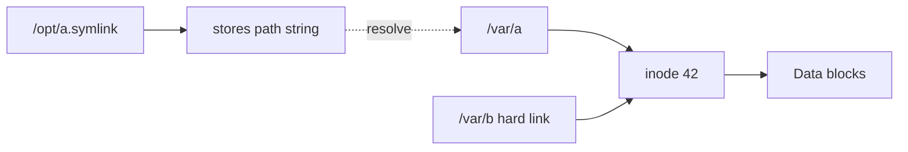
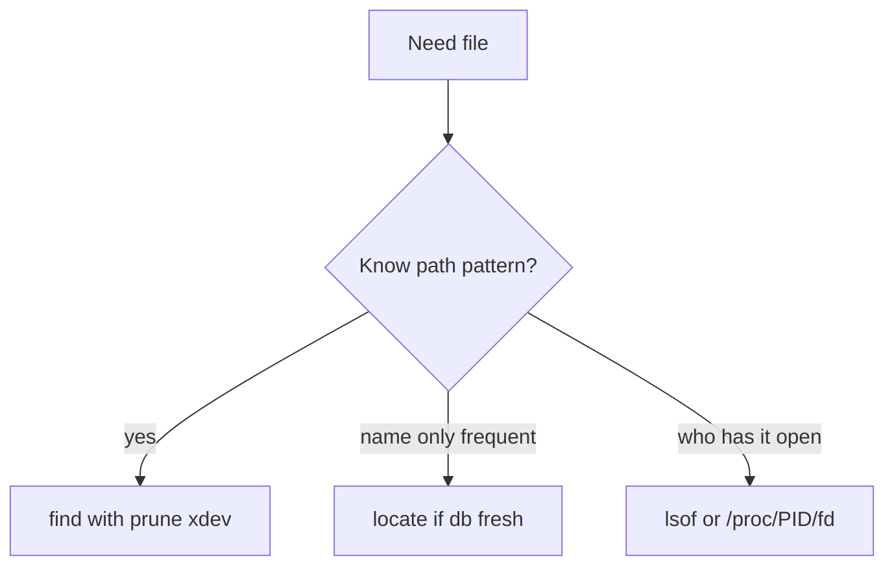

# Finding Files Inodes and Links

## Overview

A **directory entry** is a name → **inode** mapping. The inode holds metadata and data pointers; **hard links** are multiple names for one inode (same filesystem); **symbolic links** store a path string and resolve at access time. Finding files (`find`, `locate`, `lsof`) and interpreting `ls -li` / `stat` are core host triage skills when disk fills, deletes “don’t free space,” or configs diverge across names.

CS owns the file abstraction; Linux owns the ops tooling—see [[10-Linux/README|Linux]].

## Learning Objectives

- Relate names, inodes, link counts, and data blocks
- Distinguish hard links vs symlinks and cross-device limits
- Use `find` safely (prune, `-xdev`, permission errors)
- Explain “deleted but space held” via open file descriptors
- Avoid symlink traversal pitfalls in scripts and backups

## Prerequisites

- [[10-Linux/01-Shell-Filesystem-Hierarchy-and-Permissions/Filesystem Hierarchy Standard and Path Semantics|Filesystem Hierarchy Standard and Path Semantics]]
- [[01-Computer-Science/06-IO-and-Persistence/Files as Abstractions|Files as Abstractions]]
- [[10-Linux/01-Shell-Filesystem-Hierarchy-and-Permissions/Users Groups and DAC Permissions|Users Groups and DAC Permissions]]

## Difficulty

`beginner`

## Estimated Time

- Reading: 1 hour
- Exercises: 1 hour
- Mini project: 2 hours

## History

Inodes are a Unix filesystem classic; hard links enabled efficient aliasing; symlinks added cross-tree and dangling flexibility. `find` predates fancy indexers; `locate`/`updatedb` trade freshness for speed. Containers and overlays add layers—but the name/inode mental model still explains most surprises.

## Problem It Solves

| Symptom | Mechanism |
| --- | --- |
| `rm` file but `df` unchanged | Process still holds FD; link count 0, blocks remain |
| Same content two paths | Hard link or copy—check inode numbers |
| Broken app path after move | Symlink target relative/absolute mismatch |
| `find /` melts the disk | Unbounded walk; need prune/`-xdev` |
| Cannot hard-link across mounts | Different filesystems |

## Internal Implementation

### Name vs inode



Unlink removes a name; when link count hits 0 and no FDs remain, blocks free.

## Mermaid Diagrams

### Structure — find decision tree



### Sequence / Lifecycle — deleted but held

```mermaid
sequenceDiagram
    participant App
    participant FS as Filesystem
    participant Eng
    App->>FS: open /var/log/big.log
    Eng->>FS: rm /var/log/big.log
    FS-->>Eng: name gone; inode linkcnt 0
    Note over App: FD still references inode
    FS-->>Eng: df still high
    Eng->>App: restart or copy /proc/PID/fd/N
```

## Examples

### Minimal Example — link model

```typescript
export type Inode = {
  id: number;
  nlink: number;
  size: number;
  openFds: number;
};

export type DirEnt =
  | { kind: "hard"; name: string; inode: number }
  | { kind: "sym"; name: string; target: string };

export function unlink(inode: Inode): Inode {
  const nlink = Math.max(0, inode.nlink - 1);
  return { ...inode, nlink };
}

export function canReclaimBlocks(inode: Inode): boolean {
  return inode.nlink === 0 && inode.openFds === 0;
}
```

### Production-Shaped Example — safe find policy

```typescript
export type FindPolicy = {
  roots: string[];
  xdev: boolean;
  prune: string[];
  maxDepth?: number;
};

export const LOG_HUNT: FindPolicy = {
  roots: ["/var/log"],
  xdev: true,
  prune: ["/var/log/journal"], // example: handle separately
  maxDepth: 6,
};

export function argvFor(policy: FindPolicy, name: string): string[] {
  const args = ["find", ...policy.roots];
  if (policy.xdev) args.push("-xdev");
  for (const p of policy.prune) args.push("-path", p, "-prune", "-o");
  if (policy.maxDepth !== undefined) args.push("-maxdepth", String(policy.maxDepth));
  args.push("-name", name, "-print");
  return args;
}
```

## Trade-offs

| Approach | Upside | Downside |
| --- | --- | --- |
| Hard link | No extra space; atomic rename patterns | Same FS only; mutual fate |
| Symlink | Flexible targets | Dangling; TOCTOU; relative traps |
| `find` | Precise, live | Expensive on huge trees |
| `locate` | Fast | Stale index |

### When to Use

- Disk forensics, config discovery, open-deleted files
- Understanding package alternatives and `/etc/alternatives`-style links
- Writing backup exclude rules

### When Not to Use

- Hard-linking secrets into world-readable trees
- Unbounded `find /` on production without ionice/nice and scope

## Exercises

1. Create a hard link; show identical inode via `ls -li`.
2. Create relative vs absolute symlinks; break one by moving.
3. Demonstrate reclaim after truncate/delete with open FD (`lsof` + restart).
4. Write a `find` that stays on one filesystem and skips `/proc`.
5. Explain why copying with `cp` without `-a` may drop links.

## Mini Project

Simulate name/inode/FD reclaim in TypeScript; add a fixture where `df` stays high until `openFds` clears. Cite [[10-Linux/README|Linux]].

## Portfolio Project

[[10-Linux/projects/Linux Host Workbench/README|Linux Host Workbench]] — “open deleted files” inspector using `/proc` sketches.

## Interview Questions

1. What is an inode?
2. Hard link vs symlink?
3. Why can deleting a file not free disk space?
4. Limits of hard links?
5. How do you find which process holds a deleted file?

### Stretch / Staff-Level

1. Design safe recursive delete tooling that refuses to follow attacker symlinks.
2. How do overlayfs whiteouts change “find the real file” stories?

## Common Mistakes

- Assuming two paths mean two copies
- Following symlinks blindly in cleanup scripts
- Using `locate` after fresh writes without updatedb
- Forgetting `-xdev` and scanning huge network mounts
- Confusing link count with reference count of memory objects

## Best Practices

- Prefer `stat`/`ls -li` before concluding duplication
- Scope `find`; prune virtual filesystems
- For space leaks: `lsof +L1` / `/proc/*/fd` patterns
- Preserve links in backups when required
- Document symlink farms in FHS layout ADRs

## Summary

**Names point to inodes; links multiply names or redirect paths.** Finding files is an ops discipline of scoped search plus understanding why space and configs behave oddly under hard links, symlinks, and open FDs. See the inode before trusting the path.

## Further Reading

- [[10-Linux/README|Linux README]]
- [[01-Computer-Science/06-IO-and-Persistence/Files as Abstractions|Files as Abstractions]]
- [[10-Linux/04-Filesystems-Disks-and-IO/Inodes Quotas and ENOSPC Failure Modes|Inodes Quotas and ENOSPC Failure Modes]]
- [[10-Linux/08-Observability-Tracing-and-Profiling/strace and lsof First-Aid Tracing|strace and lsof First-Aid Tracing]]

## Related Notes

- [[10-Linux/01-Shell-Filesystem-Hierarchy-and-Permissions/ACLs Sticky Bits and Umask|ACLs Sticky Bits and Umask]]
- [[10-Linux/02-Processes-Signals-and-Job-Control/Process Lifecycle ps and procfs|Process Lifecycle ps and procfs]]
- [[10-Linux/04-Filesystems-Disks-and-IO/Block Devices Partitions and Mounts|Block Devices Partitions and Mounts]]

## Progress Checklist

- [ ] Explained from first principles
- [ ] Drew at least one Mermaid diagram
- [ ] Implemented a minimal version
- [ ] Documented trade-offs and non-goals
- [ ] Completed exercises
- [ ] Practiced interview questions aloud
- [ ] Linked prerequisites and dependents
