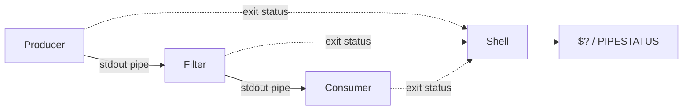
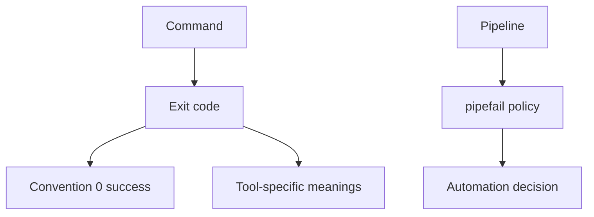
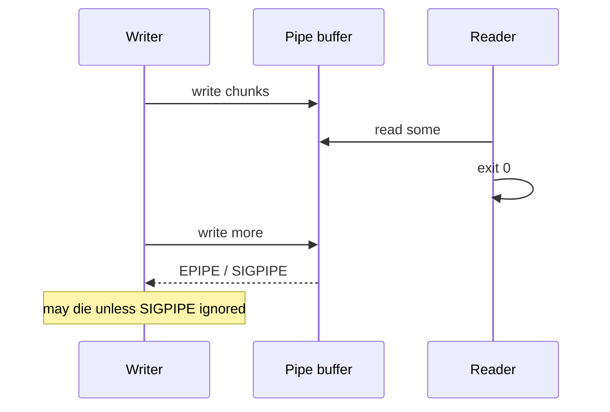

# Shell Pipelines and Exit Status Contracts

## Overview

A **pipeline** connects processes with anonymous pipes so stdout of one feeds stdin of the next. The **exit status** (0–255) is the contract automation uses: 0 means success by convention; non-zero means failure—but which stage’s status you see depends on shell options (`pipefail`), and a successful `grep` with no match exits 1.

Host ops scripts, health checks, and CI steps fail silently when they ignore these contracts. This note is the ops layer on top of process models in CS—see [[10-Linux/README|Linux]].

## Learning Objectives

- Explain pipe semantics, buffering, and SIGPIPE when a reader exits early
- Use exit statuses correctly in scripts (`set -euo pipefail` trade-offs)
- Distinguish `grep`/`diff` “no match” codes from real errors
- Build pipelines that surface the failing stage
- Avoid masking failures in `cmd || true` without intent

## Prerequisites

- [[10-Linux/00-Orientation-and-Boundaries/Why Linux Exists for Engineers|Why Linux Exists for Engineers]]
- [[01-Computer-Science/04-Processes-and-Execution/Processes|Processes]]
- [[01-Computer-Science/04-Processes-and-Execution/Interprocess Communication Fundamentals|Interprocess Communication Fundamentals]]

## Difficulty

`beginner`

## Estimated Time

- Reading: 1 hour
- Exercises: 1 hour
- Mini project: 2 hours

## History

Unix pipes (Thompson/McIlroy) made small filters composable. Shells inherited `$?` and later `pipefail` because the default “last command wins” hid earlier failures—an endless source of “CI green, prod broken” scripts.

## Problem It Solves

| Symptom | Mechanism |
| --- | --- |
| Script continues after failed `grep` in pipe | Default pipeline status = last command |
| `set -e` does not stop on pipe mid-fail | Need `pipefail` |
| Job “succeeds” though producer crashed | Consumer got EOF and exited 0 |
| Broken pipe spam in logs | Writer gets SIGPIPE / EPIPE |
| Health check flips on “no lines” | `grep` exit 1 treated as hard fail |

## Internal Implementation

### Pipeline data and status



With `pipefail`, the pipeline status is the rightmost non-zero (or 0 if all succeed). Without it, only the last stage matters.

## Mermaid Diagrams

### Structure — contracts



### Sequence / Lifecycle — early consumer exit



## Examples

### Minimal Example — status evaluator

```typescript
export type Stage = { name: string; exit: number };

/** Bash-like pipefail: rightmost non-zero, else 0 */
export function pipeStatus(stages: Stage[]): number {
  for (let i = stages.length - 1; i >= 0; i--) {
    if (stages[i].exit !== 0) return stages[i].exit;
  }
  return 0;
}

export function lastOnly(stages: Stage[]): number {
  return stages[stages.length - 1]?.exit ?? 0;
}

// lastOnly([{grep:1},{wc:0}]) === 0  // masks grep "no match" or fail
// pipeStatus(...) === 1
```

### Production-Shaped Example — safe check pattern

```typescript
export type CheckResult =
  | { ok: true }
  | { ok: false; reason: "error" | "not_found"; detail: string };

/** Model: grep-like tool where 1 means not found, ≥2 means error */
export function interpretGrep(exit: number, stderr: string): CheckResult {
  if (exit === 0) return { ok: true };
  if (exit === 1) return { ok: false, reason: "not_found", detail: "no match" };
  return { ok: false, reason: "error", detail: stderr || `exit ${exit}` };
}
```

## Trade-offs

| Dimension | `set -euo pipefail` | Loose scripts |
| --- | --- | --- |
| Safety | Fail closed | Fail open |
| Ergonomics | Needs careful `grep` handling | Easy to write, easy to lie |
| Debuggability | Stops early | Continues in bad state |
| CI signal | Noisy until tuned | False greens |

### When to Use

- Deploy hooks, backups, cert renewal, anything irreversible
- Pipelines where middle stages can fail
- Teaching juniors production shell hygiene

### When Not to Use

- Interactive exploration (optional)
- Blind `set -e` around tools with special exit codes without wrappers

## Exercises

1. Demonstrate `lastOnly` vs `pipeStatus` with a failing middle stage.
2. Explain why `cmd | tee log` can hide `cmd` failure without `pipefail`.
3. Write a wrapper that treats `grep` 1 as success for “absence checks.”
4. Trigger SIGPIPE intentionally (`yes | head`) and describe statuses.
5. Critique a script that uses `|| true` on `systemctl restart`.

## Mini Project

Implement a TypeScript pipeline status simulator plus a bash sample under `code/` that fails CI without `pipefail` and passes with it. Link [[10-Linux/README|Linux]].

## Portfolio Project

[[10-Linux/projects/Linux Host Workbench/README|Linux Host Workbench]] — `shell/contracts` lab: assert `PIPESTATUS` documentation in runbooks.

## Interview Questions

1. What does a pipeline exit status mean by default in bash?
2. What is `pipefail`?
3. Why might `grep | wc -l` be a bad health check?
4. What happens when a reader closes the pipe early?
5. How do you get all stage statuses?

### Stretch / Staff-Level

1. Design a shell style guide for an org that mixes bash and Python orchestration.
2. When should you abandon shell pipelines for a typed workflow engine?

## Common Mistakes

- Assuming non-zero always means “abort the world”
- Ignoring `pipefail` in CI
- Redirecting stderr away and losing the real error
- Using pipelines where a single process with libraries is safer
- Treating `set -e` as complete correctness

## Best Practices

- Prefer `set -euo pipefail` in production scripts with documented exceptions
- Check `PIPESTATUS` when diagnosing
- Wrap tools with special codes
- Keep pipelines short; name intermediate files when debugging
- Log exit codes in runbooks

## Summary

Pipelines compose processes; **exit status contracts** decide whether automation trusts the result. Default “last wins” hides failures—use `pipefail`, interpret tool-specific codes, and treat SIGPIPE as a real backpressure signal. Host reliability starts with scripts that refuse to lie.

## Further Reading

- [[10-Linux/README|Linux README]]
- [[01-Computer-Science/04-Processes-and-Execution/Interprocess Communication Fundamentals|Interprocess Communication Fundamentals]]
- [[10-Linux/02-Processes-Signals-and-Job-Control/Signals Delivery and Common Handlers|Signals Delivery and Common Handlers]]
- [[10-Linux/06-systemd-Timers-and-Logging/Timers vs Cron Operational Choice|Timers vs Cron Operational Choice]]

## Related Notes

- [[10-Linux/01-Shell-Filesystem-Hierarchy-and-Permissions/Filesystem Hierarchy Standard and Path Semantics|Filesystem Hierarchy Standard and Path Semantics]]
- [[10-Linux/02-Processes-Signals-and-Job-Control/Process Lifecycle ps and procfs|Process Lifecycle ps and procfs]]
- [[10-Linux/00-Orientation-and-Boundaries/ADR Discipline for Host Decisions|ADR Discipline for Host Decisions]]

## Progress Checklist

- [ ] Explained from first principles
- [ ] Drew at least one Mermaid diagram
- [ ] Implemented a minimal version
- [ ] Documented trade-offs and non-goals
- [ ] Completed exercises
- [ ] Practiced interview questions aloud
- [ ] Linked prerequisites and dependents
