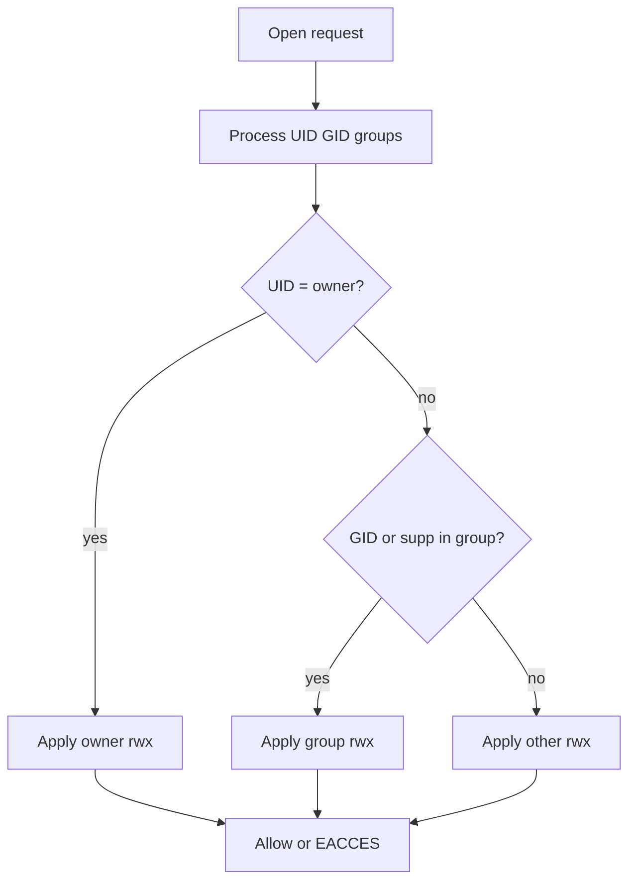
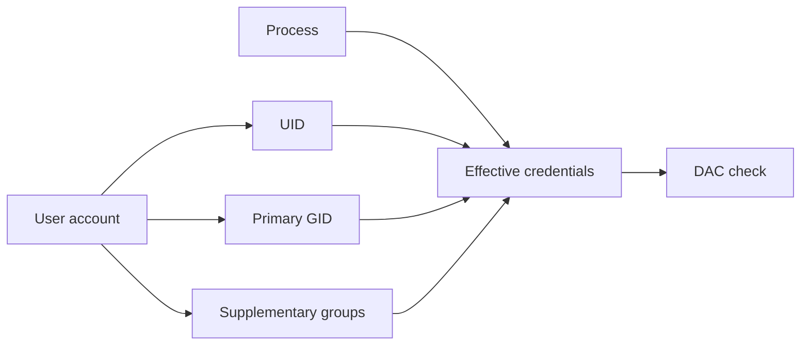
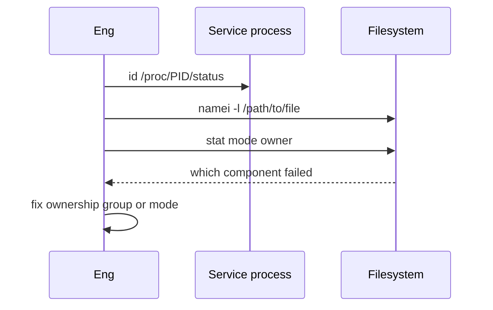

# Users Groups and DAC Permissions

## Overview

**Discretionary Access Control (DAC)** on Linux decides file access using the process credentials (**UID**, **GID**, **supplementary groups**) against the inode’s owner, group, and mode bits (`rwx` for user/group/other, plus special bits covered next note). Root (UID 0) traditionally bypasses DAC—capabilities and LSM refine that myth later.

Most “Permission denied” production tickets are DAC: wrong service user, missing group, overly tight directories that block traversal, or world-writable dirs. This is host ops on top of process identity—see [[10-Linux/README|Linux]].

## Learning Objectives

- Map UID/GID/groups of a process to `stat` mode checks
- Explain directory execute bit as “traverse,” not “run”
- Use `id`, `namei`, `stat`, `chmod`/`chown` with intent
- Design least-privilege service users and shared group patterns
- Recognize setuid/setgid *existence* and defer deep abuse cases to security modules

## Prerequisites

- [[10-Linux/01-Shell-Filesystem-Hierarchy-and-Permissions/Filesystem Hierarchy Standard and Path Semantics|Filesystem Hierarchy Standard and Path Semantics]]
- [[01-Computer-Science/04-Processes-and-Execution/Processes|Processes]]
- [[10-Linux/00-Orientation-and-Boundaries/CS Models vs Linux Operations Boundaries|CS Models vs Linux Operations Boundaries]]

## Difficulty

`beginner`

## Estimated Time

- Reading: 1.25 hours
- Exercises: 1 hour
- Mini project: 2 hours

## History

Unix permissions predate modern IAM: a simple owner/group/other matrix scaled multi-user minicomputers. Linux kept the model, added POSIX ACLs (next note), and later capabilities/SELinux for mandatory controls. Containers remapped UIDs—DAC still applies *inside* the namespace.

## Problem It Solves

| Symptom | DAC cause |
| --- | --- |
| `EACCES` opening file | Mode bits or ownership mismatch |
| Can see file but not `cd` into dir | Missing `x` on directory |
| App cannot write logs | Dir owned by root; service is `app` |
| Shared drop folder chaos | Wrong group + missing setgid dir (ACL note) |
| “It works as root” | Masks broken DAC forever |

## Internal Implementation

### Access check (simplified)



Root bypass and LSM hooks omitted—still verify DAC for non-root services.

## Mermaid Diagrams

### Structure — identity surfaces



### Sequence / Lifecycle — debug permission denied



## Examples

### Minimal Example — mode evaluator

```typescript
export type Cred = { uid: number; gids: number[] };
export type Inode = { uid: number; gid: number; mode: number }; // low 9 bits rwxrwxrwx

function bit(mode: number, mask: number): boolean {
  return (mode & mask) !== 0;
}

export function canRead(cred: Cred, file: Inode): boolean {
  if (cred.uid === 0) return true; // traditional root bypass sketch
  if (cred.uid === file.uid) return bit(file.mode, 0o400);
  if (cred.gids.includes(file.gid)) return bit(file.mode, 0o040);
  return bit(file.mode, 0o004);
}

export function canTraverse(cred: Cred, dir: Inode): boolean {
  if (cred.uid === 0) return true;
  if (cred.uid === dir.uid) return bit(dir.mode, 0o100);
  if (cred.gids.includes(dir.gid)) return bit(dir.mode, 0o010);
  return bit(dir.mode, 0o001);
}
```

### Production-Shaped Example — service identity policy

```typescript
export type ServiceIdentity = {
  user: string;
  primaryGroup: string;
  supplementary: string[];
  owns: string[]; // paths
  groupWritable: string[]; // shared via group
};

export const API_IDENTITY: ServiceIdentity = {
  user: "api",
  primaryGroup: "api",
  supplementary: ["app-logs"],
  owns: ["/var/lib/api", "/run/api"],
  groupWritable: ["/var/log/api"],
};
```

## Trade-offs

| Pattern | Upside | Downside |
| --- | --- | --- |
| Dedicated service user | Clear blast domain | More accounts to manage |
| Shared group for logs | Simple collaboration | Over-broad if misused |
| Run as root | “Works” | Max blast radius |
| World-readable configs | Convenience | Secret leakage |

### When to Use

- Installing services, fixing `EACCES`, packaging files
- Designing who can read TLS keys or env files on disk
- Interviews: explain `rwx` on directories

### When Not to Use

- As the only security layer for multi-tenant hostility (need namespaces/LSM)
- chmod 777 “to unblock” without a follow-up ADR

## Exercises

1. Implement `canWrite`/`canExecute` beside `canRead`.
2. Use `namei -l` on a failing path and identify the first bad component.
3. Show why `r--` on a directory is rarely enough for listing+access patterns.
4. Design UID/GID for API + log shipper reading the same files.
5. Explain effective vs real UID at a high level (setuid teaser).

## Mini Project

Build a TypeScript DAC checker that evaluates a path of directory inodes + final file for a credential. Fixtures for “missing traverse bit.” Link [[10-Linux/README|Linux]].

## Portfolio Project

[[10-Linux/projects/Linux Host Workbench/README|Linux Host Workbench]] — permission evaluator lab matching Implementation Checklist.

## Interview Questions

1. How does Linux decide read access for a non-owner?
2. What does execute mean on a directory?
3. How do supplementary groups participate?
4. Why is “works as root” a red flag?
5. Difference between ownership and mode bits?

### Stretch / Staff-Level

1. Design a least-privilege layout for app, deployer, and auditor roles on one host.
2. How do user namespaces change the meaning of UID 0?

## Common Mistakes

- chmod on file while parent dir blocks traverse
- Adding user to group but not re-logging / restarting service
- Relying on primary group only
- World-writable service directories
- Ignoring that tools create files as the process UID

## Best Practices

- One service → one UID; share via groups intentionally
- Debug with `namei` + `id` before chmod roulette
- Prefer group write over world write
- Document identity in unit files (`User=`, `Group=`)
- Cross-link ACLs when DAC groups explode

## Summary

**Users, groups, and DAC mode bits** are the default Linux access contract. Match process credentials to inode owner/group/other checks, treat directory `x` as traversal, and design service identities deliberately. Fix `EACCES` with evidence, not `chmod 777`.

## Further Reading

- [[10-Linux/README|Linux README]]
- [[10-Linux/01-Shell-Filesystem-Hierarchy-and-Permissions/ACLs Sticky Bits and Umask|ACLs Sticky Bits and Umask]]
- [[10-Linux/09-Security-Primitives-on-the-Host/Capabilities vs root All-Powerful Myth|Capabilities vs root All-Powerful Myth]]
- [[01-Computer-Science/04-Processes-and-Execution/Processes|Processes]]

## Related Notes

- [[10-Linux/01-Shell-Filesystem-Hierarchy-and-Permissions/Finding Files Inodes and Links|Finding Files Inodes and Links]]
- [[10-Linux/06-systemd-Timers-and-Logging/Service Hardening Directives|Service Hardening Directives]]
- [[10-Linux/00-Orientation-and-Boundaries/Failure Domains on a Single Host|Failure Domains on a Single Host]]

## Progress Checklist

- [ ] Explained from first principles
- [ ] Drew at least one Mermaid diagram
- [ ] Implemented a minimal version
- [ ] Documented trade-offs and non-goals
- [ ] Completed exercises
- [ ] Practiced interview questions aloud
- [ ] Linked prerequisites and dependents
