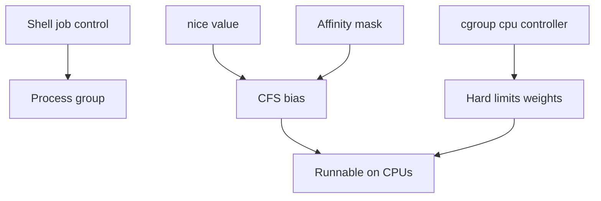
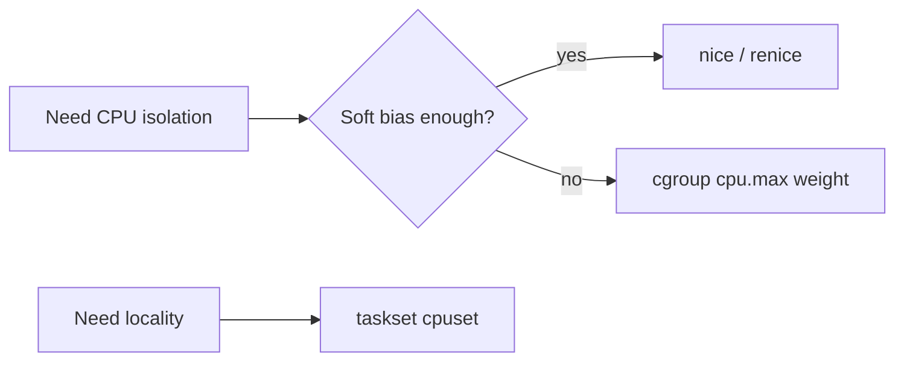
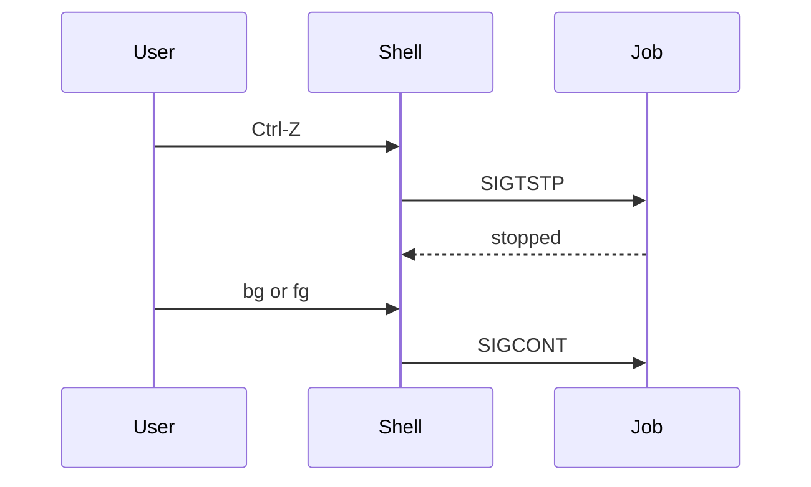

# Job Control Nice and Affinity Ops

## Overview

**Job control** (foreground/background, `fg`/`bg`, Ctrl-Z) manages interactive process groups under a shell. **`nice`/`renice`** adjust CPU scheduling *priority bias* (not a hard cap). **CPU affinity** (`taskset`, cpusets) pins threads to CPUs for locality or isolation.

Operators misuse nice as a QoS system and affinity as a substitute for capacity. This note is host scheduling *ops*; fairness theory stays in CS—see [[10-Linux/README|Linux]] and cgroups for hard limits.

## Learning Objectives

- Use job control signals safely and know when systemd makes them irrelevant
- Interpret nice values (−20..19) and their limited effect under load
- Apply `taskset` / affinity with NUMA awareness (module 03)
- Choose nice vs cgroup `cpu.weight`/`cpu.max` for real isolation
- Avoid pinning that creates artificial bottlenecks

## Prerequisites

- [[10-Linux/02-Processes-Signals-and-Job-Control/Signals Delivery and Common Handlers|Signals Delivery and Common Handlers]]
- [[01-Computer-Science/04-Processes-and-Execution/Scheduling Concepts|Scheduling Concepts]]
- [[10-Linux/00-Orientation-and-Boundaries/Failure Domains on a Single Host|Failure Domains on a Single Host]]

## Difficulty

`intermediate`

## Estimated Time

- Reading: 1 hour
- Exercises: 45 minutes
- Mini project: 2 hours

## History

Job control grew with interactive terminals. `nice` dates to early Unix share scheduling. Affinity and cpusets became critical on multi-socket NUMA machines and for latency-sensitive workloads. systemd and containers shifted production control from tty jobs to cgroups—interactive job control remains for bastions and debugging.

## Problem It Solves

| Symptom | Ops lever |
| --- | --- |
| Backup starves API on same host | nice + better: cgroup CPU weight |
| Latency jitter from migration | careful affinity / isolcpus (advanced) |
| Ctrl-Z’d debugger left stopped | SIGCONT / job control hygiene |
| “We niced it” still dominates | nice is soft; need cpu.max |
| Batch on same cores as IRQ | affinity / irqbalance policy |

## Internal Implementation

### Control layers



## Mermaid Diagrams

### Structure — when to use what



### Sequence / Lifecycle — interactive stop



## Examples

### Minimal Example — nice comparator

```typescript
/** Lower nice = higher priority bias. Clamp to Linux range. */
export function clampNice(n: number): number {
  return Math.min(19, Math.max(-20, Math.trunc(n)));
}

export function preferFirst(aNice: number, bNice: number): "a" | "b" | "tie" {
  const a = clampNice(aNice);
  const b = clampNice(bNice);
  if (a < b) return "a";
  if (b < a) return "b";
  return "tie";
}
```

### Production-Shaped Example — policy chooser

```typescript
export type CpuPolicy =
  | { kind: "nice"; value: number }
  | { kind: "cgroup"; cpuMaxQuota: string; weight?: number }
  | { kind: "affinity"; cpus: number[] };

export function chooseCpuPolicy(input: {
  mustHardCap: boolean;
  latencySensitive: boolean;
  numaLocalCpus?: number[];
}): CpuPolicy[] {
  const out: CpuPolicy[] = [];
  if (input.mustHardCap) out.push({ kind: "cgroup", cpuMaxQuota: "200000 100000" });
  else out.push({ kind: "nice", value: 10 });
  if (input.latencySensitive && input.numaLocalCpus) {
    out.push({ kind: "affinity", cpus: input.numaLocalCpus });
  }
  return out;
}
```

## Trade-offs

| Lever | Upside | Downside |
| --- | --- | --- |
| Job control | Great for interactive debug | Not a service manager |
| nice | Simple soft priority | Weak under contention; needs privileges for negative |
| affinity | Locality / isolation | Can strand capacity; complexity |
| cgroup CPU | Real budgets | Requires cgroup setup |

### When to Use

- Bastion interactive workflows (job control)
- Mild deprioritization of batch (nice) while planning cgroups
- NUMA-local workers with measured wins (affinity)

### When Not to Use

- nice as the only multi-tenant isolator
- Affinity without measuring before/after
- Job control to run production daemons

## Exercises

1. Renice a CPU burner and observe `top` NI column under contention.
2. `taskset -c 0` a process and explain risk on a busy core 0.
3. Stop with Ctrl-Z and recover with `fg`.
4. Compare nice vs cgroup quota for a noisy neighbor scenario.
5. Draft ADR: batch nice=15 vs batch.slice CPUWeight=.

## Mini Project

Simulate scheduler bias: two tasks with nice values sharing a quantum budget; show soft vs hard cap. Cite [[10-Linux/README|Linux]].

## Portfolio Project

[[10-Linux/projects/Cgroup Budget Clinic/README|Cgroup Budget Clinic]] — contrast nice-only vs cpu.max isolation demos.

## Interview Questions

1. What does nice actually change?
2. Why might nice fail to protect an API?
3. What is CPU affinity used for?
4. SIGTSTP vs SIGSTOP?
5. Job control vs systemd?

### Stretch / Staff-Level

1. Design CPU isolation for a latency tier using cpusets + IRQs (high level).
2. When is `SCHED_FIFO` justified vs CFS + cgroups—and what are the risks?

## Common Mistakes

- Negative nice for everything (starves maintenance)
- Pinning all services to subset of cores “for safety”
- Leaving stopped jobs forever
- Confusing ionice with nice (IO class is separate)
- Ignoring hyperthread siblings in affinity maps

## Best Practices

- Prefer cgroups for production QoS; nice for light bias
- Measure latency before/after affinity
- Document CPU policies in host ADRs
- Use systemd `CPUAffinity=` / `Nice=` when applicable
- Cross-link NUMA note for placement

## Summary

**Job control** manages interactive process groups; **nice** softly biases CFS; **affinity** constrains CPUs. Production isolation usually needs **cgroups**. Use each lever knowingly—soft bias is not a blast-radius budget.

## Further Reading

- [[10-Linux/README|Linux README]]
- [[01-Computer-Science/04-Processes-and-Execution/Scheduling Concepts|Scheduling Concepts]]
- [[10-Linux/07-Cgroups-Namespaces-and-Isolation/cgroup v2 Controllers CPU Memory IO|cgroup v2 Controllers CPU Memory IO]]
- [[10-Linux/03-Memory-Swap-and-OOM/NUMA Basics for Host Operators|NUMA Basics for Host Operators]]

## Related Notes

- [[10-Linux/02-Processes-Signals-and-Job-Control/Limits ulimit and rlimits|Limits ulimit and rlimits]]
- [[10-Linux/10-Performance-Tuning-and-Kernel-Knobs/CPU Saturation Steal and Run Queue|CPU Saturation Steal and Run Queue]]
- [[10-Linux/00-Orientation-and-Boundaries/ADR Discipline for Host Decisions|ADR Discipline for Host Decisions]]

## Progress Checklist

- [ ] Explained from first principles
- [ ] Drew at least one Mermaid diagram
- [ ] Implemented a minimal version
- [ ] Documented trade-offs and non-goals
- [ ] Completed exercises
- [ ] Practiced interview questions aloud
- [ ] Linked prerequisites and dependents
