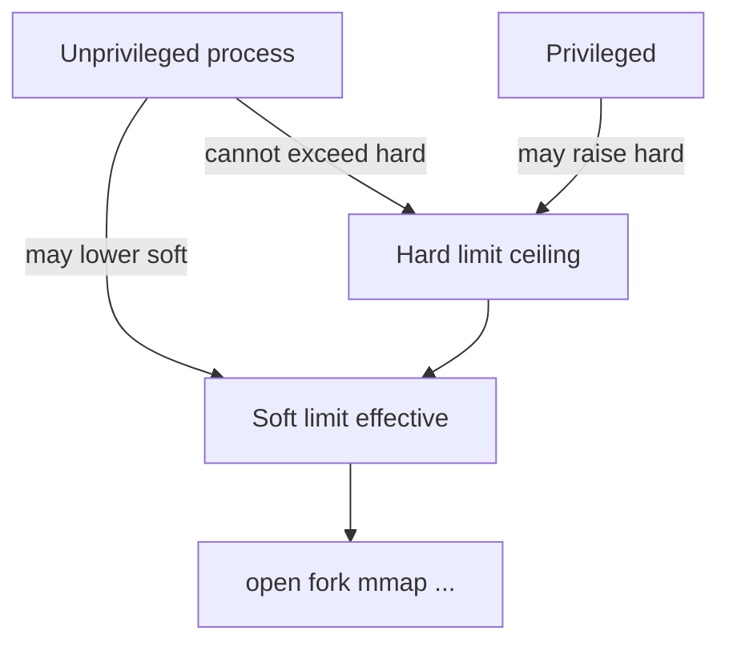
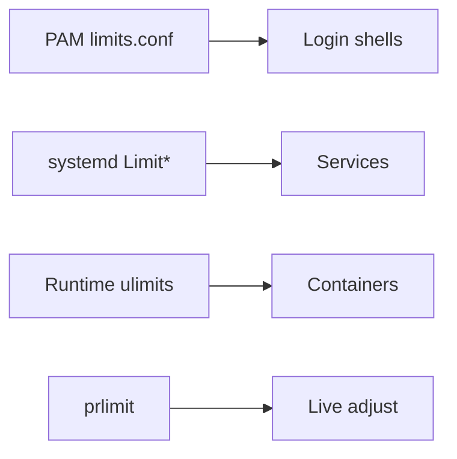
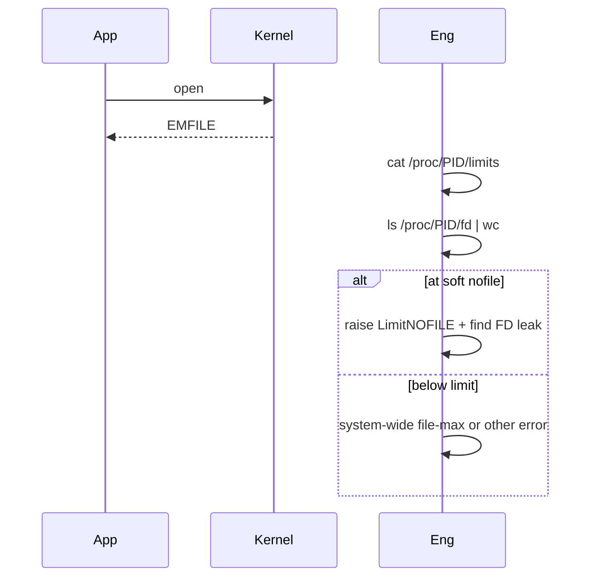

# Limits ulimit and rlimits

## Overview

**Resource limits (rlimits)** cap per-process (and sometimes per-user) consumption: open files (`nofile`), processes (`nproc`), core size, stack, CPU time, address space, and more. Shells expose them via **`ulimit`**; systemd via `LimitNOFILE=` / `prlimit`; values appear in `/proc/<pid>/limits`.

Raising `nofile` without understanding is a meme; leaving defaults too low causes mysterious `EMFILE`/`EAGAIN` outages. Limits are soft fences—not cgroup budgets—see [[10-Linux/README|Linux]].

## Learning Objectives

- Distinguish soft vs hard rlimits and who may raise them
- Diagnose EMFILE / “Cannot fork” as limit vs true exhaustion
- Set limits correctly for services (unit files > random PAM only)
- Read `/proc/<pid>/limits` and `prlimit`
- Decide ulimit vs cgroup when containing noisy neighbors

## Prerequisites

- [[10-Linux/02-Processes-Signals-and-Job-Control/Process Lifecycle ps and procfs|Process Lifecycle ps and procfs]]
- [[10-Linux/00-Orientation-and-Boundaries/Failure Domains on a Single Host|Failure Domains on a Single Host]]
- [[01-Computer-Science/04-Processes-and-Execution/System Calls|System Calls]]

## Difficulty

`intermediate`

## Estimated Time

- Reading: 1 hour
- Exercises: 1 hour
- Mini project: 2 hours

## History

rlimits protected multi-user systems from fork bombs and FD leaks. PAM `limits.conf` applied at login; daemons often missed those settings until systemd made `Limit*=` first-class. Containers add another layer—image ulimits vs runtime overrides.

## Problem It Solves

| Symptom | Likely limit |
| --- | --- |
| `Too many open files` | `RLIMIT_NOFILE` |
| `Cannot allocate memory` on fork / EAGAIN | `nproc` or true memory |
| Huge core files fill disk | `core` unlimited |
| Service ignores shell ulimit | Not inherited via systemd path |
| Thread create fails | nproc counting threads (Linux) |

## Internal Implementation

### Soft vs hard



On Linux, `nproc` limits number of tasks (threads) for the real UID—surprises Java/Node thread pools.

## Mermaid Diagrams

### Structure — where limits are set



### Sequence / Lifecycle — EMFILE triage



## Examples

### Minimal Example — enforce soft cap

```typescript
export type RLimit = { soft: number; hard: number };

export function applySoft(current: RLimit, requestedSoft: number): RLimit | { error: string } {
  if (requestedSoft > current.hard) return { error: "soft exceeds hard" };
  if (requestedSoft < 0) return { error: "negative" };
  return { soft: requestedSoft, hard: current.hard };
}
```

### Production-Shaped Example — service limit policy

```typescript
export type ServiceLimits = {
  nofile: RLimit;
  nproc: RLimit;
  core: RLimit;
};

export const API_LIMITS: ServiceLimits = {
  nofile: { soft: 65535, hard: 65535 },
  nproc: { soft: 4096, hard: 8192 },
  core: { soft: 0, hard: 0 }, // no cores on prod API by default
};

export function fdPressure(openFds: number, limits: RLimit): "ok" | "warn" | "hard_fail_risk" {
  const ratio = openFds / limits.soft;
  if (ratio >= 0.95) return "hard_fail_risk";
  if (ratio >= 0.75) return "warn";
  return "ok";
}
```

## Trade-offs

| Approach | Upside | Downside |
| --- | --- | --- |
| High nofile | Headroom for connections | Hides FD leaks longer |
| Tight nproc | Fork-bomb resistance | Breaks thread-heavy runtimes |
| Unlimited core | Great debug | Disk blast radius |
| Only PAM limits | Helps humans | Misses systemd services |

### When to Use

- Tuning connection-heavy services
- Containing runaway fork/thread creation (with monitoring)
- Disabling cores on sensitive hosts (or redirecting via pattern)

### When Not to Use

- As replacement for cgroup memory/CPU budgets
- Copying “nofile=1 million” cargo cult without sockets/memory math

## Exercises

1. Compare `ulimit -a` in shell vs `/proc/1/limits` vs a systemd service.
2. Simulate FD pressure with `fdPressure`.
3. Explain why raising soft without hard fails for users.
4. Show thread creation counting against `nproc`.
5. Draft ADR for API `LimitNOFILE=65535` with alert at 75%.

## Mini Project

TypeScript rlimit checker: given limits + current usage, emit warn/fail and suggested unit directives. Link [[10-Linux/README|Linux]].

## Portfolio Project

[[10-Linux/projects/Linux Host Workbench/README|Linux Host Workbench]] — rlimit checker from Implementation Checklist.

## Interview Questions

1. Soft vs hard ulimit?
2. Why did my service not inherit my shell ulimit?
3. What typically causes EMFILE?
4. How does nproc interact with threads on Linux?
5. ulimit vs cgroup?

### Stretch / Staff-Level

1. Design FD and conntrack budgets together for a reverse-proxy host.
2. How do you roll out higher nofile safely across a fleet?

## Common Mistakes

- Setting only soft in docs; hard still low
- Forgetting systemd override drop-ins
- Unlimited cores on busy nodes
- Raising limits instead of fixing leaks
- Ignoring system-wide `fs.file-max`

## Best Practices

- Set limits on the unit that starts the process
- Alert before soft ceiling
- Pair nofile changes with memory and socket backlog review
- Document in host ADRs
- Prefer cgroups for multi-service isolation

## Summary

**rlimits/ulimit** are per-process ceilings that prevent and cause outages depending on configuration. Read `/proc/<pid>/limits`, set soft/hard deliberately on systemd units, monitor approach-to-ceiling, and remember: limits are not cgroup resource budgets.

## Further Reading

- [[10-Linux/README|Linux README]]
- [[10-Linux/06-systemd-Timers-and-Logging/Service Hardening Directives|Service Hardening Directives]]
- [[10-Linux/05-Networking-Stack-and-Host-Firewall/TCP UDP Sockets ss and Conntrack|TCP UDP Sockets ss and Conntrack]]
- [[10-Linux/07-Cgroups-Namespaces-and-Isolation/Resource Budgets and Noisy Neighbor Containment|Resource Budgets and Noisy Neighbor Containment]]

## Related Notes

- [[10-Linux/02-Processes-Signals-and-Job-Control/Zombies Orphans and Reaping Failures|Zombies Orphans and Reaping Failures]]
- [[10-Linux/00-Orientation-and-Boundaries/ADR Discipline for Host Decisions|ADR Discipline for Host Decisions]]
- [[10-Linux/05-Networking-Stack-and-Host-Firewall/TCP UDP Sockets ss and Conntrack|TCP UDP Sockets ss and Conntrack]]

## Progress Checklist

- [ ] Explained from first principles
- [ ] Drew at least one Mermaid diagram
- [ ] Implemented a minimal version
- [ ] Documented trade-offs and non-goals
- [ ] Completed exercises
- [ ] Practiced interview questions aloud
- [ ] Linked prerequisites and dependents
