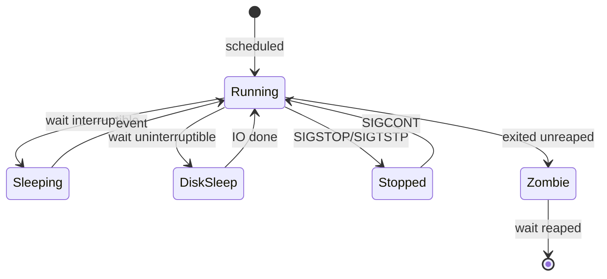
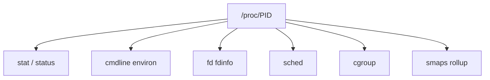
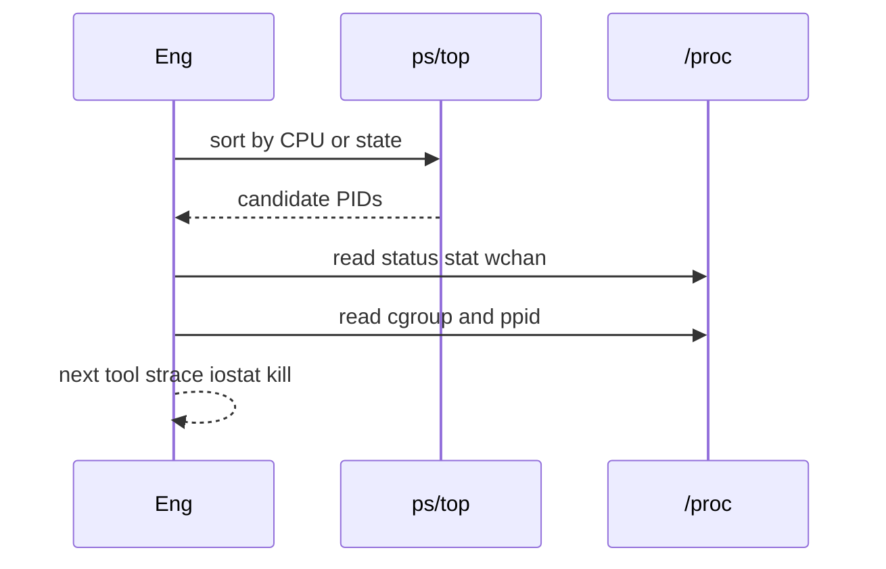

# Process Lifecycle ps and procfs

## Overview

A Linux **process** moves through kernel-visible states (running, sleeping, uninterruptible sleep, stopped, zombie) from `fork`/`clone` to exit and reaping. **`ps`**, **`top`/`htop`**, and **`/proc/<pid>/`** expose that lifecycle for operators: who burns CPU, who waits on disk (`D` state), parentage, and command lines.

CS owns PCB/address-space models; this note owns **reading the live host**—see [[10-Linux/README|Linux]].

## Learning Objectives

- Map `ps` STAT codes to operational meaning
- Navigate `/proc/<pid>/{status,stat,cmdline,fd,cgroup}`
- Trace parent/child trees (`pstree`, `PPID`) for service debugging
- Distinguish threads vs processes in `ps -L` / `/proc/<pid>/task`
- Build a first-pass triage: CPU, state, parent, start time, cgroup

## Prerequisites

- [[10-Linux/00-Orientation-and-Boundaries/CS Models vs Linux Operations Boundaries|CS Models vs Linux Operations Boundaries]]
- [[01-Computer-Science/04-Processes-and-Execution/Processes|Processes]]
- [[01-Computer-Science/04-Processes-and-Execution/Context Switching|Context Switching]]

## Difficulty

`intermediate`

## Estimated Time

- Reading: 1.25 hours
- Exercises: 1 hour
- Mini project: 3 hours

## History

`/proc` began as a process information filesystem and became the universal Linux control/observation plane. `ps` evolved across UNIX variants; on Linux it largely reads procfs. Containers remount proc views—operators still debug with the same files.

## Problem It Solves

| Symptom | procfs / ps angle |
| --- | --- |
| Load high, CPUs idle | Many uninterruptible `D` waiters |
| Service “running” but dead | Zombie children or stuck `D` |
| Who forked the runaway? | PPID / pstree / systemd slice |
| Mystery memory | `smaps` / RSS fields (module 03) |
| Cannot kill | Wrong PID, kernel thread, or `D` state |

## Internal Implementation

### Lifecycle (ops view)



## Mermaid Diagrams

### Structure — key procfs files



### Sequence / Lifecycle — triage



## Examples

### Minimal Example — parse STAT intent

```typescript
export type ProcHint =
  | "runnable_or_running"
  | "interruptible_sleep"
  | "uninterruptible_io"
  | "stopped"
  | "zombie";

export function hintFromStat(stat: string): ProcHint {
  // first char of ps STAT field
  const c = stat[0];
  if (c === "R") return "runnable_or_running";
  if (c === "S") return "interruptible_sleep";
  if (c === "D") return "uninterruptible_io";
  if (c === "T") return "stopped";
  if (c === "Z") return "zombie";
  return "interruptible_sleep";
}
```

### Production-Shaped Example — process snapshot

```typescript
export type ProcSnapshot = {
  pid: number;
  ppid: number;
  state: string;
  rssKb: number;
  cmdline: string;
  cgroup: string;
};

export function triageOrder(rows: ProcSnapshot[]): ProcSnapshot[] {
  return [...rows].sort((a, b) => {
    const score = (p: ProcSnapshot) =>
      (p.state.startsWith("D") ? 1000 : 0) +
      (p.state.startsWith("Z") ? 500 : 0) +
      p.rssKb / 1024;
    return score(b) - score(a);
  });
}
```

## Trade-offs

| Tool | Upside | Downside |
| --- | --- | --- |
| `ps` one-shot | Scriptable | Easy to miss spikes |
| `top` live | Interactive | Costly if misused on huge PID counts |
| raw procfs | Authoritative | Format quirks; races as PIDs reuse |
| pidfd / modern APIs | Safer targeting | Not always in old runbooks |

### When to Use

- Any host latency/CPU/memory incident first pass
- Confirming systemd actually started the intended binary
- Teaching differences between threads and processes

### When Not to Use

- Replacing distributed tracing for multi-service root cause
- Sampling so hard you become the load

## Exercises

1. Map five processes’ STAT codes and explain each.
2. Read `/proc/self/status` and identify Uid/Gid/Threads.
3. Find a process’s controlling terminal and session (or none under systemd).
4. Compare `ps -eLf` thread lines vs task directory count.
5. Capture `wchan` for a `D`-state process during heavy disk IO.

## Mini Project

[[10-Linux/projects/Procfs Inspector Lab/README|Procfs Inspector Lab]] — parse `status`/`stat` into `ProcSnapshot` and print triage-ordered table.

## Portfolio Project

[[10-Linux/projects/Linux Host Workbench/README|Linux Host Workbench]] — live procfs inspector module.

## Interview Questions

1. What does `D` state mean operationally?
2. How does `ps` get its data on Linux?
3. Difference between PID and TID in listings?
4. How do you find a process’s cgroup?
5. Why might kill appear to do nothing?

### Stretch / Staff-Level

1. Design PID-reuse-safe operational targeting (pidfd) for automation.
2. How do you attribute CPU when many short-lived processes churn?

## Common Mistakes

- Killing the wrong PID after reuse
- Ignoring `D` state and “trying harder” with SIGKILL (may still wait)
- Assuming cmdline is trustworthy (can be overwritten)
- Forgetting threads share address space but have own stacks
- Never checking PPID/systemd slice

## Best Practices

- Record PID, start time, and cgroup in incident notes
- Prefer `systemctl status` + procfs together for services
- Sort by state before CPU when load ≠ CPU
- Cross-link zombies note when `Z` appears
- Link CS Processes for model depth

## Summary

**Process lifecycle** becomes actionable through **`ps` and procfs**. Read state, parentage, cgroup, and resources before changing signals or sysctls. The host tells the truth in `/proc` if you know which files to trust.

## Further Reading

- [[10-Linux/README|Linux README]]
- [[01-Computer-Science/04-Processes-and-Execution/Processes|Processes]]
- [[10-Linux/02-Processes-Signals-and-Job-Control/Zombies Orphans and Reaping Failures|Zombies Orphans and Reaping Failures]]
- [[10-Linux/08-Observability-Tracing-and-Profiling/Metrics from procfs and sysfs|Metrics from procfs and sysfs]]

## Related Notes

- [[10-Linux/02-Processes-Signals-and-Job-Control/Signals Delivery and Common Handlers|Signals Delivery and Common Handlers]]
- [[10-Linux/02-Processes-Signals-and-Job-Control/Limits ulimit and rlimits|Limits ulimit and rlimits]]
- [[10-Linux/03-Memory-Swap-and-OOM/Virtual Memory Ops RSS vs VSZ|Virtual Memory Ops RSS vs VSZ]]
- [[10-Linux/06-systemd-Timers-and-Logging/Unit Types Dependencies and Targets|Unit Types Dependencies and Targets]]

## Progress Checklist

- [ ] Explained from first principles
- [ ] Drew at least one Mermaid diagram
- [ ] Implemented a minimal version
- [ ] Documented trade-offs and non-goals
- [ ] Completed exercises
- [ ] Practiced interview questions aloud
- [ ] Linked prerequisites and dependents
