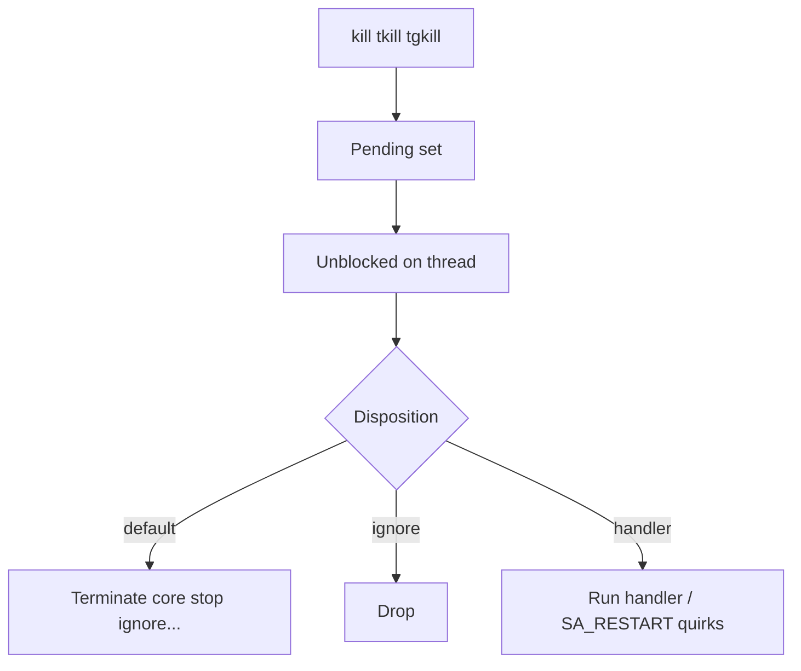
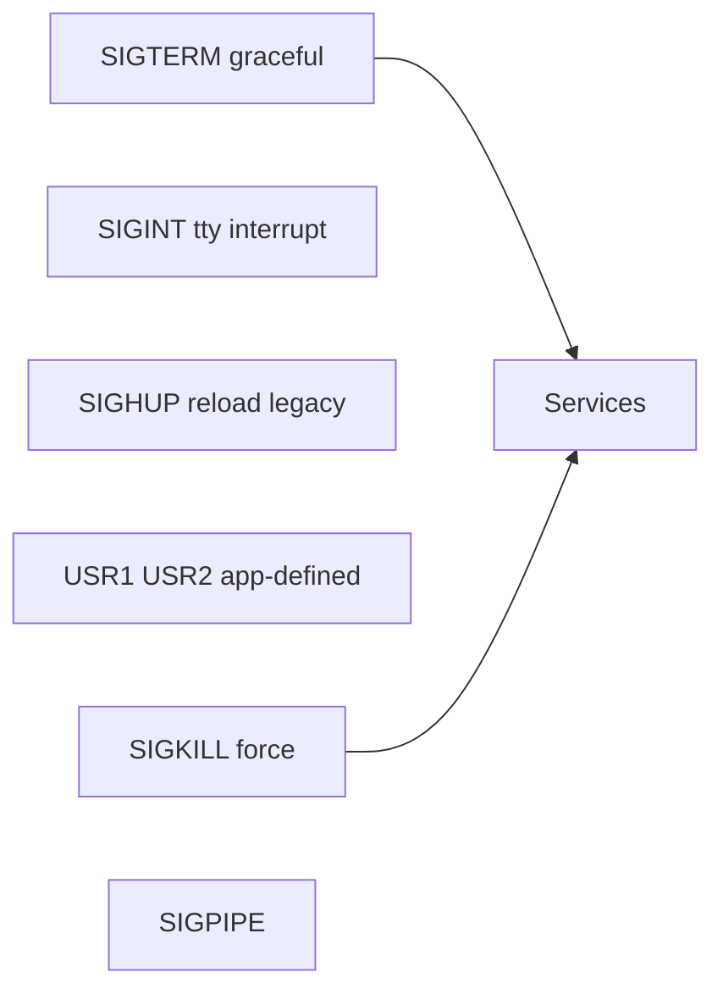
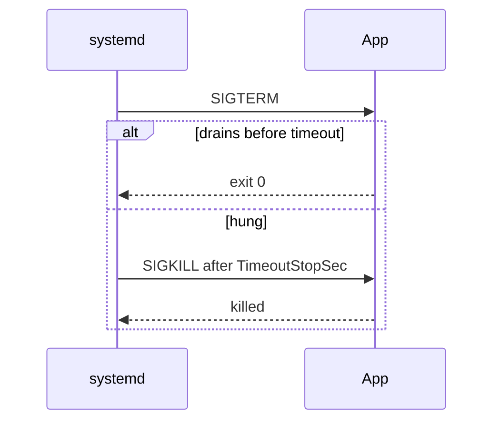

# Signals Delivery and Common Handlers

## Overview

**Signals** are asynchronous notifications to a process or thread group: `SIGTERM` for polite shutdown, `SIGKILL`/`SIGSTOP` unblockable, `SIGHUP` for reload traditions, `SIGPIPE` for broken pipes, `SIGINT` for Ctrl-C. Kernels queue (with limits) and deliver according to disposition: default, ignore, or handler.

Host ops uses signals for service control; apps mishandle them and lose durability or leave zombies. systemd’s stop timeout is a signal policy story—see [[10-Linux/README|Linux]].

## Learning Objectives

- Know which common signals are catchable vs not
- Explain delivery to process vs thread, and masked signals
- Design graceful shutdown: TERM → drain → KILL escalation
- Diagnose “signal ignored” and `SIGPIPE` noise
- Relate Node/Backend shutdown hooks to Linux signal contracts

## Prerequisites

- [[10-Linux/02-Processes-Signals-and-Job-Control/Process Lifecycle ps and procfs|Process Lifecycle ps and procfs]]
- [[01-Computer-Science/04-Processes-and-Execution/Processes|Processes]]
- [[10-Linux/01-Shell-Filesystem-Hierarchy-and-Permissions/Shell Pipelines and Exit Status Contracts|Shell Pipelines and Exit Status Contracts]]

## Difficulty

`intermediate`

## Estimated Time

- Reading: 1 hour
- Exercises: 1 hour
- Mini project: 2 hours

## History

Signals are an old Unix IPC primitive—simple and race-prone. POSIX refined masks and `sigaction`. systemd standardized stop signals and timeouts; containers forward signals only if PID 1 handles them correctly—a perennial footgun.

## Problem It Solves

| Symptom | Signal angle |
| --- | --- |
| Hard kill loses in-flight work | No TERM handler / too short timeout |
| Unit stuck in deactivating | Handler hung; needs KILL after timeout |
| Pipeline spam Broken pipe | Writer vs SIGPIPE disposition |
| Ctrl-Z job stuck | SIGTSTP / job control (next note) |
| Kill -9 “required always” | App ignores TERM; culture problem |

## Internal Implementation

### Disposition path



`SIGKILL` and `SIGSTOP` cannot be caught or ignored.

## Mermaid Diagrams

### Structure — common ops signals



### Sequence / Lifecycle — systemd stop



## Examples

### Minimal Example — escalation policy

```typescript
export type Signal = "TERM" | "KILL" | "HUP" | "INT";

export type ShutdownPolicy = {
  graceMs: number;
  escalateTo: "KILL";
};

export function nextSignal(
  elapsedMs: number,
  policy: ShutdownPolicy,
  caughtTerm: boolean,
): Signal {
  if (!caughtTerm) return "TERM";
  if (elapsedMs >= policy.graceMs) return "KILL";
  return "TERM";
}
```

### Production-Shaped Example — handler contract sketch

```typescript
export type HandlerContract = {
  signals: Signal[];
  must: string[];
  mustNot: string[];
};

export const API_SHUTDOWN: HandlerContract = {
  signals: ["TERM", "INT"],
  must: ["stop listeners", "drain in-flight with deadline", "flush logs"],
  mustNot: ["start new work", "block forever on remote call", "ignore TERM"],
};
```

## Trade-offs

| Approach | Upside | Downside |
| --- | --- | --- |
| Long grace | Clean drain | Slow deploys / sticky load balancers |
| Short grace | Fast replace | Truncated requests / dirty state |
| Catch everything | Flexible | Hidden hangs; restart complexity |
| Default dispositions | Simple | Abrupt exits |

### When to Use

- Service stop/reload design
- Debugging stuck deploys and zombie-leaving crashes
- Teaching PID 1 in containers to forward/reap

### When Not to Use

- Using signals as a general RPC bus
- SIGKILL as the first reaction every time

## Exercises

1. List catchable vs non-catchable among TERM, KILL, STOP, CONT, PIPE.
2. Write a policy table: TimeoutStopSec vs p99 request length.
3. Demonstrate `trap` in bash vs ignoring SIGTERM in a bad script.
4. Explain why Node’s `process.on('SIGTERM')` must still exit.
5. Relate SIGPIPE to pipeline exit contracts.

## Mini Project

TypeScript signal-escalation simulator with fake drain times; output whether KILL fires. Link [[10-Linux/README|Linux]].

## Portfolio Project

[[10-Linux/projects/systemd Unit Workshop/README|systemd Unit Workshop]] — unit with `TimeoutStopSec` and handler checklist.

## Interview Questions

1. Difference between SIGTERM and SIGKILL?
2. Can you catch SIGSTOP?
3. What is a signal mask?
4. How should a server handle SIGTERM?
5. Why do containers need a proper PID 1?

### Stretch / Staff-Level

1. Design fleet-wide drain coordinated with LB deregistration and TERM.
2. How do you test handlers without flaky sleeps?

## Common Mistakes

- Handler does heavy work unsafe for async signal context (prefer flag + loop)
- Forgetting to re-raise or `_exit` after cleanup
- Swallowing TERM and never exiting
- Assuming SIGHUP always means reload (systemd services often don’t)
- Killing process groups incorrectly

## Best Practices

- Document stop signal and timeout in unit + ADR
- Drain with deadlines; then KILL is OK
- Log receipt of TERM
- Align LB health with shutdown
- Cross-link Backend graceful drain notes

## Summary

**Signals** are the host’s control plane for process lifecycle events. Prefer catchable graceful stops with timed escalation to KILL, know the unblockable exceptions, and treat handler design as a production contract—not an afterthought.

## Further Reading

- [[10-Linux/README|Linux README]]
- [[07-Backend/06-Reliability-and-Abuse-Resistance/Graceful Request Drain Above Process Shutdown|Graceful Request Drain Above Process Shutdown]]
- [[10-Linux/06-systemd-Timers-and-Logging/Unit Types Dependencies and Targets|Unit Types Dependencies and Targets]]
- [[01-Computer-Science/04-Processes-and-Execution/Interprocess Communication Fundamentals|Interprocess Communication Fundamentals]]

## Related Notes

- [[10-Linux/02-Processes-Signals-and-Job-Control/Job Control Nice and Affinity Ops|Job Control Nice and Affinity Ops]]
- [[10-Linux/02-Processes-Signals-and-Job-Control/Zombies Orphans and Reaping Failures|Zombies Orphans and Reaping Failures]]
- [[10-Linux/01-Shell-Filesystem-Hierarchy-and-Permissions/Shell Pipelines and Exit Status Contracts|Shell Pipelines and Exit Status Contracts]]

## Progress Checklist

- [ ] Explained from first principles
- [ ] Drew at least one Mermaid diagram
- [ ] Implemented a minimal version
- [ ] Documented trade-offs and non-goals
- [ ] Completed exercises
- [ ] Practiced interview questions aloud
- [ ] Linked prerequisites and dependents
