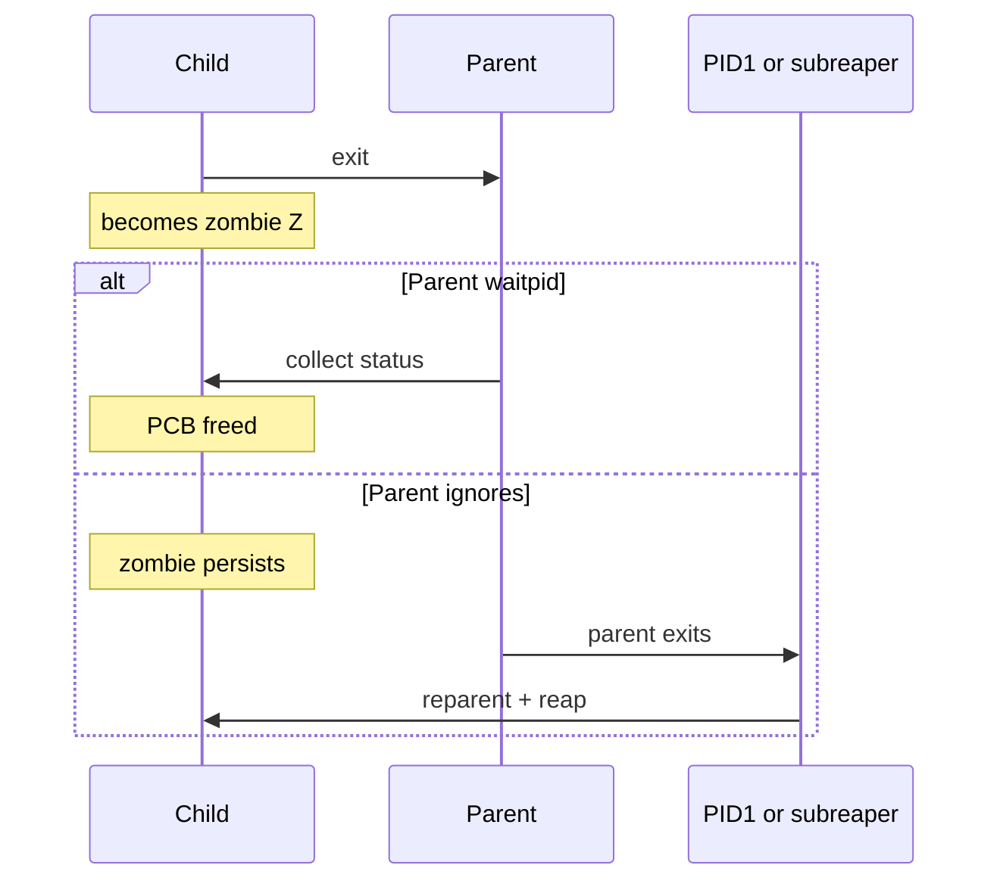
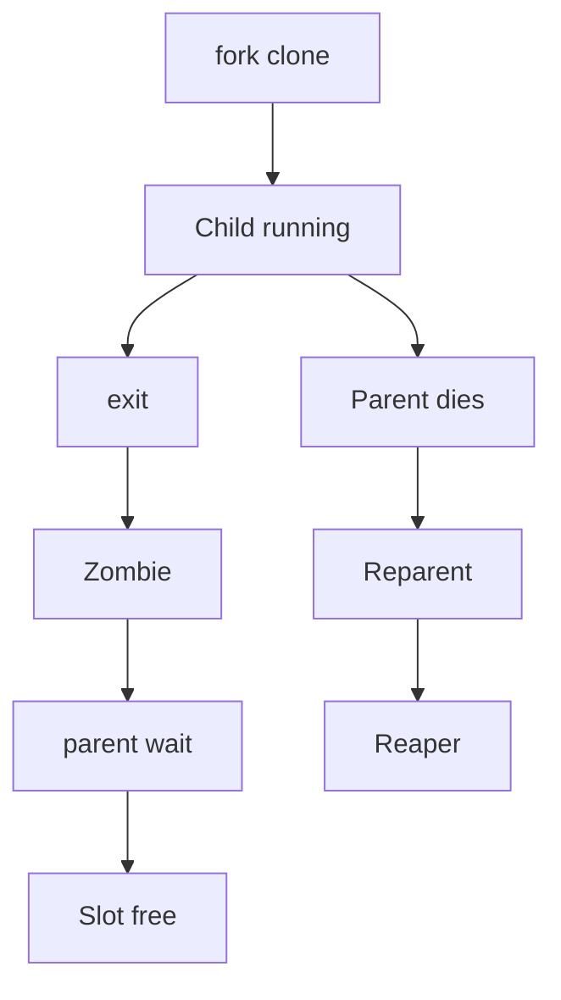
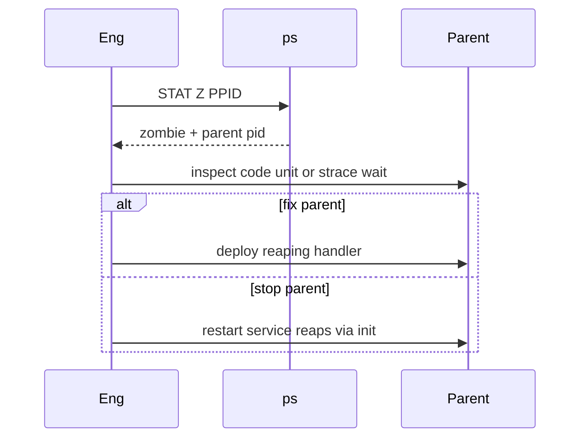

# Zombies Orphans and Reaping Failures

## Overview

A **zombie** (`Z` state) is a process that has exited but whose parent has not yet **`wait`/`waitpid`**’d to collect its exit status—the PCB stub remains. An **orphan** is a live process whose parent died; it is reparented (typically to PID 1 / subreaper). **Reaping failures** happen when parents ignore `SIGCHLD` or never wait—PID tables fill with zombies; under containers, a broken PID 1 makes this catastrophic.

CS explains wait semantics; Linux ops diagnoses and fixes them—see [[10-Linux/README|Linux]].

## Learning Objectives

- Explain zombie vs orphan precisely
- Diagnose zombie storms via `ps` and parent PID
- Design parents (and PID 1) that reap
- Use `PR_SET_CHILD_SUBREAPER` / systemd concepts at a high level
- Know when zombies are harmless noise vs slot exhaustion

## Prerequisites

- [[10-Linux/02-Processes-Signals-and-Job-Control/Process Lifecycle ps and procfs|Process Lifecycle ps and procfs]]
- [[10-Linux/02-Processes-Signals-and-Job-Control/Signals Delivery and Common Handlers|Signals Delivery and Common Handlers]]
- [[01-Computer-Science/04-Processes-and-Execution/Processes|Processes]]

## Difficulty

`intermediate`

## Estimated Time

- Reading: 1 hour
- Exercises: 1 hour
- Mini project: 2.5 hours

## History

Unix required parents to collect exit statuses—zombies are the bookkeeping. Double-fork daemons orphaned children to init on purpose. Containers revived the bug: people put app binaries as PID 1 without a reaper, then wondered why zombies accumulate and signals misbehave.

## Problem It Solves

| Symptom | Cause |
| --- | --- |
| Many `[app] <defunct>` | Parent not waiting |
| Cannot fork new tasks | PID/thread table pressure from zombies + others |
| Zombies vanish after parent kill | Reparent to init which reaps |
| Container leaks zombies | PID 1 is non-reaping app |
| Worker pool leaks | mishandled child lifecycle |

## Internal Implementation

### Exit and reap



## Mermaid Diagrams

### Structure — roles



### Sequence / Lifecycle — triage



## Examples

### Minimal Example — reaper sketch

```typescript
export type Child = { pid: number; exited: boolean; reaped: boolean };

export function onSigChld(children: Child[]): Child[] {
  return children.map((c) =>
    c.exited && !c.reaped ? { ...c, reaped: true } : c,
  );
}

export function zombieCount(children: Child[]): number {
  return children.filter((c) => c.exited && !c.reaped).length;
}
```

### Production-Shaped Example — PID 1 policy

```typescript
export type Pid1Policy =
  | { mode: "systemd" }
  | { mode: "tini_or_dumb_init" }
  | { mode: "app_as_pid1"; reaps: boolean };

export function containerRisk(policy: Pid1Policy): "low" | "high" {
  if (policy.mode === "app_as_pid1" && !policy.reaps) return "high";
  return "low";
}
```

## Trade-offs

| Approach | Upside | Downside |
| --- | --- | --- |
| App handles SIGCHLD | Correct for supervisors | Easy to get wrong |
| Double-fork to init | Classic daemon trick | Opaque; less needed under systemd |
| tini/dumb-init | Fixes container PID 1 | Extra process |
| Ignore few zombies | Sometimes OK briefly | Storms become outages |

### When to Use

- Writing process supervisors / worker pools
- Container entrypoint design
- Incidents with defunct processes

### When Not to Use

- Panic-killing unrelated processes because one zombie exists
- Treating a single short-lived zombie during restart as Sev-1

## Exercises

1. Create a zombie intentionally (fork+exit without wait) and observe `Z`.
2. Kill the parent and watch reaping.
3. Implement `zombieCount` tests for the sketch.
4. Evaluate `containerRisk` for your runtime’s entrypoint.
5. strace a broken supervisor missing `waitpid`.

## Mini Project

TypeScript simulation: parents that forget to reap vs subreaper; graph zombie count over “ticks.” Cite [[10-Linux/README|Linux]].

## Portfolio Project

[[10-Linux/projects/Linux Host Workbench/README|Linux Host Workbench]] — zombie detector alerting on count and parent cmdline.

## Interview Questions

1. What is a zombie process?
2. How do you get rid of zombies?
3. What is an orphan?
4. Why is app-as-PID1 dangerous?
5. Does SIGKILL on a zombie help?

### Stretch / Staff-Level

1. Design a language runtime finalizer/supervisor that cannot leak zombies under load.
2. How do pidfds change waiting and races?

## Common Mistakes

- `kill -9` on zombies (no effect on reclaim)
- Blaming zombies for CPU use (they use almost none)
- App PID 1 without reaper in Docker
- Waiting only once when multiple children exit
- Ignoring `SA_NOCLDWAIT` semantics surprises

## Best Practices

- Supervisors must loop on `waitpid(-1, …)` appropriately
- Use systemd or a tiny init in containers
- Alert on zombie count growth per parent
- Fix the parent; don’t harvest symptoms only
- Cross-link signals note for SIGCHLD

## Summary

**Zombies** await reaping; **orphans** get new parents; **reaping failures** are supervisor bugs amplified by bad PID 1. Diagnose via `Z` + PPID, fix the waiter, and never ship a non-reaping app as container init.

## Further Reading

- [[10-Linux/README|Linux README]]
- [[01-Computer-Science/04-Processes-and-Execution/Processes|Processes]]
- [[10-Linux/02-Processes-Signals-and-Job-Control/Signals Delivery and Common Handlers|Signals Delivery and Common Handlers]]
- [[14-Docker/README|Docker]] — entrypoint/init handoff

## Related Notes

- [[10-Linux/02-Processes-Signals-and-Job-Control/Process Lifecycle ps and procfs|Process Lifecycle ps and procfs]]
- [[10-Linux/02-Processes-Signals-and-Job-Control/Limits ulimit and rlimits|Limits ulimit and rlimits]]
- [[10-Linux/07-Cgroups-Namespaces-and-Isolation/From Host Primitives to Containers Handoff|From Host Primitives to Containers Handoff]]

## Progress Checklist

- [ ] Explained from first principles
- [ ] Drew at least one Mermaid diagram
- [ ] Implemented a minimal version
- [ ] Documented trade-offs and non-goals
- [ ] Completed exercises
- [ ] Practiced interview questions aloud
- [ ] Linked prerequisites and dependents
