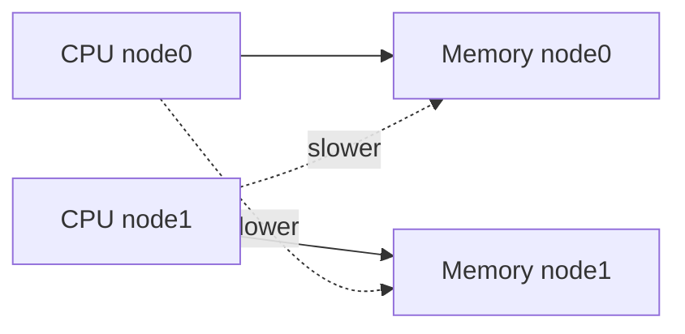
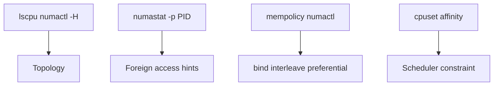
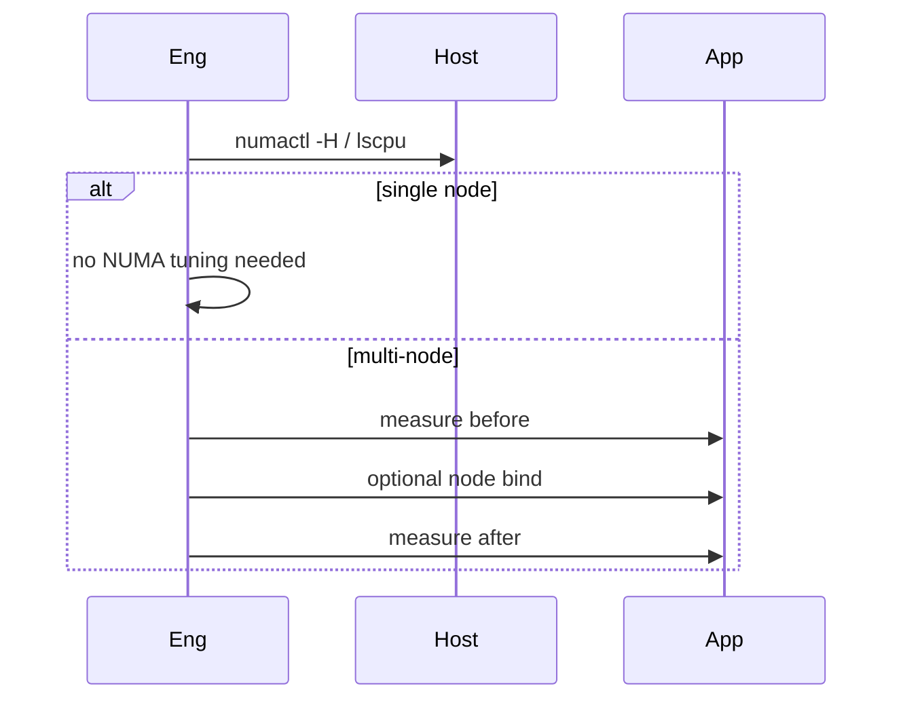

# NUMA Basics for Host Operators

## Overview

**NUMA (Non-Uniform Memory Access)** means CPUs have local memory nodes; remote access is slower. On multi-socket hosts, a process scheduled on node 0 while its memory lives on node 1 pays latency and bandwidth taxes. Operators use **`numactl`**, **`numastat`**, `/sys/devices/system/node/`, and affinity/cpusets to see and manage locality.

Most app hosts need awareness, not heroic pinning. Databases and latency-critical services sometimes need explicit policy—see [[10-Linux/README|Linux]]. Deep microarchitecture stays CS.

## Learning Objectives

- Identify whether a host is NUMA and map CPUs to nodes
- Read `numastat` for remote vs local allocation symptoms
- Apply `numactl --cpunodebind/--membind` carefully
- Relate NUMA to affinity, IRQ balance, and VM sizing
- Know when *not* to pin (flexibility vs locality)

## Prerequisites

- [[10-Linux/03-Memory-Swap-and-OOM/Virtual Memory Ops RSS vs VSZ|Virtual Memory Ops RSS vs VSZ]]
- [[10-Linux/02-Processes-Signals-and-Job-Control/Job Control Nice and Affinity Ops|Job Control Nice and Affinity Ops]]
- [[01-Computer-Science/03-Memory-and-Addressing/Memory Hierarchy Trade-offs|Memory Hierarchy Trade-offs]]

## Difficulty

`advanced`

## Estimated Time

- Reading: 1.25 hours
- Exercises: 1.5 hours
- Mini project: 3 hours

## History

SMP machines with uniform memory scaled poorly past sockets; NUMA hardware and OS support (Linux mempolicies) became standard in servers. Hypervisors expose vNUMA—wrong topology hurts guests. Cloud instance types vary; operators must check rather than assume single-node.

## Problem It Solves

| Symptom | NUMA angle |
| --- | --- |
| Throughput far below single-socket lab | Cross-node memory traffic |
| Latency jitter after migration | Memory left behind on old node |
| One node’s memory full, other free | Imbalanced alloc / binding |
| DB slow on large VM | Untuned vNUMA / interleaved policy |
| Blind `numactl --interleave=all` | Helps some, hurts locality-sensitive |

## Internal Implementation

### Local vs remote



Default Linux often allocates near the allocating CPU (local first); first-touch policy matters for who initializes memory.

## Mermaid Diagrams

### Structure — ops toolkit



### Sequence / Lifecycle — check before pin



## Examples

### Minimal Example — topology record

```typescript
export type NumaNode = { id: number; cpus: number[]; memMb: number };

export type NumaTopo = { nodes: NumaNode[] };

export function isNuma(topo: NumaTopo): boolean {
  return topo.nodes.length > 1;
}

export function cpusOnNode(topo: NumaTopo, nodeId: number): number[] {
  return topo.nodes.find((n) => n.id === nodeId)?.cpus ?? [];
}
```

### Production-Shaped Example — policy chooser

```typescript
export type NumaPolicy =
  | { kind: "default" }
  | { kind: "bind"; node: number }
  | { kind: "interleave"; nodes: number[] };

export function chooseNumaPolicy(input: {
  numa: boolean;
  role: "api" | "db" | "batch";
  measuredRemoteHeavy: boolean;
}): NumaPolicy {
  if (!input.numa) return { kind: "default" };
  if (input.role === "db" && input.measuredRemoteHeavy) return { kind: "bind", node: 0 };
  if (input.role === "batch") return { kind: "interleave", nodes: [0, 1] };
  return { kind: "default" };
}
```

## Trade-offs

| Policy | Upside | Downside |
| --- | --- | --- |
| Default local/first-touch | Simple; often OK | Can imbalance |
| Node bind | Strong locality | Strands other node capacity |
| Interleave | Spreads bandwidth | Higher average remote |
| Smaller single-socket instances | Avoid NUMA | More hosts to manage |

### When to Use

- Multi-socket bare metal / large VMs with vNUMA
- Measured remote access problems on DB/analytics
- IRQ/CPU isolation projects with locality goals

### When Not to Use

- Premature pinning on small single-node VMs
- Copying numactl flags without before/after metrics
- Fighting the hypervisor with guest-only tricks when topology is wrong upstream

## Exercises

1. Run `numactl -H` / `lscpu` and draw node↔CPU map.
2. Use `numastat` on a process; interpret imbalances carefully.
3. Decide policy for api/db/batch on a 2-node host.
4. Explain first-touch with a multithreaded allocator story.
5. Draft ADR: prefer 1-socket instance types for latency tier.

## Mini Project

TypeScript cost model: local vs remote access fractions → relative latency; recommend bind vs interleave. Cite [[10-Linux/README|Linux]].

## Portfolio Project

[[10-Linux/projects/Linux Host Workbench/README|Linux Host Workbench]] — NUMA topology reporter + policy notes for lab fixtures.

## Interview Questions

1. What is NUMA?
2. Why can memory be free on one node while alloc fails on another?
3. What does numactl membind do?
4. When is interleave appropriate?
5. How does CPU affinity interact with NUMA?

### Stretch / Staff-Level

1. Design placement for a latency-critical service across NUMA with IRQs and NIC locality.
2. How do you validate cloud vNUMA topology against vendor claims?

## Common Mistakes

- Assuming all cloud VMs are UMA
- Binding memory without binding CPUs (or vice versa)
- Pinning then forgetting about capacity headroom
- Ignoring autoNUMA / kernel balancing effects across versions
- Treating NUMA as the first knob for every slow host

## Best Practices

- Inventory topology in host identity / ADR
- Measure remote access before binding
- Prefer right-sized instances over complex pin maps when possible
- Coordinate with affinity and cpuset notes
- Document policies per role

## Summary

**NUMA** makes memory access cost topology-dependent. Operators verify node maps, watch for remote-heavy symptoms, and apply bind/interleave only with evidence. For many services, choosing simpler topology beats clever `numactl`.

## Further Reading

- [[10-Linux/README|Linux README]]
- [[01-Computer-Science/03-Memory-and-Addressing/Memory Hierarchy Trade-offs|Memory Hierarchy Trade-offs]]
- [[10-Linux/02-Processes-Signals-and-Job-Control/Job Control Nice and Affinity Ops|Job Control Nice and Affinity Ops]]
- [[10-Linux/10-Performance-Tuning-and-Kernel-Knobs/CPU Saturation Steal and Run Queue|CPU Saturation Steal and Run Queue]]

## Related Notes

- [[10-Linux/03-Memory-Swap-and-OOM/OOM Killer Scores and Policy|OOM Killer Scores and Policy]]
- [[10-Linux/03-Memory-Swap-and-OOM/Virtual Memory Ops RSS vs VSZ|Virtual Memory Ops RSS vs VSZ]]
- [[10-Linux/00-Orientation-and-Boundaries/ADR Discipline for Host Decisions|ADR Discipline for Host Decisions]]
- [[10-Linux/07-Cgroups-Namespaces-and-Isolation/cgroup v2 Controllers CPU Memory IO|cgroup v2 Controllers CPU Memory IO]]

## Progress Checklist

- [ ] Explained from first principles
- [ ] Drew at least one Mermaid diagram
- [ ] Implemented a minimal version
- [ ] Documented trade-offs and non-goals
- [ ] Completed exercises
- [ ] Practiced interview questions aloud
- [ ] Linked prerequisites and dependents
