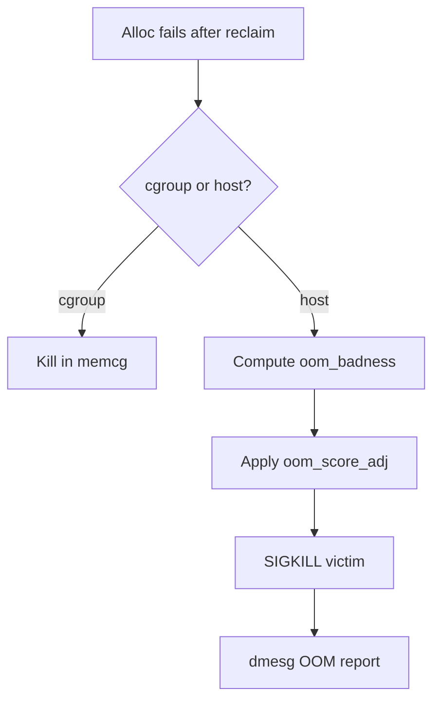
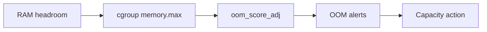
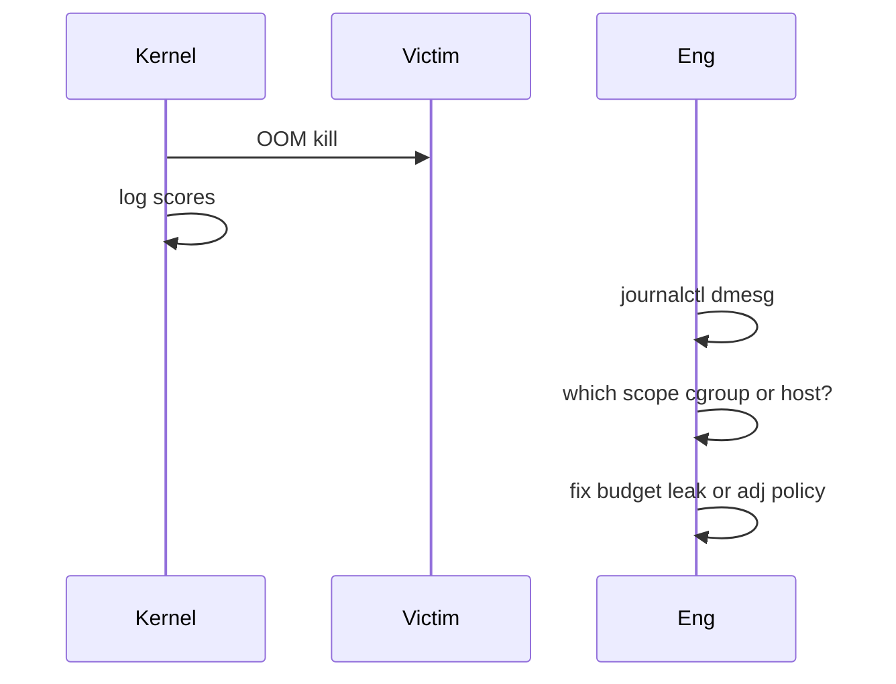

# OOM Killer Scores and Policy

## Overview

When the kernel cannot reclaim enough memory, the **OOM killer** selects a victim process to kill (SIGKILL) based on **`oom_score`** / heuristics, adjustable via **`oom_score_adj`** (−1000..1000). **cgroup memory.max** OOMs can kill within a cgroup without host-wide selection—often the better blast-radius tool.

“The OOM killer killed the wrong thing” is usually missing policy: protect PID 1-critical agents carefully, prefer cgroup isolation, and read `dmesg` evidence—see [[10-Linux/README|Linux]].

## Learning Objectives

- Explain when host OOM vs cgroup OOM fires
- Read `oom_score`, `oom_score_adj`, and dmesg OOM reports
- Design protection for must-survive processes (−1000 risks)
- Prefer memory.max budgets over hoping scores are fair
- Document OOM policy in host ADRs and runbooks

## Prerequisites

- [[10-Linux/03-Memory-Swap-and-OOM/Swap Pressure and thrashing Symptoms|Swap Pressure and thrashing Symptoms]]
- [[10-Linux/00-Orientation-and-Boundaries/Failure Domains on a Single Host|Failure Domains on a Single Host]]
- [[10-Linux/03-Memory-Swap-and-OOM/Virtual Memory Ops RSS vs VSZ|Virtual Memory Ops RSS vs VSZ]]

## Difficulty

`advanced`

## Estimated Time

- Reading: 1.25 hours
- Exercises: 1.5 hours
- Mini project: 3 hours

## History

Linux OOM killer evolved through heuristics (badness scores) to avoid killing `init` and prefer fat consumers. Containers made cgroup OOM the common path. Still, host OOMs happen on VMs without tight cgroups—and scores surprise teams who never set `oom_score_adj`.

## Problem It Solves

| Symptom | Policy fix |
| --- | --- |
| API killed, batch survives | Adjust adj / isolate cgroups |
| sshd or node-exporter killed | Protect modestly; fix RAM |
| Silent restarts | Missed dmesg/journal OOM lines |
| Kill loops | Leak remains; killer is not capacity |
| −1000 on everything | Defeats OOM; deadlock risk |

## Internal Implementation

### Selection sketch



Exact scoring changes across kernels—ops should verify on their version and prefer cgroup limits.

## Mermaid Diagrams

### Structure — policy stack



### Sequence / Lifecycle — incident



## Examples

### Minimal Example — score adjust clamp

```typescript
export function clampAdj(adj: number): number {
  return Math.min(1000, Math.max(-1000, Math.trunc(adj)));
}

/** Higher adj → more likely victim (typical). */
export function preferKillFirst(aAdj: number, bAdj: number): "a" | "b" | "tie" {
  const a = clampAdj(aAdj);
  const b = clampAdj(bAdj);
  if (a > b) return "a";
  if (b > a) return "b";
  return "tie";
}
```

### Production-Shaped Example — OOM policy

```typescript
export type OomPolicy = {
  name: string;
  memoryMaxMb?: number;
  oomScoreAdj: number;
  mustSurvive: boolean;
};

export const HOST_OOM_POLICY: OomPolicy[] = [
  { name: "api", memoryMaxMb: 4096, oomScoreAdj: 0, mustSurvive: true },
  { name: "batch", memoryMaxMb: 2048, oomScoreAdj: 200, mustSurvive: false },
  { name: "node-exporter", oomScoreAdj: -300, mustSurvive: true },
];

export function forbidden(p: OomPolicy): string[] {
  const e: string[] = [];
  if (p.mustSurvive && p.oomScoreAdj >= 500) e.push("mustSurvive but high adj");
  if (p.oomScoreAdj <= -1000 && p.name !== "init-like") e.push("avoid -1000 except rare cases");
  return e;
}
```

## Trade-offs

| Approach | Upside | Downside |
| --- | --- | --- |
| cgroup memory.max | Contained blast radius | Needs correct sizing |
| oom_score_adj only | Simple | Host still shared fate |
| −1000 protect | Immune to OOM killer | Can deadlock system memory |
| No swap + tight RAM | Fail fast | Abrupt kills |

### When to Use

- Co-located batch and API
- Protecting observability agents modestly
- Postmortem after unexpected kills

### When Not to Use

- Using killer as an autoscaler
- −1000 on large apps that can leak
- Ignoring cgroup OOM events in Kubernetes

## Exercises

1. Read `/proc/<pid>/oom_score` and `oom_score_adj` for api vs batch.
2. Simulate preferKillFirst for policy table.
3. Find an OOM kill line in sample dmesg; extract victim and total-vm.
4. Design cgroup memory.max so batch dies first.
5. Write ADR: protect sshd adj vs relying on systemd.

## Mini Project

TypeScript OOM victim selector under a simplified badness model (RSS + adj); compare to cgroup-first policy. Link [[10-Linux/README|Linux]].

## Portfolio Project

[[10-Linux/projects/Cgroup Budget Clinic/README|Cgroup Budget Clinic]] — prove batch OOM does not kill API; document scoreadj fallback.

## Interview Questions

1. What triggers the OOM killer?
2. What is oom_score_adj?
3. cgroup OOM vs host OOM?
4. Risks of oom_score_adj=-1000?
5. How do you find who was killed?

### Stretch / Staff-Level

1. Design memory failure domains for a node running kubelet, system.slice, and user pods.
2. How should product SLOs treat OOM kills vs latency thrashing?

## Common Mistakes

- No alerts on OOM kills
- Protecting everything with −1000
- Debugging scores while leak grows unbounded
- Assuming kill equals “kernel bug”
- Forgetting container runtime OOM vs host

## Best Practices

- Prefer hard memory.max per role
- Modest negative adj for small critical agents
- Positive adj for disposable batch
- Capture dmesg in postmortems
- ADR the policy; revisit after incidents

## Summary

The **OOM killer** is a last-resort allocator policy guided by scores and adjustments. Production reliability comes from **cgroup memory budgets**, deliberate `oom_score_adj`, and capacity—not from arguing with the killer after the fact.

## Further Reading

- [[10-Linux/README|Linux README]]
- [[10-Linux/07-Cgroups-Namespaces-and-Isolation/cgroup v2 Controllers CPU Memory IO|cgroup v2 Controllers CPU Memory IO]]
- [[10-Linux/00-Orientation-and-Boundaries/Failure Domains on a Single Host|Failure Domains on a Single Host]]
- [[10-Linux/12-Incidents-Runbooks-and-Portfolio/Postmortem Evidence Collection on Linux|Postmortem Evidence Collection on Linux]]

## Related Notes

- [[10-Linux/03-Memory-Swap-and-OOM/Swap Pressure and thrashing Symptoms|Swap Pressure and thrashing Symptoms]]
- [[10-Linux/03-Memory-Swap-and-OOM/NUMA Basics for Host Operators|NUMA Basics for Host Operators]]
- [[10-Linux/00-Orientation-and-Boundaries/ADR Discipline for Host Decisions|ADR Discipline for Host Decisions]]

## Progress Checklist

- [ ] Explained from first principles
- [ ] Drew at least one Mermaid diagram
- [ ] Implemented a minimal version
- [ ] Documented trade-offs and non-goals
- [ ] Completed exercises
- [ ] Practiced interview questions aloud
- [ ] Linked prerequisites and dependents
