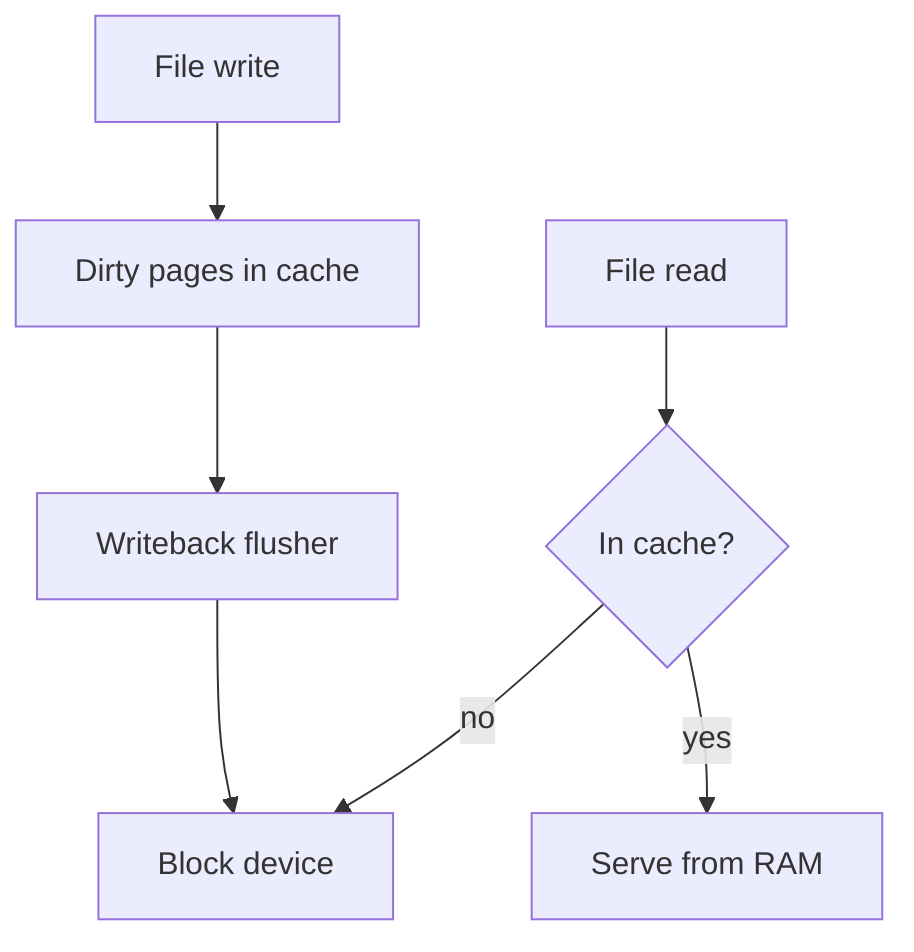
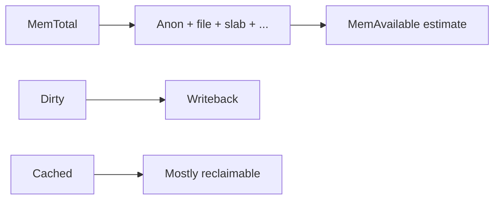

# Page Cache Dirty Writeback and Drop Caches Myths

## Overview

The Linux **page cache** keeps file-backed pages in RAM so reads hit memory and writes can be buffered as **dirty** pages until **writeback** flushes them to storage. `free` memory looking “low” is often cache doing its job—**available** matters more. **`echo 3 > /proc/sys/vm/drop_caches`** is a mythic fix that can hurt production by discarding hot cache and stalling I/O.

Databases own buffer pools; Linux owns host page cache behavior—see [[10-Linux/README|Linux]] and [[08-Databases/README|Databases]] boundary.

## Learning Objectives

- Read `MemAvailable`, cache, dirty from `/proc/meminfo` and `free -h`
- Explain dirty ratios and writeback pressure symptoms
- Know when drop_caches is for labs only
- Separate DB buffer pool cache from OS page cache
- Tune thinking toward workloads, not ritual sysctls (ADR later)

## Prerequisites

- [[10-Linux/03-Memory-Swap-and-OOM/Virtual Memory Ops RSS vs VSZ|Virtual Memory Ops RSS vs VSZ]]
- [[01-Computer-Science/03-Memory-and-Addressing/Virtual Memory|Virtual Memory]]
- [[08-Databases/00-Orientation/Files vs Engines vs Services|Files vs Engines vs Services]]

## Difficulty

`intermediate`

## Estimated Time

- Reading: 1.25 hours
- Exercises: 1 hour
- Mini project: 2.5 hours

## History

Unix buffer caches made disks usable. Linux unified page cache with virtual memory reclaim. Operators learned “free memory is wasted memory,” then overcorrected with drop_caches in runbooks. Modern `MemAvailable` estimates reclaimable cache+reclaimable slab for humans.

## Problem It Solves

| Symptom | Cache reality |
| --- | --- |
| `free` near 0, system fine | Cache reclaimable |
| Latency spike under write bursts | Dirty writeback / congestion |
| “Fixed OOM” with drop_caches | Temporary; may worsen; wrong tool |
| DB double caching | Buffer pool + OS cache |
| fsync stalls | Linked durability contracts |

## Internal Implementation

### Dirty path



Reclaim prefers inactive clean file pages before anonymous under default pressure—details interact with swappiness (next note).

## Mermaid Diagrams

### Structure — meminfo lenses



### Sequence / Lifecycle — drop_caches myth

```mermaid
sequenceDiagram
    participant Op as Operator
    participant Cache as Page cache
    participant App
    Op->>Cache: drop_caches
    Cache-->>Op: RAM looks free
    App->>Cache: reread hot files
    Cache->>App: disk IO storm
    Note over Op: symptom masked; latency regresses
```

## Examples

### Minimal Example — available vs free

```typescript
export type Meminfo = {
  memTotalKb: number;
  memFreeKb: number;
  memAvailableKb: number;
  dirtyKb: number;
  cachedKb: number;
};

export function panicFreeButOk(m: Meminfo): boolean {
  const freeRatio = m.memFreeKb / m.memTotalKb;
  const availRatio = m.memAvailableKb / m.memTotalKb;
  return freeRatio < 0.05 && availRatio > 0.2;
}
```

### Production-Shaped Example — dirty pressure flag

```typescript
export function dirtyPressure(m: Meminfo): "ok" | "elevated" | "critical" {
  const dirtyRatio = m.dirtyKb / m.memTotalKb;
  if (dirtyRatio > 0.2) return "critical";
  if (dirtyRatio > 0.1) return "elevated";
  return "ok";
}

export const DROP_CACHES_POLICY = {
  prodAllowed: false,
  labAllowed: true,
  reason: "discards hot cache; use for reproducible benchmarks only",
};
```

## Trade-offs

| Action | Upside | Downside |
| --- | --- | --- |
| Large page cache | Fast reads | Looks like low free |
| Aggressive writeback | Lower dirty risk | More steady disk util |
| drop_caches | Benchmark isolation | Prod latency hit |
| Smaller DB buffer + OS cache | Simple | Double cache or thrash either side |

### When to Use

- Interpreting memory graphs before paging app teams
- Write-heavy ingest hosts (watch dirty)
- Benchmarks that need cold-cache runs (lab)

### When Not to Use

- drop_caches as an OOM or latency “fix”
- Blind `vm.dirty_*` changes without ADR and measurement

## Exercises

1. On a lab host, generate file reads and watch Cached vs Available.
2. Create dirty pages with large writes; observe writeback with `iostat`.
3. Argue against a runbook step that drops caches weekly.
4. Compare Postgres `shared_buffers` sizing note with this host view.
5. Draft ADR rejecting drop_caches in prod.

## Mini Project

TypeScript meminfo classifier: `panicFreeButOk`, dirty pressure, and a policy gate for drop_caches. Link [[10-Linux/README|Linux]].

## Portfolio Project

[[10-Linux/projects/Linux Host Workbench/README|Linux Host Workbench]] — page-cache dashboard with myth warnings.

## Interview Questions

1. Is low `free` memory bad?
2. What are dirty pages?
3. Why is drop_caches dangerous in production?
4. Page cache vs DB buffer pool?
5. What is MemAvailable?

### Stretch / Staff-Level

1. Design writeback monitoring tied to app write SLOs.
2. How do you co-size DB buffers and host RAM intentionally?

## Common Mistakes

- Equating Cached with “wasted”
- drop_caches in incident checklists
- Ignoring dirty during bulk loads
- Tuning dirty ratios from blog posts without workload capture
- Blaming page cache for anon leaks

## Best Practices

- Alert on MemAvailable / pressure stall metrics, not free alone
- Keep drop_caches out of prod runbooks
- ADR any dirty_* sysctl
- Coordinate with DB engine sizing
- Cross-link fsync durability for operators (module 04)

## Summary

**Page cache** is a performance feature; **dirty writeback** is its durability/latency edge; **drop_caches** is a lab scalpel, not a cure. Read Available and dirty pressure, not folklore about free memory.

## Further Reading

- [[10-Linux/README|Linux README]]
- [[08-Databases/01-Storage-and-Buffer-Pool/Pages Blocks and IO Units|Pages Blocks and I/O Units]]
- [[10-Linux/03-Memory-Swap-and-OOM/Swap Pressure and thrashing Symptoms|Swap Pressure and thrashing Symptoms]]
- [[10-Linux/04-Filesystems-Disks-and-IO/fsync Durability Contracts for Operators|fsync Durability Contracts for Operators]]

## Related Notes

- [[10-Linux/03-Memory-Swap-and-OOM/Virtual Memory Ops RSS vs VSZ|Virtual Memory Ops RSS vs VSZ]]
- [[10-Linux/03-Memory-Swap-and-OOM/OOM Killer Scores and Policy|OOM Killer Scores and Policy]]
- [[10-Linux/00-Orientation-and-Boundaries/ADR Discipline for Host Decisions|ADR Discipline for Host Decisions]]

## Progress Checklist

- [ ] Explained from first principles
- [ ] Drew at least one Mermaid diagram
- [ ] Implemented a minimal version
- [ ] Documented trade-offs and non-goals
- [ ] Completed exercises
- [ ] Practiced interview questions aloud
- [ ] Linked prerequisites and dependents
