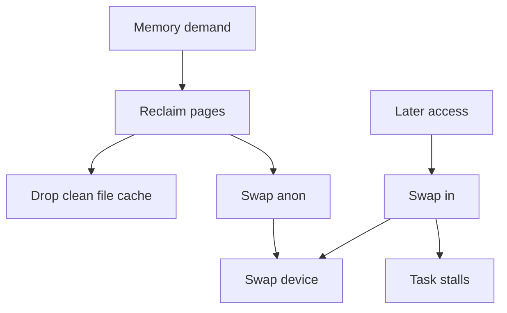
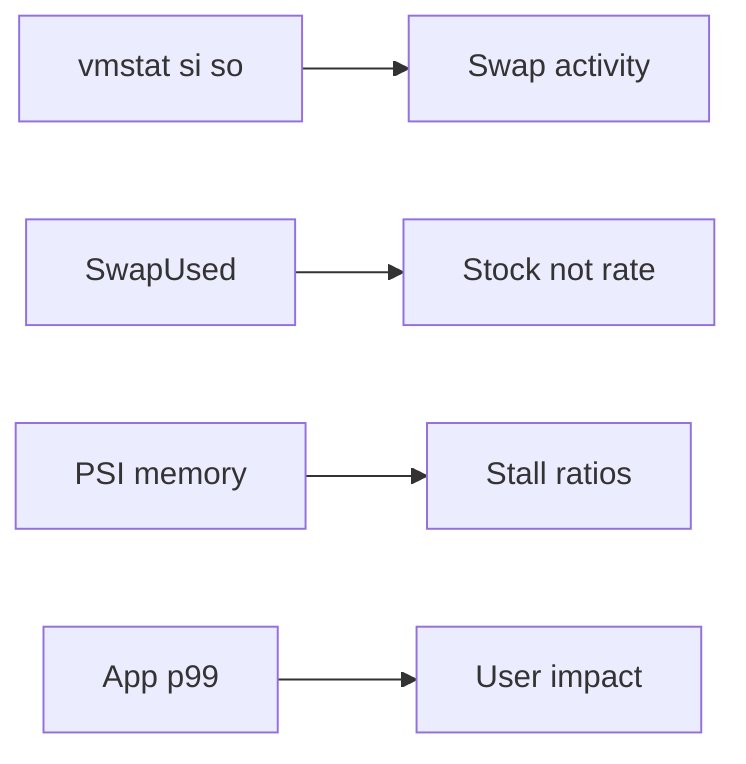
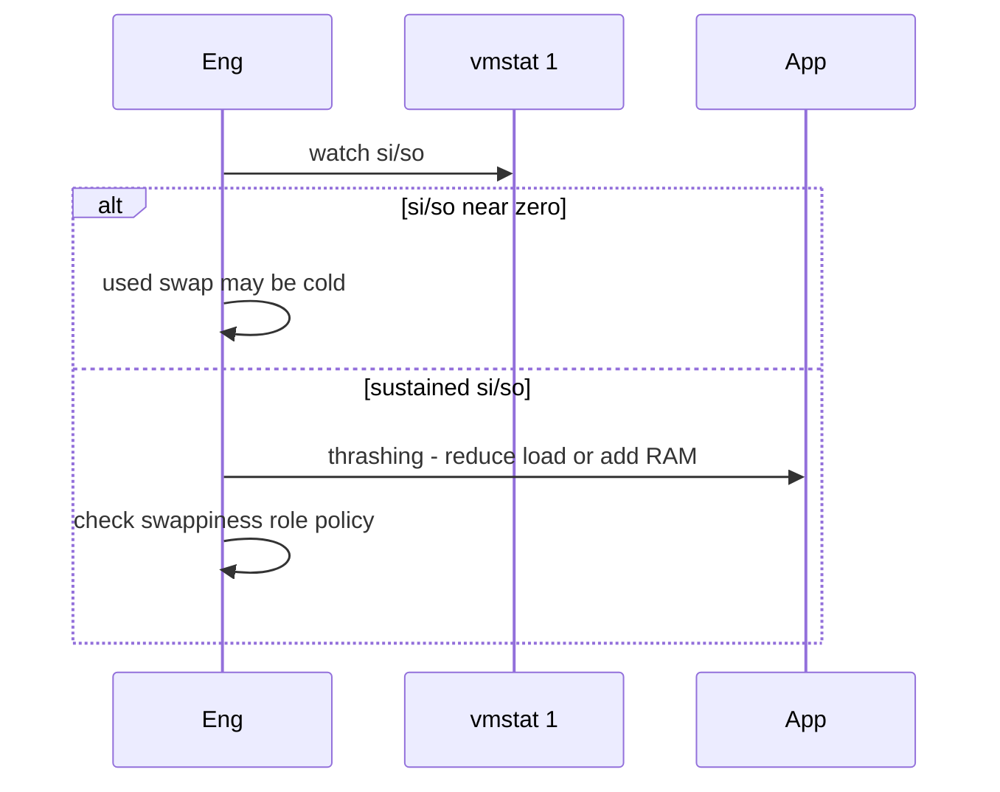

# Swap Pressure and thrashing Symptoms

## Overview

**Swap** extends reclaim by writing anonymous pages to disk when memory is tight. Mild swap can be healthy; **thrashing** is when the working set cannot stay resident—CPU waits on page-ins (`si`/`so` in `vmstat`), load rises, and latency collapses. **`vm.swappiness`** biases reclaim toward file cache vs anon swap-out—not an on/off switch.

Disable-swap absolutism and “swappiness=0 always” cargo cult both fail some workloads. Measure pressure—see [[10-Linux/README|Linux]].

## Learning Objectives

- Read swap usage vs swap *activity* (the important part)
- Recognize thrashing with `vmstat`, `psi` (pressure stall info), and latency
- Reason about swappiness qualitatively for app vs DB hosts
- Choose swap present vs absent with explicit failure mode (OOM sooner vs crawl)
- ADR role-scoped swap policy

## Prerequisites

- [[10-Linux/03-Memory-Swap-and-OOM/Page Cache Dirty Writeback and Drop Caches Myths|Page Cache Dirty Writeback and Drop Caches Myths]]
- [[01-Computer-Science/03-Memory-and-Addressing/Virtual Memory|Virtual Memory]]
- [[10-Linux/00-Orientation-and-Boundaries/ADR Discipline for Host Decisions|ADR Discipline for Host Decisions]]

## Difficulty

`intermediate`

## Estimated Time

- Reading: 1 hour
- Exercises: 1 hour
- Mini project: 2 hours

## History

Swap made small-RAM Unix usable. SSDs changed the cost of swap I/O but not thrashing physics—random page-in still destroys tail latency. Kubernetes revived “swap off” defaults; newer versions experiment with limited swap. Operators still confuse *bytes swapped* with *pages flipping now*.

## Problem It Solves

| Symptom | Swap angle |
| --- | --- |
| p99 multi-second, CPU idle-ish | page-in waits |
| Swap used but system fine | Cold anon parked; low si/so |
| OOM with swap free | cgroup limits / mlock / admin_reserve |
| “We set swappiness=1” mystery | Still swaps under pressure; check activity |
| DB latency with swap | Prefer avoid anon reclaim—role policy |

## Internal Implementation

### Pressure loop



Thrashing ≈ working set > RAM, continuous swap-in/out.

## Mermaid Diagrams

### Structure — signals



### Sequence / Lifecycle — triage



## Examples

### Minimal Example — activity detector

```typescript
export type SwapSample = { si: number; so: number; usedMb: number };

export function thrashSuspect(samples: SwapSample[], thresholdPages: number): boolean {
  if (samples.length < 3) return false;
  const hot = samples.filter((s) => s.si + s.so >= thresholdPages);
  return hot.length >= samples.length - 1;
}
```

### Production-Shaped Example — role policy

```typescript
export type SwapPolicy = {
  role: "api" | "db" | "batch";
  swapEnabled: boolean;
  swappiness: number;
  rationale: string;
};

export const POLICIES: SwapPolicy[] = [
  {
    role: "db",
    swapEnabled: true, // small emergency; prefer RAM headroom
    swappiness: 10,
    rationale: "Prefer reclaim file cache; avoid anon churn on DB",
  },
  {
    role: "batch",
    swapEnabled: true,
    swappiness: 60,
    rationale: "Tolerate more reclaim; cost sensitive",
  },
  {
    role: "api",
    swapEnabled: true,
    swappiness: 30,
    rationale: "Balance; alert on PSI and si/so not on SwapUsed alone",
  },
];
```

## Trade-offs

| Choice | Upside | Downside |
| --- | --- | --- |
| Swap on | Soft landing; hibernate use cases | Thrash risk if undersized RAM |
| Swap off | Fail fast via OOM | Abrupt kills; no emergency room |
| Low swappiness | Keep anon longer | More cache reclaim; may hurt file-heavy |
| High swappiness | Keep cache | Anon may swap earlier |

### When to Use

- Diagnosing mysterious latency with free RAM charts looking “OK”
- Setting role-based swappiness ADRs
- Capacity reviews after seeing SwapUsed climb

### When Not to Use

- Celebrating SwapUsed=0 while thrashing on remote storage page cache (different)
- Copying swappiness from Reddit into all AMIs

## Exercises

1. Generate swap activity in lab; plot si/so vs p99 of a simple service.
2. Contrast SwapUsed high/low activity cases.
3. Pick policies for api/db/batch and defend.
4. Read PSI memory some/full if available.
5. Write alerts: si/so sustained vs SwapUsed threshold.

## Mini Project

Simulate a working-set vs RAM model that emits thrashSuspect; document ADR for swappiness by role. Cite [[10-Linux/README|Linux]].

## Portfolio Project

[[10-Linux/projects/Linux Host Workbench/README|Linux Host Workbench]] — swap activity monitor separate from usage gauge.

## Interview Questions

1. Is swap usage always bad?
2. What is thrashing?
3. What does swappiness influence?
4. Swap off vs OOM?
5. Which metrics detect swap *pressure*?

### Stretch / Staff-Level

1. Design node policy for K8s with limited swap (if enabled) and user-facing SLOs.
2. How do you distinguish disk thrashing from CPU saturation using golden signals?

## Common Mistakes

- Alerting only on SwapUsed percent
- swappiness=0 cargo cult without measuring
- Adding swap to “fix” chronic RAM shortage
- Ignoring cgroup swap limits
- Tuning during thrash without reducing load

## Best Practices

- Watch rates (si/so, PSI) and latency together
- Role-scope swappiness via ADR
- Size RAM for working set; swap is seatbelt
- Prefer fail-fast for latency-critical if policy says so—and provision headroom
- Cross-link OOM note for the other failure mode

## Summary

**Swap pressure** is about *activity and stalls*, not merely bytes used. Thrashing destroys latency; swappiness biases reclaim. Choose swap presence and knobs per role with measurement and ADRs—not folklore.

## Further Reading

- [[10-Linux/README|Linux README]]
- [[01-Computer-Science/03-Memory-and-Addressing/Virtual Memory|Virtual Memory]]
- [[10-Linux/03-Memory-Swap-and-OOM/OOM Killer Scores and Policy|OOM Killer Scores and Policy]]
- [[10-Linux/10-Performance-Tuning-and-Kernel-Knobs/sysctl Trade-offs Documentation Discipline|sysctl Trade-offs Documentation Discipline]]

## Related Notes

- [[10-Linux/03-Memory-Swap-and-OOM/Page Cache Dirty Writeback and Drop Caches Myths|Page Cache Dirty Writeback and Drop Caches Myths]]
- [[10-Linux/03-Memory-Swap-and-OOM/Virtual Memory Ops RSS vs VSZ|Virtual Memory Ops RSS vs VSZ]]
- [[10-Linux/00-Orientation-and-Boundaries/ADR Discipline for Host Decisions|ADR Discipline for Host Decisions]]

## Progress Checklist

- [ ] Explained from first principles
- [ ] Drew at least one Mermaid diagram
- [ ] Implemented a minimal version
- [ ] Documented trade-offs and non-goals
- [ ] Completed exercises
- [ ] Practiced interview questions aloud
- [ ] Linked prerequisites and dependents
