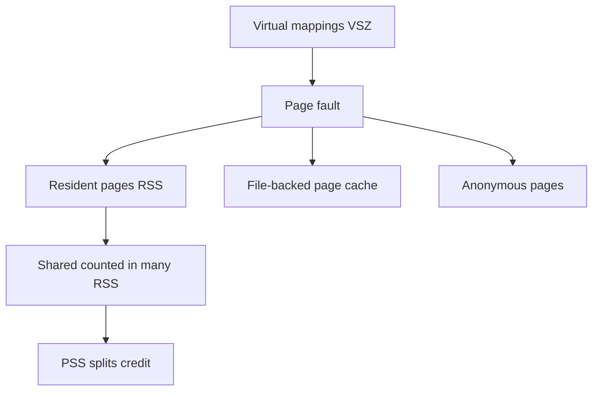
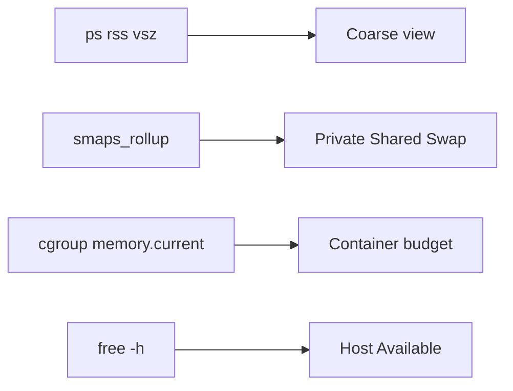

# Virtual Memory Ops RSS vs VSZ

## Overview

**VSZ (virtual size)** is the size of a process’s virtual address space mappings; **RSS (resident set size)** is how much physical RAM is currently backing it (roughly). Operators who alert on VSZ panic wrongly; those who ignore PSS/shared pages double-count RAM. **`/proc/<pid>/smaps`** (and `smaps_rollup`) refine the picture with private vs shared, swap, and huge pages.

CS owns page tables and faults; Linux owns reading live memory for incidents—see [[10-Linux/README|Linux]].

## Learning Objectives

- Interpret VSZ, RSS, PSS, and Swap in ops tooling
- Use `ps`, `top`, `smem`, and `smaps_rollup` appropriately
- Explain why mmap’d files inflate VSZ and sometimes RSS
- Avoid double-counting shared libraries across processes
- Link memory growth symptoms to next notes (cache, swap, OOM)

## Prerequisites

- [[10-Linux/00-Orientation-and-Boundaries/CS Models vs Linux Operations Boundaries|CS Models vs Linux Operations Boundaries]]
- [[01-Computer-Science/03-Memory-and-Addressing/Virtual Memory|Virtual Memory]]
- [[10-Linux/02-Processes-Signals-and-Job-Control/Process Lifecycle ps and procfs|Process Lifecycle ps and procfs]]

## Difficulty

`intermediate`

## Estimated Time

- Reading: 1.25 hours
- Exercises: 1 hour
- Mini project: 3 hours

## History

Early `ps` columns taught generations to fear VSZ. Shared libraries and `mmap` made RSS summation lie. PSS (proportional set size) and `smaps` improved accountability; cgroup memory.current became the multi-process truth for containers.

## Problem It Solves

| Symptom | Metric literacy |
| --- | --- |
| “Memory leak” because VSZ grew after mmap | Often mappings, not anon leak |
| Sum of RSS ≫ RAM | Shared pages counted many times |
| OOM despite “free” in top | Need available, cache, reclaim (next notes) |
| Container killed, host looks fine | cgroup memory != host free |
| Java “heap + RSS confuse” | Direct buffers, code cache, stacks |

## Internal Implementation

### Mapping to residency



## Mermaid Diagrams

### Structure — tools



### Sequence / Lifecycle — growth triage

```mermaid
sequenceDiagram
    participant Eng
    participant Ps as ps/top
    participant Smaps as smaps_rollup
    Eng->>Ps: RSS climbing?
    Ps-->>Eng: candidate PID
    Eng->>Smaps: Anonymous vs File vs Swap
    alt Anonymous private up
        Eng->>Eng: heap leak / caches in app
    else File RSS up
        Eng->>Eng: page cache mapped; check host pressure
    end
```

## Examples

### Minimal Example — double-count guard

```typescript
export type ProcMem = { pid: number; rssKb: number; pssKb: number; vszKb: number };

export function sumRss(procs: ProcMem[]): number {
  return procs.reduce((a, p) => a + p.rssKb, 0);
}

export function sumPss(procs: ProcMem[]): number {
  return procs.reduce((a, p) => a + p.pssKb, 0);
}

// sumRss can exceed physical RAM; prefer sumPss for fleet accounting sketches
```

### Production-Shaped Example — classifier

```typescript
export type GrowthClass = "anon_leak_suspect" | "mapped_file" | "swapped" | "vsz_only";

export function classifyGrowth(before: ProcMem & { anonKb: number; swapKb: number }, after: typeof before): GrowthClass {
  if (after.vszKb - before.vszKb > 0 && after.rssKb === before.rssKb) return "vsz_only";
  if (after.swapKb > before.swapKb + 1024) return "swapped";
  if (after.anonKb - before.anonKb > (after.rssKb - before.rssKb) * 0.7) return "anon_leak_suspect";
  return "mapped_file";
}
```

## Trade-offs

| Metric | Upside | Downside |
| --- | --- | --- |
| VSZ | Cheap; shows mapping sprawl | Weak RAM predictor |
| RSS | Familiar residency | Shared double-count |
| PSS | Fairer accounting | Costlier to compute |
| cgroup memory | Matches kill policy | Needs cgroup v2 literacy |

### When to Use

- Process-level leak hunts (anon via smaps)
- Explaining memory to app teams without CS lectures
- Comparing before/after deploys

### When Not to Use

- Alerting solely on VSZ
- Summing RSS across all PIDs for capacity planning

## Exercises

1. Compare VSZ/RSS for a process before/after large `mmap`.
2. Show two processes sharing a `.so` and discuss RSS vs PSS.
3. Parse a fake `smaps_rollup` into the classifier.
4. Contrast host `free` available vs process RSS.
5. Write alert rules: RSS rate vs cgroup memory.current.

## Mini Project

[[10-Linux/projects/Procfs Inspector Lab/README|Procfs Inspector Lab]] — add RSS/VSZ/PSS columns and growth classifier.

## Portfolio Project

[[10-Linux/projects/Linux Host Workbench/README|Linux Host Workbench]] — memory inspector with double-count warnings.

## Interview Questions

1. RSS vs VSZ?
2. Why can sum(RSS) exceed RAM?
3. What is PSS?
4. Does a VSZ increase mean a leak?
5. Where do you look for per-mapping detail?

### Stretch / Staff-Level

1. Design memory SLOs for a multi-tenant node using cgroup + PSS sampling.
2. How do transparent huge pages distort RSS observations?

## Common Mistakes

- Killing processes because VSZ looks “huge”
- Ignoring shared mappings
- Comparing JVM `-Xmx` directly to RSS
- Forgetting swap portion of working set
- Not checking cgroup when in containers

## Best Practices

- Prefer smaps_rollup + cgroup for truth
- Track anon private for leak hunts
- Document memory metrics in runbooks
- Cross-link CS Virtual Memory for theory
- Pair with page cache and OOM notes

## Summary

**VSZ** measures mappings; **RSS** measures residency with shared-page caveats; **PSS/smaps/cgroups** refine accountability. Virtual memory ops is literacy with `/proc` numbers so you chase leaks—not phantoms.

## Further Reading

- [[10-Linux/README|Linux README]]
- [[01-Computer-Science/03-Memory-and-Addressing/Virtual Memory|Virtual Memory]]
- [[10-Linux/03-Memory-Swap-and-OOM/Page Cache Dirty Writeback and Drop Caches Myths|Page Cache Dirty Writeback and Drop Caches Myths]]
- [[10-Linux/03-Memory-Swap-and-OOM/OOM Killer Scores and Policy|OOM Killer Scores and Policy]]

## Related Notes

- [[10-Linux/03-Memory-Swap-and-OOM/Swap Pressure and thrashing Symptoms|Swap Pressure and thrashing Symptoms]]
- [[10-Linux/03-Memory-Swap-and-OOM/NUMA Basics for Host Operators|NUMA Basics for Host Operators]]
- [[10-Linux/07-Cgroups-Namespaces-and-Isolation/cgroup v2 Controllers CPU Memory IO|cgroup v2 Controllers CPU Memory IO]]

## Progress Checklist

- [ ] Explained from first principles
- [ ] Drew at least one Mermaid diagram
- [ ] Implemented a minimal version
- [ ] Documented trade-offs and non-goals
- [ ] Completed exercises
- [ ] Practiced interview questions aloud
- [ ] Linked prerequisites and dependents
