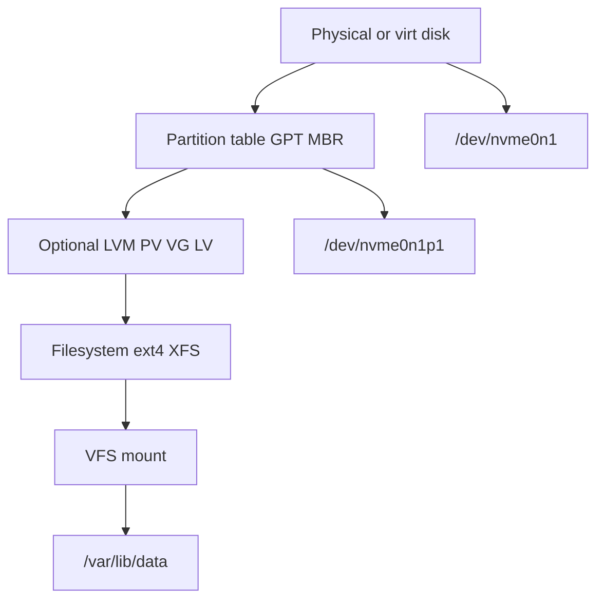
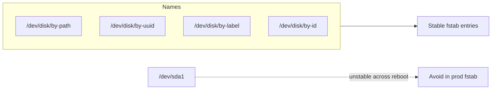
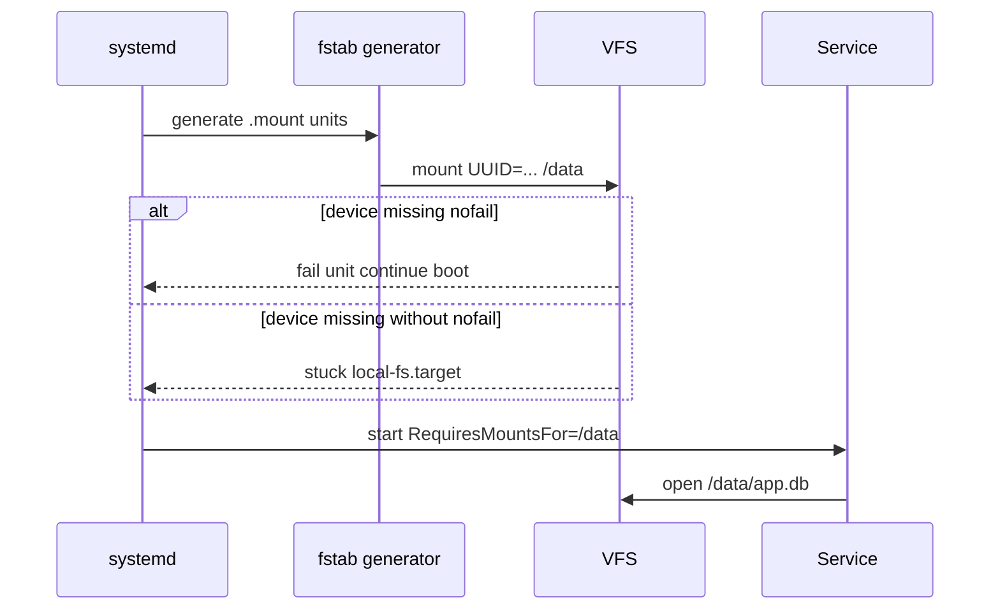

# Block Devices Partitions and Mounts

## Overview

A **block device** exposes storage as fixed-size blocks (typically 512 B or 4 KiB logical sectors) via `/dev/*`. **Partitions** (or LVM logical volumes) carve that device into independently formatable regions. A **mount** binds a filesystem on a block device (or network/pseudo FS) into the single Linux directory tree at a mount point.

Operators live here: wrong `fstab`, missing `nofail`, read-only remounts after unclean shutdown, and Docker/K8s volume mounts that are just bind/mount wrappers over the same kernel VFS.

## Learning Objectives

- Map disk → partition/LVM → filesystem → mount point with `lsblk`/`findmnt`
- Read `/proc/mounts` and `/etc/fstab` as contracts, not folklore
- Choose mount options (`ro`, `noatime`, `nofail`, `x-systemd.*`) for production
- Distinguish bind mounts, tmpfs, and network mounts from local block mounts
- Hand off engine-level page/WAL durability to [[08-Databases/README|Databases]] and image layers to [[14-Docker/README|Docker]]

## Prerequisites

- [[10-Linux/01-Shell-Filesystem-Hierarchy-and-Permissions/Filesystem Hierarchy Standard and Path Semantics|Filesystem Hierarchy Standard and Path Semantics]]
- [[01-Computer-Science/06-IO-and-Persistence/Blocking Nonblocking and Multiplexed IO|Blocking Nonblocking and Multiplexed IO]] — syscall I/O model

## Difficulty

`intermediate`

## Estimated Time

- Reading: 1.5 hours
- Exercises: 1 hour
- Mini project: 2 hours

## History

Unix unified devices and files under one namespace; Linux kept the model and layered LVM, device-mapper (dm), multipath, and systemd `.mount` units. Cloud VMs added NVMe naming instability (`nvme0n1` vs serial), pushing UUID/LABEL-based fstab. Containers reused bind mounts and mount namespaces rather than inventing a new storage API.

## Problem It Solves

| Failure mode | Root cause class |
| --- | --- |
| Boot hangs on missing NFS | fstab without `nofail` / `_netdev` |
| App writes vanish after reboot | Wrote to mount point *before* mount (hidden dir) |
| Disk full on `/` while `/data` empty | Wrong mount / no separate volume |
| Docker volume "empty" | Bind to host path that is itself an unmounted point |
| Device name changed after resize | `/dev/sdX` in fstab instead of UUID |

## Internal Implementation

### Stack from hardware to path



The kernel VFS resolves paths through a mount table; `open("/var/lib/data/x")` does not know which disk until mount lookup succeeds.

### Mount table as kernel state

```text
# findmnt -o TARGET,SOURCE,FSTYPE,OPTIONS /var/lib/pgsql
TARGET         SOURCE           FSTYPE OPTIONS
/var/lib/pgsql /dev/mapper/pg-lv xfs    rw,relatime,attr2,...
```

`/etc/fstab` is the *desired* boot config; `/proc/self/mountinfo` is *actual* runtime state (authoritative during incidents).

## Mermaid Diagrams

### Structure — device naming



### Sequence / Lifecycle — boot mount



## Examples

### Minimal Example — parse mountinfo sketch

```typescript
export type MountRow = {
  mountId: number;
  parentId: number;
  source: string;
  target: string;
  fstype: string;
  options: string[];
};

/** Educational parser for one /proc/self/mountinfo line (simplified). */
export function parseMountInfoLine(line: string): MountRow {
  const [ids, rest] = (() => {
    const parts = line.trim().split(" ");
    return [parts.slice(0, 2), parts] as const;
  })();
  const dash = rest.indexOf("-");
  const target = rest[4]!;
  const opts = rest[5]!.split(",");
  const fstype = rest[dash + 1]!;
  const source = rest[dash + 2]!;
  return {
    mountId: Number(ids[0]),
    parentId: Number(ids[1]),
    source,
    target,
    fstype,
    options: opts,
  };
}

export function findCoveringMount(mounts: MountRow[], path: string): MountRow | undefined {
  return mounts
    .filter((m) => path === m.target || path.startsWith(m.target.endsWith("/") ? m.target : m.target + "/"))
    .sort((a, b) => b.target.length - a.target.length)[0];
}
```

### Production-Shaped Example — fstab contracts

```fstab
# Prefer UUID; separate data volume; tolerate optional cloud disk
UUID=a1b2c3d4-e5f6-7890-abcd-ef1234567890  /               xfs   defaults                    0 1
UUID=11111111-2222-3333-4444-555555555555  /var/lib/pgsql  xfs   noatime,nodev,nosuid        0 2
UUID=aaaaaaaa-bbbb-cccc-dddd-eeeeeeeeeeee  /mnt/ephemeral  ext4  defaults,nofail,x-systemd.device-timeout=10  0 2
server:/export                             /mnt/nfs        nfs   _netdev,nofail,soft,timeo=50  0 0
```

```bash
lsblk -o NAME,SIZE,TYPE,FSTYPE,UUID,MOUNTPOINTS
findmnt --verify   # when available: catch fstab typos before reboot
systemctl list-units --type=mount --state=failed
```

**Handoffs**

| Concern | Home |
| --- | --- |
| Block I/O syscall semantics | [[01-Computer-Science/README\|Computer Science]] |
| WAL / buffer pool vs page cache | [[08-Databases/README\|Databases]] |
| Image layers, volume drivers | [[14-Docker/README\|Docker]] |
| Fleet disk provisioning, IaC | [[16-DevOps/README\|DevOps]] |

## Trade-offs

| Dimension | Separate data mount | Everything on `/` |
| --- | --- | --- |
| Blast radius | Full `/` less likely | One ENOSPC kills OS + apps |
| Resize ops | Grow data LV independently | Risky root resize |
| Complexity | More fstab/LVM | Simpler for labs |
| Container bind mounts | Clear host path contract | Accidental writes into image layers |

### When to Use

- Dedicated volumes for databases, logs, and container runtime storage
- UUID/LABEL fstab on any host that may renumber devices
- `nofail` + systemd timeouts for optional cloud volumes

### When Not to Use

- Exotic multipath without documenting failover in an ADR
- Mounting NFS as the *only* durability path for a primary DB without engine awareness
- Editing `/etc/mtab` (legacy; trust kernel mountinfo)

## Exercises

1. On a lab VM, create a loopback file, partition or mkfs, mount at `/mnt/lab`, write a file, unmount, and show the "hidden directory" problem by writing before remount.
2. Convert an `/dev/sdX` fstab line to UUID using `blkid`.
3. Use `findmnt -T /path` and explain which mount covers a nested bind mount.
4. Sketch LVM: PV → VG → LV → mount for a Postgres data directory.
5. List three mount options that reduce metadata write amplification (`noatime`, etc.) and their correctness risks.

## Mini Project

Build a TypeScript `MountAuditor` that reads a fixture `mountinfo` + `fstab` and reports: devices by-path vs UUID, missing `nofail` on non-critical mounts, and services that would start before their `RequiresMountsFor` path exists.

## Portfolio Project

Add a "storage topology" panel to [[10-Linux/projects/Linux Host Workbench/README|Linux Host Workbench]]: disk → LV → mount → consuming systemd units.

## Interview Questions

1. What is the difference between a block device and a filesystem?
2. Why prefer UUID over `/dev/sda1` in fstab?
3. What happens if a process writes to a mount point directory while the filesystem is unmounted?
4. Explain bind mounts and why containers use them.
5. How do systemd `.mount` units relate to fstab?

### Stretch / Staff-Level

1. Design mount policy for a host running both a stateful DB and ephemeral batch jobs sharing one NVMe—partitioning, mount options, and failure domains.
2. How do you safely migrate `/var/lib/docker` to a new volume with minimal downtime?

## Common Mistakes

- Putting database data on root filesystem "temporarily"
- Forgetting `_netdev` / network-online ordering for NFS
- Assuming `df` on the mount point shows the right FS after a failed mount
- Using `mount -o remount,rw` without fixing the underlying journal/errors cause
- Ignoring `x-systemd.device-timeout` on cloud attach races

## Best Practices

- Inventory with `lsblk -f` and `findmnt` before changes
- Document every non-default mount option in an ADR
- Align systemd `RequiresMountsFor=` with application data paths
- Prefer LVM or cloud volume resize workflows that are rehearsed
- Monitor mount unit failures as first-class alerts

## Summary

Block devices, partitions/LVM, and mounts are the host's storage topology: disks become named devices, get carved and formatted, then attached into the VFS tree. Production discipline means stable identifiers, explicit mount options, and systemd ordering—so apps never silently write into empty mount-point directories or hang the boot on optional disks.

## Further Reading

- `man 5 fstab`, `man 8 mount`, `man 8 lsblk`
- [[10-Linux/04-Filesystems-Disks-and-IO/ext4 and XFS Operational Differences|ext4 and XFS Operational Differences]]
- [[10-Linux/04-Filesystems-Disks-and-IO/Inodes Quotas and ENOSPC Failure Modes|Inodes Quotas and ENOSPC Failure Modes]]
- [[08-Databases/00-Orientation/Files vs Engines vs Services|Files vs Engines vs Services]]

## Related Notes

- [[10-Linux/README|Linux MOC]]
- [[10-Linux/03-Memory-Swap-and-OOM/Page Cache Dirty Writeback and Drop Caches Myths|Page Cache Dirty Writeback and Drop Caches Myths]]
- [[14-Docker/README|Docker]]
- [[16-DevOps/README|DevOps]]

## Progress Checklist

- [ ] Explained from first principles
- [ ] Drew at least one Mermaid diagram
- [ ] Implemented a minimal version
- [ ] Documented trade-offs and non-goals
- [ ] Completed exercises
- [ ] Practiced interview questions aloud
- [ ] Linked prerequisites and dependents
