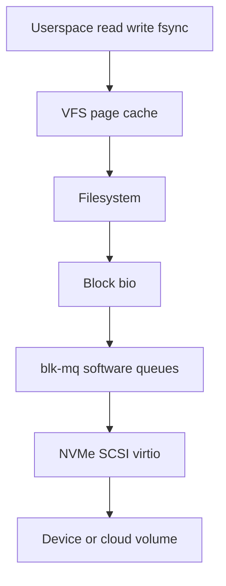
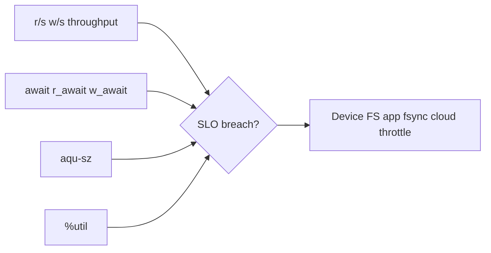
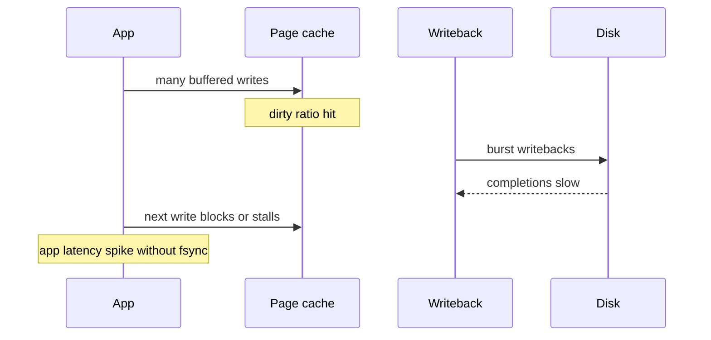

# Disk IO Queuing iostat and Latency

## Overview

Disk performance incidents are rarely "the disk is slow" in one dimension. Linux exposes **queueing** (blk-mq), **scheduler/policy**, **utilization**, **await/r_await/w_await**, and **saturation** signals via `iostat`, `/proc/diskstats`, and `iotop`. Reading them correctly distinguishes device saturation, queue depth collapse, writeback storms, and application-level synchronous fsync storms.

This note is the host operator's latency toolkit for storage—complementing CS latency theory and DB buffer-pool analysis.

## Learning Objectives

- Interpret `iostat -xz` fields: `aqu-sz`, `await`, `%util`, `r/s`, `w/s`
- Explain blk-mq queues vs older CFQ mental models on modern kernels
- Separate throughput limits from latency SLO breaches
- Map symptoms to page cache writeback, fsync, or device saturation
- Hand off multi-service capacity math to System Design; cgroup `io` limits to module 07

## Prerequisites

- [[10-Linux/04-Filesystems-Disks-and-IO/Block Devices Partitions and Mounts|Block Devices Partitions and Mounts]]
- [[01-Computer-Science/07-Networking-Fundamentals/Latency Bandwidth Throughput and Tail Latency|Latency Bandwidth Throughput and Tail Latency]]

## Difficulty

`intermediate`

## Estimated Time

- Reading: 1.5 hours
- Exercises: 1.5 hours
- Mini project: 2 hours

## History

Classic single-queue elevators (CFQ, deadline) gave way to **blk-mq** for multi-queue NVMe. `%util` semantics that meant "device busy" on single-queue HDDs become misleading on highly parallel SSDs—yet on-call culture still quotes them. Cloud block volumes add noisy-neighbor and credit-bucket behavior underneath guest `iostat`.

## Problem It Solves

| Symptom | Misleading reading | Better question |
| --- | --- | --- |
| `%util` ≈ 100% on NVMe | "Disk maxed" | Is latency up? Is `aqu-sz` huge? |
| High `w/s`, low await | Healthy flush | Maybe fine—check app SLO |
| Low util, high await | "Not saturated" | Queueing elsewhere / tiny QD / fsync |
| App p99 up, iostat calm | Blame network | Check NFS, or CPU steal, or lock |

## Internal Implementation

### Request path (simplified)



`iostat` aggregates device-level completions; it does not show filesystem journal latency separately—combine with `perf`, blktrace/eBPF, or app metrics.

### Little's law intuition for disks

\[
L \approx \lambda W
\]

Average queue length ≈ arrival rate × average wait. Rising `aqu-sz` with rising `await` is classic saturation; rising latency with tiny queue may be serial fsync or broken QD.

## Mermaid Diagrams

### Structure — metric families



### Sequence / Lifecycle — writeback storm



## Examples

### Minimal Example — diskstats delta

```typescript
export type DiskStats = {
  name: string;
  reads: number;
  readSectors: number;
  writes: number;
  writeSectors: number;
  ioTicksMs: number; // field 10 in /proc/diskstats (ms spent doing I/Os)
  timeInQueueMs: number; // weighted cumulative
};

export function rates(a: DiskStats, b: DiskStats, dtSec: number) {
  const reads = (b.reads - a.reads) / dtSec;
  const writes = (b.writes - a.writes) / dtSec;
  const readKb = ((b.readSectors - a.readSectors) * 512) / 1024 / dtSec;
  const writeKb = ((b.writeSectors - a.writeSectors) * 512) / 1024 / dtSec;
  const util = ((b.ioTicksMs - a.ioTicksMs) / (dtSec * 1000)) * 100;
  return { reads, writes, readKb, writeKb, utilPct: Math.min(util, 100) };
}

export function classify(awaitMs: number, aquSz: number, utilPct: number): string {
  if (awaitMs > 20 && aquSz > 8) return "saturated-queue";
  if (awaitMs > 20 && aquSz < 2) return "serial-or-shallow-qd";
  if (utilPct > 90 && awaitMs < 5) return "parallel-device-ok-check-app";
  return "nominal-or-ambiguous";
}
```

### Production-Shaped Example — triage commands

```bash
iostat -xz 1
# Focus: r_await/w_await, aqu-sz, rarefy %util on NVMe

pidstat -d 1
iotop -oPa          # who issues IO
cat /sys/block/nvme0n1/queue/scheduler
cat /sys/block/nvme0n1/queue/nr_requests

# cgroup v2 io pressure (when enabled)
cat /sys/fs/cgroup/.../io.stat
```

```typescript
export type IoVerdict = {
  device: string;
  awaitMs: number;
  aquSz: number;
  hypothesis: string;
  nextTool: string;
};

export function triage(v: Omit<IoVerdict, "hypothesis" | "nextTool">): IoVerdict {
  const c = classify(v.awaitMs, v.aquSz, 50);
  if (c === "saturated-queue") {
    return { ...v, hypothesis: c, nextTool: "iotop + check cloud volume credits" };
  }
  if (c === "serial-or-shallow-qd") {
    return { ...v, hypothesis: c, nextTool: "strace fsync / DB sync_commit" };
  }
  return { ...v, hypothesis: c, nextTool: "app RED metrics" };
}
```

**Handoffs**

| Concern | Home |
| --- | --- |
| Latency math, percentiles | [[01-Computer-Science/README\|Computer Science]] |
| WAL group commit vs disk | [[08-Databases/README\|Databases]] |
| Fleet capacity / storage tier | [[09-System-Design/README\|System Design]] |
| `io.max` noisy neighbor | [[10-Linux/07-Cgroups-Namespaces-and-Isolation/cgroup v2 Controllers CPU Memory IO|cgroup v2 Controllers]] |
| Volume provisioning SLOs | [[16-DevOps/README\|DevOps]] |

## Trade-offs

| Dimension | Deep queue / high QD | Shallow / sync heavy |
| --- | --- | --- |
| Throughput | Higher on parallel devices | Lower |
| Latency | Can hide under load then cliff | Predictable but slow commits |
| Diagnosis | Watch aqu-sz + await | Watch fsync rate |
| Cloud disks | May burn credits faster | Under-uses provisioned IOPS |

### When to Use

- `iostat -xz 1` as first disk golden-signal check
- Correlate with application p99 before resizing volumes
- blk-mq / NVMe: treat `%util` as secondary

### When Not to Use

- Tuning elevator myths on NVMe without measuring
- Buying "faster disk" when the issue is synchronous commit storms
- Ignoring that virtio-blk in VMs may batch differently than bare metal

## Exercises

1. Generate sequential write load vs random 4K; capture `iostat` and explain differences.
2. Run a process that `fsync`s every write; compare await vs buffered writers.
3. Parse `/proc/diskstats` twice with your TypeScript rates helper.
4. On a cloud VM, find documentation for burst credits and map to iostat cliffs.
5. Explain why `%util` near 100% on one HDD spindle differs from NVMe.

## Mini Project

Build an `IoTriage` CLI that ingests two `diskstats` snapshots + optional await/aqu-sz and emits hypothesis + next tool (fixture-driven for CI).

## Portfolio Project

Add disk golden signals to [[10-Linux/projects/Observability First-Aid Kit/README|Observability First-Aid Kit]].

## Interview Questions

1. What does `await` measure?
2. Why is `%util` tricky on NVMe?
3. How does Little's law relate to `aqu-sz`?
4. Buffered write storm vs fsync storm—how do iostat patterns differ?
5. Where do IO schedulers still matter in 2020s kernels?

### Stretch / Staff-Level

1. Design a host-level disk SLO (p99 read/write) and alert that avoids flapping on bursty writeback.
2. Explain guest iostat vs hypervisor storage contention—what can you not see?

## Common Mistakes

- Equating 100% util with "need bigger disk" always
- Looking only at `tps` without latency
- Forgetting partition vs whole-disk double counting in some tools
- Tuning `nr_requests` without understanding device/driver limits
- Ignoring cgroup IO throttle as the real queue

## Best Practices

- Always pair device metrics with app latency
- Record baseline iostat for each volume class in the ADR
- Prefer measuring before changing scheduler or QD
- Watch dirty ratios when write latency spikes globally
- Document cloud volume IOPS/throughput caps next to alerts

## Summary

Disk triage is queueing science on the host: rate, latency, queue depth, and (carefully) utilization. `iostat` and `diskstats` tell you whether the device path is saturated, shallow/serial, or falsely calm while apps suffer elsewhere—then you escalate to fsync analysis, cgroups, or cloud volume limits with evidence.

## Further Reading

- `man iostat`, kernel blk-mq docs
- [[10-Linux/04-Filesystems-Disks-and-IO/fsync Durability Contracts for Operators|fsync Durability Contracts for Operators]]
- [[10-Linux/03-Memory-Swap-and-OOM/Page Cache Dirty Writeback and Drop Caches Myths|Page Cache Dirty Writeback and Drop Caches Myths]]

## Related Notes

- [[10-Linux/README|Linux MOC]]
- [[10-Linux/10-Performance-Tuning-and-Kernel-Knobs/Disk and Network Saturation Playbooks|Disk and Network Saturation Playbooks]]
- [[09-System-Design/01-Capacity-Latency-and-Bottlenecks/Bottleneck Finding CPU Memory Disk Network|Bottleneck Finding CPU Memory Disk Network]]

## Progress Checklist

- [ ] Explained from first principles
- [ ] Drew at least one Mermaid diagram
- [ ] Implemented a minimal version
- [ ] Documented trade-offs and non-goals
- [ ] Completed exercises
- [ ] Practiced interview questions aloud
- [ ] Linked prerequisites and dependents
