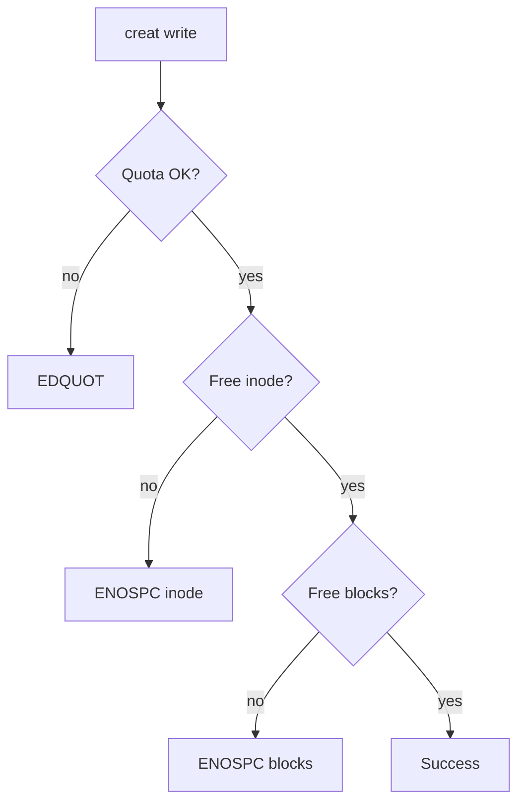
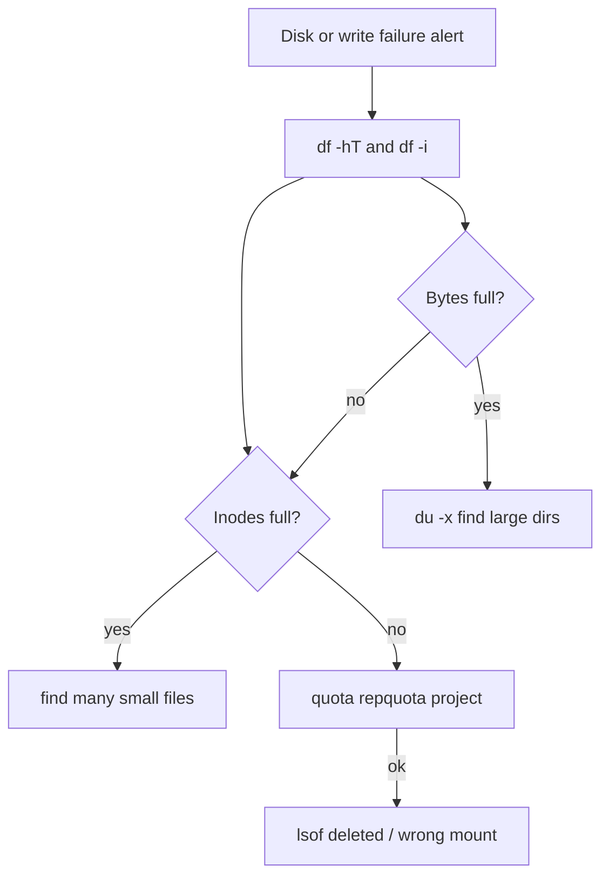
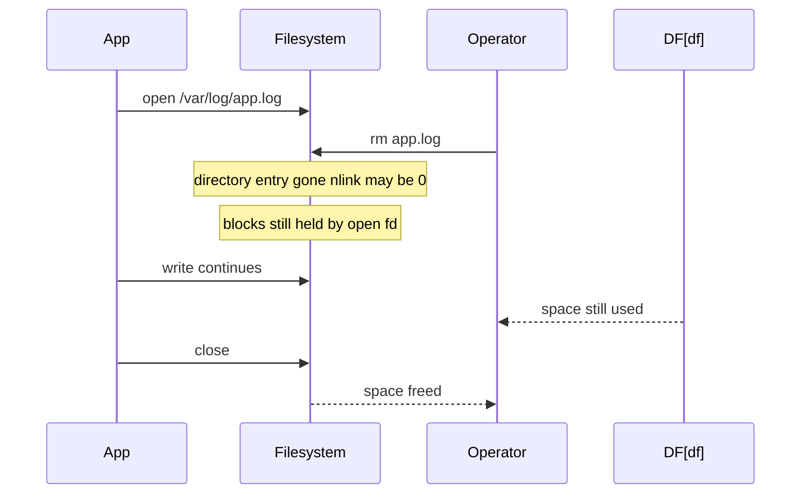

# Inodes Quotas and ENOSPC Failure Modes

## Overview

**ENOSPC** ("No space left on device") is not one failure—it is at least three common host contracts breaking: **byte capacity** (`df`), **inode capacity** (`df -i`), and **quota limits** (user/group/project). Apps often surface the same `errno`, while root cause and remediation diverge completely.

This note trains operators to diagnose which budget broke, find the consumers, and prevent silent mount-point / Docker layer fills from taking down a host.

## Learning Objectives

- Distinguish block-full vs inode-full vs quota-denied ENOSPC
- Use `df`, `df -i`, `du`, `quota`, and find-large-file patterns safely on production
- Explain why deleting open files does not free space until close/unlink completes
- Design monitoring that alerts on inode % as well as byte %
- Hand off container layer growth to Docker; fleet disk policy to DevOps

## Prerequisites

- [[10-Linux/01-Shell-Filesystem-Hierarchy-and-Permissions/Finding Files Inodes and Links|Finding Files Inodes and Links]]
- [[10-Linux/04-Filesystems-Disks-and-IO/Block Devices Partitions and Mounts|Block Devices Partitions and Mounts]]

## Difficulty

`intermediate`

## Estimated Time

- Reading: 1 hour
- Exercises: 1 hour
- Mini project: 2 hours

## History

Unix separated **inode tables** (metadata slots) from data blocks early; tiny-file workloads (mail spools, container image extracts, CI artifact trees) still exhaust inodes while `df` shows free gigabytes. Quotas returned as multi-tenant and container-host controls. Systemd-journald, package caches, and log shippers are modern ENOSPC protagonists.

## Problem It Solves

| errno / symptom | Actual budget |
| --- | --- |
| ENOSPC, `df` 100% | Data blocks |
| ENOSPC, `df -i` 100% | Inodes |
| EDQUOT | Quota soft/hard limit |
| App "disk full", df fine | Wrong filesystem / wrong mount / reserved root blocks |
| Space not freeing after `rm` | File still open (Deleted in `lsof`) |

## Internal Implementation

### Three budgets



ext4 inode count is largely fixed at `mkfs` (with flex_bg caveats); XFS can dynamically allocate inodes—yet you can still exhaust free space for inode/data with millions of tiny files.

### Reserved blocks

Root-reserved percentage on ext4 can make non-root ENOSPC while root still writes—confusing app users running as non-root services.

## Mermaid Diagrams

### Structure — triage decision tree



### Sequence / Lifecycle — deleted but open



## Examples

### Minimal Example — classify ENOSPC

```typescript
export type SpaceBudget = "blocks" | "inodes" | "quota" | "unknown";

export type DfSnapshot = {
  mount: string;
  sizeBytes: number;
  usedBytes: number;
  availBytes: number;
  inodesTotal: number;
  inodesUsed: number;
};

export function classifyEnospc(
  df: DfSnapshot,
  opts?: { quotaExceeded?: boolean },
): SpaceBudget {
  if (opts?.quotaExceeded) return "quota";
  const inodePct = df.inodesUsed / Math.max(df.inodesTotal, 1);
  const bytePct = df.usedBytes / Math.max(df.sizeBytes, 1);
  if (inodePct > 0.95 && df.availBytes > 64 * 1024 * 1024) return "inodes";
  if (bytePct > 0.95 || df.availBytes === 0) return "blocks";
  return "unknown";
}
```

### Production-Shaped Example — incident commands

```bash
df -hT
df -i
du -x -d 1 -h /var | sort -h          # stay on one filesystem (-x)
find /var/lib/docker -xdev -type f | wc -l   # inode suspects (careful on prod)

lsof +L1                               # open deleted files
lsof -nP | grep '(deleted)'

# quotas (when enabled)
repquota -as
xfs_quota -x -c 'report -h' /data
```

```typescript
export type EnospcPlaybook = {
  budget: SpaceBudget;
  immediate: string[];
  lasting: string[];
};

export function playbook(budget: SpaceBudget): EnospcPlaybook {
  switch (budget) {
    case "inodes":
      return {
        budget,
        immediate: ["find tiny-file directories", "clear package/image caches"],
        lasting: ["raise inode ratio at mkfs", "split volume", "change app layout"],
      };
    case "blocks":
      return {
        budget,
        immediate: ["truncate rotate logs", "clear closed deleted via restart"],
        lasting: ["log retention", "separate volumes", "alerts at 70/85%"],
      };
    case "quota":
      return {
        budget,
        immediate: ["identify user/project", "raise or reclaim"],
        lasting: ["quota policy ADR", "per-tenant volumes"],
      };
    default:
      return {
        budget,
        immediate: ["verify mount", "lsof deleted", "check reserved blocks"],
        lasting: ["mount auditor", "service RequiresMountsFor"],
      };
  }
}
```

**Handoffs**

| Concern | Home |
| --- | --- |
| Inode as data structure | [[01-Computer-Science/README\|Computer Science]] / Finding Files note |
| DB tablespace full vs FS full | [[08-Databases/README\|Databases]] |
| Overlay / image GC | [[14-Docker/README\|Docker]] |
| Fleet disk alerts & runbooks | [[16-DevOps/README\|DevOps]] |

## Trade-offs

| Dimension | One big `/` | Split volumes + quotas |
| --- | --- | --- |
| Isolation | Poor blast radius | Contained fills |
| Ops complexity | Simple | More mounts/alerts |
| Inode planning | One mkfs gamble | Per-workload mkfs |
| Multi-tenant | Weak | Project quotas / separate disks |

### When to Use

- Alert on both byte and inode utilization
- Separate `/var/log`, container runtime, and DB data volumes
- Quotas for shared login hosts and build agents

### When Not to Use

- Aggressive `find /` without `-xdev` on huge NFS (latency bomb)
- Deleting files you do not understand in `/var/lib/docker`
- Raising quotas forever instead of fixing retention

## Exercises

1. Fill a small ext4 loop FS with millions of empty files until `df -i` fails while `df -h` shows free space.
2. Demonstrate open-deleted: write, `rm`, watch `df`, then close and recheck.
3. Compare `du` vs `df` discrepancy causes (snapshots, deleted open, reserved).
4. Draft alert thresholds for a CI host that creates many small artifacts.
5. Map three Docker scenarios that present as host ENOSPC.

## Mini Project

TypeScript `EnospcClassifier` consuming fixture `df`/`df -i` JSON and optional quota flags; emit playbook steps. Add unit tests for each branch.

## Portfolio Project

Wire ENOSPC runbook into [[10-Linux/12-Incidents-Runbooks-and-Portfolio/Host Incident Triage Order CPU Mem Disk Net|Host Incident Triage Order]].

## Interview Questions

1. Why can `df` show free space while creates fail?
2. What is EDQUOT vs ENOSPC?
3. Why does restarting a process free disk after log deletion?
4. How do reserved blocks affect non-root services?
5. How do you find which directory consumes inodes?

### Stretch / Staff-Level

1. Design inode-safe layout for a registry mirror host holding millions of blobs/metadata files.
2. How do XFS project quotas interact with container uid mapping?

## Common Mistakes

- Only monitoring byte `%`
- `du` without `-x` crossing mounts into huge trees
- Clearing random Docker dirs instead of documented prune
- Ignoring that root can still write into "full" ext4
- Forgetting journald persistence growth—see module 06

## Best Practices

- Dual metrics: bytes + inodes per mount
- Retention and rotation before bigger disks
- Document reclaim procedures per mount role
- Use `-xdev` in forensic find/du
- Rehearse ENOSPC on staging with chaos fills

## Summary

ENOSPC is a family of exhausted **block**, **inode**, and **quota** budgets plus mount/open-file illusions. Operators who always run `df -h` *and* `df -i`, check quotas, and hunt deleted-open files fix outages that "disk full" tickets alone never explain.

## Further Reading

- `man df`, `man quota`, `man lsof`
- [[10-Linux/04-Filesystems-Disks-and-IO/ext4 and XFS Operational Differences|ext4 and XFS Operational Differences]]
- [[10-Linux/06-systemd-Timers-and-Logging/journald Persistence and Rate Limits|journald Persistence and Rate Limits]]

## Related Notes

- [[10-Linux/README|Linux MOC]]
- [[14-Docker/README|Docker]]
- [[16-DevOps/README|DevOps]]

## Progress Checklist

- [ ] Explained from first principles
- [ ] Drew at least one Mermaid diagram
- [ ] Implemented a minimal version
- [ ] Documented trade-offs and non-goals
- [ ] Completed exercises
- [ ] Practiced interview questions aloud
- [ ] Linked prerequisites and dependents
