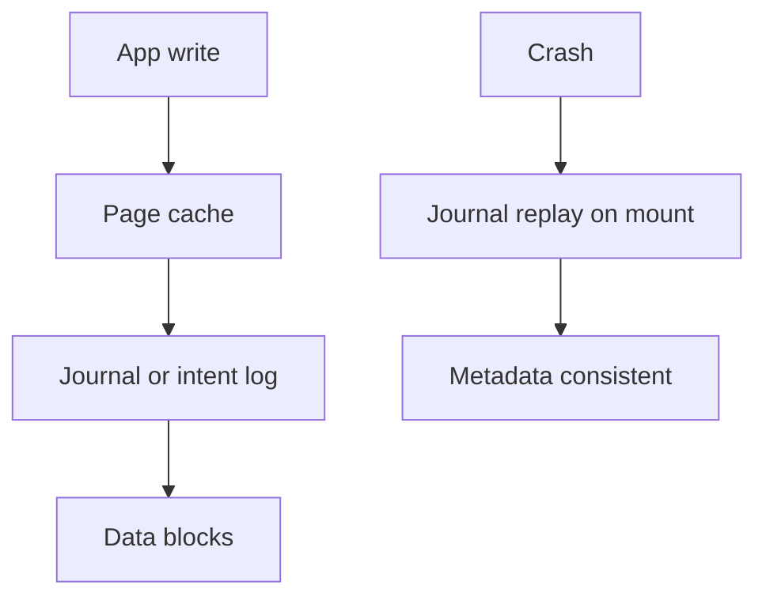
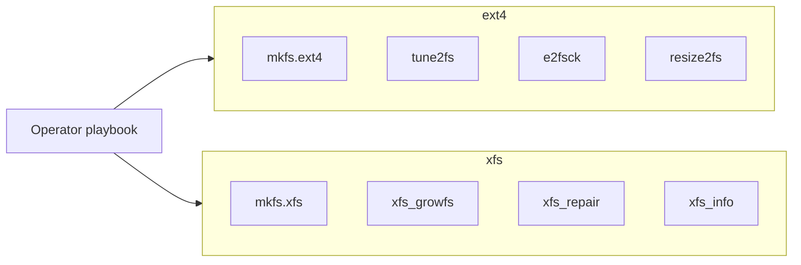
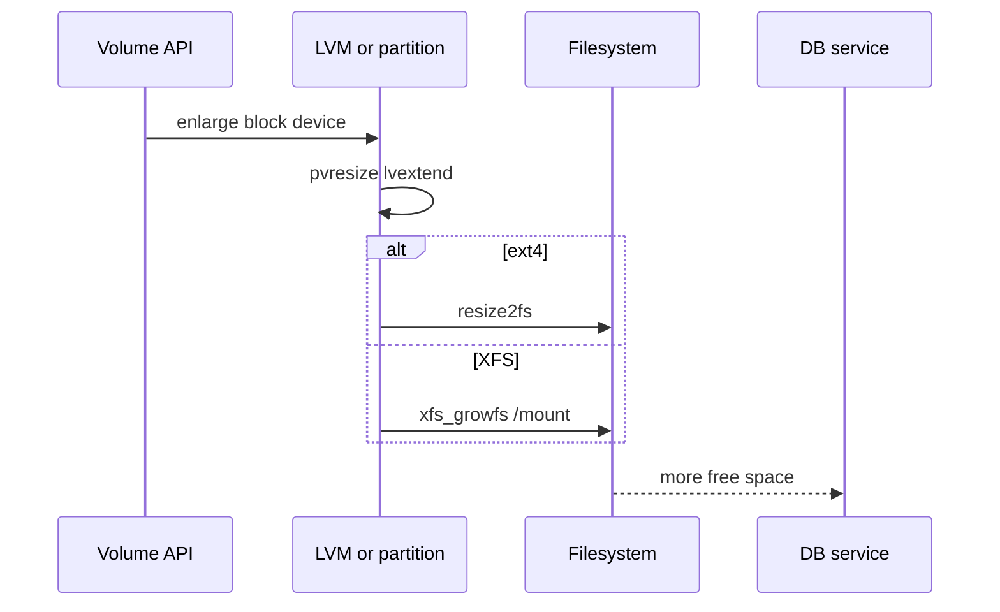

# ext4 and XFS Operational Differences

## Overview

**ext4** and **XFS** are the two dominant Linux local filesystems for general-purpose and large-volume workloads. Both are journaling filesystems with mature tooling, but they differ in allocation strategy, growth/shrink story, `fsck` expectations, sparse-file and reflink behavior, and failure modes under full-disk or metadata pressure.

Operators choose and *operate* them; on-disk B-tree layouts and journaling algorithms belong to kernel/CS depth—here we own mount options, resize playbooks, and when RHEL/Ubuntu defaults matter.

## Learning Objectives

- Contrast ext4 vs XFS on resize, fsck, quotas, and large-file workloads
- Pick mount/mkfs options that match database vs general OS disks
- Explain journal modes and crash recovery expectations for operators
- Recognize filesystem-specific gotchas (XFS `inode64`, ext4 lazy init, reflink)
- Hand off page-cache/WAL durability depth to Databases; FS *inside* images to Docker

## Prerequisites

- [[10-Linux/04-Filesystems-Disks-and-IO/Block Devices Partitions and Mounts|Block Devices Partitions and Mounts]]

## Difficulty

`intermediate`

## Estimated Time

- Reading: 1.5 hours
- Exercises: 1 hour
- Mini project: 2 hours

## History

ext family evolved from ext2/3 into ext4 (extents, delayed allocation). XFS originated at SGI for large filesystems and parallel I/O; Linux adopted it as the default on RHEL 7+ for many data volumes. Cloud images often ship root as ext4 or XFS depending on distro—mixed fleets force dual operational literacy.

## Problem It Solves

| Question | ext4 tendency | XFS tendency |
| --- | --- | --- |
| Default root FS (varies by distro) | Common on Debian/Ubuntu | Common on RHEL family |
| Online grow | Yes | Yes |
| Online shrink | Possible (careful) | Not supported—backup/restore |
| Very large FS / many files | Fine | Historically stronger at scale |
| Metadata dump/repair | `e2fsck` | `xfs_repair` (unmount; different UX) |
| Reflink / CoW clones | Limited / experimental by era | Mature `cp --reflink` on modern XFS |

## Internal Implementation

### Shared journal idea (operator view)



Both aim for **metadata consistency** after crash; **data=ordered/writeback/journal** (ext4) and XFS log behavior change whether file *contents* match what apps expected—see [[10-Linux/04-Filesystems-Disks-and-IO/fsync Durability Contracts for Operators|fsync Durability Contracts for Operators]].

### Allocator intuition

- **ext4**: block groups, flexible for mixed small files; delayed allocation coalesces.
- **XFS**: allocation groups (AGs) enable parallel allocation; shines with large sequential files and high concurrency metadata ops when sized well.

## Mermaid Diagrams

### Structure — ops tooling



### Sequence / Lifecycle — online grow data volume



## Examples

### Minimal Example — FS capability matrix sketch

```typescript
export type LocalFs = "ext4" | "xfs";

export type FsOpsProfile = {
  onlineGrow: boolean;
  onlineShrink: boolean;
  repairTool: string;
  growTool: string;
  reflinkCommon: boolean;
};

export const FS_OPS: Record<LocalFs, FsOpsProfile> = {
  ext4: {
    onlineGrow: true,
    onlineShrink: true, // offline/online with caveats—never casual on prod root
    repairTool: "e2fsck",
    growTool: "resize2fs",
    reflinkCommon: false,
  },
  xfs: {
    onlineGrow: true,
    onlineShrink: false,
    repairTool: "xfs_repair",
    growTool: "xfs_growfs",
    reflinkCommon: true,
  },
};

export function pickFs(opts: {
  mustShrinkInPlace: boolean;
  wantReflink: boolean;
}): LocalFs {
  if (opts.mustShrinkInPlace) return "ext4";
  if (opts.wantReflink) return "xfs";
  return "xfs"; // modern default for large data vols in many fleets
}
```

### Production-Shaped Example — mkfs and mount notes

```bash
# XFS data volume for Postgres (example—align with vendor guidance)
mkfs.xfs -f -L pgdata /dev/vg/pgdata
mount -o noatime /dev/vg/pgdata /var/lib/pgsql

# ext4 when you need shrink path or distro root conventions
mkfs.ext4 -L varlog /dev/vg/varlog
tune2fs -c 0 -i 0 /dev/vg/varlog   # disable forced fsck intervals when using monitoring instead
```

```typescript
export type MountAdvice = {
  fstype: LocalFs;
  options: string[];
  rationale: string;
};

export const DB_DATA_MOUNT: MountAdvice = {
  fstype: "xfs",
  options: ["noatime", "nodev", "nosuid"],
  rationale: "Large files, grow-only volumes, reduce atime metadata writes",
};
```

**Handoffs**

| Concern | Home |
| --- | --- |
| Extent trees / journaling algorithms | [[01-Computer-Science/README\|Computer Science]] |
| DB `data=` / `fsync` / double-write | [[08-Databases/README\|Databases]] |
| OverlayFS + image layers | [[14-Docker/README\|Docker]] |
| Golden image FS choice fleet-wide | [[16-DevOps/README\|DevOps]] |

## Trade-offs

| Dimension | Prefer XFS | Prefer ext4 |
| --- | --- | --- |
| Large sequential + grow-only | Strong default | Also fine |
| Must shrink filesystem | Avoid | Possible with care |
| Repair under pressure | `xfs_repair` discipline | Familiar `e2fsck` |
| Distro root defaults | RHEL-like | Debian/Ubuntu-like |
| Reflink clones | Natural fit | Check kernel/features |

### When to Use

- XFS for dedicated DB/log/container-thin-pool data disks that only grow
- ext4 when organizational playbooks and root FS already standardize on it
- Match vendor guidance (e.g., some storage appliances document one FS)

### When Not to Use

- Mixing undocumented experimental features (new encrypt, rare mount flags) without ADR
- Shrinking *any* production filesystem without backup—even if the tool allows it
- Assuming "XFS is always faster" without measuring the workload

## Exercises

1. Create two loopback filesystems (ext4 and XFS), fill with many small files vs few large files, compare `df -i` and create latency.
2. Grow each online after `lvextend`; document exact commands.
3. Attempt (on disposable lab) XFS shrink path—document why backup/mkfs/restore is required.
4. Read `xfs_info` / `tune2fs -l` and explain three fields relevant to ops.
5. Research whether your cloud DB AMI uses XFS or ext4 for data—and why.

## Mini Project

TypeScript CLI: given `fstype` + intent (`grow`, `shrink`, `repair`, `clone-file`), emit the safe command sequence or refuse with reason (using `FS_OPS` above).

## Portfolio Project

Document FS choice ADRs in [[10-Linux/projects/Linux Host Workbench/README|Linux Host Workbench]] for root, postgres, and container runtime volumes.

## Interview Questions

1. Can you shrink XFS online? What do you do instead?
2. Difference between `resize2fs` and `xfs_growfs` invocation?
3. What does a journal guarantee after crash for metadata vs data?
4. When would reflink matter operationally?
5. Why might RHEL default XFS while Ubuntu defaults ext4 on root?

### Stretch / Staff-Level

1. Write a fleet migration plan from ext4 data volumes to XFS with checksum verification and rollback.
2. How do AG count / block size choices at `mkfs.xfs` time become irreversible operational debt?

## Common Mistakes

- Running `xfs_repair` on a mounted filesystem
- Forcing periodic `fsck` on huge volumes that delay boot for hours
- Using `discard`/fstrim carelessly on busy cloud disks without measuring
- Copying mount options between ext4 and XFS blindly
- Ignoring project quotas differences when enforcing tenant limits

## Best Practices

- Record `mkfs` command lines in the host ADR
- Prefer grow-only capacity planning for XFS data volumes
- Align FS choice with backup/repair runbooks your on-call knows
- Test repair tools on fixtures *before* the incident
- Cross-check database vendor FS recommendations

## Summary

ext4 and XFS are both production-ready; the operational differences that bite are **shrinkability**, **repair tooling**, **scale defaults**, and **feature surface** (reflink, quotas). Choose deliberately per volume role, document `mkfs`/mount options, and keep durability semantics in the fsync note and Databases track—not as filesystem brand loyalty.

## Further Reading

- `man mkfs.ext4`, `man mkfs.xfs`, `man xfs_growfs`
- [[10-Linux/04-Filesystems-Disks-and-IO/Disk IO Queuing iostat and Latency|Disk IO Queuing iostat and Latency]]
- [[10-Linux/04-Filesystems-Disks-and-IO/fsync Durability Contracts for Operators|fsync Durability Contracts for Operators]]

## Related Notes

- [[10-Linux/README|Linux MOC]]
- [[08-Databases/02-WAL-Durability-and-Recovery/fsync Group Commit and Durability Levels|fsync Group Commit and Durability Levels]]
- [[14-Docker/README|Docker]]

## Progress Checklist

- [ ] Explained from first principles
- [ ] Drew at least one Mermaid diagram
- [ ] Implemented a minimal version
- [ ] Documented trade-offs and non-goals
- [ ] Completed exercises
- [ ] Practiced interview questions aloud
- [ ] Linked prerequisites and dependents
