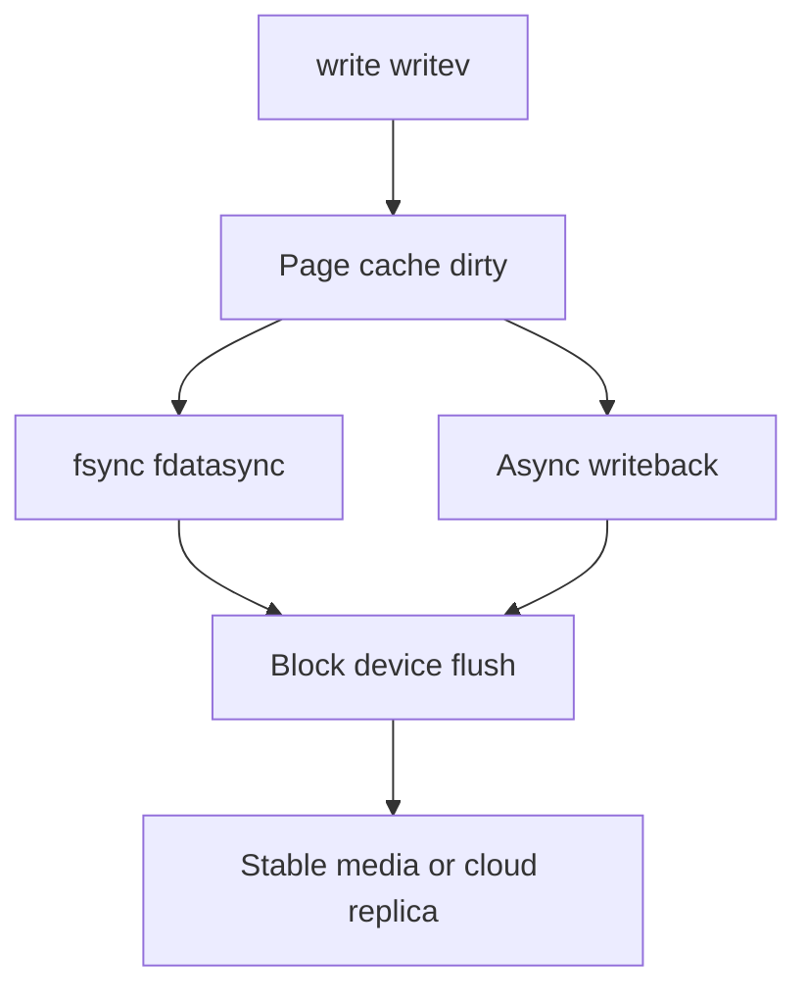
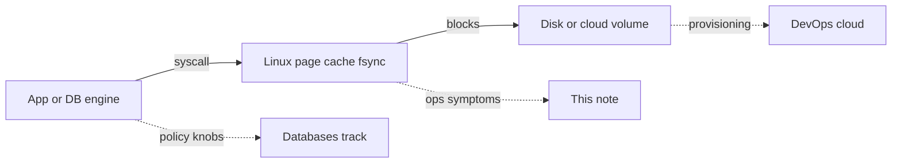
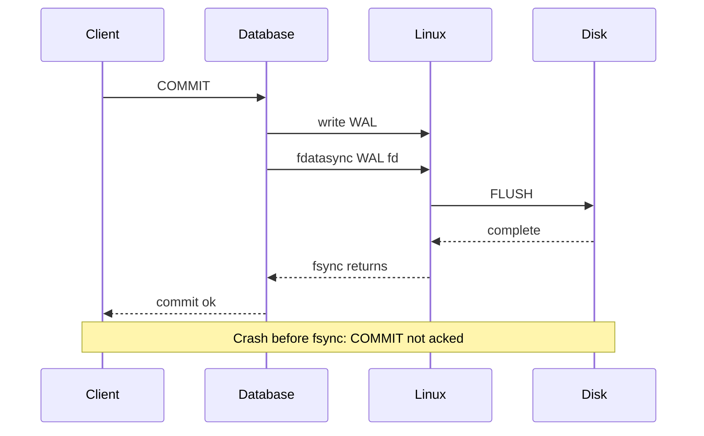

# fsync Durability Contracts for Operators

## Overview

**`fsync` / `fdatasync`** flush dirty file data (and with `fsync`, enough metadata) so that a successful return means the kernel believes the bytes hit stable storage—*under the storage stack's honesty*. Operators must connect app "commit" latency, iostat write storms, and database durability knobs to this syscall contract—without confusing page-cache acknowledgment with durability.

This Linux note owns **host semantics and symptoms**; deep WAL group-commit policy lives in [[08-Databases/README|Databases]].

## Learning Objectives

- State what `write()` vs `fsync()` vs `fdatasync()` vs `O_SYNC` guarantee
- Explain why fsync latency clusters dominate DB commit p99 on local disks
- Recognize lying disks, battery-backed caches, and cloud volume "durable" claims
- Relate dirty ratios and writeback to non-fsync stalls
- Hand off engine `synchronous_commit` to Databases; image ephemeral storage to Docker

## Prerequisites

- [[10-Linux/04-Filesystems-Disks-and-IO/Disk IO Queuing iostat and Latency|Disk IO Queuing iostat and Latency]]
- [[10-Linux/03-Memory-Swap-and-OOM/Page Cache Dirty Writeback and Drop Caches Myths|Page Cache Dirty Writeback and Drop Caches Myths]]
- [[08-Databases/02-WAL-Durability-and-Recovery/fsync Group Commit and Durability Levels|fsync Group Commit and Durability Levels]]

## Difficulty

`advanced`

## Estimated Time

- Reading: 1.5 hours
- Exercises: 1.5 hours
- Mini project: 3 hours

## History

Berkeley DB, Postgres, and MySQL taught the industry that "write returned" ≠ durable. Hardware write caches with volatile power made `fsync` a negotiation with firmware. Linux added `fdatasync`, range fsyncs, and finer dirty accounting; cloud block storage rebranded the same problem as replication and IO credits.

## Problem It Solves

| Belief | Reality |
| --- | --- |
| `write()` persisted | Data may sit in page cache |
| Process exit implies flush | Not for all dirty pages of shared files |
| `fsync` always safe on crash | Requires truthful device / barrier behavior |
| High w/s means durable | Buffered writeback ≠ fsync |
| Docker volume = durable | Depends on host mount and volume driver |

## Internal Implementation

### Contract ladder



- **`fdatasync`**: flush file data; may skip some metadata (e.g., mtime) depending on needs.
- **`fsync`**: data + metadata required for retrieval.
- **`O_SYNC` / `O_DSYNC`**: per-write synchronous semantics (often slower API shape).

### Directory durability

Creating a file durably often requires fsyncing the **directory** entry as well as the file—databases and careful apps document rename+fsync patterns (create temp → fsync → rename → fsync dir).

## Mermaid Diagrams

### Structure — ownership boundaries



### Sequence / Lifecycle — commit ack



## Examples

### Minimal Example — unsafe vs durable append

```typescript
import { openSync, writeSync, fsyncSync, fdatasyncSync, closeSync } from "node:fs";

export function appendUnsafe(path: string, line: string) {
  const fd = openSync(path, "a");
  writeSync(fd, line);
  closeSync(fd); // close does not guarantee durability of data
}

export function appendDurable(path: string, line: string, mode: "fsync" | "fdatasync" = "fdatasync") {
  const fd = openSync(path, "a");
  writeSync(fd, line);
  if (mode === "fsync") fsyncSync(fd);
  else fdatasyncSync(fd);
  closeSync(fd);
}
```

### Production-Shaped Example — operator checklist

```typescript
export type DurabilityIncident = {
  appCommitP99Ms: number;
  iostatWawaitMs: number;
  fsyncPerSecEstimate: number;
  dirtyBytes: number;
};

export function hypothesize(d: DurabilityIncident): string[] {
  const out: string[] = [];
  if (d.fsyncPerSecEstimate > 500 && d.appCommitP99Ms > 20) {
    out.push("fsync storm—check group commit / batching / sync_commit");
  }
  if (d.dirtyBytes > 1_000_000_000 && d.iostatWawaitMs > 50) {
    out.push("writeback pressure—dirty ratios or slow volume");
  }
  if (d.appCommitP99Ms > 100 && d.iostatWawaitMs < 5) {
    out.push("latency elsewhere—locks, CPU, network sync replica");
  }
  return out.length ? out : ["correlate with blktrace/perf and DB wait events"];
}
```

```bash
# Observe fsync-ish behavior (educational; prefer app metrics in prod)
perf trace -e syscalls:sys_enter_fsync,syscalls:sys_enter_fdatasync
# or strace -e fsync,fdatasync -p <pid>  (high overhead)

# Postgres / MySQL: use engine wait events first
# Host: iostat -xz 1 during commit benchmark
```

**Handoffs**

| Concern | Home |
| --- | --- |
| Syscall / caching theory | [[01-Computer-Science/README\|Computer Science]] |
| `synchronous_commit`, group commit | [[08-Databases/README\|Databases]] |
| Ephemeral vs persistent volumes | [[14-Docker/README\|Docker]] |
| Volume replication / IOPS SKUs | [[16-DevOps/README\|DevOps]] / cloud tracks |

## Trade-offs

| Dimension | Every write fsync | Grouped / relaxed |
| --- | --- | --- |
| RPO | Minimal on truthful disk | Window of loss |
| Latency | High p99 | Lower |
| Device wear / credits | Higher | Lower |
| Code complexity | Simple | Needs batching |

### When to Use

- Ledger/WAL paths with explicit fsync and measured commit SLO
- Operator runbooks that pair DB durability settings with disk class
- Chaos tests: kill -9 and power-loss simulations on lab hardware

### When Not to Use

- `drop_caches` as a durability or performance strategy
- Disabling barriers / lying about cache flush for benchmarks
- Assuming container bind-mount to laptop Docker Desktop equals production fsync

## Exercises

1. Benchmark appendUnsafe vs appendDurable on local SSD; plot latency histograms.
2. Crash a toy WAL (kill -9) with and without fsync; show lost records.
3. Correlate Postgres `synchronous_commit=on/off` with host `fdatasync` rate.
4. Explain why fsyncing a file may still lose the directory entry without dir fsync.
5. Read your cloud volume docs for "what fsync means" under their replication.

## Mini Project

Implement a toy group-commit queue in TypeScript: multiple writers await one flusher that calls `fdatasync` once per batch; measure batch size vs latency (fixture with injected flush delay).

## Portfolio Project

Add a durability matrix panel to [[10-Linux/projects/Linux Host Workbench/README|Linux Host Workbench]] linking host disk class ↔ DB knobs ↔ measured fsync latency.

## Interview Questions

1. What does a successful `fsync` guarantee?
2. `fsync` vs `fdatasync`?
3. Why can writeback cause stalls even without fsync?
4. How does group commit interact with fsync?
5. Name two ways storage can "lie" about durability.

### Stretch / Staff-Level

1. Design an ADR for moving a payment DB from local NVMe RAID to network-attached block—fsync latency, RPO, and failure domains.
2. How do you detect firmware write-cache issues in a fleet?

## Common Mistakes

- Equating `fflush` (stdio) with `fsync`
- Believing process crash always loses only un-fsynced data *and* that disks are honest
- Tuning DB to sync off to "fix" disk latency permanently
- Ignoring directory entry durability for create/replace
- Using tmpfs for "performance" on data that must survive reboot

## Best Practices

- Measure fsync latency as a first-class SLO for stateful hosts
- Keep Databases-track knobs and Linux disk class documented together
- Prefer engine metrics over blanket `strace` in production
- Test crash recovery, not only happy-path TPS
- Treat cloud volume SKUs as part of the durability contract

## Summary

`fsync` is the host durability handshake between applications and storage. Operators connect commit latency and iostat patterns to that handshake, stay humble about device honesty, and leave WAL policy details to Databases—while ensuring mounts, volume drivers, and disk classes actually support the contract apps believe they bought.

## Further Reading

- `man 2 fsync`, `man 2 fdatasync`
- [[08-Databases/02-WAL-Durability-and-Recovery/fsync Group Commit and Durability Levels|fsync Group Commit and Durability Levels]]
- [[10-Linux/04-Filesystems-Disks-and-IO/Disk IO Queuing iostat and Latency|Disk IO Queuing iostat and Latency]]

## Related Notes

- [[10-Linux/README|Linux MOC]]
- [[08-Databases/README|Databases]]
- [[14-Docker/README|Docker]]
- [[16-DevOps/README|DevOps]]

## Progress Checklist

- [ ] Explained from first principles
- [ ] Drew at least one Mermaid diagram
- [ ] Implemented a minimal version
- [ ] Documented trade-offs and non-goals
- [ ] Completed exercises
- [ ] Practiced interview questions aloud
- [ ] Linked prerequisites and dependents
