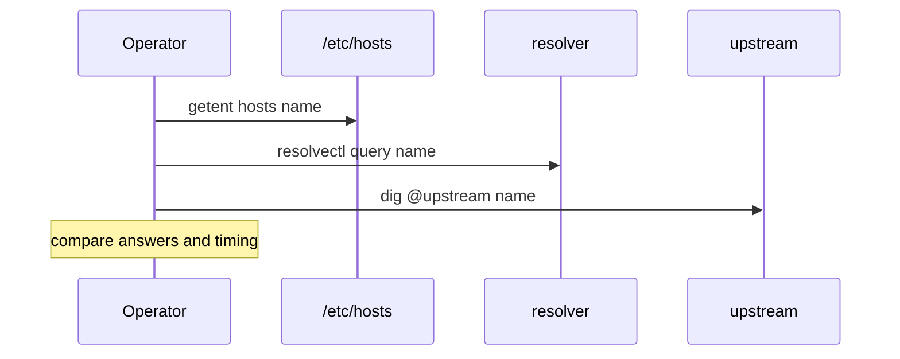

# DNS Resolvers and nsswitch Ops

## Overview

Name resolution on Linux is a **pipeline**: NSS (`nsswitch.conf`) chooses sources (files, DNS, mDNS, …); DNS clients consult **`resolv.conf`** (often managed by **systemd-resolved**, NetworkManager, or cloud-init); glibc `getaddrinfo` applies ordering (Happy Eyeballs, `gai.conf`). Outages labeled "network down" are frequently "resolver timeout" or "wrong search domain."

This note owns host resolver ops. Protocol DNS deep-dives stay in CS; service discovery product patterns in System Design; CoreDNS in Kubernetes.

## Learning Objectives

- Trace a hostname lookup through nsswitch → resolver → response
- Debug `resolv.conf`, stub resolvers, and search/ndots traps
- Distinguish /etc/hosts overrides from DNS answers
- Explain systemd-resolved stub (`127.0.0.53`) vs upstream
- Hand off cluster DNS to Kubernetes; app caching to Node/Backend

## Prerequisites

- [[10-Linux/05-Networking-Stack-and-Host-Firewall/Interfaces Addressing and Routing Tables|Interfaces Addressing and Routing Tables]]

## Difficulty

`intermediate`

## Estimated Time

- Reading: 1 hour
- Exercises: 1 hour
- Mini project: 2 hours

## History

`/etc/resolv.conf` was once hand-edited. DHCP, VPNs, and containers fight over it. systemd-resolved introduced a local stub and per-link DNS. Alpine/musl and glibc differ slightly—fleet diversity matters. Kubernetes injected `ndots:5` search domains and created a generation of latency incidents.

## Problem It Solves

| Symptom | Resolver cause |
| --- | --- |
| 5s delays on short names | search domains / ndots |
| Works with IP not hostname | DNS or NSS failure |
| Intermittent NXDOMAIN | Split DNS / wrong upstream |
| VPN breaks corp DNS | resolv.conf overwritten |
| Container differs from host | Embedded resolv in netns |

## Internal Implementation

### Lookup pipeline

```mermaid
flowchart TD
    App[getaddrinfo] --> NSS[nsswitch hosts]
    NSS --> Files[/etc/hosts]
    NSS --> DNS[DNS module]
    DNS --> Resolv[resolv.conf or resolved]
    Resolv --> Up[Upstream resolvers]
    Up --> Ans[Answers TTL]
```

### ndots and search

If a name has fewer dots than `ndots`, resolvers may try search domains first—multiplying queries and latency (classic K8s issue).

## Mermaid Diagrams

### Structure — who owns resolv.conf

```mermaid
flowchart LR
    CloudInit[cloud-init] --> Resolv[/etc/resolv.conf]
    NM[NetworkManager] --> Resolv
    Resolved[systemd-resolved] --> Stub[127.0.0.53]
    Stub --> Resolv
    Docker[Docker embedded DNS] --> Cont[container resolv.conf]
```

### Sequence / Lifecycle — debug order



## Examples

### Minimal Example — ndots cost model

```typescript
export function queryCandidates(name: string, search: string[], ndots: number): string[] {
  const dotCount = (name.match(/\./g) ?? []).length;
  if (name.endsWith(".")) return [name.slice(0, -1)]; // FQDN absolute
  if (dotCount >= ndots) return [name, ...search.map((s) => `${name}.${s}`)];
  return [...search.map((s) => `${name}.${s}`), name];
}

// Kubernetes-like: ndots=5, search=default.svc.cluster.local svc.cluster.local cluster.local
export const K8S_SEARCH = ["default.svc.cluster.local", "svc.cluster.local", "cluster.local"];
```

### Production-Shaped Example — commands

```bash
getent hosts api.internal
cat /etc/nsswitch.conf | grep hosts
cat /etc/resolv.conf
resolvectl status          # when systemd-resolved
resolvectl query api.internal

dig +short api.internal
dig @8.8.8.8 api.internal  # compare path

# timings
time getent hosts something-short
```

```typescript
export type ResolverConfig = {
  nameservers: string[];
  search: string[];
  ndots: number;
  timeoutSec: number;
  attempts: number;
};

export function worstCaseLookups(cfg: ResolverConfig, name: string): number {
  return queryCandidates(name, cfg.search, cfg.ndots).length * cfg.attempts;
}

export function latencyBudgetMs(cfg: ResolverConfig, name: string): number {
  return worstCaseLookups(cfg, name) * cfg.timeoutSec * 1000;
}
```

**Handoffs**

| Concern | Home |
| --- | --- |
| DNS protocol, caching theory | [[01-Computer-Science/README\|Computer Science]] |
| Happy Eyeballs in Node | [[06-NodeJS/05-Networking/DNS Lookup Caching and Happy Eyeballs Concepts\|DNS Lookup Caching and Happy Eyeballs Concepts]] |
| Service discovery topologies | [[09-System-Design/README\|System Design]] |
| Docker embedded DNS | [[14-Docker/README\|Docker]] |
| CoreDNS / ndots | [[15-Kubernetes/README\|Kubernetes]] |

## Trade-offs

| Dimension | Local stub resolved | Direct upstream in resolv.conf |
| --- | --- | --- |
| Caching / split DNS | Strong | Manual |
| Debuggability | Extra hop | Simpler path |
| VPN friendliness | Per-link DNS | Easy to clobber |
| Containers | Often separate | Must inject carefully |

### When to Use

- `getent` before `dig` to see what *apps* see (NSS)
- Absolute FQDNs with trailing dot in critical configs when search is hostile
- Explicit resolvers for CI images baked into golden config

### When Not to Use

- Hand-editing resolv.conf on NM/resolved hosts without disabling management
- Pointing prod at public DNS for private names
- Infinite negative caching assumptions

## Exercises

1. Compute `queryCandidates` for `api` vs `api.prod.example.com` with ndots 1 vs 5.
2. Break search domains on a lab VM and measure `getent` latency.
3. Compare `dig` vs `getent` when `/etc/hosts` overrides.
4. Inspect a container's `/etc/resolv.conf` vs host.
5. Read `gai.conf` / Happy Eyeballs behavior for dual-stack hosts.

## Mini Project

TypeScript `ResolverRisk` CLI: parse fixture resolv.conf + nsswitch, estimate worst-case query count and flag ndots>1 with long search lists.

## Portfolio Project

DNS chapter in [[10-Linux/projects/Host Network Triage Toolkit/README|Host Network Triage Toolkit]].

## Interview Questions

1. What does nsswitch control?
2. Why can `dig` succeed while an app fails?
3. What is `ndots`?
4. What listens on `127.0.0.53`?
5. How do search domains cause latency?

### Stretch / Staff-Level

1. Design split-DNS for laptop VPN users without resolv.conf flapping.
2. Set a fleet standard for short-name usage vs FQDN-only.

## Common Mistakes

- Debugging only with `ping` (ICMP may be blocked; also bypasses some app paths)
- Ignoring IPv6 AAAA delays
- Committing corporate DNS into public images
- Assuming TTL is always honored by every libc/cache
- Forgetting hosts file leftovers after migrations

## Best Practices

- Prefer FQDNs in production configs
- Monitor resolver latency as a dependency SLO
- Document who manages resolv.conf on each image family
- Use `getent` + `resolvectl`/`dig` together
- Treat DNS failures as first-class in incident order

## Summary

Host DNS is NSS plus resolver configuration, often mediated by systemd-resolved or cloud agents. Operators who understand search/ndots, stub vs upstream, and `getent` vs `dig` fix "network" tickets that were never routing problems—and know when to hand off to Kubernetes CoreDNS or app-level caching.

## Further Reading

- `man resolv.conf`, `man nsswitch.conf`, `man resolvectl`
- [[10-Linux/05-Networking-Stack-and-Host-Firewall/Packet Capture tcpdump and Wireshark Triage|Packet Capture tcpdump and Wireshark Triage]]
- [[15-Kubernetes/README|Kubernetes]]

## Related Notes

- [[10-Linux/README|Linux MOC]]
- [[06-NodeJS/05-Networking/DNS Lookup Caching and Happy Eyeballs Concepts|DNS Lookup Caching and Happy Eyeballs Concepts]]
- [[14-Docker/README|Docker]]

## Progress Checklist

- [ ] Explained from first principles
- [ ] Drew at least one Mermaid diagram
- [ ] Implemented a minimal version
- [ ] Documented trade-offs and non-goals
- [ ] Completed exercises
- [ ] Practiced interview questions aloud
- [ ] Linked prerequisites and dependents
