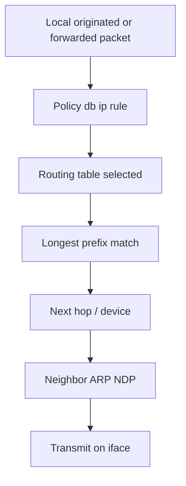
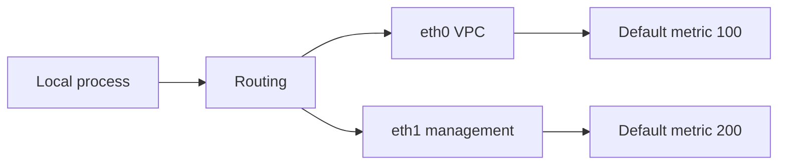
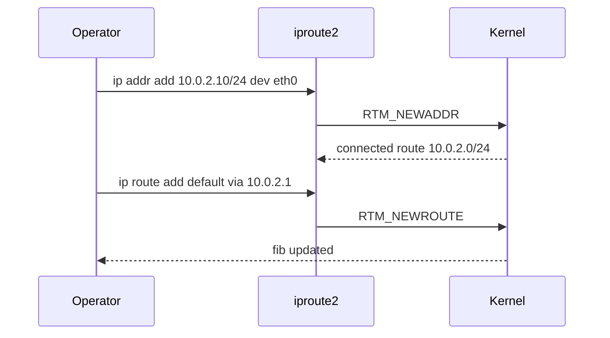

# Interfaces Addressing and Routing Tables

## Overview

Linux networking starts with **interfaces** (physical, VLAN, bond, bridge, veth), **addresses** (IPv4/IPv6, secondary, link-local), and **routing tables** that decide the next hop for each packet. The modern operator surface is **iproute2** (`ip link`, `ip addr`, `ip route`, `ip rule`) plus NetworkManager/systemd-networkd on many distros.

This note owns host L2/L3 plumbing. TCP state and firewalls come next; protocol theory stays in CS; container CNI/bridges hand off to Docker/Kubernetes; fleet BGP/DNS steering to System Design/DevOps.

## Learning Objectives

- Read and modify interface state with `ip` without relying on deprecated `ifconfig`
- Explain connected routes, default routes, and policy routing (`ip rule`)
- Diagnose "no route to host", wrong source address, and asymmetric paths
- Map cloud metadata routes (IMDS) and VPC route tables to guest `ip route`
- Hand off CNI/veth pairs to Docker; multi-region traffic policy to System Design

## Prerequisites

- [[01-Computer-Science/07-Networking-Fundamentals/Layered Network Models|Layered Network Models]]
- [[10-Linux/README|Linux MOC]] orientation boundaries

## Difficulty

`intermediate`

## Estimated Time

- Reading: 1.5 hours
- Exercises: 1 hour
- Mini project: 2 hours

## History

`ifconfig`/`route` from net-tools froze while the kernel grew VRFs, multiple tables, and netns. iproute2 became the standard. Cloud and containers multiplied interfaces per host (dozens of veths), making `ip -br` and namespace-aware tooling mandatory.

## Problem It Solves

| Symptom | Typical host cause |
| --- | --- |
| Cannot reach internet | Missing default route / wrong GW |
| Reachable from A not B | Policy routing / source address selection |
| Intermittent after failover | Stale neighbor / bonding / GW ARP |
| Container no egress | Bridge/NAT/ns wrong—not always "app bug" |
| Dual-homed host breaks | Multiple defaults without metrics/rules |

## Internal Implementation

### Packet egress decision (simplified)



### Interface kinds operators meet

| Kind | Role |
| --- | --- |
| `eth0`/`ens*`/`enp*` | Physical/virt NIC |
| `lo` | Loopback |
| `bond0` | LACP/failover aggregate |
| `br0` | L2 bridge (VMs/containers) |
| `veth*` | Netns pair endpoint |
| `vlan` | 802.1Q subinterface |
| `wg0`/`tun` | Overlay/VPN |

## Mermaid Diagrams

### Structure — dual-homed host



### Sequence / Lifecycle — add address and route



## Examples

### Minimal Example — route lookup sketch

```typescript
export type Route = {
  dstCidr: string; // e.g. "0.0.0.0/0" or "10.0.2.0/24"
  prefix: number;
  gateway?: string;
  dev: string;
  metric: number;
  table: number;
};

export function parseCidr(cidr: string): { ip: number; prefix: number } {
  const [a, p] = cidr.split("/");
  const parts = a!.split(".").map(Number);
  const ip = ((parts[0]! << 24) | (parts[1]! << 16) | (parts[2]! << 8) | parts[3]!) >>> 0;
  return { ip, prefix: Number(p) };
}

export function matchPrefix(ip: number, route: Route): boolean {
  const { ip: net, prefix } = parseCidr(route.dstCidr.includes("/") ? route.dstCidr : route.dstCidr + "/32");
  const mask = prefix === 0 ? 0 : (0xffffffff << (32 - prefix)) >>> 0;
  return (ip & mask) === (net & mask);
}

/** Longest prefix, then lowest metric (educational IPv4). */
export function lookup(routes: Route[], destIp: string, table = 254): Route | undefined {
  const { ip } = parseCidr(destIp + "/32");
  return routes
    .filter((r) => r.table === table && matchPrefix(ip, r))
    .sort((a, b) => b.prefix - a.prefix || a.metric - b.metric)[0];
}
```

### Production-Shaped Example — triage commands

```bash
ip -br link
ip -br addr
ip route show table all
ip rule show
ip neigh show

# Which path would a packet take?
ip route get 1.1.1.1
ip route get 10.0.5.8 from 10.0.2.10 iif eth0

# Persist via distro: netplan / NM / systemd-networkd (not ad-hoc forever)
```

```typescript
export type HostNetSnapshot = {
  ifaces: Array<{ name: string; state: "UP" | "DOWN"; ipv4: string[] }>;
  defaultRoutes: Array<{ via: string; dev: string; metric: number }>;
};

export function sanity(s: HostNetSnapshot): string[] {
  const issues: string[] = [];
  if (s.defaultRoutes.length === 0) issues.push("no default route");
  if (s.defaultRoutes.length > 1) issues.push("multiple defaults—check metrics/VRF");
  for (const i of s.ifaces.filter((x) => x.state === "UP" && x.ipv4.length === 0)) {
    issues.push(`${i.name} up but unaddressed`);
  }
  return issues;
}
```

**Handoffs**

| Concern | Home |
| --- | --- |
| IP/TCP theory | [[01-Computer-Science/README\|Computer Science]] |
| Product LBs / anycast | [[09-System-Design/README\|System Design]] |
| veth, bridges, iptables NAT in Engine | [[14-Docker/README\|Docker]] |
| CNI, NetworkPolicy | [[15-Kubernetes/README\|Kubernetes]] |
| Golden image netplan/NM | [[16-DevOps/README\|DevOps]] |

## Trade-offs

| Dimension | Static `ip` scripts | NM / networkd / cloud-init |
| --- | --- | --- |
| Debuggability | Immediate | Layered generators |
| Persistence | Easy to forget | Reboot-safe |
| Fleet scale | Poor | Preferred |
| Containers | Often netns + CNI | Host config still matters |

### When to Use

- `ip route get` as first "why did this packet go there" tool
- Explicit metrics on multi-homed hosts
- Document VRFs/policy routing in ADRs when used

### When Not to Use

- Permanent config only in shell history
- Disabling cloud-init networking without replacement
- Assuming container IP troubleshooting equals host eth0 troubleshooting

## Exercises

1. Add a secondary address and show how source selection changes with `ip route get`.
2. Create two defaults with different metrics; demonstrate failover by deleting one path.
3. Implement `lookup()` tests for connected vs default routes.
4. Inspect Docker bridge: `ip link` / `ip route` on host vs inside a container netns.
5. Trace a VPC route table change to the guest default gateway behavior.

## Mini Project

TypeScript router simulator: load fixture routes/rules, answer `lookup(dest, from?)`, and flag multiple-default misconfig.

## Portfolio Project

Host network inventory in [[10-Linux/projects/Host Network Triage Toolkit/README|Host Network Triage Toolkit]].

## Interview Questions

1. What does a connected route mean?
2. How does longest-prefix match work?
3. Why use `ip` instead of `ifconfig`?
4. What is policy routing?
5. How do you ask the kernel which path a packet would take?

### Stretch / Staff-Level

1. Design dual-homed egress (corp + internet) with source-based routing without breaking return paths.
2. Explain VRF lite use cases on a Linux hypervisor host.

## Common Mistakes

- Adding a default route on the wrong interface
- Forgetting IPv6 (`ip -6 route`) when dual-stack breaks
- Ignoring `onlink` / link-local gateway quirks in cloud
- Editing live routes then rebooting into broken netplan
- Confusing hostname resolution failures with routing failures

## Best Practices

- Prefer `ip -br` for fast inventory
- Persist via the distro network daemon; treat `ip` as surgical
- Always verify with `ip route get` and an active probe (`ping`/`curl`)
- Document multi-homing in an ADR
- Separate management plane interfaces mentally from data plane

## Summary

Interfaces, addresses, and routing tables are the host's L3 map: they decide whether packets leave at all and through which door. Master iproute2 reads, longest-prefix match, and policy routing—then escalate container overlays and fleet traffic steering to their proper tracks.

## Further Reading

- `man ip`, `man ip-route`, `man ip-rule`
- [[10-Linux/05-Networking-Stack-and-Host-Firewall/TCP UDP Sockets ss and Conntrack|TCP UDP Sockets ss and Conntrack]]
- [[10-Linux/05-Networking-Stack-and-Host-Firewall/nftables and Firewalld Operator Model|nftables and Firewalld Operator Model]]

## Related Notes

- [[10-Linux/README|Linux MOC]]
- [[14-Docker/README|Docker]]
- [[09-System-Design/02-Load-Balancing-and-Edge-Entry/Edge Admission Control and Global Traffic Steering|Edge Admission Control and Global Traffic Steering]]

## Progress Checklist

- [ ] Explained from first principles
- [ ] Drew at least one Mermaid diagram
- [ ] Implemented a minimal version
- [ ] Documented trade-offs and non-goals
- [ ] Completed exercises
- [ ] Practiced interview questions aloud
- [ ] Linked prerequisites and dependents
