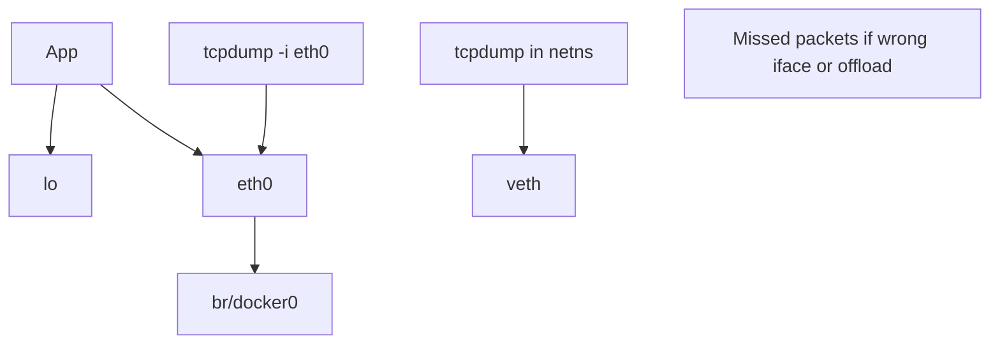
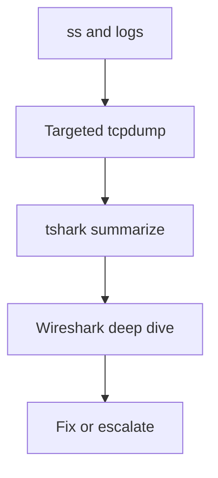
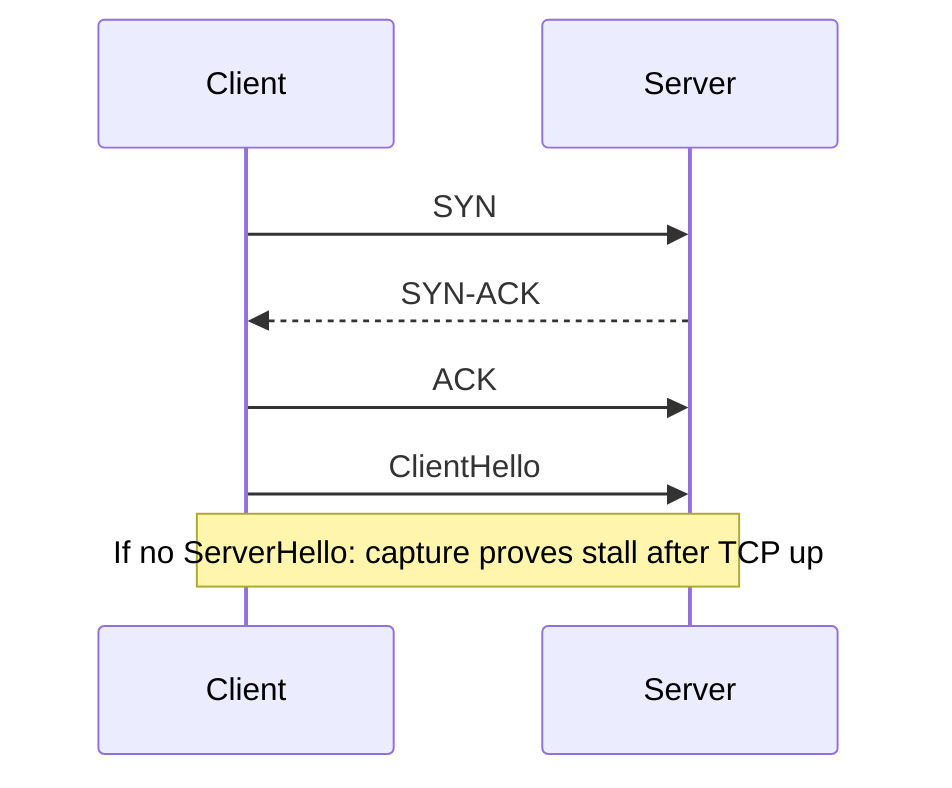

# Packet Capture tcpdump and Wireshark Triage

## Overview

**Packet capture** is the ground-truth tool when sockets, firewalls, and app logs disagree. **`tcpdump`** (libpcap + BPF filters) captures on the host; **Wireshark/tshark** dissect protocols offline. Used well, it confirms SYN drops, TLS alerts, DNS timings, and MTU/blackhole issues. Used poorly, it floods disks, captures secrets, and violates privacy policy.

This note owns host triage discipline. Protocol theory is CS; distributed tracing is System Design/Observability modules.

## Learning Objectives

- Write BPF capture filters that shrink volume safely
- Capture rotating pcaps with snaplen and privilege awareness
- Triage TCP handshake failures vs app-level errors
- Use Wireshark/tshark displays for HTTP/DNS/TLS metadata without unnecessary decryption
- Hand off continuous fleet packet brokers to DevOps/Security platforms

## Prerequisites

- [[10-Linux/05-Networking-Stack-and-Host-Firewall/TCP UDP Sockets ss and Conntrack|TCP UDP Sockets ss and Conntrack]]
- [[10-Linux/05-Networking-Stack-and-Host-Firewall/DNS Resolvers and nsswitch Ops|DNS Resolvers and nsswitch Ops]]

## Difficulty

`intermediate`

## Estimated Time

- Reading: 1.5 hours
- Exercises: 1.5 hours
- Mini project: 2 hours

## History

tcpdump/libpcap defined Unix packet triage; BPF filters moved into the kernel for efficiency. Wireshark made deep dissection accessible. eBPF and modern observability reduced *constant* capture needs, but incident pcaps remain decisive. Encrypted traffic shifted analysis toward metadata, TLS handshake, and endpoint tracing.

## Problem It Solves

| Hypothesis | Capture shows |
| --- | --- |
| Firewall drop | SYN no SYN-ACK on wire |
| App bug | Full HTTP 500 body |
| DNS delay | Query/response timing |
| MTU blackhole | TCP stall, ICMP need-frag missing |
| Wrong VIP | Packets never arrive on NIC |

## Internal Implementation

### Capture point matters



Offloading (TSO/GRO) can make captures look "wrong"—be aware when diagnosing checksums/segment sizes.

### BPF filter vs display filter

- **Capture filter** (pcap/BPF): reduces what hits disk
- **Display filter** (Wireshark): filters after capture

## Mermaid Diagrams

### Structure — triage ladder



### Sequence / Lifecycle — failed TLS connect



## Examples

### Minimal Example — filter builder

```typescript
export type CaptureIntent = {
  host?: string;
  port?: number;
  proto?: "tcp" | "udp" | "icmp";
};

export function bpf(intent: CaptureIntent): string {
  const parts: string[] = [];
  if (intent.proto) parts.push(intent.proto);
  if (intent.host) parts.push(`host ${intent.host}`);
  if (intent.port) parts.push(`port ${intent.port}`);
  return parts.join(" and ") || "ip";
}

// bpf({ proto: "tcp", host: "10.0.2.15", port: 443 })
// => "tcp and host 10.0.2.15 and port 443"
```

### Production-Shaped Example — safe capture

```bash
# Short, filtered, snaplen, rotate
tcpdump -i eth0 -nn -s 128 -W 5 -C 100 -w /var/tmp/inc_%Y%m%d_%H%M%S.pcap \
  'tcp port 5432 and host 10.0.2.15'

# Quick console triage
tcpdump -i eth0 -nn -c 100 'udp port 53'

# tshark summaries
tshark -r capture.pcap -q -z io,phs
tshark -r capture.pcap -Y 'tcp.flags.syn==1 && tcp.flags.ack==0' -T fields -e ip.src -e ip.dst

# Privileges: prefer cap_net_raw ambient or dedicated capture user—not forever root shell
```

```typescript
export type TriageFinding =
  | { kind: "syn_no_synack"; evidence: string }
  | { kind: "rst_after_syn"; evidence: string }
  | { kind: "dns_slow"; evidence: string }
  | { kind: "tcp_ok_app_fail"; evidence: string };

export function interpret(notes: {
  synSeen: boolean;
  synAckSeen: boolean;
  rstSeen: boolean;
  httpStatus?: number;
}): TriageFinding {
  if (notes.synSeen && !notes.synAckSeen) {
    return { kind: "syn_no_synack", evidence: "filter/drop/wrong dest" };
  }
  if (notes.rstSeen) return { kind: "rst_after_syn", evidence: "reject or closed port" };
  if (notes.httpStatus && notes.httpStatus >= 500) {
    return { kind: "tcp_ok_app_fail", evidence: `HTTP ${notes.httpStatus}` };
  }
  return { kind: "tcp_ok_app_fail", evidence: "need app logs" };
}
```

**Handoffs**

| Concern | Home |
| --- | --- |
| Protocol formats | [[01-Computer-Science/README\|Computer Science]] |
| Distributed traces | [[09-System-Design/README\|System Design]] / Linux obs module 08 |
| Packet broker / SPAN platforms | [[16-DevOps/README\|DevOps]] |
| Legal hold / PII in pcaps | [[18-Security/README\|Security]] |
| Container netns capture | [[14-Docker/README\|Docker]] |

## Trade-offs

| Dimension | Full packet capture | Metadata / snaplen 128 |
| --- | --- | --- |
| Evidence depth | High | Limited payloads |
| Privacy/risk | High | Lower |
| Disk/CPU | High | Manageable |
| Encryption | Still opaque payloads | Handshake still useful |

### When to Use

- Disambiguate drop vs app error after `ss`/firewall checks
- Time-boxed incident captures with filters
- Lab reproduction of MTU/DNS/TLS handshake issues

### When Not to Use

- Always-on unfiltered capture on busy NICs
- Capturing on shared hosts without policy approval
- Decrypting TLS with private keys outside approved Security process

## Exercises

1. Capture a successful vs refused TCP connection; compare flags.
2. Capture DNS for a short name; measure multi-query search behavior.
3. Build BPF strings with the TypeScript helper; verify with `-d` (dump packet-matching code) where available.
4. Demonstrate snaplen truncating HTTP bodies.
5. Capture inside a container netns vs on `docker0`—explain differences.

## Mini Project

CLI that takes intent JSON → prints recommended `tcpdump` command (iface, filter, snaplen, rotate) and a privacy warning checklist.

## Portfolio Project

Capture playbook in [[10-Linux/projects/Host Network Triage Toolkit/README|Host Network Triage Toolkit]] with redaction guidance.

## Interview Questions

1. Capture filter vs display filter?
2. How do you prove a firewall SYN drop?
3. Why might checksums look wrong in Wireshark?
4. What is snaplen?
5. How do you capture without filling the disk?

### Stretch / Staff-Level

1. Design a compliant incident-pcap workflow: access control, retention, encryption, redaction.
2. When do you choose eBPF flow logs over pcap?

## Common Mistakes

- Capturing on the wrong interface
- No `-nn` leading to DNS delays during capture
- Leaving tcpdump running overnight
- Pasting pcaps with session cookies into tickets
- Skipping `ss` and jumping straight to Wireshark theater

## Best Practices

- Filter first; rotate always; time-box captures
- Prefer metadata for encrypted services
- Store pcaps in controlled evidence locations
- Document iface + filter + clock sync in the incident timeline
- Correlate with logs using timestamps (NTP!)

## Summary

tcpdump and Wireshark convert networking hypotheses into packet evidence. Operators climb a triage ladder from `ss` to filtered, rotating captures, interpret handshake vs application failures, and respect privacy—escalating continuous capture platforms and legal constraints to DevOps and Security.

## Further Reading

- `man tcpdump`, Wireshark user guide
- [[10-Linux/08-Observability-Tracing-and-Profiling/eBPF Intro for Operators|eBPF Intro for Operators]]
- [[10-Linux/11-Packaging-Config-and-Automation-Basics/Time NTP Chrony and Clock Skew Ops|Time NTP Chrony and Clock Skew Ops]]

## Related Notes

- [[10-Linux/README|Linux MOC]]
- [[18-Security/README|Security]]
- [[14-Docker/README|Docker]]

## Progress Checklist

- [ ] Explained from first principles
- [ ] Drew at least one Mermaid diagram
- [ ] Implemented a minimal version
- [ ] Documented trade-offs and non-goals
- [ ] Completed exercises
- [ ] Practiced interview questions aloud
- [ ] Linked prerequisites and dependents
