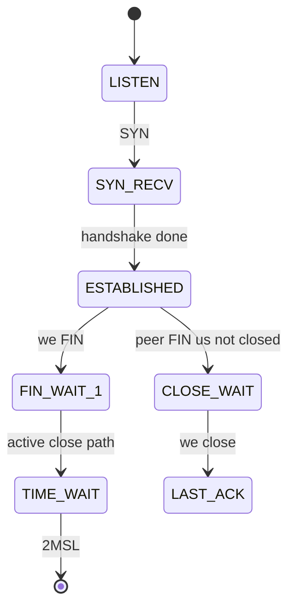
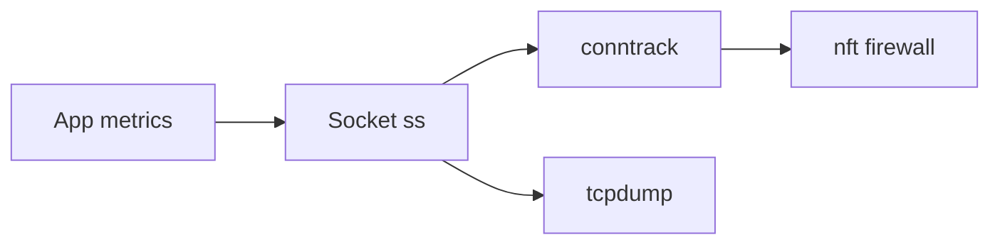
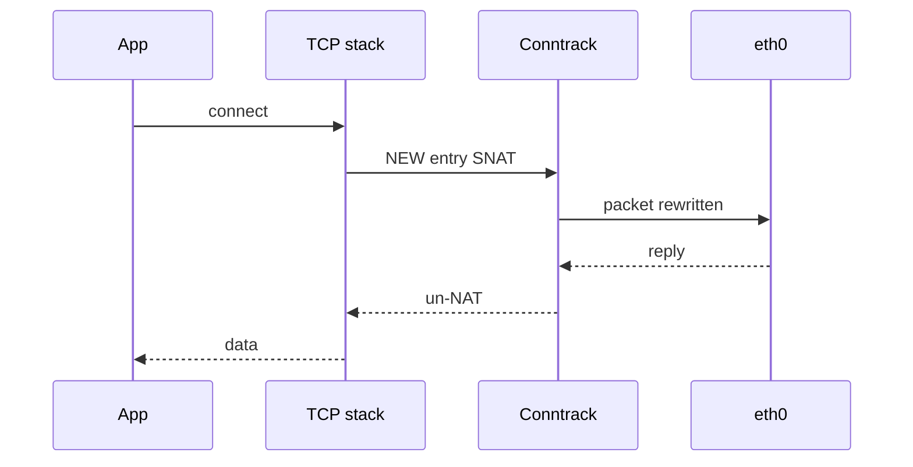

# TCP UDP Sockets ss and Conntrack

## Overview

**Sockets** are the kernel objects apps bind and connect; **`ss`** (and legacy `netstat`) expose their state; **conntrack** tracks flows for NAT and stateful firewalls. Production failures—`TIME_WAIT` exhaustion, `nf_conntrack: table full`, half-open SYN floods, UDP "connection" myths—show up here before they show up cleanly in app logs.

This note is host socket and flow-table ops. Deep TCP algorithms stay in CS; service timeouts in Backend; NAT meshes in Docker/K8s.

## Learning Objectives

- Read `ss -tanop` / `ss -uanop` and map states to failure modes
- Explain TCP state machine points that matter operationally (`ESTAB`, `TIME-WAIT`, `CLOSE-WAIT`)
- Diagnose conntrack table pressure and NAT asymmetry
- Contrast UDP's lack of kernel connection with conntrack entries
- Hand off app pool timeouts to Backend; CNI conntrack to Kubernetes/Docker

## Prerequisites

- [[10-Linux/05-Networking-Stack-and-Host-Firewall/Interfaces Addressing and Routing Tables|Interfaces Addressing and Routing Tables]]
- CS layered models / TCP overview

## Difficulty

`intermediate`

## Estimated Time

- Reading: 1.5 hours
- Exercises: 1.5 hours
- Mini project: 2 hours

## History

`netstat` gave way to `ss` (netlink-based, faster on busy hosts). Netfilter conntrack became the linchpin of Linux NAT as containers and cloud security groups pushed more flows through stateful filtering. Ephemeral port ranges and `TIME_WAIT` recycling remain evergreen incident topics.

## Problem It Solves

| Symptom | Kernel clue |
| --- | --- |
| Cannot connect out under load | Ephemeral ports / TIME_WAIT |
| Inbound drops intermittent | conntrack full |
| App says "connection reset" | `ss` state + RST capture |
| Many `CLOSE-WAIT` | App not reading/closing—userspace bug |
| UDP "works then stops" | conntrack UDP timeout / NAT |

## Internal Implementation

### TCP states operators actually use



### Conntrack role

Conntrack stores flow tuples so replies match NAT/firewall decisions. Table size and timeouts are sysctls—silent drop when full.

## Mermaid Diagrams

### Structure — observability layers



### Sequence / Lifecycle — outbound NAT flow



## Examples

### Minimal Example — parse ss-like rows

```typescript
export type TcpState =
  | "LISTEN"
  | "ESTAB"
  | "TIME-WAIT"
  | "CLOSE-WAIT"
  | "SYN-SENT"
  | "SYN-RECV"
  | "OTHER";

export type SockRow = {
  state: TcpState;
  local: string;
  peer: string;
  pid?: number;
};

export function summarize(rows: SockRow[]) {
  const byState = new Map<TcpState, number>();
  for (const r of rows) byState.set(r.state, (byState.get(r.state) ?? 0) + 1);
  const closeWait = byState.get("CLOSE-WAIT") ?? 0;
  const timeWait = byState.get("TIME-WAIT") ?? 0;
  return {
    byState: Object.fromEntries(byState),
    warnCloseWait: closeWait > 100,
    warnTimeWait: timeWait > 10_000,
  };
}
```

### Production-Shaped Example — triage

```bash
ss -s                          # summary
ss -tanop | head
ss -tan '( sport = :5432 )'
ss -tan state time-wait | wc -l

conntrack -L 2>/dev/null | wc -l
# or
cat /proc/sys/net/netfilter/nf_conntrack_count
cat /proc/sys/net/netfilter/nf_conntrack_max

sysctl net.ipv4.ip_local_port_range
sysctl net.ipv4.tcp_tw_reuse
```

```typescript
export type FlowPressure = {
  conntrackCount: number;
  conntrackMax: number;
  timeWait: number;
  ephemeralRangeSize: number;
};

export function pressureHints(p: FlowPressure): string[] {
  const hints: string[] = [];
  if (p.conntrackCount / p.conntrackMax > 0.8) {
    hints.push("raise max carefully OR reduce NAT churn / short UDP timeouts");
  }
  if (p.timeWait > p.ephemeralRangeSize * 0.5) {
    hints.push("TIME_WAIT pressure—connection reuse, pools, or architecture");
  }
  return hints;
}
```

**Handoffs**

| Concern | Home |
| --- | --- |
| Congestion control, handshake theory | [[01-Computer-Science/README\|Computer Science]] |
| Client timeouts, pools, keepalives | [[07-Backend/README\|Backend]] |
| Product connection fan-out | [[09-System-Design/README\|System Design]] |
| Docker userland-proxy / iptables NAT | [[14-Docker/README\|Docker]] |
| kube-proxy conntrack | [[15-Kubernetes/README\|Kubernetes]] |

## Trade-offs

| Dimension | Short timeouts / aggressive reuse | Long TIME_WAIT conservative |
| --- | --- | --- |
| Port/conntrack use | Lower residency | Higher table occupancy |
| Risk | Premature reuse bugs | Exhaustion under churn |
| Tuning | Needs measurement | Safer defaults |

### When to Use

- `ss` before packet capture for state hypotheses
- Conntrack metrics on any NAT host (bastions, K8s nodes, Docker hosts)
- Fix app `CLOSE-WAIT` in code, not with sysctl

### When Not to Use

- Blindly enabling exotic `tcp_tw_*` sysctls from old blog posts
- Raising conntrack max forever without finding flow leaks
- Treating UDP like TCP sessions in app design (use app-level sessions)

## Exercises

1. Generate many short TCP connections; watch TIME_WAIT with `ss -s`.
2. Find a `CLOSE-WAIT` leak intentionally (server accepts, peer closes, server never reads).
3. On a Docker host, count conntrack entries before/after heavy publish-port traffic.
4. Implement `summarize()` tests for fixture ss dumps.
5. Explain why load balancer health checks can inflate conntrack.

## Mini Project

`SsFixtureAnalyzer`: ingest text `ss -tan` fixtures, emit state histogram and hints via `pressureHints`.

## Portfolio Project

Socket/conntrack module in [[10-Linux/projects/Host Network Triage Toolkit/README|Host Network Triage Toolkit]].

## Interview Questions

1. What does TIME_WAIT protect?
2. CLOSE-WAIT vs TIME_WAIT—who must act?
3. Why does conntrack fill on Kubernetes nodes?
4. How is UDP represented in conntrack?
5. `ss` vs `netstat`?

### Stretch / Staff-Level

1. Design connection pooling standards that keep ephemeral ports and conntrack healthy at 10k RPS egress NAT.
2. When is it correct to tune `nf_conntrack_udp_timeout`?

## Common Mistakes

- Restarting apps to "clear TIME_WAIT" (does not work that way)
- Ignoring pid/fd columns when many processes share ports
- Confusing listen backlog overflows with firewall drops
- Debugging container IPs only from the host without netns
- Copying sysctl snippets without documenting risk

## Best Practices

- Alert on conntrack usage ratio on NAT nodes
- Prefer connection reuse and HTTP keep-alive over churn
- Capture `ss -s` snapshots in incident bundles
- Pair socket state with tcpdump only when needed
- Document sysctl changes as ADRs

## Summary

`ss` and conntrack make flow-level truth visible: TCP states explain app bugs and port exhaustion; conntrack explains NAT/firewall capacity. Operators read these before random sysctl surgery, and hand app timeout design and CNI details to Backend and container tracks.

## Further Reading

- `man ss`, `man conntrack`
- [[10-Linux/05-Networking-Stack-and-Host-Firewall/nftables and Firewalld Operator Model|nftables and Firewalld Operator Model]]
- [[10-Linux/05-Networking-Stack-and-Host-Firewall/Packet Capture tcpdump and Wireshark Triage|Packet Capture tcpdump and Wireshark Triage]]

## Related Notes

- [[10-Linux/README|Linux MOC]]
- [[07-Backend/README|Backend]]
- [[14-Docker/README|Docker]]

## Progress Checklist

- [ ] Explained from first principles
- [ ] Drew at least one Mermaid diagram
- [ ] Implemented a minimal version
- [ ] Documented trade-offs and non-goals
- [ ] Completed exercises
- [ ] Practiced interview questions aloud
- [ ] Linked prerequisites and dependents
