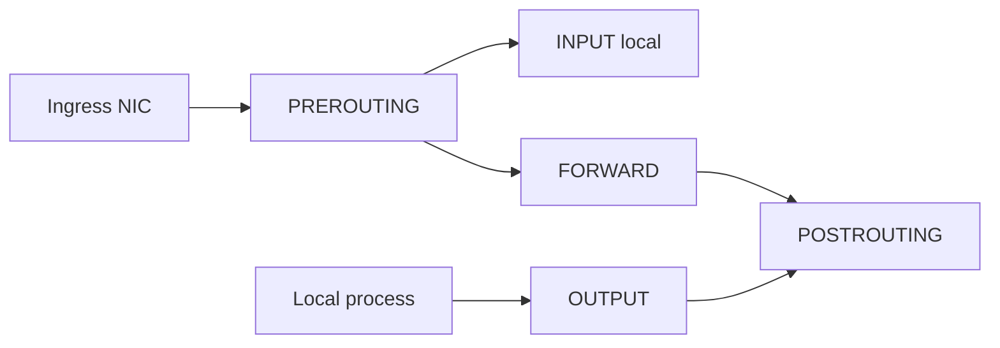
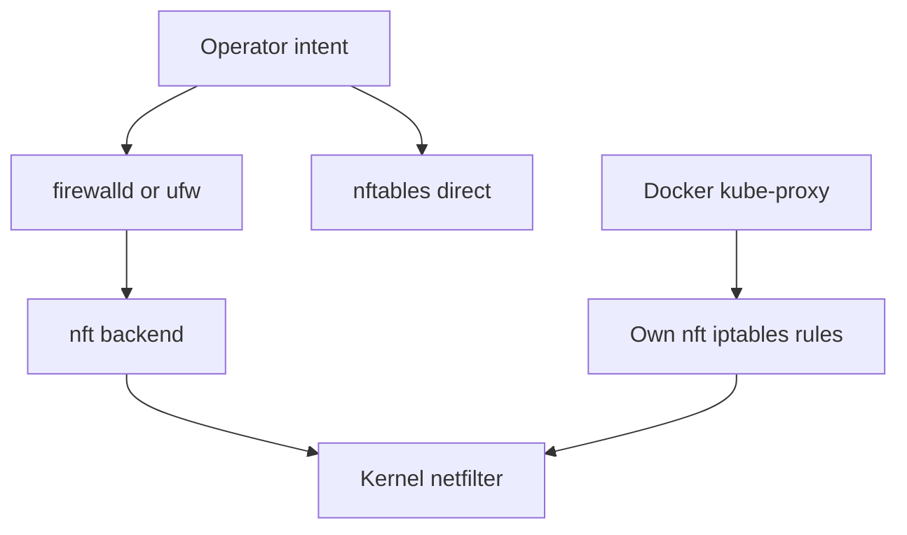
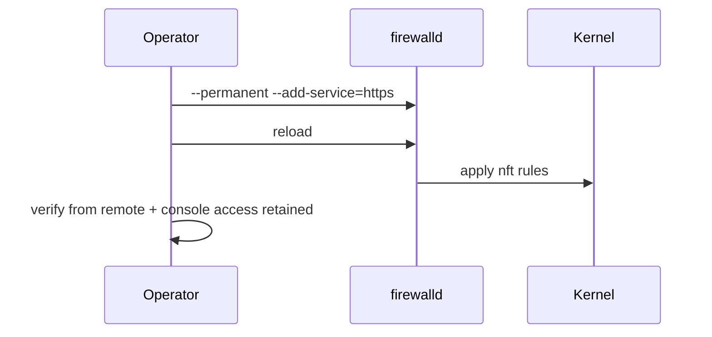

# nftables and Firewalld Operator Model

## Overview

Linux packet filtering sits in **netfilter** hooks; **nftables** is the modern userspace/config language (successor mindset to iptables); **firewalld** is a zone-based manager common on RHEL-family systems that can backend to nft. Operators need a mental model for zones, rich rules, and coexistence with Docker/K8s rules that also program netfilter.

Deep threat modeling belongs to [[18-Security/README|Security]]; cloud SG/NSG to cloud tracks; this note owns **host firewall operations**.

## Learning Objectives

- Explain netfilter hooks vs "the firewall" as a single object
- Operate firewalld zones or raw nftables without fighting the distro
- Predict interactions with Docker/iptables and conntrack
- Change rules safely (persist, audit, rollback)
- Hand off product allowlists and WAF to Security/System Design edge

## Prerequisites

- [[10-Linux/05-Networking-Stack-and-Host-Firewall/TCP UDP Sockets ss and Conntrack|TCP UDP Sockets ss and Conntrack]]

## Difficulty

`intermediate`

## Estimated Time

- Reading: 1.5 hours
- Exercises: 1.5 hours
- Mini project: 2 hours

## History

iptables dominated for decades; nftables unified ipv4/ipv6/arp with better set performance. Distros differ: Debian often raw nft/iptables; RHEL pushes firewalld; Ubuntu may use ufw as a thin layer. Containers layered their own chains—operational pain when dual-managed.

## Problem It Solves

| Symptom | Firewall angle |
| --- | --- |
| Port open locally, closed remotely | Filter INPUT / cloud SG |
| Intermittent drops | Rule order / conntrack / rate |
| Docker publish weirdness | DOCKER chains vs host policy |
| Locked out after change | No management plane exception |
| "nft vs iptables" confusion | Backend translation layers |

## Internal Implementation

### Hooks (operator view)



### firewalld zones

Interfaces (and sources) map to zones with default targets (public, internal, trusted, drop, …). Services are named port/protocol bundles.

## Mermaid Diagrams

### Structure — management layers



### Sequence / Lifecycle — open a service safely



## Examples

### Minimal Example — policy model sketch

```typescript
export type Proto = "tcp" | "udp";
export type Rule = {
  zone: string;
  action: "accept" | "drop" | "reject";
  proto?: Proto;
  port?: number;
  sourceCidr?: string;
};

export type ZonePolicy = {
  name: string;
  target: "default" | "ACCEPT" | "DROP" | "%%REJECT%%";
  interfaces: string[];
  rules: Rule[];
};

export function allows(zone: ZonePolicy, src: string, proto: Proto, port: number): boolean {
  for (const r of zone.rules) {
    if (r.sourceCidr && !src.startsWith(r.sourceCidr.split("/")[0]!.slice(0, 4))) {
      // educational stub—not a real CIDR matcher
    }
    if (r.proto === proto && r.port === port) return r.action === "accept";
  }
  return zone.target === "ACCEPT";
}
```

### Production-Shaped Example — firewalld / nft

```bash
# firewalld
firewall-cmd --get-active-zones
firewall-cmd --list-all
firewall-cmd --permanent --zone=public --add-service=https
firewall-cmd --permanent --zone=public --add-rich-rule='rule family=ipv4 source address=10.0.0.0/8 port port=22 protocol=tcp accept'
firewall-cmd --reload

# nftables inventory
nft list ruleset
iptables-nft -L -n -v   # when compat layer present

# NEVER lock yourself out: keep an active session + break-glass console
```

```typescript
export type ChangePlan = {
  intent: string;
  permanent: boolean;
  verifyFrom: string[]; // remote probes
  rollback: string[];
};

export const OPEN_HTTPS: ChangePlan = {
  intent: "allow TCP/443 in public zone",
  permanent: true,
  verifyFrom: ["external runner", "localhost ss -lnt"],
  rollback: ["firewall-cmd --permanent --remove-service=https", "firewall-cmd --reload"],
};
```

**Handoffs**

| Concern | Home |
| --- | --- |
| Netfilter architecture depth | [[01-Computer-Science/README\|Computer Science]] / kernel docs |
| App authn/z | [[07-Backend/README\|Backend]] / [[18-Security/README\|Security]] |
| Edge WAF / SG design | [[09-System-Design/README\|System Design]] |
| Docker iptables | [[14-Docker/README\|Docker]] |
| NetworkPolicy | [[15-Kubernetes/README\|Kubernetes]] |
| Fleet firewall as code | [[16-DevOps/README\|DevOps]] |

## Trade-offs

| Dimension | firewalld zones | Raw nftables |
| --- | --- | --- |
| Ergonomics | High for common cases | Full power |
| Portability | RHEL-centric habits | Distro-agnostic syntax |
| Container coexistence | Still careful | Still careful |
| Auditability | XML/zone files | Single ruleset files |

### When to Use

- Distro-native tool (firewalld on RHEL, documented nft on others)
- Explicit management-plane allow rules before tightening
- Permanent + reload workflow with remote verify

### When Not to Use

- Mixing ufw + firewalld + hand nft on one host
- Relying only on host firewall when cloud SG already denies (debug both)
- Copying iptables `-I INPUT 1 -j DROP` experiments on prod SSH

## Exercises

1. Map your lab distro: firewalld, ufw, or nft? List the source of truth files.
2. Open a high port, verify with remote `nc`, then remove it.
3. List Docker-created rules and explain one DROP/ACCEPT path.
4. Write a ChangePlan ADR for restricting SSH to a CIDR.
5. Simulate lockout prevention: second session + cloud serial console checklist.

## Mini Project

TypeScript zone policy evaluator with real CIDR matching (use a small helper) and fixture tests for allow/deny matrices.

## Portfolio Project

Firewall change runbook in [[10-Linux/projects/Host Network Triage Toolkit/README|Host Network Triage Toolkit]] + Security checklist cross-link.

## Interview Questions

1. iptables vs nftables vs firewalld—how do they relate?
2. INPUT vs FORWARD—when does each matter?
3. Why do Docker hosts surprise people with firewalls?
4. How do you persist firewalld changes?
5. What is a zone?

### Stretch / Staff-Level

1. Design host firewall policy that cooperates with Kubernetes without fighting kube-proxy.
2. Propose nft set-based allowlists for 50k IPs efficiently.

## Common Mistakes

- Runtime-only rules lost on reboot
- Forgetting IPv6 (`ip6tables`/inet family)
- Blocking DHCP/DNS while debugging
- Assuming cloud SG and host firewall are duplicates (defense in depth vs double-debug)
- Editing live production without rollback

## Best Practices

- Infrastructure-as-code for firewall policy
- Change windows + out-of-band console access
- Inventory full ruleset in incidents (`nft list ruleset`)
- Prefer sets/maps over huge linear rule lists
- Document coexistence with container engines

## Summary

nftables and firewalld express netfilter policy at different abstraction layers. Operators pick the distro-supported model, persist changes carefully, verify remotely, and expect containers to inject their own rules—while leaving product auth and edge WAF ownership to Security and System Design.

## Further Reading

- `man firewall-cmd`, `man nft`
- [[10-Linux/05-Networking-Stack-and-Host-Firewall/Packet Capture tcpdump and Wireshark Triage|Packet Capture tcpdump and Wireshark Triage]]
- [[10-Linux/09-Security-Primitives-on-the-Host/SSH Hardening Operator Checklist|SSH Hardening Operator Checklist]]

## Related Notes

- [[10-Linux/README|Linux MOC]]
- [[18-Security/README|Security]]
- [[14-Docker/README|Docker]]
- [[16-DevOps/README|DevOps]]

## Progress Checklist

- [ ] Explained from first principles
- [ ] Drew at least one Mermaid diagram
- [ ] Implemented a minimal version
- [ ] Documented trade-offs and non-goals
- [ ] Completed exercises
- [ ] Practiced interview questions aloud
- [ ] Linked prerequisites and dependents
