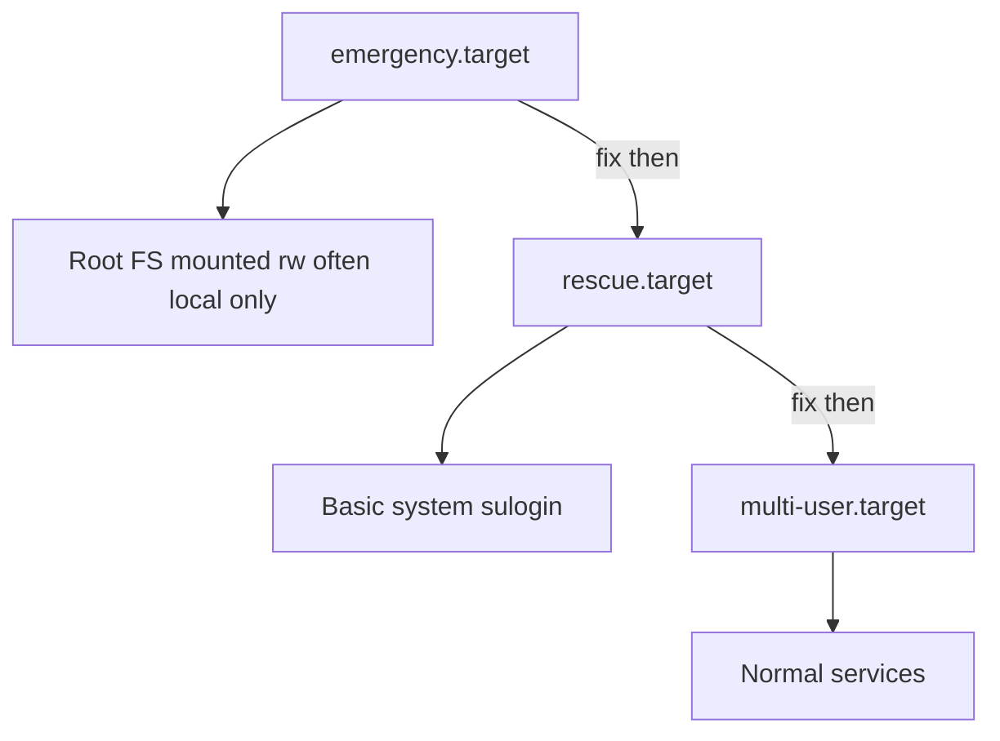
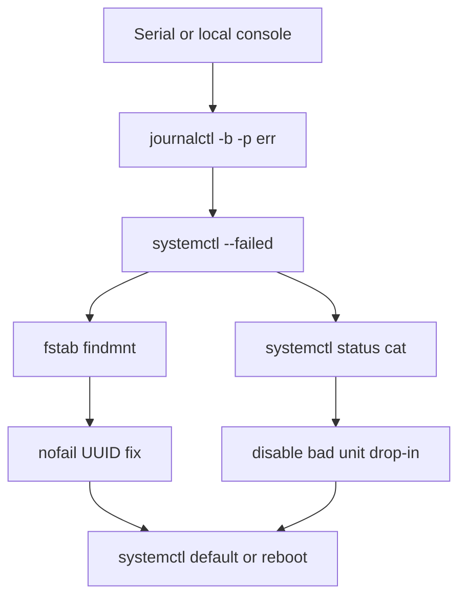
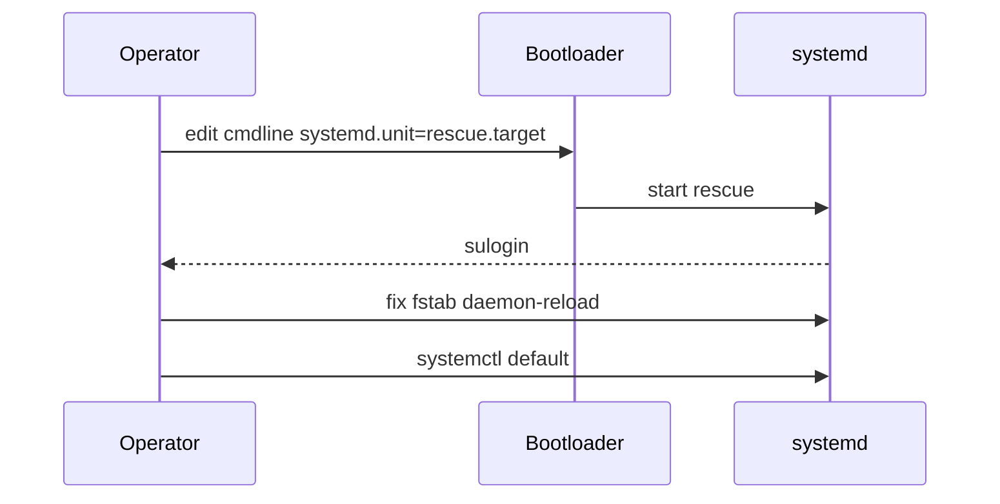

# Boot Rescue Targets and Failed Units

## Overview

When a host will not reach `multi-user.target` / `graphical.target`, systemd offers **rescue** and **emergency** targets, plus tooling to inspect **failed units**, generate boot charts, and fix fstab/mount disasters. Cloud serial consoles and provider recovery volumes complete the operator toolkit.

This note is the boot-break glass playbook. Image baking and fleet rollback hand off to [[16-DevOps/README|DevOps]].

## Learning Objectives

- Contrast `rescue.target` vs `emergency.target` vs single-user myths
- Use `systemctl --failed`, `journalctl -b -p err`, and `systemd-analyze blame`
- Recover from bad fstab, broken units, and dependency cycles
- Enter rescue via kernel cmdline when login is impossible
- Hand off AMI/golden-image rollback to DevOps/cloud tracks

## Prerequisites

- [[10-Linux/06-systemd-Timers-and-Logging/Unit Types Dependencies and Targets|Unit Types Dependencies and Targets]]
- [[10-Linux/06-systemd-Timers-and-Logging/journald Persistence and Rate Limits|journald Persistence and Rate Limits]]
- [[10-Linux/04-Filesystems-Disks-and-IO/Block Devices Partitions and Mounts|Block Devices Partitions and Mounts]]

## Difficulty

`intermediate`

## Estimated Time

- Reading: 1.5 hours
- Exercises: 1.5 hours
- Mini project: 2 hours

## History

SysV "single user mode" was the classic recovery lane. systemd formalized targets and made parallel boot failures more nuanced—one failed mount can cascade. Cloud removed physical console access, elevating serial console and replacement-instance patterns.

## Problem It Solves

| Boot symptom | Likely class |
| --- | --- |
| Hang at "A start job is running…" | Mount/device timeout |
| Drops to emergency shell | Local FS dependency failure |
| Reaches login but services dead | Failed units after boot |
| Kernel panic / no systemd | Not this note—kernel/initramfs |
| Works after manual `systemctl start` | Missing WantedBy / ordering |

## Internal Implementation

### Targets for recovery



- **emergency**: minimal; often for local-fs problems; `systemd.unit=emergency.target`
- **rescue**: more userspace; `systemd.unit=rescue.target` / formerly single-user

### Failed unit states

Units can be `failed` after start timeout, non-zero exit, or dependency collapse. `systemctl reset-failed` clears state but not root cause.

## Mermaid Diagrams

### Structure — triage order



### Sequence / Lifecycle — cmdline rescue



## Examples

### Minimal Example — failed unit report

```typescript
export type UnitFail = {
  name: string;
  result: "exit-code" | "timeout" | "dependency" | "resources" | "unknown";
  exitCode?: number;
};

export function prioritize(failures: UnitFail[]): UnitFail[] {
  const rank: Record<UnitFail["result"], number> = {
    dependency: 0,
    timeout: 1,
    resources: 2,
    "exit-code": 3,
    unknown: 4,
  };
  return [...failures].sort((a, b) => rank[a.result] - rank[b.result]);
}

export function suggest(f: UnitFail): string {
  if (f.name.endsWith(".mount")) return "check fstab UUID nofail device-timeout";
  if (f.result === "dependency") return "systemctl list-dependencies --reverse " + f.name;
  if (f.result === "timeout") return "raise TimeoutStartSec or fix ExecStart hang";
  return "journalctl -u " + f.name + " -b";
}
```

### Production-Shaped Example — commands

```bash
systemctl --failed
systemctl status postgresql.service -l
journalctl -b -p err --no-pager
journalctl -b -1 -p err          # previous boot

systemd-analyze blame
systemd-analyze critical-chain

# Mask a poison unit temporarily
systemctl mask broken-legacy.service

# fstab verification mindset
findmnt --verify 2>/dev/null || cat /etc/fstab
# Add nofail to optional mounts; fix UUID

# Kernel cmdline (GRUB): systemd.unit=emergency.target
# Cloud: use serial console + same cmdline or attach root volume to helper VM
```

```typescript
export type BootIncident = {
  reachedTarget: "emergency" | "rescue" | "multi-user" | "unknown";
  failed: UnitFail[];
};

export function runbook(i: BootIncident): string[] {
  const steps = ["capture journalctl -b -p err", "systemctl --failed"];
  if (i.reachedTarget === "emergency" || i.reachedTarget === "rescue") {
    steps.push("inspect fstab and local-fs.target", "fix mounts", "systemctl default");
  }
  for (const f of prioritize(i.failed)) steps.push(suggest(f));
  return steps;
}
```

**Handoffs**

| Concern | Home |
| --- | --- |
| Initramfs / kernel | Distro docs / CS OS depth |
| Volume detach repair | Cloud tracks / [[16-DevOps/README\|DevOps]] |
| Container host reboot policy | [[14-Docker/README\|Docker]] / K8s |
| Fleet auto-heal replace instance | [[16-DevOps/README\|DevOps]] |

## Trade-offs

| Dimension | Fix in place (rescue) | Replace instance |
| --- | --- | --- |
| Root cause learning | High | Lower |
| Time to restore | Variable | Often faster in cattle fleets |
| Risk | Human error on root FS | State on ephemeral lost |
| Evidence | Keep disk | Snapshot first |

### When to Use

- rescue/emergency for fstab and unit graph disasters
- `systemd-analyze` on healthy labs to know baselines
- Mask + ticket for poison non-critical units to restore login quickly

### When Not to Use

- Endless rescue surgery on cattle nodes without snapshots
- `reset-failed` as the fix
- Ignoring cloud-init re-breaking fstab on next boot

## Exercises

1. Break a lab fstab with a fake UUID; boot; recover with emergency + `nofail` or fix.
2. Create a oneshot that fails; observe `--failed` and journal.
3. Practice GRUB cmdline to `rescue.target` in a VM snapshot.
4. Implement `prioritize`/`runbook` tests.
5. Document your cloud serial console path for the next outage.

## Mini Project

TypeScript boot-triage CLI: ingest fixture `systemctl --failed` + journal err lines → ordered runbook steps.

## Portfolio Project

Boot failure chapter in [[10-Linux/12-Incidents-Runbooks-and-Portfolio/Host Incident Triage Order CPU Mem Disk Net|Host Incident Triage Order]] + Unit Workshop.

## Interview Questions

1. rescue vs emergency target?
2. How do you see units that failed this boot?
3. How do you enter rescue without a working login?
4. What does `systemctl mask` do vs `disable`?
5. How do you analyze slow boots?

### Stretch / Staff-Level

1. Design a golden-image policy: which mounts are `nofail`, which are boot-critical.
2. Automate "failed unit" alerts that ignore noisy transient oneshots safely.

## Common Mistakes

- Fixing `/etc/fstab` but not testing with `findmnt`/`systemd-fstab-generator` mindset before reboot
- Passwordless emergency shell assumptions on locked-down cloud images
- Clearing failed state without journal evidence captured
- Fighting the wrong boot (current vs `-b -1`)
- No serial console enabled until you need it

## Best Practices

- Snapshot / backup before rescue edits on stateful hosts
- Prefer UUID + `nofail` for optional disks
- Keep break-glass console access tested quarterly
- Capture `systemd-analyze critical-chain` in postmortems
- Prefer immutable cattle replace when policy says so—after evidence

## Summary

Rescue and emergency targets, failed-unit inspection, and journal boots are how operators reclaim a box that will not reach multi-user. Triage mounts and dependencies first, fix or mask with evidence, and know when DevOps-style instance replacement is the safer product move.

## Further Reading

- `man systemd.special`, `man systemd-analyze`, `man bootup`
- [[10-Linux/04-Filesystems-Disks-and-IO/Block Devices Partitions and Mounts|Block Devices Partitions and Mounts]]
- [[10-Linux/12-Incidents-Runbooks-and-Portfolio/Postmortem Evidence Collection on Linux|Postmortem Evidence Collection on Linux]]

## Related Notes

- [[10-Linux/README|Linux MOC]]
- [[16-DevOps/README|DevOps]]
- [[10-Linux/06-systemd-Timers-and-Logging/Unit Types Dependencies and Targets|Unit Types Dependencies and Targets]]

## Progress Checklist

- [ ] Explained from first principles
- [ ] Drew at least one Mermaid diagram
- [ ] Implemented a minimal version
- [ ] Documented trade-offs and non-goals
- [ ] Completed exercises
- [ ] Practiced interview questions aloud
- [ ] Linked prerequisites and dependents
