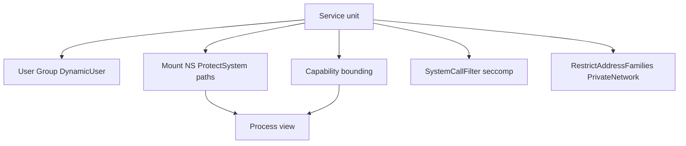
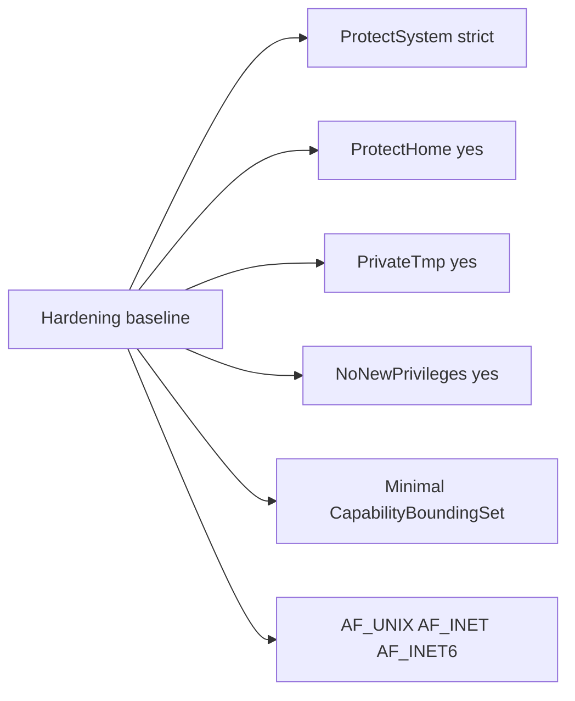
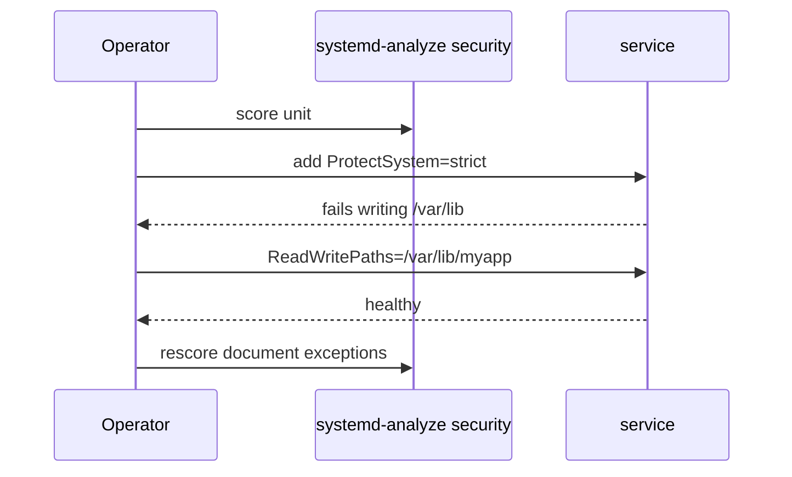

# Service Hardening Directives

## Overview

systemd can **sandbox** services with declarative directives: filesystem namespaces (`ProtectSystem=`, `ProtectHome=`, `ReadOnlyPaths=`), capability dropping (`CapabilityBoundingSet=`), `NoNewPrivileges=`, `PrivateTmp=`, `RestrictAddressFamilies=`, and more. This is host-native defense-in-depth for daemons—not a replacement for app security, but a powerful operator control plane.

Deep capability/seccomp theory continues in module 09 and [[18-Security/README|Security]]; container runtime sandboxes hand off to Docker/Kubernetes.

## Learning Objectives

- Apply a hardening baseline to a typical TypeScript/Node or Go service unit
- Explain what key `Protect*` and `Private*` directives change in the namespace
- Use `systemd-analyze security` as a scoring starting point—not a blind mandate
- Avoid breaking apps with over-restrictive address families or paths
- Hand off image-level USER/seccomp to Docker; policy-as-code fleets to DevOps

## Prerequisites

- [[10-Linux/06-systemd-Timers-and-Logging/Unit Types Dependencies and Targets|Unit Types Dependencies and Targets]]
- DAC permissions basics

## Difficulty

`intermediate`

## Estimated Time

- Reading: 1.5 hours
- Exercises: 1.5 hours
- Mini project: 2 hours

## History

Traditional Unix daemons ran as dedicated UIDs—necessary but coarse. systemd imported ideas from container isolation into unit files so ordinary packages gain namespaces without Docker. `systemd-analyze security` popularized checklists; misuse causes mysterious `EACCES`/`EPERM` in production.

## Problem It Solves

| Risk | Directive class |
| --- | --- |
| RCE writes `/etc` | `ProtectSystem=strict` + exceptions |
| Credential theft from `/home` | `ProtectHome=` |
| Privilege escalation via exec | `NoNewPrivileges=` |
| Unexpected network | `RestrictAddressFamilies=` |
| Tempfile races | `PrivateTmp=` |
| Ambient root caps | `CapabilityBoundingSet=` / `AmbientCapabilities=` |

## Internal Implementation

### Sandbox layers



### DynamicUser

`DynamicUser=yes` allocates an ephemeral UID, owns `StateDirectory=`, and reduces static user provisioning—great for stateless-ish daemons; careful with persistent file ownership across upgrades.

## Mermaid Diagrams

### Structure — baseline profile



### Sequence / Lifecycle — iterate safely



## Examples

### Minimal Example — hardening profile type

```typescript
export type HardeningProfile = {
  User: string;
  ProtectSystem: "full" | "strict" | "true";
  ProtectHome: "yes" | "read-only" | "tmpfs";
  PrivateTmp: boolean;
  NoNewPrivileges: boolean;
  CapabilityBoundingSet: string[]; // empty = drop all by convention in our sketch
  RestrictAddressFamilies: string[];
  ReadWritePaths: string[];
};

export const NODE_API_BASELINE: HardeningProfile = {
  User: "billing",
  ProtectSystem: "strict",
  ProtectHome: "yes",
  PrivateTmp: true,
  NoNewPrivileges: true,
  CapabilityBoundingSet: [],
  RestrictAddressFamilies: ["AF_UNIX", "AF_INET", "AF_INET6"],
  ReadWritePaths: ["/var/lib/billing"],
};

export function toUnitFragment(h: HardeningProfile): string {
  return [
    `[Service]`,
    `User=${h.User}`,
    `ProtectSystem=${h.ProtectSystem}`,
    `ProtectHome=${h.ProtectHome}`,
    `PrivateTmp=${h.PrivateTmp ? "yes" : "no"}`,
    `NoNewPrivileges=${h.NoNewPrivileges ? "yes" : "no"}`,
    `CapabilityBoundingSet=${h.CapabilityBoundingSet.join(" ") || "~"}`,
    `RestrictAddressFamilies=${h.RestrictAddressFamilies.join(" ")}`,
    ...h.ReadWritePaths.map((p) => `ReadWritePaths=${p}`),
  ].join("\n");
}
```

### Production-Shaped Example — drop-in

```ini
# /etc/systemd/system/billing-api.service.d/hardening.conf
[Service]
NoNewPrivileges=yes
ProtectSystem=strict
ProtectHome=yes
PrivateTmp=yes
ProtectKernelTunables=yes
ProtectKernelModules=yes
ProtectControlGroups=yes
RestrictSUIDSGID=yes
RestrictNamespaces=yes
LockPersonality=yes
MemoryDenyWriteExecute=yes
RestrictAddressFamilies=AF_UNIX AF_INET AF_INET6
CapabilityBoundingSet=
AmbientCapabilities=
ReadWritePaths=/var/lib/billing
StateDirectory=billing
```

```bash
systemd-analyze security billing-api.service
systemctl edit billing-api   # creates drop-in
journalctl -u billing-api -b --no-pager | tail
```

**Handoffs**

| Concern | Home |
| --- | --- |
| Capabilities/seccomp depth | [[10-Linux/09-Security-Primitives-on-the-Host/Capabilities vs root All-Powerful Myth\|Capabilities]] |
| App auth / secrets | [[18-Security/README\|Security]] / Backend |
| Container USER/seccomp | [[14-Docker/README\|Docker]] |
| Fleet policy | [[16-DevOps/README\|DevOps]] |

## Trade-offs

| Dimension | Strict sandbox | Loose / root |
| --- | --- | --- |
| Attack surface | Smaller | Larger |
| Breakage risk | Higher initially | Lower |
| Debuggability | More EPERM mysteries | Easier strace |
| Compliance story | Strong | Weak |

### When to Use

- Any internet-facing or multi-tenant host daemon
- Drop-ins that document exceptions (`ReadWritePaths`)
- `DynamicUser` for simple state directories

### When Not to Use

- Blindly applying highest `systemd-analyze` score without testing
- `PrivateNetwork=yes` on services that must listen on eth0
- `MemoryDenyWriteExecute=yes` on JITs that need W+X (Node often needs care—verify)

## Exercises

1. Run `systemd-analyze security` on a stock unit; list three easy wins.
2. Apply `ProtectSystem=strict` without `ReadWritePaths` and observe failure.
3. Generate a unit fragment from `NODE_API_BASELINE`.
4. Compare hardening to a Docker `read_only: true` + mounts mental model.
5. Determine whether your Node build needs writable `/tmp` only vs code dirs.

## Mini Project

Hardening linter: given unit text, flag missing `NoNewPrivileges`, root `User=`, or `ProtectSystem` absent; emit suggested drop-in.

## Portfolio Project

Hardening matrix in [[10-Linux/projects/systemd Unit Workshop/README|systemd Unit Workshop]].

## Interview Questions

1. What does `ProtectSystem=strict` do?
2. Why `NoNewPrivileges=`?
3. `CapabilityBoundingSet=` empty means?
4. How do drop-ins help hardening rollouts?
5. systemd sandbox vs container sandbox?

### Stretch / Staff-Level

1. Create tiered profiles (edge ingress, batch worker, DB sidecar) with exception catalogs.
2. How do you roll hardening fleet-wide without mass outages?

## Common Mistakes

- Editing vendor units in `/usr/lib` instead of drop-ins
- Forgetting `daemon-reload`
- Restricting `AF_UNIX` when the app uses UDS healthchecks
- Assuming hardened unit fixes vulnerable app code
- Leaving `AmbientCapabilities=` that re-add caps

## Best Practices

- Iterate: add restriction → test → document exception
- Prefer drop-ins and git-reviewed unit store
- Pair with non-root `User=` always
- Re-run `systemd-analyze security` after changes
- Cross-link Security track for threat model

## Summary

systemd hardening directives wrap services in filesystem, capability, and syscall constraints declared next to the unit. Operators apply baselines carefully, carve `ReadWritePaths`, measure with `systemd-analyze security`, and remember containers/Security tracks still own adjacent layers of the same story.

## Further Reading

- `man systemd.exec`, `man systemd-analyze`
- [[10-Linux/09-Security-Primitives-on-the-Host/seccomp and Syscall Filtering Basics|seccomp and Syscall Filtering Basics]]
- [[18-Security/README|Security]]

## Related Notes

- [[10-Linux/README|Linux MOC]]
- [[14-Docker/README|Docker]]
- [[16-DevOps/README|DevOps]]

## Progress Checklist

- [ ] Explained from first principles
- [ ] Drew at least one Mermaid diagram
- [ ] Implemented a minimal version
- [ ] Documented trade-offs and non-goals
- [ ] Completed exercises
- [ ] Practiced interview questions aloud
- [ ] Linked prerequisites and dependents
