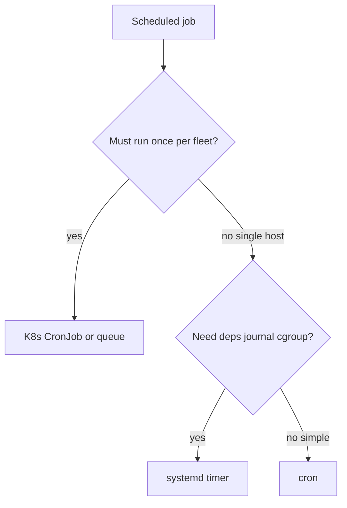
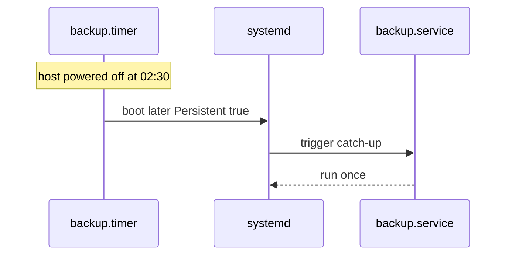

# Timers vs Cron Operational Choice

## Overview

**cron** schedules command lines via crontab; **systemd timers** schedule activation of units with calendar/monotonic events, dependency integration, randomized delay, and journald-native logs. Neither is universally "better"—operators choose based on persistence model, observability, privileges, and fleet standards.

This note owns the host scheduling decision. Distributed job platforms (Sidekiq, K8s CronJobs, cloud schedulers) hand off to Backend/DevOps/Kubernetes.

## Learning Objectives

- Write `.timer` + `.service` pairs with `OnCalendar=` / `OnBootSec=`
- Compare cron and timers on logging, missed runs, and environment
- Use `Persistent=true` and randomized delay correctly
- Avoid double-scheduling the same job from cron *and* timers
- Hand off multi-node exactly-once jobs to system design / K8s CronJobs

## Prerequisites

- [[10-Linux/06-systemd-Timers-and-Logging/Unit Types Dependencies and Targets|Unit Types Dependencies and Targets]]

## Difficulty

`intermediate`

## Estimated Time

- Reading: 1 hour
- Exercises: 1 hour
- Mini project: 2 hours

## History

cron is ancient, ubiquitous, and simple. systemd timers arrived to unify scheduling with the unit graph and cgroups. Distros still ship both; cloud images and containers often confuse newcomers ("which PID runs my nightly?").

## Problem It Solves

| Need | Prefer |
| --- | --- |
| One-off user crontab | cron / user timers |
| Job needs mount + network deps | systemd timer |
| Capture stdout in journal with unit | timer |
| Catch up missed runs after downtime | timer `Persistent=` |
| Portable to non-systemd (some containers) | cron or app scheduler |
| Cluster-wide singleton | Not host cron—use K8s/cloud |

## Internal Implementation

### Timer fires a unit


### Calendar vs monotonic

- **OnCalendar**: wall clock (`*-*-* 02:30:00`)
- **OnBootSec** / **OnUnitActiveSec**: monotonic relative

## Mermaid Diagrams

### Structure — decision tree



### Sequence / Lifecycle — Persistent miss



## Examples

### Minimal Example — calendar parse sketch

```typescript
export type TimerSpec = {
  onCalendar?: string; // systemd calendar subset, e.g. daily midnight
  persistent: boolean;
  randomizedDelaySec: number;
  unit: string;
};

export function cronToRoughTimer(cron: string): Partial<TimerSpec> {
  // educational: only handles "M H * * *"
  const [min, hour] = cron.trim().split(/\s+/);
  if (min === undefined || hour === undefined) return {};
  return {
    onCalendar: `*-*-* ${hour.padStart(2, "0")}:${min.padStart(2, "0")}:00`,
    persistent: true,
    randomizedDelaySec: 0,
  };
}
```

### Production-Shaped Example — timer pair

```ini
# /etc/systemd/system/billing-reconcile.service
[Unit]
Description=Billing reconcile batch
After=network-online.target postgresql.service
Requires=postgresql.service

[Service]
Type=oneshot
User=billing
ExecStart=/usr/local/bin/billing-reconcile
Nice=10
IOSchedulingClass=best-effort
IOSchedulingPriority=7
```

```ini
# /etc/systemd/system/billing-reconcile.timer
[Unit]
Description=Run billing reconcile nightly

[Timer]
OnCalendar=*-*-* 02:15:00
Persistent=true
RandomizedDelaySec=15m
Unit=billing-reconcile.service

[Install]
WantedBy=timers.target
```

```bash
systemctl enable --now billing-reconcile.timer
systemctl list-timers --all
journalctl -u billing-reconcile.service -b
```

**Handoffs**

| Concern | Home |
| --- | --- |
| App job frameworks | [[07-Backend/README\|Backend]] |
| K8s CronJob | [[15-Kubernetes/README\|Kubernetes]] |
| Fleet crontab management | [[16-DevOps/README\|DevOps]] |
| Exactly-once product semantics | [[09-System-Design/README\|System Design]] |

## Trade-offs

| Dimension | systemd timer | cron |
| --- | --- | --- |
| Dependencies | First-class | DIY |
| Logging | journal unit | mail/syslog files |
| Missed runs | `Persistent=` | generally skipped |
| Ubiquity | systemd hosts | Almost everywhere |
| User jobs | user timers | classic crontab |
| Random jitter | built-in | manual |

### When to Use

- Timers for system services tied to mounts/DBs
- cron for simple user jobs or non-systemd environments
- Jitter (`RandomizedDelaySec`) to avoid thundering herds

### When Not to Use

- Host cron for work that must be cluster-singleton
- Both cron and timer firing the same script
- Long `Type=simple` services pretending to be oneshot batches

## Exercises

1. Convert a crontab line to a timer pair; enable and verify `list-timers`.
2. Demo `Persistent=true` by setting a past calendar and rebooting a lab VM.
3. Compare journal output of timer job vs cron mailing.
4. Implement `cronToRoughTimer` tests for a few patterns.
5. Explain why RandomizedDelaySec matters on 500 identically imaged hosts.

## Mini Project

TypeScript converter: crontab file → proposed `.timer`/`.service` stubs with warnings for `@reboot` and `%` cron peculiarities.

## Portfolio Project

Scheduling ADR in [[10-Linux/projects/systemd Unit Workshop/README|systemd Unit Workshop]].

## Interview Questions

1. cron vs systemd timers—when each?
2. What does `Persistent=` do?
3. Why oneshot for batch timers?
4. How do you list next timer elapses?
5. Why not use host cron for multi-replica web fleets?

### Stretch / Staff-Level

1. Design migration from root crontab sprawl to timer units with canary hosts.
2. Compare systemd timers to K8s CronJob for the same reconcile job.

## Common Mistakes

- Forgetting to enable the **timer** (only starting the service once)
- `Type=simple` oneshot jobs that never exit cleanly
- No timezone awareness (`OnCalendar` uses system TZ)
- Assuming cron `MAILTO` still works the same under timer
- Scheduling heavy jobs at midnight everywhere without jitter

## Best Practices

- One job → one service unit → one timer
- Put batches behind Nice/IOScheduling
- Monitor `list-timers` last/next in host checks
- Document TZ and Persistent policy in ADR
- Prefer app/K8s schedulers for horizontally scaled work

## Summary

Timers integrate scheduling into systemd's dependency and logging model; cron remains simple and portable. Choose deliberately, add jitter and persistence where needed, and escalate fleet-wide singleton jobs off the host crontab entirely.

## Further Reading

- `man systemd.timer`, `man systemd.time`, `man 5 crontab`
- [[10-Linux/06-systemd-Timers-and-Logging/journald Persistence and Rate Limits|journald Persistence and Rate Limits]]
- [[15-Kubernetes/README|Kubernetes]]

## Related Notes

- [[10-Linux/README|Linux MOC]]
- [[16-DevOps/README|DevOps]]
- [[07-Backend/README|Backend]]

## Progress Checklist

- [ ] Explained from first principles
- [ ] Drew at least one Mermaid diagram
- [ ] Implemented a minimal version
- [ ] Documented trade-offs and non-goals
- [ ] Completed exercises
- [ ] Practiced interview questions aloud
- [ ] Linked prerequisites and dependents
