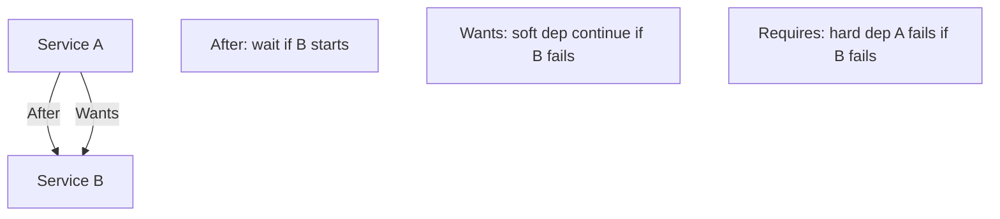
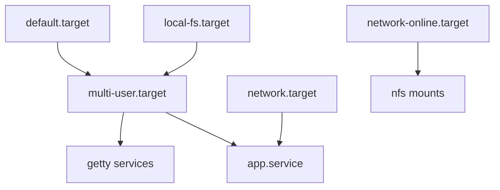
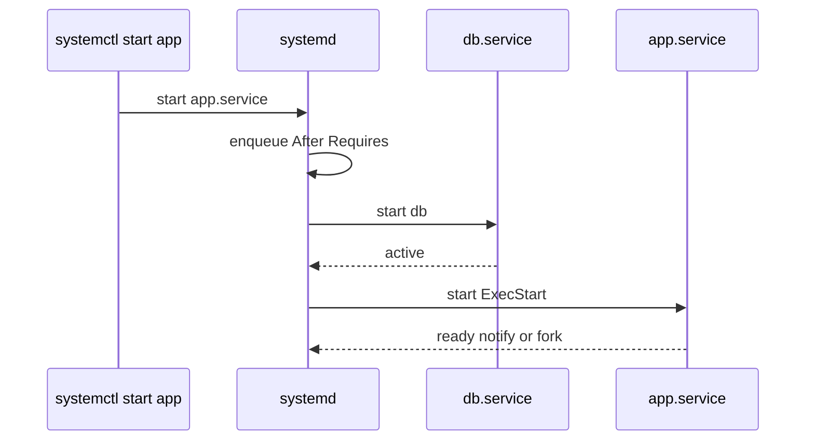

# Unit Types Dependencies and Targets

## Overview

**systemd** manages the host as a dependency graph of **units**: services, sockets, mounts, timers, devices, and **targets** (synchronization points replacing SysV runlevels). Correct `Wants=`/`Requires=`/`After=`/`Before=` relationships prevent races (app before database mount, network before NFS).

This note owns unit graph literacy. Fleet orchestration and config management hand off to [[16-DevOps/README|DevOps]]; container entrypoints are not a substitute for understanding host units when you SSH to a node.

## Learning Objectives

- Name primary unit types and when to use each
- Distinguish ordering (`After=`) from requirement (`Requires=`/`Wants=`)
- Explain targets (`multi-user.target`, `network-online.target`) as barriers
- Inspect the graph with `systemctl` and debug failed activation
- Hand off CI/CD unit deployment patterns to DevOps

## Prerequisites

- Process lifecycle / signals familiarity
- [[10-Linux/README|Linux MOC]] orientation

## Difficulty

`intermediate`

## Estimated Time

- Reading: 1.5 hours
- Exercises: 1 hour
- Mini project: 2 hours

## History

SysV init ran shell scripts in sequence; parallelism and reliable dependencies were weak. systemd unified init, parallel activation, cgroups, and journal. Controversially complex—but it is the de facto Linux service manager operators must read under pressure.

## Problem It Solves

| Failure | Dependency mistake |
| --- | --- |
| App starts before DB socket ready | Missing `After=`/`Requires=` on socket/service |
| Boot hangs on remote FS | Wrong target / missing `nofail` |
| Service ignored on boot | Not `WantedBy=multi-user.target` |
| Restart loops | Unrealistic `Requires=` on flaky deps |
| "It works after login" | User vs system bus confusion |

## Internal Implementation

### Unit types (ops cheat sheet)

| Type | Role |
| --- | --- |
| `.service` | Process supervisor |
| `.socket` | Socket activation |
| `.timer` | Calendar/monotonic schedule |
| `.mount` / `.automount` | Filesystem attach |
| `.target` | Grouping / milestone |
| `.path` | Path-based activation |
| `.slice` | cgroup hierarchy |

### Ordering ≠ requirement



## Mermaid Diagrams

### Structure — boot to multi-user



### Sequence / Lifecycle — activate with deps



## Examples

### Minimal Example — dependency resolver sketch

```typescript
export type DepKind = "after" | "wants" | "requires";

export type Unit = {
  name: string;
  deps: Array<{ kind: DepKind; target: string }>;
};

export function activationOrder(units: Unit[], start: string): string[] {
  const byName = new Map(units.map((u) => [u.name, u]));
  const seen = new Set<string>();
  const out: string[] = [];

  function visit(n: string) {
    if (seen.has(n)) return;
    seen.add(n);
    const u = byName.get(n);
    if (!u) throw new Error(`missing unit ${n}`);
    for (const d of u.deps.filter((x) => x.kind === "requires" || x.kind === "wants" || x.kind === "after")) {
      visit(d.target);
    }
    out.push(n);
  }

  visit(start);
  return out;
}
```

### Production-Shaped Example — unit fragment

```ini
# /etc/systemd/system/billing-api.service
[Unit]
Description=Billing API
Documentation=https://internal/docs/billing-api
After=network-online.target postgresql.service
Wants=network-online.target
Requires=postgresql.service
RequiresMountsFor=/var/lib/billing

[Service]
Type=notify
User=billing
ExecStart=/usr/local/bin/billing-api
Restart=on-failure
RestartSec=2

[Install]
WantedBy=multi-user.target
```

```bash
systemctl cat billing-api
systemctl list-dependencies billing-api.service
systemctl show billing-api -p After,Wants,Requires,ConflictedBy
systemd-analyze plot > /tmp/boot.svg   # lab
```

**Handoffs**

| Concern | Home |
| --- | --- |
| Process model | [[01-Computer-Science/README\|Computer Science]] |
| Container PID 1 | [[14-Docker/README\|Docker]] |
| Fleet unit deployment | [[16-DevOps/README\|DevOps]] |
| Service mesh vs host units | [[09-System-Design/README\|System Design]] |

## Trade-offs

| Dimension | `Requires=` | `Wants=` |
| --- | --- | --- |
| Coupling | Hard fail together | Soft |
| Resilience | Fragile to optional deps | Survives optional failure |
| Clarity | Strict contracts | Need health checks elsewhere |

### When to Use

- `RequiresMountsFor=` for data directories
- Socket activation for on-demand daemons
- Explicit `After=network-online.target` only when truly needed (can slow boot)

### When Not to Use

- `Requires=` on remote/flaky services without timeouts
- Putting complex logic in `ExecStartPre` sprawl—prefer ready notifications
- Assuming `network.target` means routable internet

## Exercises

1. Draw dependencies for a web app needing mount + postgres + network.
2. Break `Requires=` vs `Wants=` on a lab dependency and observe boot/start behavior.
3. Use `systemctl list-dependencies multi-user.target`.
4. Implement `activationOrder` tests with a small unit graph.
5. Explain when `Type=notify` beats `Type=simple`.

## Mini Project

TypeScript unit-graph linter: detect cycles, `Requires` without `After`, and missing `WantedBy` in fixture unit files.

## Portfolio Project

[[10-Linux/projects/systemd Unit Workshop/README|systemd Unit Workshop]] — multi-unit demo with intentional dependency bugs.

## Interview Questions

1. Difference between `After=` and `Requires=`?
2. What is a target?
3. `network.target` vs `network-online.target`?
4. How do you inspect why a unit started late?
5. What does `WantedBy=multi-user.target` do?

### Stretch / Staff-Level

1. Design unit topology for a host running DB + API + log shipper with clear failure domains.
2. When should socket activation replace always-on services?

## Common Mistakes

- Using `After=` alone and expecting dependency start
- Enabling a unit but not understanding install section
- Editing `/lib/systemd/system` instead of drop-ins under `/etc`
- Ignoring `systemctl daemon-reload` after file changes
- Fighting Docker restart policies vs systemd on the same process

## Best Practices

- Drop-ins (`*.conf`) over copying vendor units
- `systemctl cat` as source of truth
- Document dependency ADRs for stateful stacks
- Prefer `Type=notify` with readiness
- Keep units idempotent and boring

## Summary

systemd units form an ordered dependency graph; targets are the milestones. Operators who separate **ordering** from **requirement**, use mounts/network barriers correctly, and inspect the graph with `systemctl` stop racing boots—and leave fleet rollout machinery to DevOps.

## Further Reading

- `man systemd.unit`, `man systemd.service`, `man bootup`
- [[10-Linux/06-systemd-Timers-and-Logging/Service Hardening Directives|Service Hardening Directives]]
- [[10-Linux/06-systemd-Timers-and-Logging/Boot Rescue Targets and Failed Units|Boot Rescue Targets and Failed Units]]

## Related Notes

- [[10-Linux/README|Linux MOC]]
- [[16-DevOps/README|DevOps]]
- [[14-Docker/README|Docker]]

## Progress Checklist

- [ ] Explained from first principles
- [ ] Drew at least one Mermaid diagram
- [ ] Implemented a minimal version
- [ ] Documented trade-offs and non-goals
- [ ] Completed exercises
- [ ] Practiced interview questions aloud
- [ ] Linked prerequisites and dependents
