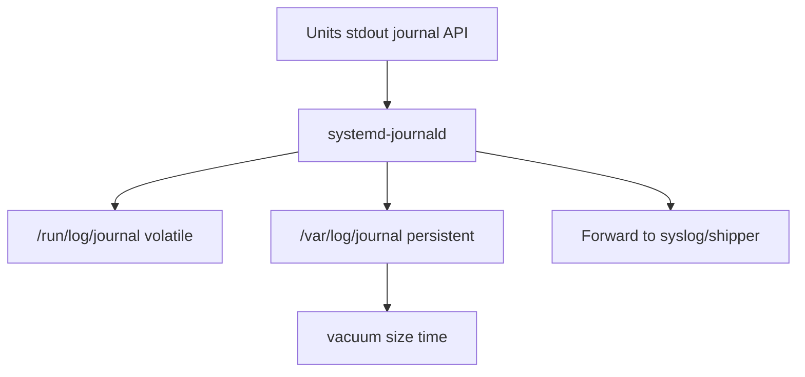
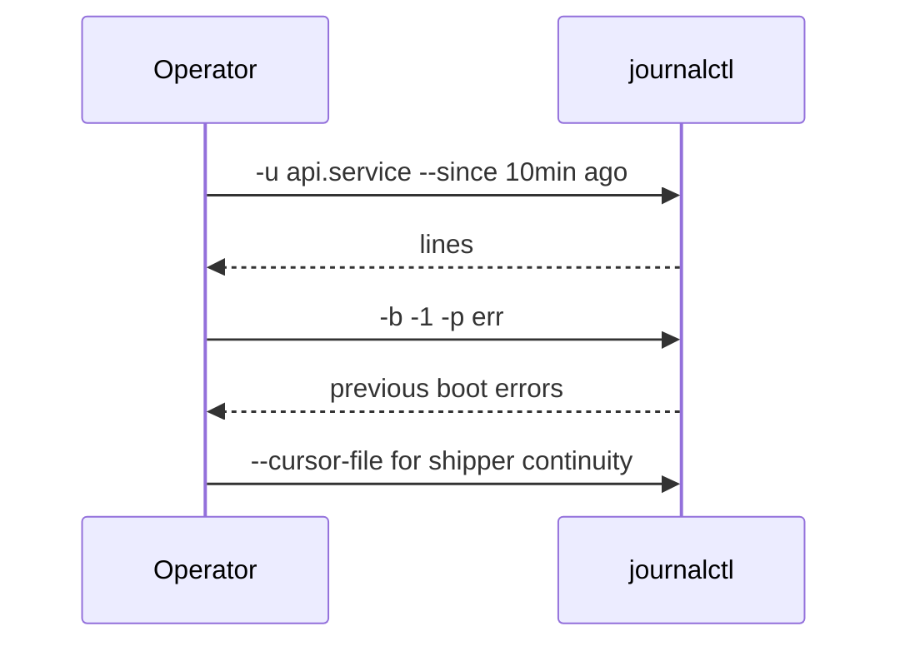

# journald Persistence and Rate Limits

## Overview

**journald** collects stdout/stderr and structured logs from units into a binary journal. **Persistence** (`Storage=persistent`) survives reboot under `/var/log/journal`; volatile mode keeps only `/run`. **Rate limits** protect the host from log storms but can hide the very errors you need during incidents.

Operators must size journals, query with `journalctl`, tune limits consciously, and ship logs onward—without treating journald as the long-term compliance archive.

## Learning Objectives

- Configure volatile vs persistent storage and vacuum size/time caps
- Query by unit, priority, boot, and cursor with `journalctl`
- Explain rate-limit fields and how suppressed messages appear
- Prevent journal ENOSPC while retaining enough incident evidence
- Hand off centralized logging pipelines to DevOps/observability platforms

## Prerequisites

- [[10-Linux/06-systemd-Timers-and-Logging/Unit Types Dependencies and Targets|Unit Types Dependencies and Targets]]
- [[10-Linux/04-Filesystems-Disks-and-IO/Inodes Quotas and ENOSPC Failure Modes|Inodes Quotas and ENOSPC Failure Modes]]

## Difficulty

`intermediate`

## Estimated Time

- Reading: 1 hour
- Exercises: 1 hour
- Mini project: 2 hours

## History

syslog files were plain text rotated by logrotate. journald added structured fields, per-unit capture, and sealing. Early defaults were volatile on some systems—surprise loss across reboot. Rate limiting became famous for swallowing kernel/app spam (and occasionally the smoking gun).

## Problem It Solves

| Symptom | journald angle |
| --- | --- |
| No logs after reboot | volatile storage |
| `/var` full | unbounded persistent journal |
| "Suppressed N messages" | rate limit |
| Cannot find app output | not capturing stdout / wrong unit |
| Gaps in SIEM | shipper lag vs vacuum |

## Internal Implementation

### Paths and storage



### Rate limit intuition

Per-unit (and global) limits: if a service logs too many lines in an interval, further lines are dropped until the window resets—journal notes suppression counts.

## Mermaid Diagrams

### Structure — retention controls

```mermaid
flowchart LR
    Cfg[journald.conf] --> Storage[Storage auto persistent volatile]
    Cfg --> SystemMaxUse[SystemMaxUse]
    Cfg --> MaxFileSec[MaxFileSec]
    Cfg --> Rate[RateLimitIntervalSec Burst]
    Vacuum[journalctl --vacuum] --> Var[/var/log/journal]
```

### Sequence / Lifecycle — incident query



## Examples

### Minimal Example — rate limiter sketch

```typescript
export type RateLimit = { intervalMs: number; burst: number };

export class JournalRateLimiter {
  private timestamps: number[] = [];
  constructor(private readonly lim: RateLimit) {}

  allow(now = Date.now()): { ok: boolean; suppressedHint?: number } {
    const cutoff = now - this.lim.intervalMs;
    this.timestamps = this.timestamps.filter((t) => t >= cutoff);
    if (this.timestamps.length >= this.lim.burst) {
      return { ok: false, suppressedHint: this.timestamps.length - this.lim.burst + 1 };
    }
    this.timestamps.push(now);
    return { ok: true };
  }
}
```

### Production-Shaped Example — config and queries

```ini
# /etc/systemd/journald.conf.d/size.conf
[Journal]
Storage=persistent
SystemMaxUse=2G
SystemKeepFree=1G
MaxRetentionSec=14day
RateLimitIntervalSec=30s
RateLimitBurst=10000
```

```bash
mkdir -p /var/log/journal   # ensure persistent path exists; reboot or restart journald
systemctl restart systemd-journald

journalctl -u billing-api.service -e
journalctl -u billing-api.service --since "2026-07-23 10:00:00"
journalctl -b -p warning
journalctl --disk-usage
journalctl --vacuum-size=1G

# Follow with shipper-friendly output
journalctl -u billing-api -f -o json
```

```typescript
export type JournalPolicy = {
  storage: "persistent" | "volatile" | "auto";
  systemMaxUseMb: number;
  rateLimitBurst: number;
  forwardToSiim: boolean;
};

export function validatePolicy(p: JournalPolicy): string[] {
  const issues: string[] = [];
  if (p.storage === "volatile") issues.push("reboots lose local evidence");
  if (p.systemMaxUseMb < 200) issues.push("very small journal—risk vacuuming active incident");
  if (p.rateLimitBurst < 100) issues.push("burst may hide error storms");
  if (!p.forwardToSiim) issues.push("no central archive—compliance risk");
  return issues;
}
```

**Handoffs**

| Concern | Home |
| --- | --- |
| App structured logging | [[07-Backend/README\|Backend]] |
| Fleet log pipelines | [[16-DevOps/README\|DevOps]] |
| Multi-service correlation | [[09-System-Design/README\|System Design]] / Linux module 08 |
| Container log drivers | [[14-Docker/README\|Docker]] |

## Trade-offs

| Dimension | Persistent large journal | Volatile / tiny |
| --- | --- | --- |
| Forensics | Strong | Weak across reboot |
| Disk risk | Must vacuum | Lower |
| Privacy | Longer retention | Shorter |
| Rate limits high | Noisy but complete | Quiet but blind |

### When to Use

- Persistent journals on stateful/prod hosts with explicit caps
- Higher bursts during known noisy boot windows (carefully)
- JSON journal shipping to central systems as system of record

### When Not to Use

- Relying on journal alone for years of compliance retention
- Disabling rate limits globally without disk+CPU budget
- `Storage=volatile` on hosts you debug after crash loops

## Exercises

1. Switch a lab VM from volatile to persistent; prove logs survive reboot.
2. Generate a log storm; observe suppression; raise burst; retest.
3. Vacuum by size and by time; measure `--disk-usage`.
4. Implement `JournalRateLimiter` tests.
5. Compare Docker `json-file` logs vs journald for a systemd-run container.

## Mini Project

Ring-buffer log simulator with rate limits + vacuum policy (TypeScript)—fixture-driven, mirrors journal constraints for teaching.

## Portfolio Project

Logging panel in [[10-Linux/projects/Observability First-Aid Kit/README|Observability First-Aid Kit]].

## Interview Questions

1. Where are persistent journals stored?
2. What do rate limits do and how do you see them?
3. How do you fetch previous boot logs?
4. journald vs syslog vs SIEM—roles?
5. How do you stop journals from filling `/var`?

### Stretch / Staff-Level

1. Design journal + shipper architecture with backpressure when SIEM is down.
2. How do sealed journals and vacuum interact with forensic holds?

## Common Mistakes

- Never creating `/var/log/journal` then wondering why not persistent
- Unlimited growth until ENOSPC
- Lowering rate limits to "clean logs" and losing crashes
- Forgetting `-b` / multiple boots when debugging reboot loops
- Granting world-read on journals containing secrets

## Best Practices

- Cap `SystemMaxUse` and monitor disk
- Ship centrally; treat local journal as hot cache
- Document rate-limit ADRs when changing defaults
- Use unit-scoped queries in runbooks
- Restrict journal ACL groups (`systemd-journal`)

## Summary

journald is the host's structured log bus: persistence and vacuum set retention, rate limits set honesty under spam, and `journalctl` is the triage interface. Size it deliberately, ship elsewhere for long-term truth, and never confuse suppressed messages with a healthy system.

## Further Reading

- `man journald.conf`, `man journalctl`
- [[10-Linux/08-Observability-Tracing-and-Profiling/Logging Correlation on a Single Host|Logging Correlation on a Single Host]]
- [[10-Linux/04-Filesystems-Disks-and-IO/Inodes Quotas and ENOSPC Failure Modes|Inodes Quotas and ENOSPC Failure Modes]]

## Related Notes

- [[10-Linux/README|Linux MOC]]
- [[16-DevOps/README|DevOps]]
- [[14-Docker/README|Docker]]

## Progress Checklist

- [ ] Explained from first principles
- [ ] Drew at least one Mermaid diagram
- [ ] Implemented a minimal version
- [ ] Documented trade-offs and non-goals
- [ ] Completed exercises
- [ ] Practiced interview questions aloud
- [ ] Linked prerequisites and dependents
