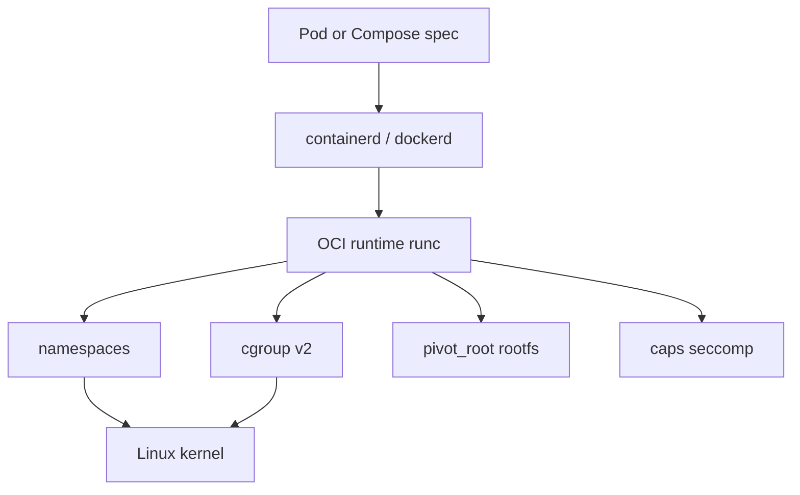
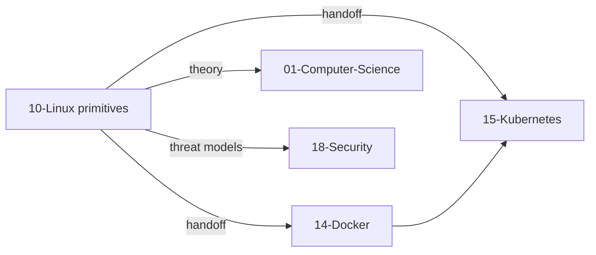
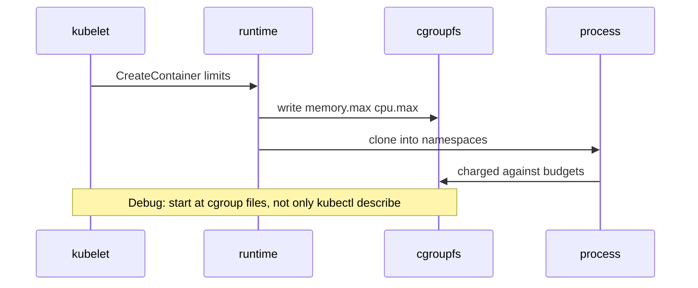

# From Host Primitives to Containers Handoff

## Overview

A **container** is not a kernel object. It is a **userspace bundle**: namespaces + cgroups + capability/seccomp profile + root filesystem + lifecycle API (runC/containerd/CRI). This note is the **handoff boundary** from Linux host primitives to [[14-Docker/README|Docker]] and [[15-Kubernetes/README|Kubernetes]]: what you must understand on the box vs what those tracks own.

If you cannot map a pod’s CPU limit to `cpu.max`, you will mis-debug “Kubernetes issues” that are host saturation—or vice versa.

## Learning Objectives

- Decompose “a container” into kernel primitives + runtime responsibilities
- Trace Docker/K8s resource fields to cgroup v2 files on a node
- Know which incidents stay on Linux vs escalate to orchestration tracks
- Avoid teaching image layers, CNI, and schedulers inside this track
- Write an ADR when hostNetwork/privileged exceptions pierce the model

## Prerequisites

- [[10-Linux/07-Cgroups-Namespaces-and-Isolation/cgroup v2 Controllers CPU Memory IO|cgroup v2 Controllers CPU Memory IO]]
- [[10-Linux/07-Cgroups-Namespaces-and-Isolation/Namespaces Types and Isolation Boundaries|Namespaces Types and Isolation Boundaries]]
- [[10-Linux/07-Cgroups-Namespaces-and-Isolation/User Namespaces Capabilities and Privilege Drops|User Namespaces Capabilities and Privilege Drops]]

## Difficulty

`intermediate`

## Estimated Time

- Reading: 1 hour
- Exercises: 1.5 hours
- Mini project: 2 hours

## History

LXC showed that namespaces+cgroups could look like lightweight VMs. Docker packaged images and DX; OCI standardized runtime/image specs; Kubernetes scheduled *pods* of containers across nodes. The kernel primitives barely changed—the **control plane** did. Curriculum often starts at YAML; this Bible starts at `/proc` and `/sys/fs/cgroup`, then hands off.

## Problem It Solves

| Confusion | Clarification |
| --- | --- |
| “Containers are VMs” | Shared kernel; NS+cgroup isolation |
| “Docker provides CPU limits” | Docker writes cgroup files |
| “Fix it in Linux” for Pending pods | Scheduler/capacity → K8s |
| Re-teaching overlay networking here | CNI → K8s/Docker |

## Internal Implementation

### Ownership table

| Concern | Linux track | Docker / K8s tracks |
| --- | --- | --- |
| `cpu.max`, `memory.max`, PSI | Own | Consume / expose as resources |
| Namespace types, nsenter triage | Own | Create via runtime |
| Image layers, registries | Out of scope | Own |
| Pod scheduling, PDBs, CNI | Out of scope | Own |
| seccomp/cap defaults on host units | Own basics | Profiles at runtime |
| Multi-node SLOs | Hint only | System Design + K8s |



## Mermaid Diagrams

### Structure



### Sequence / Lifecycle — limit appears on node



## Examples

### Minimal Example — mental map

```text
K8s resources.limits.memory: "512Mi"
  → cgroup v2 memory.max ≈ 512 * 1024^2
Docker --cpus=1.5
  → cpu.max ≈ "150000 100000"
--network=host
  → share host net namespace (isolation exception)
```

### Production-Shaped Example — incident routing

```typescript
type Symptom = {
  where: "node" | "control-plane" | "app";
  hints: string[];
};

export function routeContainerIncident(s: Symptom): "linux" | "docker" | "k8s" | "security" {
  if (s.hints.some((h) => /memory.events|cpu.stat|nsenter|cgroup/.test(h))) return "linux";
  if (s.hints.some((h) => /image pull|Dockerfile|overlay/.test(h))) return "docker";
  if (s.hints.some((h) => /Pending|CNI|scheduler|kubelet/.test(h))) return "k8s";
  if (s.hints.some((h) => /escape|seccomp|capability/.test(h))) return "security";
  return s.where === "node" ? "linux" : "k8s";
}
```

## Trade-offs

| Dimension | Stay on host primitives | Jump to orchestration docs |
| --- | --- | --- |
| Debug speed for node saturation | Faster | Lost in YAML |
| Fleet identity / rollout | Insufficient | Required |
| Teaching clarity | Strong first principles | Risk of cargo cult |
| Security depth | Checklist level | Security track |

### When to Use

- Onboarding: “what is a container, really?”
- Node-level incidents involving throttle/OOM/ns
- Writing ADRs for privileged/hostNetwork exceptions

### When Not to Use

- Implementing the Docker Engine or kube-scheduler here
- Replacing Security threat models with “we use namespaces”

## Exercises

1. On a lab with Docker or kind, map one container’s cgroup path and read `memory.max`.
2. List every namespace inode for a container PID; mark shared-with-host cases.
3. Classify five ticket titles into linux/docker/k8s/security using the router sketch.
4. Explain why `kubectl top` disagreeing with `memory.current` can still both be “right.”
5. Draft an ADR template section: “Host primitive exceptions.”

## Mini Project

One-page handoff guide in the workbench: table of Compose/K8s fields → cgroup/NS effects → first Linux command to verify.

## Portfolio Project

[[10-Linux/projects/Linux Host Workbench/README|Linux Host Workbench]] — `docs/CONTAINERS_HANDOFF.md` linking to Docker and Kubernetes READMEs without duplicating their syllabi.

## Interview Questions

1. What kernel features make a container?
2. Who enforces CPU limits—kubelet or the kernel?
3. Why is hostNetwork dangerous?
4. Where does this Bible put overlay networking?
5. How do you debug container OOM on the node?

### Stretch / Staff-Level

1. Design a training path so SREs learn Linux primitives before CKAD-style YAML.
2. Compare VM isolation vs container handoff for a hostile multi-tenant threat model (with Security).

## Common Mistakes

- Debugging only with `kubectl` when the node is IO-saturated
- Teaching Docker as if it were a hypervisor
- Duplicating entire K8s curriculum inside Linux notes
- Forgetting seccomp/caps in the “container = NS+cgroup” slogan

## Best Practices

- Always verify limits in cgroupfs during node incidents
- Document escape hatches (privileged, hostPID) as security exceptions
- Keep Linux notes runtime-agnostic where possible
- Cross-link, don’t fork, Docker/K8s content

## Summary

Linux owns **namespaces, cgroups, and host privilege mechanics**. Docker and Kubernetes own **images, lifecycles, and fleet scheduling** that *configure* those primitives. This handoff note is the seam: map specs to kernel files, triage on the right track, and escalate threat models to Security.

## Further Reading

- OCI Runtime Spec
- [[14-Docker/README|Docker]]
- [[15-Kubernetes/README|Kubernetes]]
- [[10-Linux/README|Linux README]] scope table

## Related Notes

- [[10-Linux/07-Cgroups-Namespaces-and-Isolation/Resource Budgets and Noisy Neighbor Containment|Resource Budgets and Noisy Neighbor Containment]]
- [[10-Linux/09-Security-Primitives-on-the-Host/seccomp and Syscall Filtering Basics|seccomp and Syscall Filtering Basics]]
- [[18-Security/README|Security]]
- [[01-Computer-Science/04-Processes-and-Execution/System Calls|System Calls]]

## Progress Checklist

- [ ] Explained from first principles
- [ ] Drew at least one Mermaid diagram
- [ ] Implemented a minimal version
- [ ] Documented trade-offs and non-goals
- [ ] Completed exercises
- [ ] Practiced interview questions aloud
- [ ] Linked prerequisites and dependents
