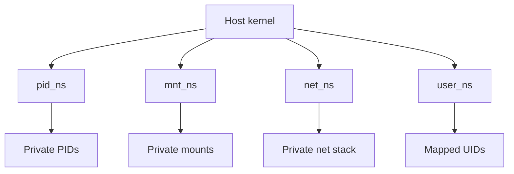
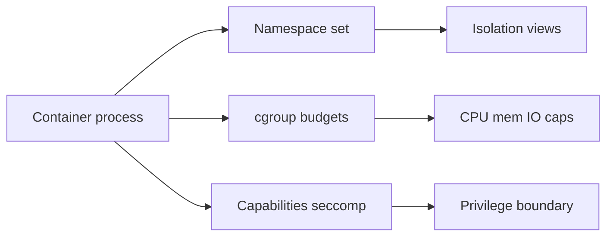

# Namespaces Types and Isolation Boundaries

## Overview

**Namespaces** partition kernel global resources so a process (and its children) see a private view: PIDs, mounts, network stack, hostnames, IPC, UIDs, and even cgroup roots. They are the **isolation** half of containers; cgroups are the **resource budget** half.

This note maps each namespace type to what it *does* and *does not* isolate—critical for operators who hear “container escape” or “I see host PIDs” without a boundary model. Deep threat modeling of escapes → [[18-Security/README|Security]]. Orchestration of many namespaces → [[14-Docker/README|Docker]] / [[15-Kubernetes/README|Kubernetes]].

## Learning Objectives

- Name the major namespace types and the resource each virtualizes
- Read `/proc/PID/ns/*` and explain shared vs unshared namespaces
- Contrast isolation (namespaces) with resource control (cgroups) and privilege (capabilities)
- Predict visible symptoms when PID, mount, or net NS is missing/shared
- State non-goals: namespaces ≠ VM, ≠ complete security boundary alone

## Prerequisites

- [[10-Linux/02-Processes-Signals-and-Job-Control/Process Lifecycle ps and procfs|Process Lifecycle ps and procfs]]
- [[01-Computer-Science/04-Processes-and-Execution/System Calls|System Calls]] — `clone`/`unshare` intuition

## Difficulty

`intermediate`

## Estimated Time

- Reading: 1.5 hours
- Exercises: 2 hours
- Mini project: 2.5 hours

## History

Early Linux shared one global PID table, one mount table, one network stack. Plan 9-inspired isolation and the rise of multi-tenant PaaS forced per-resource virtualization: mount (2002), UTS/IPC (2006), PID/net (2006–2008), user (2013-ish maturity), cgroup NS (later). Docker popularized composing them; the kernel objects predate the brand.

## Problem It Solves

| Without namespaces | With namespaces |
| --- | --- |
| Process A kills process B by guessing PID | PID NS: B’s PID 1 is not host PID 1 |
| Bind to `:80` fights the host | Net NS: private interfaces and ports |
| `chroot` escape via `/proc` mounts | Mount NS + careful `/proc` |
| Hostname collisions in orchestration | UTS NS |

## Internal Implementation

Creating a namespace uses `clone`/`unshare`/`setns` with flags such as `CLONE_NEWPID`, `CLONE_NEWNET`, `CLONE_NEWNS`, `CLONE_NEWUTS`, `CLONE_NEWIPC`, `CLONE_NEWUSER`, `CLONE_NEWCGROUP`, `CLONE_NEWTIME` (time NS on newer kernels).

| Namespace | Isolates | Operator check |
| --- | --- | --- |
| PID | PID number space; nested init | `ls -l /proc/self/ns/pid` |
| Mount | Mount table / filesystem view | `findmnt`, `/proc/self/mountinfo` |
| Net | Interfaces, routes, sockets | `ip link`, `ss` inside vs host |
| UTS | Hostname / NIS domain | `hostname` |
| IPC | System V IPC, POSIX MQ | `ipcs` |
| User | UID/GID mapping | `/proc/self/uid_map` |
| cgroup | cgroup root view | `/proc/self/ns/cgroup` |
| Time | Offsets / monotonic views | newer kernels |

**Hard truth:** namespaces isolate *views*, not *all kernel attack surface*. Shared kernel = shared bugs. Capabilities, seccomp, LSMs, and patching matter—see module 09 and Security track.



## Mermaid Diagrams

### Structure



### Sequence / Lifecycle — enter net namespace

```mermaid
sequenceDiagram
    participant Op as Operator
    participant Host as Host netns
    participant CT as Container netns
    Op->>Host: ss -lntp sees :8080 on host
    Op->>CT: nsenter --net -t PID ss -lntp
    CT-->>Op: private lo eth0 ports
    Note over Host,CT: Same kernel; different netns objects
```

## Examples

### Minimal Example — compare namespace inodes

```bash
# Same inode = shared namespace
ls -l /proc/1/ns/pid /proc/self/ns/pid
ls -l /proc/1/ns/mnt /proc/self/ns/mnt
ls -l /proc/1/ns/net /proc/self/ns/net

# unshare a UTS namespace (demo)
unshare --uts /bin/bash -c 'hostname jail-demo; hostname'
# host hostname unchanged in another terminal
```

### Production-Shaped Example — nsenter triage

```bash
# Find container PID on host (runtime-specific; concept only)
PID=12345
nsenter --target "$PID" --mount --uts --ipc --net --pid /bin/bash
# Inside: ps sees PID NS; ip addr sees veth; df sees container mounts
# Correlate with cgroup:
cat /proc/$PID/cgroup
```

Handoff: how runtimes assemble these flags → [[10-Linux/07-Cgroups-Namespaces-and-Isolation/From Host Primitives to Containers Handoff|From Host Primitives to Containers Handoff]].

## Trade-offs

| Dimension | Upside | Downside | When it matters |
| --- | --- | --- | --- |
| Full NS set | Strong app isolation | Debug harder from host | Multi-tenant |
| Shared PID/net (rare) | Easier debugging | Weak isolation | Break-glass only |
| User NS | Rootless containers | Mapping complexity, fs ownership | Unprivileged runtimes |
| Kernel sharing | Cheap vs VMs | Escape class exists | High-threat tenants → VMs/Security |

### When to Use

- Any multi-tenant or containerized workload
- Incident triage: “what does this process *see*?”

### When Not to Use

- As proof of security without caps/seccomp/LSM
- When true hardware isolation is required (hand off to Security / virt)

## Exercises

1. `unshare --pid --fork --mount-proc` and explain why `ps` looks empty/minimal.
2. Compare `ip link` on host vs `nsenter --net -t <ctr>`.
3. Draw which namespaces a typical app container has vs a `--network=host` container.
4. Show two processes sharing net NS but not PID NS; list observable consequences.
5. Read `uid_map` for a rootless container and explain host UID on a bind mount.

## Mini Project

Write a small TypeScript or bash “NS inspector” that, given a PID, prints inode IDs for each `/proc/PID/ns/*` and flags which match PID 1 (host). Extend [[10-Linux/projects/Procfs Inspector Lab/README|Procfs Inspector Lab]].

## Portfolio Project

[[10-Linux/projects/Linux Host Workbench/README|Linux Host Workbench]] — document a table: symptom → missing/shared namespace → first command.

## Interview Questions

1. List namespace types and one resource each isolates.
2. Do namespaces provide CPU limits? (No—cgroups.)
3. What does sharing the host network namespace imply?
4. Why is `chroot` alone insufficient?
5. How do you inspect another process’s network view?

### Stretch / Staff-Level

1. Explain PID namespace nesting and re-parenting to the NS init.
2. Argue when gVisor/Kata/VMs beat namespaces for a threat model (Security handoff).

## Common Mistakes

- Equating “Docker” with “secure”
- Debugging with host `ss` while the app is in another netns
- Forgetting mount NS when bind mounts “disappear”
- Assuming user NS root equals host root

## Best Practices

- Triage with `nsenter` / `/proc/PID/ns` before guessing
- Treat NS + cgroup + caps + seccomp as a stack
- Prefer runtime tooling for creation; use raw `unshare` for learning
- Document hostNetwork/hostPID exceptions in ADRs

## Summary

Namespaces give processes **private views** of kernel globals. Operators must know which type maps to which symptom and what remains shared (the kernel). Pair with cgroups for budgets and with Security for threat models; leave pod lifecycle to Docker/Kubernetes.

## Further Reading

- `man namespaces`, `man unshare`, `man nsenter`
- [[10-Linux/07-Cgroups-Namespaces-and-Isolation/User Namespaces Capabilities and Privilege Drops|User Namespaces Capabilities and Privilege Drops]]
- [[18-Security/README|Security]]

## Related Notes

- [[10-Linux/07-Cgroups-Namespaces-and-Isolation/cgroup v2 Controllers CPU Memory IO|cgroup v2 Controllers CPU Memory IO]]
- [[10-Linux/07-Cgroups-Namespaces-and-Isolation/From Host Primitives to Containers Handoff|From Host Primitives to Containers Handoff]]
- [[10-Linux/09-Security-Primitives-on-the-Host/Capabilities vs root All-Powerful Myth|Capabilities vs root All-Powerful Myth]]
- [[01-Computer-Science/04-Processes-and-Execution/System Calls|System Calls]]

## Progress Checklist

- [ ] Explained from first principles
- [ ] Drew at least one Mermaid diagram
- [ ] Implemented a minimal version
- [ ] Documented trade-offs and non-goals
- [ ] Completed exercises
- [ ] Practiced interview questions aloud
- [ ] Linked prerequisites and dependents
