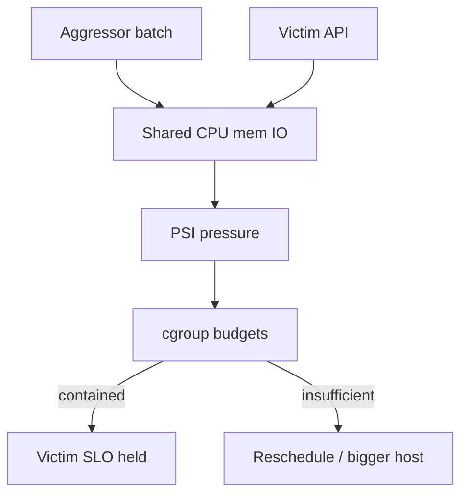
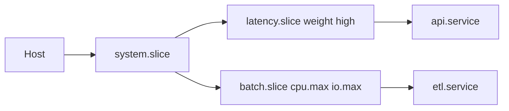
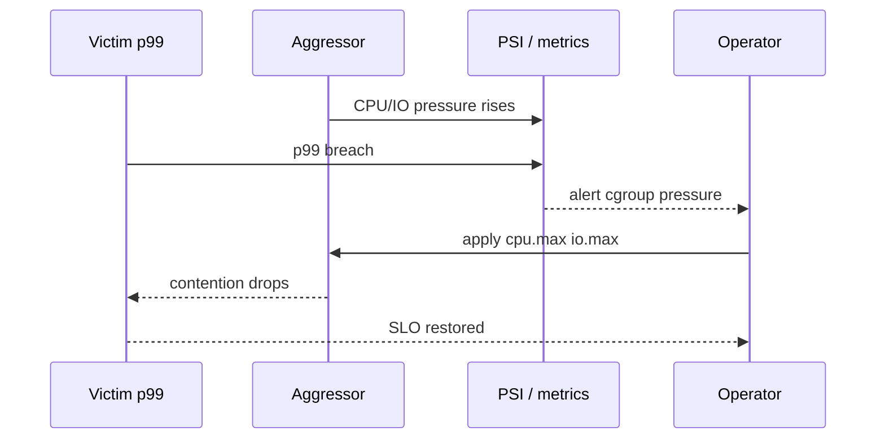

# Resource Budgets and Noisy Neighbor Containment

## Overview

A **noisy neighbor** is a workload that consumes shared host resources—CPU, memory reclaim bandwidth, disk IOPS, network—until **latency-sensitive victims** miss SLOs though the box is “up.” **Resource budgets** are explicit cgroup (and related) policies that bound that blast radius *before* you buy another machine or move to a scheduler.

This note is the *ops playbook* atop [[10-Linux/07-Cgroups-Namespaces-and-Isolation/cgroup v2 Controllers CPU Memory IO|cgroup v2 Controllers CPU Memory IO]]: how to size, place, and verify budgets. Cluster-level packing and QoS classes → [[15-Kubernetes/README|Kubernetes]]; product-scale capacity → [[09-System-Design/README|System Design]].

## Learning Objectives

- Define noisy-neighbor failure modes across CPU, memory, IO, and network
- Choose weight vs hard cap strategies for interactive vs batch
- Use PSI (`/proc/pressure`, cgroup `*.pressure`) as an early signal
- Design slice topology (systemd slices / containers) for containment
- Know when host budgets are insufficient and orchestration must reschedule

## Prerequisites

- [[10-Linux/07-Cgroups-Namespaces-and-Isolation/cgroup v2 Controllers CPU Memory IO|cgroup v2 Controllers CPU Memory IO]]
- Familiarity with load average / run queue and iostat basics

## Difficulty

`intermediate`

## Estimated Time

- Reading: 1.25 hours
- Exercises: 2 hours
- Mini project: 3 hours

## History

Multi-user Unix relied on nice levels and polite users. Cloud multi-tenancy and “pets → cattle” made polite insufficient: one customer’s analytics job could ruin another’s p99. cgroups, CFS bandwidth, blkio/io controllers, and Pressure Stall Information (PSI) evolved so operators can **measure contention** and **enforce budgets**.

## Problem It Solves

| Symptom | Likely neighbor effect | Budget lever |
| --- | --- | --- |
| API p99 ↑, CPU % “not 100%” | Run-queue contention / steal | `cpu.weight` / `cpu.max` on batch |
| Latency spikes, reclaim | Memory pressure | `memory.high` on aggressor |
| Disk util 100%, app fsync slow | IO saturation | `io.max` / `io.weight` |
| Intermittent timeouts | Combined PSI | Separate slices + alerts |

## Internal Implementation

### Containment model

1. **Identify shared resources** on the host.
2. **Partition workloads** into cgroup slices (systemd) or containers.
3. **Assign policy**: guarantees (weight / memory.low) vs ceilings (max).
4. **Verify** with victim latency + aggressor `*.stat` + PSI.
5. **Escalate** to migrate off-box if budgets starve useful work.



### Policy patterns

| Pattern | Mechanism | Use |
| --- | --- | --- |
| Cap the batch | `cpu.max`, `memory.max`, `io.max` | Known-bad neighbors |
| Protect the API | higher `cpu.weight`, `memory.low` | Latency critical |
| Soft then hard | `memory.high` then `memory.max` | Burst absorption |
| Time isolation | run batch in timer off-peak | Operational simplicity |

Network isolation may need tc/cgroup net_cls or separate interfaces—host firewall and namespaces interact; deep product traffic shaping → System Design / K8s CNI.

## Mermaid Diagrams

### Structure



### Sequence / Lifecycle — detect and contain



## Examples

### Minimal Example — PSI snapshot

```bash
# Host-level pressure (some distros)
cat /proc/pressure/cpu
cat /proc/pressure/memory
cat /proc/pressure/io

# Per-cgroup (v2)
CG=/sys/fs/cgroup/system.slice/api.service
cat "$CG/cpu.pressure" "$CG/memory.pressure" "$CG/io.pressure"
```

### Production-Shaped Example — slice weights

```ini
# /etc/systemd/system/latency.slice
[Slice]
CPUWeight=500
MemoryHigh=4G

# /etc/systemd/system/batch.slice
[Slice]
CPUWeight=50
CPUQuota=400%
MemoryMax=8G
IOWeight=50
```

```ini
# api.service
[Service]
Slice=latency.slice

# etl.service
[Service]
Slice=batch.slice
```

Pair with [[10-Linux/08-Observability-Tracing-and-Profiling/Metrics from procfs and sysfs|Metrics from procfs and sysfs]] exporters that scrape cgroup stats.

## Trade-offs

| Dimension | Upside | Downside | When it matters |
| --- | --- | --- | --- |
| Hard caps | Predictable isolation | Under-utilization | Strict multi-tenant |
| Weights only | Better bin packing | Weak under saturation | Trusted co-tenants |
| Over-isolation | Easy reasoning | More hosts / cost | Compliance |
| Packing density | Cost | Noisy neighbor risk | FinOps vs SLO |

### When to Use

- Shared CI runners, shared app+batch VMs, sidecar-heavy nodes
- Before “just add CPUs” when contention is local

### When Not to Use

- As a fix for O(n²) algorithms or missing indexes
- When the neighbor is another *node*—use orchestration (K8s handoff)

## Exercises

1. Run stress-ng CPU in batch.slice and measure API latency before/after `CPUQuota`.
2. Induce memory pressure; compare victim behavior with only `memory.high` vs `memory.max`.
3. Saturate disk with `fio` in a throttled cgroup; record `io.pressure` and victim fsync times.
4. Write an alert rule sketch: `memory.pressure` some avg > threshold for latency.slice.
5. Explain Guaranteed vs Burstable vs BestEffort in K8s in terms of these host budgets (handoff depth to K8s).

## Mini Project

[[10-Linux/projects/Cgroup Budget Clinic/README|Cgroup Budget Clinic]] — automate aggressor/victim scenarios and produce a markdown report: budgets applied, PSI, victim p99 delta.

## Portfolio Project

[[10-Linux/projects/Linux Host Workbench/README|Linux Host Workbench]] — ADR: default slice layout for “API + agents + nightly batch” on a single VM.

## Interview Questions

1. What is a noisy neighbor on Linux?
2. Weight vs max—when each?
3. What does PSI add over CPU % alone?
4. How do you prove containment worked?
5. When do you stop tuning cgroups and reschedule?

### Stretch / Staff-Level

1. Design multi-tenant budgets for a node running both latency pods and burstable batch with evasion-resistant enforcement.
2. Relate host containment to [[09-System-Design/09-Failure-Modes-at-Product-Scale/Zone and Fleet Bulkheads|Zone and Fleet Bulkheads]].

## Common Mistakes

- Watching host CPU% while one cgroup is throttled invisible to the app metric
- Capping the victim instead of the aggressor
- No baseline latency before applying limits
- Ignoring IO and memory reclaim as “CPU problems”

## Best Practices

- Separate slices by SLO class, not by team politics alone
- Alert on pressure and throttling, not only OOM kills
- Document budgets next to service ownership
- Re-validate after kernel/runtime upgrades

## Summary

Noisy-neighbor containment is **policy + measurement** on shared kernel resources. cgroup weights and maxima, read through PSI and victim SLOs, keep multi-workload hosts honest. When packing fights physics, hand off to Kubernetes scheduling and System Design capacity—not more folklore nice values.

## Further Reading

- PSI documentation in kernel admin-guide
- `man systemd.resource-control`
- [[10-Linux/12-Incidents-Runbooks-and-Portfolio/Host Incident Triage Order CPU Mem Disk Net|Host Incident Triage Order CPU Mem Disk Net]]

## Related Notes

- [[10-Linux/07-Cgroups-Namespaces-and-Isolation/cgroup v2 Controllers CPU Memory IO|cgroup v2 Controllers CPU Memory IO]]
- [[10-Linux/07-Cgroups-Namespaces-and-Isolation/From Host Primitives to Containers Handoff|From Host Primitives to Containers Handoff]]
- [[09-System-Design/01-Capacity-Latency-and-Bottlenecks/Latency Budgets Percentiles and Tail Behavior|Latency Budgets Percentiles and Tail Behavior]]
- [[15-Kubernetes/README|Kubernetes]]

## Progress Checklist

- [ ] Explained from first principles
- [ ] Drew at least one Mermaid diagram
- [ ] Implemented a minimal version
- [ ] Documented trade-offs and non-goals
- [ ] Completed exercises
- [ ] Practiced interview questions aloud
- [ ] Linked prerequisites and dependents
